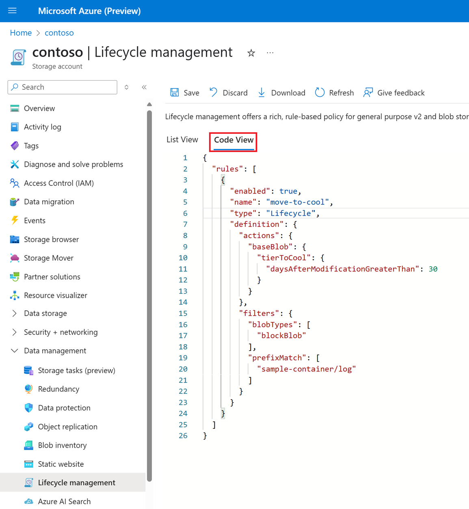

# Configure a lifecycle management policy

This article shows you how to create or manage an Azure Blob Storage lifecycle management policy. 

You can use lifecycle management policies to transition blobs to cost-efficient access tiers based on their use patterns or delete them entirely at the end of their lifecycle. To learn more, see [Azure Blob Storage lifecycle management overview](lifecycle-management-overview.md).

> [!NOTE]
> A lifecycle management policy must be read or written in full. Partial updates are not supported.

## Create or manage a policy

### [Portal](#tab/azure-portal)

1. In the Azure portal, navigate to your storage account.

2. Under **Data management**, select **Lifecycle Management** to view or change lifecycle management policies.

3. Select the **List View** tab.

4. Select **Add a rule** and name your rule on the **Details** form. You can also set the **Rule scope**, **Blob type**, and **Blob subtype** values. The following example sets the scope to filter blobs. This causes the **Filter set** tab to be added.

  :::image type="content" source="media/lifecycle-management-policy-configure/lifecycle-management-details.png" alt-text="Screenshot of the lifecycle management add a rule details page in Azure portal":::

5. Select **Base blobs** to set the conditions for your rule. In the following example, blobs are moved to cool storage if they haven't been modified for 30 days.

  :::image type="content" source="media/lifecycle-management-policy-configure/lifecycle-management-base-blobs.png" alt-text="Screenshot of the lifecycle management base blobs page in Azure portal":::

  The **Last accessed** option is available only if you have enabled access time tracking and you've selected **Block blobs** as the blob type. See [Enable access time tracking](#enable-access-time-tracking).

6. If you selected **Limit blobs with filters** on the **Details** page, select **Filter set** to add an optional filter. The following example filters on blobs whose name begins with *log* in a container called *sample-container*. 

  :::image type="content" source="media/lifecycle-management-policy-configure/lifecycle-management-filter-set.png" alt-text="Screenshot of the lifecycle management filter set page in Azure portal":::

   If you encounter unexpected results, see the following FAQ entry: [The blob prefix match string didn't apply the policy to the expected blobs](storage-blob-faq.yml#the-blob-prefix-match-string-didn-t-apply-the-policy-to-the-expected-blobs).

7. Select **Add** to add the new policy.

#### Manage a policy by using the code view.

You can also define a policy by adding JSON code directly in the **Code View** tab.

The following screenshot shows JSON in the **Code View** tab. This JSON defines a lifecycle policy that moves a block blob whose name begins with *log* to the cool tier if it has been more than 30 days since the blob was modified.

  > [!div class="mx-imgBorder"]
  > 


### [PowerShell](#tab/azure-powershell)

To add a lifecycle management policy with PowerShell, use these commands:

- Call the [Add-AzStorageAccountManagementPolicyAction](/powershell/module/az.storage/add-azstorageaccountmanagementpolicyaction) command to define the actions that comprise a rule.

- Call the [New-AzStorageAccountManagementPolicyFilter](/powershell/module/az.storage/new-azstorageaccountmanagementpolicyfilter) command to specify one or more filters for a rule.

- Call the [New-AzStorageAccountManagementPolicyRule](/powershell/module/az.storage/new-azstorageaccountmanagementpolicyrule) command to create a policy rule that includes actions and optional filters.

- Call the [Set-AzStorageAccountManagementPolicy](/powershell/module/az.storage/set-azstorageaccountmanagementpolicy) command to create the policy on the storage account.

The following example shows how to use each of these commands to create a lifecycle policy. Remember to replace placeholder values in angle brackets with your own values:

```powershell
# Initialize the following variables with your values.
$rgName = "<resource-group>"
$accountName = "<storage-account>"

# Create a new action object.
$action = Add-AzStorageAccountManagementPolicyAction -BaseBlobAction Delete `
    -daysAfterModificationGreaterThan 180
Add-AzStorageAccountManagementPolicyAction -InputObject $action `
    -BaseBlobAction TierToArchive `
    -daysAfterModificationGreaterThan 90
Add-AzStorageAccountManagementPolicyAction -InputObject $action `
    -BaseBlobAction TierToCool `
    -daysAfterModificationGreaterThan 30
Add-AzStorageAccountManagementPolicyAction -InputObject $action `
    -SnapshotAction Delete `
    -daysAfterCreationGreaterThan 90
Add-AzStorageAccountManagementPolicyAction -InputObject $action `
    -BlobVersionAction TierToArchive `
    -daysAfterCreationGreaterThan 90

# Create a new filter object.
$filter = New-AzStorageAccountManagementPolicyFilter -PrefixMatch ab,cd `
    -BlobType blockBlob

# Create a new rule object.
$rule1 = New-AzStorageAccountManagementPolicyRule -Name sample-rule `
    -Action $action `
    -Filter $filter

# Create the policy.
Set-AzStorageAccountManagementPolicy -ResourceGroupName $rgName `
    -StorageAccountName $accountName `
    -Rule $rule1
```

### [Azure CLI](#tab/azure-cli)

To add a lifecycle management policy with Azure CLI, write the policy to a JSON file, then call the [az storage account management-policy create](/cli/azure/storage/account/management-policy#az-storage-account-management-policy-create) command to create the policy.

The following example shows how to use each of these commands to create a lifecycle policy. Remember to replace placeholder values in angle brackets with your own values:

```azurecli
az storage account management-policy create \
    --account-name <storage-account> \
    --policy @policy.json \
    --resource-group <resource-group>
```

### [Template](#tab/template)

To define a lifecycle management policy with an Azure Resource Manager template, include the **Microsoft.Storage/storageAccounts/managementPolicies** object in your template. For configuration details, see [Microsoft.Storage/storageAccounts/managementPolicies 2021-02-01 - Bicep & ARM template reference](/azure/templates/microsoft.storage/2021-02-01/storageaccounts/managementpolicies?tabs=json). The **Microsoft.Storage/storageAccounts/managementPolicies** object is available in the Azure Storage Resource Provider REST API for versions 2018-11-01 and later.

---

<a id="optionally-enable-access-time-tracking"></a>

## Enable access time tracking

Enable access tracking if you want to include an action based on the time that the blob was last accessed with a read or write operation. To learn about the behavior of this capability, see [Access time tracking](lifecycle-management-policy-structure.md#access-time-tracking).

### [Portal](#tab/azure-portal)

1. Navigate to your storage account in the Azure portal.
2. In the **Data management** section, select **Lifecycle management**.
3. Check the checkbox "Enable access tracking"

   > [!div class="mx-imgBorder"]
   > 

### [PowerShell](#tab/azure-powershell)

[!INCLUDE [azure-storage-set-last-access-time-powershell](../../../includes/azure-storage-set-last-access-time-powershell.md)]

### [Azure CLI](#tab/azure-cli)

[!INCLUDE [azure-storage-set-last-access-time-azure-cli](../../../includes/azure-storage-set-last-access-time-azure-cli.md)]

### [Template](#tab/template)

[!INCLUDE [azure-storage-set-last-access-time-template](../../../includes/azure-storage-set-last-access-time-template.md)]

---

## See also

- [Azure Blob Storage lifecycle management overview](lifecycle-management-overview.md)
- [Lifecycle management policies that transition blobs between tiers](lifecycle-management-policy-access-tiers.md)
- [Lifecycle management policies that delete blobs](lifecycle-management-policy-delete.md)
- [Lifecycle management policy monitoring](lifecycle-management-policy-monitor.md)
- [Access tiers for blob data](access-tiers-overview.md)
