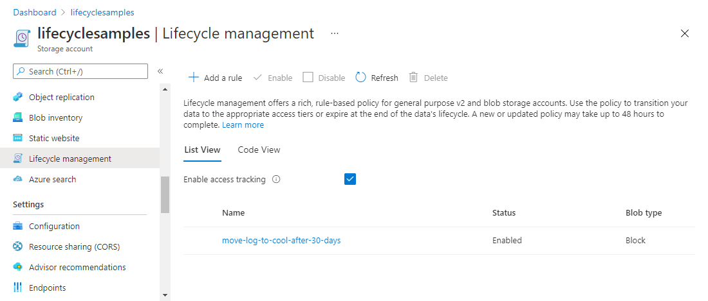

# Configure a lifecycle management policy

Azure Storage lifecycle management offers a rule-based policy that you can use to transition blob data to the appropriate access tiers or to expire data at the end of the data lifecycle. A lifecycle policy acts on a base blob, and optionally on the blob's versions or snapshots. For more information about lifecycle management policies, see [Optimize costs by automatically managing the data lifecycle](lifecycle-management-overview.md).

A lifecycle management policy is composed of one or more rules that define a set of actions to take based on a condition being met. For a base blob, you can choose to check one of the following conditions:

- The number of days since the blob was created.
- The number of days since the blob was last modified.
- The number of days since the blob was last accessed. To use this condition in an action, you should first [optionally enable last access time tracking](#optionally-enable-access-time-tracking).

When the selected condition is true, then the management policy performs the specified action. For example, if you have defined an action to move a blob from the hot tier to the cool tier if it has not been modified for 30 days, then the lifecycle management policy will move the blob 30 days after the last write operation to that blob.

For a blob snapshot or version, the condition that is checked is the number of days since the snapshot or version was created.

## Optionally enable access time tracking

Before you configure a lifecycle management policy, you can choose to enable blob access time tracking. When access time tracking is enabled, a lifecycle management policy can include an action based on the time that the blob was last accessed with a read or write operation. To minimize the effect on read access latency, only the first read of the last 24 hours updates the last access time. Subsequent reads in the same 24-hour period don't update the last access time. If a blob is modified between reads, the last access time is the more recent of the two values.

If [last access time tracking](lifecycle-management-overview.md#move-data-based-on-last-accessed-time) is not enabled, **daysAfterLastAccessTimeGreaterThan** uses the date the lifecycle policy was enabled instead of the `LastAccessTime` property of the blob. This date is also used when the `LastAccessTime` property is a null value. For more information about using last access time tracking, see [Move data based on last accessed time](lifecycle-management-overview.md#move-data-based-on-last-accessed-time).

#### [Portal](#tab/azure-portal)

To enable last access time tracking with the Azure portal, follow these steps:

1. Navigate to your storage account in the Azure portal.
1. In the **Data management** section, select **Lifecycle management**.
1. Check the checkbox "Enable access tracking"

   > [!div class="mx-imgBorder"]
   > 

#### [PowerShell](#tab/azure-powershell)

To enable last access time tracking with PowerShell, call the [Enable-AzStorageBlobLastAccessTimeTracking](/powershell/module/az.storage/enable-azstoragebloblastaccesstimetracking) command, as shown in the following example. Remember to replace placeholder values in angle brackets with your own values:

```powershell
# Initialize these variables with your values.
$rgName = "<resource-group>"
$accountName = "<storage-account>"

Enable-AzStorageBlobLastAccessTimeTracking  -ResourceGroupName $rgName `
    -StorageAccountName $accountName `
    -PassThru
```

#### [Azure CLI](#tab/azure-cli)

To enable last access time tracking with Azure CLI, call the [az storage account blob-service-properties update](/cli/azure/storage/account/blob-service-properties#az-storage-account-blob-service-properties-update) command, as shown in the following example. Remember to replace placeholder values in angle brackets with your own values:

```azurecli
az storage account blob-service-properties update \
    --resource-group <resource-group> \
    --account-name <storage-account> \
    --enable-last-access-tracking true
```

# [Template](#tab/template)

To enable last access time tracking for a new or existing storage account with an Azure Resource Manager template, include the **lastAccessTimeTrackingPolicy** object in the template definition. For details, see the [Microsoft.Storage/storageAccounts/blobServices 2021-02-01 - Bicep & ARM template reference](/azure/templates/microsoft.storage/2021-02-01/storageaccounts/blobservices?tabs=json). The **lastAccessTimeTrackingPolicy** object is available in the Azure Storage Resource Provider REST API for versions 2019-06-01 and later.

---

Use the **daysAfterLastAccessTimeGreaterThan** property to specify the number of days from last access after which an action should be taken on a blob.

## Create or manage a policy

You can add, edit, or remove a lifecycle management policy with the Azure portal, PowerShell, Azure CLI, or an Azure Resource Manager template.

# [Portal](#tab/azure-portal)

There are two ways to add a policy through the Azure portal.

- [List view](#list-view)
- [Code view](#code-view)

#### List view

1. In the Azure portal, navigate to your storage account.
1. Under **Data management**, select **Lifecycle Management** to view or change lifecycle management policies.
1. Select the **List View** tab.

1. Select **Add a rule** and name your rule on the **Details** form. You can also set the **Rule scope**, **Blob type**, and **Blob subtype** values. The following example sets the scope to filter blobs. This causes the **Filter set** tab to be added.

  :::image type="content" source="media/lifecycle-management-policy-configure/lifecycle-management-details.png" alt-text="Lifecycle management add a rule details page in Azure portal":::

1. Select **Base blobs** to set the conditions for your rule. In the following example, blobs are moved to cool storage if they haven't been modified for 30 days.

  :::image type="content" source="media/lifecycle-management-policy-configure/lifecycle-management-base-blobs.png" alt-text="Lifecycle management base blobs page in Azure portal":::

  The **Last accessed** option is available only if you have enabled access time tracking and you've selected **Block blobs** as the blob type. To learn how to enable access tracking, see [Optionally enable access time tracking](#optionally-enable-access-time-tracking).

1. If you selected **Limit blobs with filters** on the **Details** page, select **Filter set** to add an optional filter. The following example filters on blobs whose name begins with *log* in a container called *sample-container*.

  :::image type="content" source="media/lifecycle-management-policy-configure/lifecycle-management-filter-set.png" alt-text="Lifecycle management filter set page in Azure portal":::

1. Select **Add** to add the new policy.

Keep in mind that a lifecycle management policy will not delete the current version of a blob until any previous versions or snapshots associated with that blob have been deleted. If blobs in your storage account have previous versions or snapshots, then you should select **Base blobs**, **Snapshots**, and **Versions** in the **Blob Subtype** section when you are specifying a delete action as part of the policy.

#### Code view

1. In the Azure portal, navigate to your storage account.
1. Under **Data management**, select **Lifecycle Management** to view or change lifecycle management policies.
1. Select the **Code View** tab. On this tab, you can define a lifecycle management policy in JSON.

The following sample JSON defines a lifecycle policy that moves a block blob whose name begins with *log* to the cool tier if it has been more than 30 days since the blob was modified.

   ```json
   {
     "rules": [
       {
         "enabled": true,
         "name": "move-to-cool",
         "type": "Lifecycle",
         "definition": {
           "actions": {
             "baseBlob": {
               "tierToCool": {
                 "daysAfterModificationGreaterThan": 30
               }
             }
           },
           "filters": {
             "blobTypes": [
               "blockBlob"
             ],
             "prefixMatch": [
               "sample-container/log"
             ]
           }
         }
       }
     ]
   }
   ```

# [PowerShell](#tab/azure-powershell)

To add a lifecycle management policy with PowerShell, use these commands:

- Call the [Add-AzStorageAccountManagementPolicyAction](/powershell/module/az.storage/add-azstorageaccountmanagementpolicyaction) command to define the actions that comprise a rule.
- Call the [New-AzStorageAccountManagementPolicyFilter](/powershell/module/az.storage/new-azstorageaccountmanagementpolicyfilter) command to specify one or more filters for a rule.
- Call the [New-AzStorageAccountManagementPolicyRule](/powershell/module/az.storage/new-azstorageaccountmanagementpolicyrule) command to create a policy rule that includes actions and optional filters.
- Call the [Set-AzStorageAccountManagementPolicy](/powershell/module/az.storage/set-azstorageaccountmanagementpolicy) command to create the policy on the storage account.

The following example shows how to use each of these commands to create a lifecycle policy. Remember to replace placeholder values in angle brackets with your own values:

```powershell
# Initialize the following variables with your values.
$rgName = "<resource-group>"
$accountName = "<storage-account>"

# Create a new action object.
$action = Add-AzStorageAccountManagementPolicyAction -BaseBlobAction Delete `
    -daysAfterModificationGreaterThan 180
Add-AzStorageAccountManagementPolicyAction -InputObject $action `
    -BaseBlobAction TierToArchive `
    -daysAfterModificationGreaterThan 90
Add-AzStorageAccountManagementPolicyAction -InputObject $action `
    -BaseBlobAction TierToCool `
    -daysAfterModificationGreaterThan 30
Add-AzStorageAccountManagementPolicyAction -InputObject $action `
    -SnapshotAction Delete `
    -daysAfterCreationGreaterThan 90
Add-AzStorageAccountManagementPolicyAction -InputObject $action `
    -BlobVersionAction TierToArchive `
    -daysAfterCreationGreaterThan 90

# Create a new filter object.
$filter = New-AzStorageAccountManagementPolicyFilter -PrefixMatch ab,cd `
    -BlobType blockBlob

# Create a new rule object.
$rule1 = New-AzStorageAccountManagementPolicyRule -Name sample-rule `
    -Action $action `
    -Filter $filter

# Create the policy.
Set-AzStorageAccountManagementPolicy -ResourceGroupName $rgName `
    -StorageAccountName $accountName `
    -Rule $rule1
```

#### [Azure CLI](#tab/azure-cli)

To add a lifecycle management policy with Azure CLI, write the policy to a JSON file, then call the [az storage account management-policy create](/cli/azure/storage/account/management-policy#az-storage-account-management-policy-create) command to create the policy.

The following example shows how to use each of these commands to create a lifecycle policy. Remember to replace placeholder values in angle brackets with your own values:

```azurecli
az storage account management-policy create \
    --account-name <storage-account> \
    --policy @policy.json \
    --resource-group <resource-group>
```

# [Template](#tab/template)

To define a lifecycle management policy with an Azure Resource Manager template, include the **Microsoft.Storage/storageAccounts/managementPolicies** object in your template. For configuration details, see [Microsoft.Storage/storageAccounts/managementPolicies 2021-02-01 - Bicep & ARM template reference](/azure/templates/microsoft.storage/2021-02-01/storageaccounts/managementpolicies?tabs=json). The **Microsoft.Storage/storageAccounts/managementPolicies** object is available in the Azure Storage Resource Provider REST API for versions 2018-11-01 and later.

---

A lifecycle management policy must be read or written in full. Partial updates are not supported.


> [!NOTE]
> Each rule can have up to 10 case-sensitive prefixes and up to 10 blob index tag conditions.

> [!NOTE]
> If you enable firewall rules for your storage account, lifecycle management requests may be blocked. You can unblock these requests by providing exceptions for trusted Microsoft services. For more information, see the **Exceptions** section in [Configure firewalls and virtual networks](../common/storage-network-security.md#exceptions).

> [!NOTE]
> A lifecycle management policy can't change the tier of a blob that uses an encryption scope.

> [!NOTE]
> The delete action of a lifecycle management policy won't work with any blob in an immutable container. With an immutable policy, objects can be created and read, but not modified or deleted. For more information, see [Store business-critical blob data with immutable storage](./immutable-storage-overview.md).

## See also

- [Optimize costs by automatically managing the data lifecycle](lifecycle-management-overview.md)
- [Access tiers for blob data](access-tiers-overview.md)
