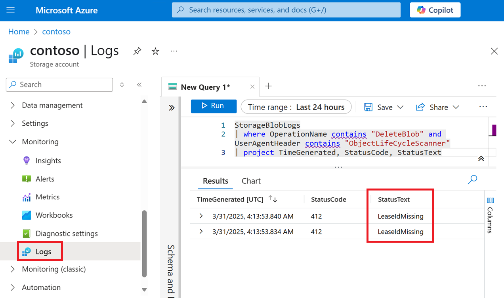

# Monitor lifecycle management policy runs

You can monitor Azure Blob Storage lifecycle management policy run by using events, metrics, and logs. You can determine when a lifecycle management run completes by subscribing to an event. You can use event properties to identify issues and then diagnose those issues by using metrics and logs. 

## Receiving notifications when a run is complete

To be notified when a lifecycle management run is complete, subscribe to the `LifecyclePolicyCompleted` event. This event is generated when the actions defined by a lifecycle management policy are performed. A summary section appears for each action that is included in the policy definition. The following json shows an example `LifecyclePolicyCompleted` event for a policy. A summary section appears for the `delete`, `tierToCool`, `tierToCold`, and `tierToArchive` actions. The following JSON shows an example of an event notification.

```json
{
    "topic": "/subscriptions/xxxxxxxx-xxxx-xxxx-xxxx-xxxxxxxxxxxx/resourceGroups/contosoresourcegroup/providers/Microsoft.Storage/storageAccounts/contosostorageaccount",
    "subject": "BlobDataManagement/LifeCycleManagement/SummaryReport",
    "eventType": "Microsoft.Storage.LifecyclePolicyCompleted",
    "eventTime": "2022-05-26T00:00:40.1880331",    
    "id": "xxxxxxxx-xxxx-xxxx-xxxx-xxxxxxxxxxxx",
    "data": {
          "scheduleTime": "2022/05/24 22:57:29.3260160",
        "policyRunSummary": { 
            "completionStatus": "Completed/CompletedWithError/Incomplete" 
        },
        "deleteSummary": {
            "totalObjectsCount": 5,
            "successCount": 3,
            "errorList": ["testFile4.txt", "testFile5.txt"]
        },
        "tierToCoolSummary": {
            "totalObjectsCount": 0,
            "successCount": 0,
            "errorList": ""
        },
        "tierToColdSummary": {
            "totalObjectsCount": 0,
            "successCount": 0,
            "errorList": ""
        },
        "tierToArchiveSummary": {
            "totalObjectsCount": 0,
            "successCount": 0,
            "errorList": ""
        }
    },
    "dataVersion": "1",
    "metadataVersion": "1"
}
```

To learn more about the different ways to subscribe to an event, see [Event handlers in Azure Event Grid](../../event-grid/event-schema-blob-storage.md#microsoftstoragelifecyclepolicycompleted-event).

## Investigating errors by using metric and logs

The event response example from the previous section shows that the lifecycle management policy attempted to delete five objects, but succeeded with only three of them. The `testFile4.txt` and `testFile5.txt` files were not successfully deleted as part of that run. To diagnose why some objects weren't processed successfully, you can use metrics explorer and query resource logs in Azure Monitor.

### Metrics

To determine exactly _when_ operations failed, use metrics explorer. You can see all transactions that were applied against the account in the timeframe between the `scheduleTime` and `eventTime` value that appear in the `LifecyclePolicyCompleted` properties. 

Use the following metric filters to narrow transactions to those executed by the policy:

| Filter | Operator | Value |
|---|---|---|
| Transaction type | equal | `system` |
| API name | equal | `DeleteBlob` |
| Response type | not equal | `Success` |

The following image shows an example of the query and the query result. The line chart that appears in the query result shows the time when these operations failed. 

  > [!div class="mx-imgBorder"]
  > 

### Logs

To find out why objects weren't successfully processed by the policy, you can look at resource logs. Narrow logs to the time frame of the failures. Then, look at entries where the **UserAgentHeader** field is set to **ObjectLifeCycleScanner** or **OLCMScanner**. If you configured a diagnostic setting to send logs to Azure Monitor Log Analytics workspace, then you can use a Kusto query to locate those log entries. To learn more about how to configure a diagnostic setting, see [Monitor Blob Storage](monitor-blob-storage.md). 

The following example query finds log entries for failed delete operations that were initiated by a lifecycle management policy.

```kusto
StorageBlobLogs
| where OperationName contains "DeleteBlob" and UserAgentHeader contains "ObjectLifeCycleScanner"
| project TimeGenerated, StatusCode, StatusText
```

The **StatusCode** and **StatusText** indicates what has caused the failure. The following image shows the output of that query. Both log entries show a **StatusText** value of **LeaseIdMissing**. This means that both objects have an active lease that must be broken or released before the operation can succeed. 

  > [!div class="mx-imgBorder"]
  > 

## See also

- [Azure Blob Storage lifecycle management overview](lifecycle-management-overview.md)
- [Lifecycle management policies that transition blobs between tiers](lifecycle-management-policy-access-tiers.md)
- [Lifecycle management policies that delete blobs](lifecycle-management-policy-delete.md)
- [Access tiers for blob data](access-tiers-overview.md)
