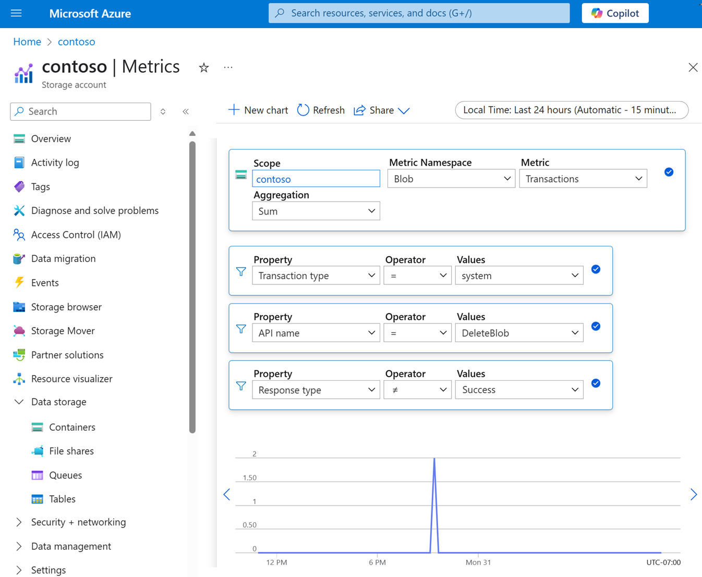

# Monitor lifecycle management policy runs

You can determine when a lifecycle management run completes by subscribing to an event. You can use event properties to identify issues and investigate errors by using metrics and logs. 

## Receiving notifications when a run is complete

A client can be notified when a lifecycle management run is complete by subscribing to the `LifecyclePolicyCompleted` event. This event is generated when the actions defined by a lifecycle management policy are performed. A summary section appears for each action that is included in the policy definition. The following json shows an example `LifecyclePolicyCompleted` event for a policy. Because the policy definition includes the `delete`, `tierToCool`, `tierToCold`, and `tierToArchive` actions, a summary section appears for each one. 

```json
{
    "topic": "/subscriptions/xxxxxxxx-xxxx-xxxx-xxxx-xxxxxxxxxxxx/resourceGroups/contosoresourcegroup/providers/Microsoft.Storage/storageAccounts/contosostorageaccount",
    "subject": "BlobDataManagement/LifeCycleManagement/SummaryReport",
    "eventType": "Microsoft.Storage.LifecyclePolicyCompleted",
    "eventTime": "2022-05-26T00:00:40.1880331",    
    "id": "xxxxxxxx-xxxx-xxxx-xxxx-xxxxxxxxxxxx",
    "data": {
        "scheduleTime": "2022/05/24 22:57:29.3260160",
        "deleteSummary": {
            "totalObjectsCount": 16,
            "successCount": 14,
            "errorList": ""
        },
        "tierToCoolSummary": {
            "totalObjectsCount": 0,
            "successCount": 0,
            "errorList": ""
        },
        "tierToColdSummary": {
            "totalObjectsCount": 0,
            "successCount": 0,
            "errorList": ""
        },
        "tierToArchiveSummary": {
            "totalObjectsCount": 0,
            "successCount": 0,
            "errorList": ""
        }
    },
    "dataVersion": "1",
    "metadataVersion": "1"
}
```

The following table describes the schema of the `LifecyclePolicyCompleted` event.

|Field|Type|Description|
|---|---|---|
|scheduleTime|string|The time that the lifecycle policy was scheduled|
|deleteSummary|vector\<byte\>|The results summary of blobs scheduled for delete operation|
|tierToCoolSummary|vector\<byte\>|The results summary of blobs scheduled for tier-to-cool operation|
|tierToColdSummary|vector\<byte\>|The results summary of blobs scheduled for tier-to-cold operation|
|tierToArchiveSummary|vector\<byte\>|The results summary of blobs scheduled for tier-to-archive operation|

To learn more about the different ways to subscribe to an event, see [Event handlers in Azure Event Grid](../../event-grid/event-handlers.md?toc=/azure/storage/blobs/toc.json#microsoftstoragelifecyclepolicycompleted-event).

Something here about parsing the errorList. How do you do this? What do you do with this?

## Investigating errors by using metric and logs

You can use metrics explorer and query resource logs in Azure Monitor to determine why some objects were not processed successfully.

### Metrics

To determine exactly when operations failed, use metrics explorer. You can see all transactions that were applied against the account in the timeframe between the `scheduleTime` and `eventTime` value that appear in the `LifecyclePolicyCompleted` properties. Use the following metric filters to narrow transactions to those executed by the policy:

| Filter | Operator | Value |
|---|---|---|
| Transaction type | = | `system` |
| API name | = | Name of failed operation. Values could be `DeleteBlob` or `SetBlobTier` |
| Response type | != | `Success` |

The following image shows an example: 

  > [!div class="mx-imgBorder"]
  > 

### Logs

Explain how to query logs on that specific time and operation type to diagnose exactly what went wrong.
Explain how to determine the reason for any given failure.
Point to any existing material about how to query logs.

## See also

- [Azure Blob Storage lifecycle management overview](lifecycle-management-overview.md)
- [Lifecycle management policies that transition blobs between tiers](lifecycle-management-policy-access-tiers.md)
- [Lifecycle management policies that delete blobs](lifecycle-management-policy-delete.md)
- [Access tiers for blob data](access-tiers-overview.md)
