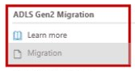
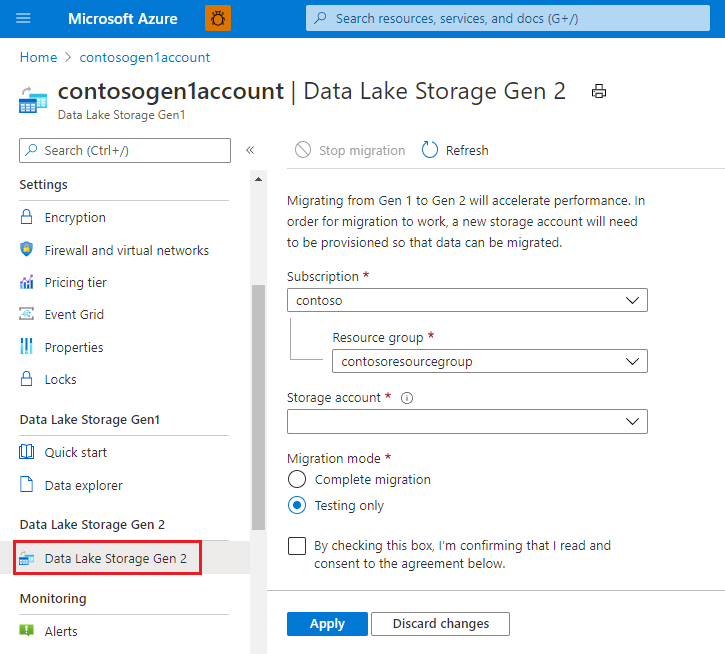
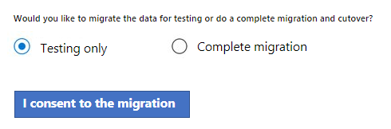

# Migrate Azure Data Lake Storage from Gen1 to Gen2 by using the managed migration tool

The managed migration tool automatically moves data from Azure Data Lake Storage Gen1 to Azure Data Lake Storage Gen2. 

Be sure to first read the general guidance and workflows described in this article: [Migrate Azure Data Lake Storage from Gen1 to Gen2](data-lake-storage-migrate-gen1-to-gen2.md).

> [!NOTE]
> For easier reading, this article uses the term *Gen1* to refer to Azure Data Lake Storage Gen1, and the term *Gen2* to refer to Azure Data Lake Storage Gen2. This article won't use the term *Gen2 account*. That's because it's not a dedicated storage account or service type, but rather a set of capabilities that can be obtained by enabling the the **Hierarchical namespace** feature of an Azure storage account. 

## General workflow

Here's the general workflow.

- Step 1: Choose an hns account

- Step 2: Consent to the migration

- Step 3: Migrate data

- Step 4: URL flipped.

## Migrate your stuff

1. Navigate to your Data Lake Storage Gen1 account in the Azure portal.

2. In the left menu for the account, scroll to the **ADLS Gen2 Migration** section, then select **Migration**.

   > [!div class="mx-imgBorder"]
   > 

   The **Microsoft Managed Gen1 to Gen2 Migration** wizard appears.

3. In the **Choose a Gen2 account for migration** page, choose a storage account that has the **Hierarchical namespace** feature enabled on it.

   > [!div class="mx-imgBorder"]
   > 

4.	In the **Consent to the migration** page, review the terms, choose whether to perform a test migration or a complete migration, and then click the **I consent to the migration** button.

   > [!div class="mx-imgBorder"]
   > 

## Next steps

- Learn about migration in general. See [Migrate Azure Data Lake Storage from Gen1 to Gen2](data-lake-storage-migrate-gen1-to-gen2.md).
