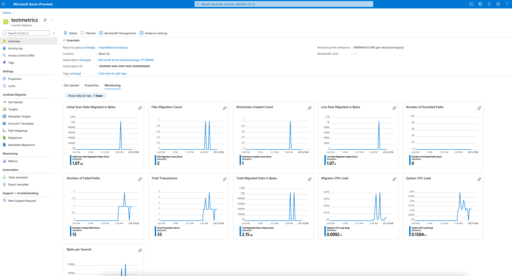
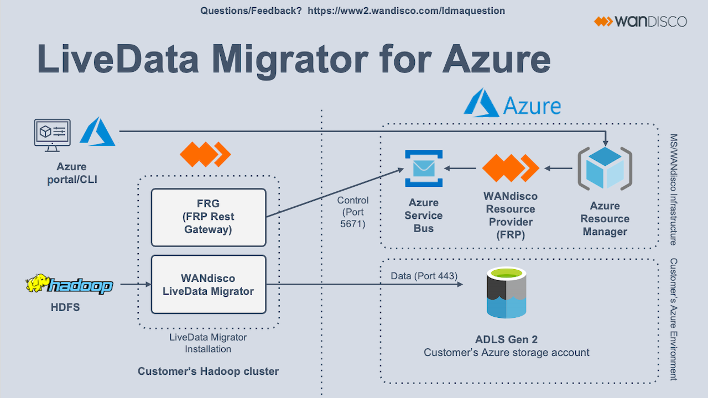
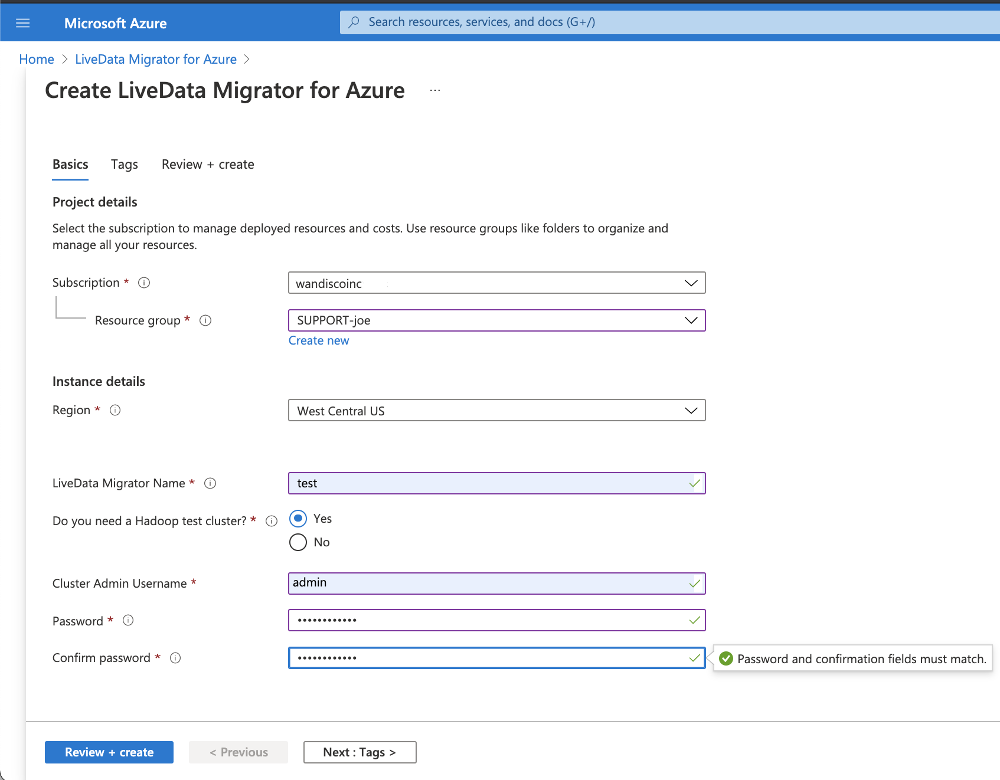
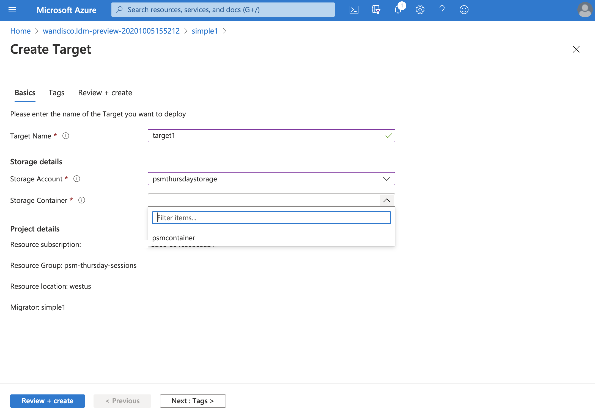
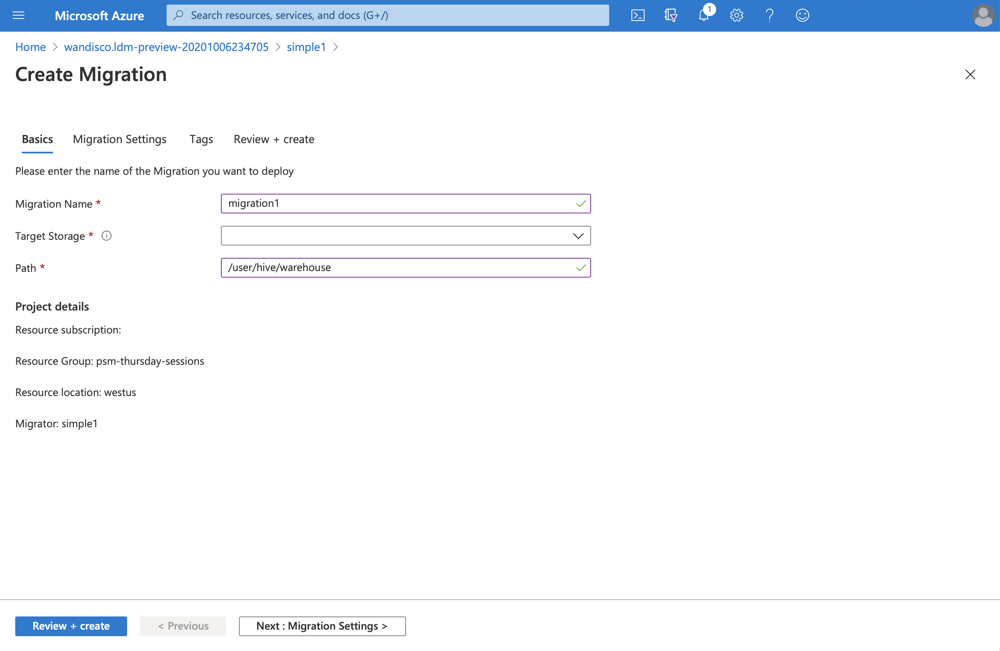
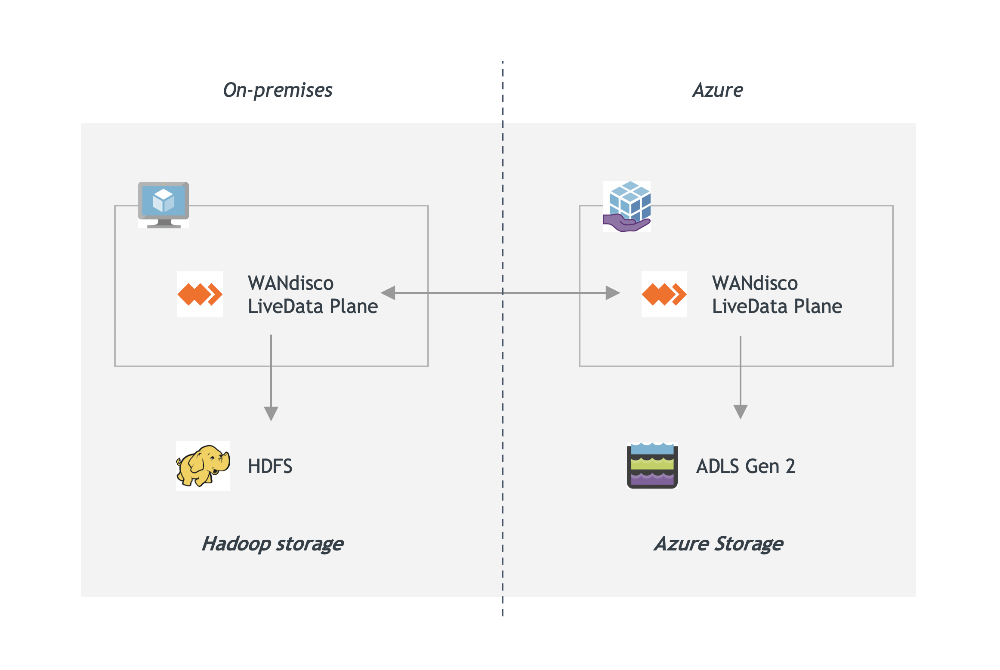

# Migrate on-premises Hadoop data to Azure Data Lake Storage Gen2 with WANdisco LiveData Platform for Azure

[WANdisco LiveData Platform for Azure](https://docs.wandisco.com/live-data-platform/docs/landing/) migrates petabytes of on-premises Hadoop data to Azure Data Lake Storage Gen2 file systems without interrupting data operations or requiring downtime. The platform's continuous checks prevent data from being lost while keeping it consistent at both ends of transference even while it undergoes modification.

The platform consists of two services. [LiveData Migrator for Azure](https://cirata.com/products/data-integration) migrates actively used data from on-premises environments to Azure storage, and [LiveData Plane for Azure](https://cirata.com/products/data-integration) ensures that all modified or ingested data is replicated consistently.

> [!div class="mx-imgBorder"]
> 

Manage both services by using the Azure portal and the Azure CLI. Each service follows the same metered, pay-as-you-go billing model as all other Azure services: data consumption in LiveData Platform for Azure appears on the monthly Azure bill, which will provide usage metrics.

Unlike migrating data *offline* by [copying static information to Azure Data Box](./data-lake-storage-migrate-on-premises-hdfs-cluster.md), or by using Hadoop tools like [DistCp](https://hadoop.apache.org/docs/current/hadoop-distcp/DistCp.html), you can maintain full operation of your business systems during *online* migration with WANdisco LiveData for Azure. Keep your big data environments operating even while moving their data to Azure.

## Key benefits of WANdisco LiveData Platform for Azure

[WANdisco LiveData Platform for Azure](https://docs.wandisco.com/live-data-platform/docs/landing/)'s wide-area network capable consensus engine achieves data consistency, and conducts real-time data replication at scale. See the following video for more information:  

>[!VIDEO https://www.youtube.com/embed/KRrmcYPxEho]

Key benefits of the platform include the following:

- **Data accuracy**: End-to-end validation of data prevents data loss and ensures transferred data is fit for use.

- **Data consistency**: Keep data volumes automatically consistent between environments even while they undergo continuous change.

- **Data efficiency**: Transfer large data volumes continuously with full control of bandwidth consumption.

- **Downtime elimination**: Freely create, modify, read, and delete data with other applications during migration, without the need to disrupt business operations during data transference to Azure. Continue to operate applications, analytics infrastructure, ingest jobs, and other processing.

- **Simple use**: Use the Platform's Azure integration to create, configure, schedule, and track the progress of automated migrations. Additionally, configure selective data replication, Hive metadata, data security, and confidentiality as needed.

## Key features of WANdisco LiveData Platform for Azure

Key features of the platform include the following:

- **Metadata Migration**: In addition to HDFS data, migrate metadata (from Hive and other storages) with LiveData Migrator for Azure.

- **Scheduled Transfer**: Use LiveData Migrator for Azure to control and automate when data transfer will initiate, eliminating the need to manually migrate changes to data.

- **Kerberos**: LiveData Migrator for Azure supports Kerberized clusters.

- **Exclusion Templates**: Create rules in LiveData Migrator for Azure to prevent certain file sizes or file names (defined using glob patterns) from being migrated to your target storage. Create exclusion templates in the Azure portal or with the CLI, and apply them to any number of migrations.

- **Path Mappings**: Define alternate target paths for specific target file systems, which automatically move transferred data to directories you specify.

- **Bandwidth Management**: Configure the maximum amount of network bandwidth LiveData Migrator for Azure can use to prevent bandwidth over consumption.

- **Exclusions**: Define template queries that prevent the migration of any files and directories that meet the criteria, allowing you to selectively migrate data from your source system.

- **Metrics**: View details about data transfer in LiveData Migrator for Azure, such as files transferred over time, excluded paths, items that failed to transfer and more.

   > [!div class="mx-imgBorder"]
   > 

## Migrate big data faster without risk

The first service included in WANdisco LiveData Platform for Azure is [LiveData Migrator for Azure](https://cirata.com/products/data-integration), which migrates data from on-premises environments to Azure Storage. Once you've deployed LiveData Migrator to your on-premises Hadoop cluster, it will automatically create the best configuration for your file system. From there, supply the Kerberos details for the system. LiveData Migrator for Azure will then be ready to migrate data to Azure Storage.

> [!div class="mx-imgBorder"]
> 

Before you start with LiveData Migrator for Azure, review these [prerequisites](https://docs.wandisco.com/live-data-platform/docs/prereq/).

To perform a migration:

1. In the Azure CLI: 

   - Register for the WANdisco resource provider in the Azure CLI by running `az provider register --namespace Wandisco.Fusion --consent-to-permissions`.
   - Accept the metered billing terms of LiveData Platform by running `az vm image terms accept --offer ldma --plan metered-v1 --publisher Wandisco --subscription <subscriptionID>`.

2. Deploy a LiveData Migrator instance from the Azure portal to your on-premises Hadoop cluster. (You don't need to make changes to or restart the cluster.)

   > [!div class="mx-imgBorder"]
   > 

   > [!NOTE]
   > WANdisco LiveData Migrator for Azure provides the option to create a Hadoop Test Cluster.

3. Configure Kerberos details, if applicable.

4. Define the target Azure Data Lake Storage Gen2-enabled storage account.

   > [!div class="mx-imgBorder"]
   > 

5. Define the location of the data that you want to migrate, for example: `/user/hive/warehouse`.

   > [!div class="mx-imgBorder"]
   > 

6. Start the migration.

Monitor your migration progress through standard Azure tooling including the Azure CLI and Azure portal.

## Bidirectionally replicate data under active change with LiveData Plane for Azure

The second service included in the LiveData Platform is [LiveData Plane for Azure](https://cirata.com/products/data-integration). LiveData Plane uses WANdisco's coordination engine to keep data consistent across many on-premises Hadoop clusters and Azure Storage by intelligently applying changes to data on all systems, removing the risk of data conflicts at different points of use.

> [!div class="mx-imgBorder"]
> 

After initial migration, keep your data consistent with LiveData Plane for Azure:

1. Deploy LiveData Plane for Azure on-premises and in Azure, starting from the Azure portal. No application changes are required.

2. Configure replication rules that cover the data locations that you want to keep consistent, for example: `/user/contoso/sales/region/WA`.

3. Run applications that access and modify data in either location as you need.

LiveData Plane for Azure consistently replicates data changes across all environments without significant impact on cluster operation or application performance.

## Test drive or Trial

From [LiveData Platform for Azure's Marketplace page](https://azuremarketplace.microsoft.com/marketplace/apps/wandisco.ldma?tab=Overview), you have two options:

- The **Get It Now** button launches the service in your subscription. From there, you may use your own Hadoop cluster or WANdisco's Trial cluster.

- Select **Test Drive** to test LiveData Migrator for Azure in an environment that is preconfigured and hosted for you. This enables you to try LiveData Migrator for Azure before adding it to your subscription, without any cost or risk to your data.

## Next Steps

- [Plan and create a migration in LiveData Migrator for Azure](https://azuremarketplace.microsoft.com/marketplace/apps/wandisco.ldma).

## See also

- [LiveData Migrator for Azure on Azure Marketplace](https://azuremarketplace.microsoft.com/marketplace/apps/wandisco.ldma?tab=Overview)

- [LiveData Migrator for Azure plans and pricing](https://azuremarketplace.microsoft.com/marketplace/apps/wandisco.ldma?tab=PlansAndPricee)

- [LiveData Platform for Azure Frequently Asked Questions](https://docs.wandisco.com/live-data-platform/docs/faq/)

- [Known Issues with LiveData Platform for Azure](https://docs.wandisco.com/live-data-platform/docs/known-issues/)
