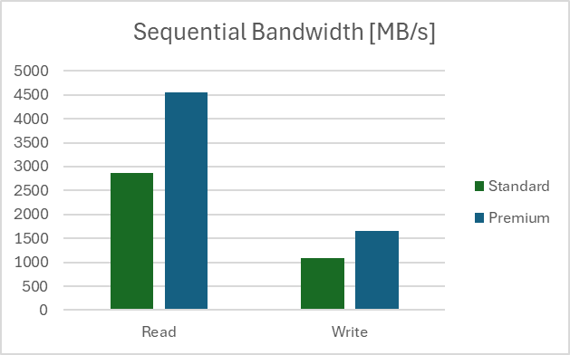
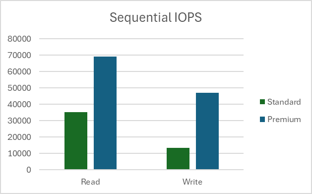
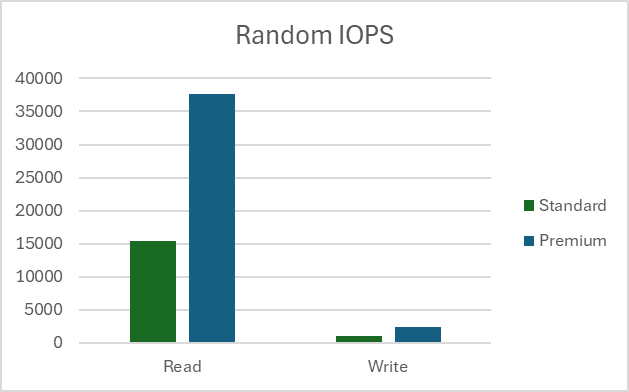

# Performance benchmark test recommendations for NFS 3.0 on Azure Blob Storage

This article provides benchmark testing recommendations and results for NFS 3.0 (Network File System Version 3) on Azure Blob Storage. Since NFS 3.0 is mostly used in Linux environments, article focuses on Linux tools only. In many cases, other operating systems can be used, but tools and commands might change.

## Overview

Storage performance testing is done to evaluate and compare different storage services. There are many ways to perform it, but three most common ones are:

- Using standard Linux commands, typically cp or dd,
- Using performance benchmark tools like fio, vdbench, ior, etc.,
- Using real-world application that is used in production.

No matter which method is used, it's always important to understand other potential bottlenecks in the environment, and make sure they aren't affecting the results. As an example, when measuring write performance, we need to make sure that source disk can read data as fast as the expected write performance. Same principle applies for read performance. Ideally, in these tests we can use a RAM disk. We need to make similar considerations for network throughput, CPU utilization, etc.

**Using standard Linux commands** is the simplest method for performance benchmark testing, but also least recommended. Method is simple as tools exist on every Linux environment and users are familiar with them. Results must be carefully analyzed since many aspects have impact on them, not only storage performance. Two commands that are typically used:
- Testing with `cp` command copies one or more files from source to the destination storage service and measuring the time it takes to fully finish the operation. This command performs buffered, not direct IO and depends on buffer sizes, operating system, threading model, etc. On the other hand, some real-world applications behave in similar way and sometimes represent a good use case.
- Second often used command is `dd`. Command is single threaded and in large scale bandwidth testing, results are limited by the speed of a single CPU core. It's possible to run multiple commands at the same time and assign them to different cores, but that complicates the testing and aggregating results. It's also much simpler to run than some of the performance benchmarking tools.

**Using performance benchmark tools** represents synthetic performance testing that is common in comparing different storage services. Tools are properly designed to utilize available client resources to maximize the storage throughput. Most of the tools are configurable and allow mimicking real-world applications, at least the simpler ones. Mimicking real-world applications requires detail information on application behavior and understanding their storage patterns. 

**Using real-world application** is always the best method as it measures performance for real-world workloads that users are running on top of storage service. However, this method is often not practical as it requires replica of the production environment and end-users to generate proper load on the system. Some applications do have a load generation capability and should be used for performance benchmarking.

| Testing method                    | Pros | Cons |
| --------------------------------- | ---- | -----|
| Standard linux commands     | - Simple   - Available on any linux platform   - Familiarity with the tools | - Not designed for performance testing   - Not configurable   - Often CPU core bound |
| Performance benchmark tools | - Optimized for performance testing   - Very configurable   - Simple multi node testing | - Complex to set up a real-world test |
| Real-world application      | - Provides accurate end-user experience | - Often end-users run tests   - Requires replica of the production environment   - Can be subjective|

Even though using real-world applications for performance testing is the best option, due to simplicity of testing setup, the most common method is using performance benchmarking tools. We show the recommended setup for running performance tests on Azure Blob Storage with NFS 3.0. 

> [!TIP]
> Most performance testing methods are focused on single client performance. To do a scale-out testing, use a performance benchmark tool that can orchestrate multi-client testing (like fio, vdbench, etc.), or build a custom orchestration layer.

## Selecting virtual machine size
To properly execute performance testing, the first step is to correctly size a virtual machine used in testing. Virtual machine acts as a client that runs performance benchmarking tool. Most important aspect when selecting the virtual machine size for this test is available network bandwidth. The bigger virtual machine we select, better results we can achieve. If we run the test in Azure, we recommend using one of the [general purpose](/azure/virtual-machines/sizes-general) virtual machines.

## Creating a storage account with NFS 3.0
After selecting the virtual machine, we need to create storage account we'll use in our testing. Follow our [how-to guide](network-file-system-protocol-support-how-to.md) for step-by-step guidance. We recommend reading [performance considerations for NFS 3.0 in Azure Blob Storage](network-file-system-protocol-support-how-to.md) before testing.  

## Other considerations
- Virtual machine and storage account with the NFS 3.0 endpoint must be in the same region,
- Virtual machine running the test applications should be used only for testing to make sure other running services aren't impacting the results,
- Mounting NFS 3.0 endpoint must use [AzNFS mount helper](./network-file-system-protocol-support-how-to.md#step-5-install-the-aznfs-mount-helper-package) client for reliable access. 

## Executing performance benchmark
There are several performance benchmarking tools available to use on Linux environments. Any of them can be used to evaluate performance, we share our recommended approach with FIO (Flexible I/O tester). FIO is available through standard package managers for each linux distribution or as an [source code](https://github.com/axboe/fio). It can be used in many test scenarios. This article describes the recommended scenarios for Azure Storage. For further customization and different parameters, consult [FIO documentation](https://fio.readthedocs.io/en/latest/index.html).

Following parameters are used for testing:

|Workload    | Metric    | Block size | Threads | IO depth | File size | nconnect | Direct IO |
| ---------- | --------- | ---------- | --------| -------- | --------- | ---------| --------- |
| Sequential | Bandwidth |1 MiB       | 8       | 1024     | 10 GiB    | 16       | Yes       |
| Sequential | IOPS      |4 KiB       | 8       | 1024     | 10 GiB    | 16       | Yes       |
| Random     | IOPS      |4 KiB       | 8       | 1024     | 10 GiB    | 16       | Yes       |

Our testing setup was done in US East region with client virtual machine type [D32ds_v5](/azure/virtual-machines/ddv5-ddsv5-series#ddsv5-series) and file size of 10 GB. All tests were run 100 times and results show the average value. Tests were done on Standard and Premium storage accounts. Read more on the differences between the two types of storage accounts [here](../common/storage-account-overview.md). 

### Measuring sequential bandwidth

#### Read bandwidth

`fio --name=seq_read_bw --ioengine=libaio --directory=/mnt/test_folder --direct=1 --blocksize=1M --readwrite=read --filesize=10G --end_fsync=1 --numjobs=8 --iodepth=1024 --runtime=60 --group_reporting --time_based=1`

#### Write bandwidth

`fio --name=seq_write_bw --ioengine=libaio --directory=/mnt/test_folder --direct=1 --blocksize=1M --readwrite=write --filesize=10G --end_fsync=1 --numjobs=8 --iodepth=1024 --runtime=60 --group_reporting --time_based=1`

#### Results

> [!div class="mx-imgBorder"]
> 

### Measuring sequential IOPS

#### Read IOPS

`fio --name=seq_read_iops --ioengine=libaio --directory=/mnt/test_folder --direct=1 --blocksize=4K --readwrite=read --filesize=10G --end_fsync=1 --numjobs=8 --iodepth=1024 --runtime=60 --group_reporting --time_based=1`

#### Write IOPS

`fio --name=seq_write_iops --ioengine=libaio --directory=/mnt/test_folder --direct=1 --blocksize=4K --readwrite=write --filesize=10G --end_fsync=1 --numjobs=8 --iodepth=1024 --runtime=60 –group_reporting –time_based=1`

#### Results

> [!div class="mx-imgBorder"]
> 

> [!NOTE]
> Results for sequential IOPS tests show values larger than [Storage Account limits](../common/scalability-targets-standard-account.md) for requests per second. IOPS are measured on the client side and larger values are due to service optimizations and sequential nature of the test.

### Measuring random IOPS

#### Read IOPS

`fio --name=rnd_read_iops --ioengine=libaio --directory=/mnt/test_folder --direct=1 --blocksize=4K --readwrite=randread --filesize=10G --end_fsync=1 --numjobs=8 --iodepth=1024 --runtime=60 --group_reporting --time_based=1`

#### Write IOPS

`fio --name=rnd_write_iops --ioengine=libaio --directory=/mnt/test_folder --direct=1 --blocksize=4K --readwrite=randwrite --filesize=10G --end_fsync=1 --numjobs=8 --iodepth=1024 --runtime=60 –group_reporting –time_based=1`

#### Results

> [!div class="mx-imgBorder"]
> 

> [!NOTE]
> Results from random tests are added for completeness, NFS 3.0 endpoint on Azure Blob Storage is not a recommended storage service for random write workloads.

## Next steps
- [Mount Blob Storage by using the Network File System (NFS) 3.0 protocol](./network-file-system-protocol-support-how-to.md)
- [Known issues with Network File System (NFS) 3.0 protocol support for Azure Blob Storage](./network-file-system-protocol-known-issues.md)
- [Network File System (NFS) 3.0 performance considerations in Azure Blob storage](./network-file-system-protocol-support-performance.md)