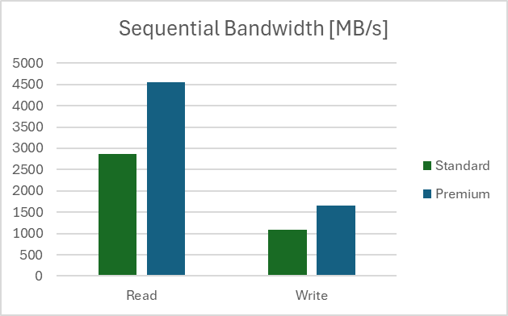
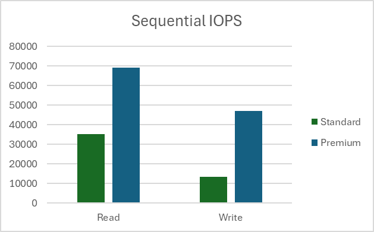
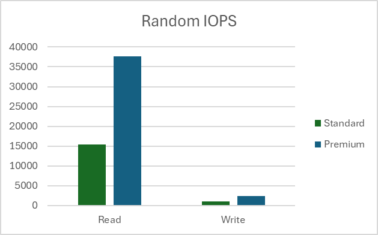

# Performance benchmark test recommendations for NFS 3.0 on Azure Blob Storage

This article provides benchmark testing recommendations and results for Network File System Version 3 (NFS 3.0) on Azure Blob Storage. Because NFS 3.0 is mostly used in Linux environments, this article focuses on Linux tools only. In many cases, you can use other operating systems, but tools and commands might change.

## Overview

Storage performance testing is done to evaluate and compare different storage services. There are many ways to perform it, but these methods are the three most common:

- Use standard Linux commands, typically `cp` or `dd`.
- Use performance benchmark tools like `fio`, `vdbench`, or `ior`.
- Use a real-world application that's used in production.

No matter which method is used, it's always important to understand other potential bottlenecks in the environment and make sure that they aren't affecting the results. As an example, when you measure write performance, you need to make sure that the source disk can read data as fast as the expected write performance.

The same principle applies for read performance. Ideally, in these tests you can use a RAM disk. You need to make similar considerations for network throughput and CPU utilization.

- **Use standard Linux commands.** This method is the simplest for performance benchmark testing, but it's also the least recommended. The method is simple because tools exist on every Linux environment and users are familiar with them. Results must be carefully analyzed because many aspects have an effect on them, not only storage performance. Two commands that are typically used:

   - The `cp` command copies one or more files from the source to the destination storage service and measures the time it takes to fully finish the operation. This command performs buffered, not direct, IO and depends on buffer sizes, operating system, and threading model. On the other hand, some real-world applications behave in a similar way and sometimes represent a good use case.
   - The `dd` command is single threaded. In large-scale bandwidth testing, results are limited by the speed of a single CPU core. It's possible to run multiple commands at the same time and assign them to different cores, but that technique complicates the testing and aggregating results. It's also much simpler to run than some of the performance benchmarking tools.

- **Use performance benchmark tools.** This method represents the synthetic performance testing that's commonly used to compare different storage services. Tools are properly designed to use available client resources to maximize the storage throughput. Most of the tools are configurable and allow mimicking real-world applications, at least the simpler ones. Mimicking real-world applications requires detailed information on application behavior and understanding their storage patterns.

- **Use a real-world application.** This method is always the best because it measures performance for real-world workloads that users are running on top of the storage service. This method is often not practical because it requires a replica of the production environment and users to generate proper load on the system. Some applications do have a load-generation capability and should be used for performance benchmarking.

| Testing method                    | Pros | Cons |
| --------------------------------- | ---- | -----|
| Standard Linux commands     | - Simple.   - Available on any Linux platform.   - Familiarity with the tools. | - Not designed for performance testing.   - Not configurable.   - Often CPU core bound. |
| Performance benchmark tools | - Optimized for performance testing.   - Very configurable.   - Simple multi-node testing. | - Complex to set up a real-world test. |
| Real-world application      | - Provides accurate user experience. | - Often users run tests.   - Requires a replica of the production environment.   - Can be subjective.|

Even though using real-world applications for performance testing is the best option, because of the simplicity of testing setup, the most common method is to use performance benchmarking tools. We show the recommended setup for running performance tests on Azure Blob Storage with NFS 3.0.

> [!TIP]
> Most performance testing methods are focused on single client performance. To do scale-out testing, use a performance benchmark tool that can orchestrate multi-client testing (like `fio` or `vdbench`). You can also build a custom orchestration layer.

## Select virtual machine size

To properly execute performance testing, the first step is to correctly size the virtual machine (VM) you use in testing. The VM acts as a client that runs the performance benchmarking tool. The most important aspect when you select the VM size for this test is the available network bandwidth. The bigger the VM that you select, the better results that you can achieve. If you run the test in Azure, we recommend that you use one of the [general purpose](/azure/virtual-machines/sizes-general) VMs.

## Create a storage account with NFS 3.0

After you select the VM, you need to create a storage account to use in your testing. For step-by-step guidance, see [Mount Blob Storage by using the Network File System (NFS) 3.0 protocol](network-file-system-protocol-support-how-to.md). We recommend that you read [Performance considerations for NFS 3.0 in Azure Blob Storage](network-file-system-protocol-support-how-to.md) before testing.  

## Other considerations

- The VM and storage account with the NFS 3.0 endpoint must be in the same region.
- The VM running the test applications should be used only for testing to make sure that other running services aren't affecting the results.
- The mounting NFS 3.0 endpoint must use the [AzNFS mount helper](./network-file-system-protocol-support-how-to.md#step-5-install-the-aznfs-mount-helper-package) client for reliable access.

## Execute performance benchmarks

Several performance benchmarking tools are available to use on Linux environments. You can use any of them to evaluate performance. We share our recommended approach with the Flexible I/O (FIO) tester. FIO is available through standard package managers for each Linux distribution or as a [source code](https://github.com/axboe/fio). You can use it in many test scenarios.

This article describes the recommended scenarios for Azure Storage. For further customization and different parameters, see the [FIO documentation](https://fio.readthedocs.io/en/latest/index.html).

The following parameters are used for testing.

|Workload    | Metric    | Block size | Threads | IO depth | File size | `nconnect` | Direct IO |
| ---------- | --------- | ---------- | --------| -------- | --------- | ---------| --------- |
| Sequential | Bandwidth |1 MiB       | 8       | 1024     | 10 GiB    | 16       | Yes       |
| Sequential | IOPS      |4 KiB       | 8       | 1024     | 10 GiB    | 16       | Yes       |
| Random     | IOPS      |4 KiB       | 8       | 1024     | 10 GiB    | 16       | Yes       |

Our testing setup was done in the US East region with the client VM type [D32ds_v5](/azure/virtual-machines/ddv5-ddsv5-series#ddsv5-series) and a file size of 10 GB. All tests were run 100 times, and results show the average value. Tests were done on Standard and Premium storage accounts. Read more on the differences between the two types of storage accounts in [Overview of storage accounts](../common/storage-account-overview.md).

### Measure sequential bandwidth

#### Read bandwidth

`fio --name=seq_read_bw --ioengine=libaio --directory=/mnt/test_folder --direct=1 --blocksize=1M --readwrite=read --filesize=10G --end_fsync=1 --numjobs=8 --iodepth=1024 --runtime=60 --group_reporting --time_based=1`

#### Write bandwidth

`fio --name=seq_write_bw --ioengine=libaio --directory=/mnt/test_folder --direct=1 --blocksize=1M --readwrite=write --filesize=10G --end_fsync=1 --numjobs=8 --iodepth=1024 --runtime=60 --group_reporting --time_based=1`

#### Results

> [!div class="mx-imgBorder"]
> 

### Measure sequential IOPS

#### Read IOPS

`fio --name=seq_read_iops --ioengine=libaio --directory=/mnt/test_folder --direct=1 --blocksize=4K --readwrite=read --filesize=10G --end_fsync=1 --numjobs=8 --iodepth=1024 --runtime=60 --group_reporting --time_based=1`

#### Write IOPS

`fio --name=seq_write_iops --ioengine=libaio --directory=/mnt/test_folder --direct=1 --blocksize=4K --readwrite=write --filesize=10G --end_fsync=1 --numjobs=8 --iodepth=1024 --runtime=60 –group_reporting –time_based=1`

#### Results

> [!div class="mx-imgBorder"]
> 

> [!NOTE]
> Results for sequential IOPS tests show values larger than [Storage Account limits](../common/scalability-targets-standard-account.md) for requests per second. IOPS are measured on the client side. Larger values are because of service optimizations and the sequential nature of the test.

### Measure random IOPS

#### Read IOPS

`fio --name=rnd_read_iops --ioengine=libaio --directory=/mnt/test_folder --direct=1 --blocksize=4K --readwrite=randread --filesize=10G --end_fsync=1 --numjobs=8 --iodepth=1024 --runtime=60 --group_reporting --time_based=1`

#### Write IOPS

`fio --name=rnd_write_iops --ioengine=libaio --directory=/mnt/test_folder --direct=1 --blocksize=4K --readwrite=randwrite --filesize=10G --end_fsync=1 --numjobs=8 --iodepth=1024 --runtime=60 –group_reporting –time_based=1`

#### Results

> [!div class="mx-imgBorder"]
> 

> [!NOTE]
> Results from random tests are added for completeness. We don't recommend NFS 3.0 endpoint on Blob Storage as a storage service for random write workloads.

## Related content

- [Mount Blob Storage by using the Network File System (NFS) 3.0 protocol](./network-file-system-protocol-support-how-to.md)
- [Known issues with Network File System (NFS) 3.0 protocol support for Azure Blob Storage](./network-file-system-protocol-known-issues.md)
- [Network File System (NFS) 3.0 performance considerations in Azure Blob Storage](./network-file-system-protocol-support-performance.md)