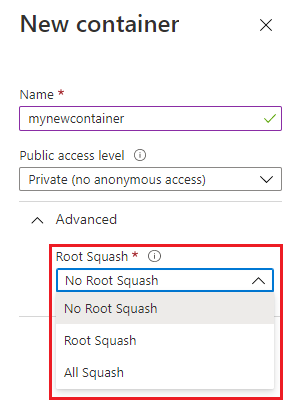

# Mount Blob Storage by using the Network File System (NFS) 3.0 protocol

> [!CAUTION]
> This article references CentOS, a Linux distribution that is nearing End Of Life (EOL) status. Please consider your use and planning accordingly. For more information, see the [CentOS End Of Life guidance](~/articles/virtual-machines/workloads/centos/centos-end-of-life.md).

This article provides guidance on how to mount a container in Azure Blob Storage from a Linux-based Azure virtual machine (VM) or a Linux system that runs on-premises by using the Network File System (NFS) 3.0 protocol. To learn more about NFS 3.0 protocol support in Blob Storage, see [Network File System (NFS) 3.0 protocol support for Azure Blob Storage](network-file-system-protocol-support.md).

## Step 1: Create an Azure virtual network 

Your storage account must be contained within a virtual network. A virtual network enables clients to connect securely to your storage account. To learn more about Azure Virtual Network, and how to create a virtual network, see the [Virtual Network documentation](../../virtual-network/index.yml).

> [!NOTE]
> Clients in the same virtual network can mount containers in your account. You can also mount a container from a client that runs in an on-premises network, but you'll have to first connect your on-premises network to your virtual network. See [Supported network connections](network-file-system-protocol-support.md#supported-network-connections).

## Step 2: Configure network security

Currently, the only way to secure the data in your storage account is by using a virtual network and other network security settings. See [Network security recommendations for Blob storage](security-recommendations.md#networking).

Any other tools used to secure data, including account key authorization, Microsoft Entra security, and access control lists (ACLs) can't be used to authorize an NFS 3.0 request. In fact, if you add an entry for a named user or group to the ACL of a blob or directory, that file becomes inaccessible on the client for non-root users. You would have to remove that entry to restore access to non-root users on the client.

> [!IMPORTANT]
> The NFS 3.0 protocol uses ports 111 and 2048. If you're connecting from an on-premises network, make sure that your client allows outgoing communication through those ports. If you have granted access to specific VNets, make sure that any network security groups associated with those VNets don't contain security rules that block incoming communication through those ports.

## Step 3: Create and configure a storage account

To mount a container by using NFS 3.0, you must create a storage account. You can't enable existing accounts.

The NFS 3.0 protocol is supported for standard general-purpose v2 storage accounts and for premium block blob storage accounts. For more information on these types of storage accounts, see [Storage account overview](../common/storage-account-overview.md).

To configure the account, choose these values:

|Setting | Premium performance | Standard performance
|----|---|---|
|Location|All available regions |All available regions
|Performance|Premium| Standard
|Account kind|BlockBlobStorage| General-purpose V2
|Replication|Locally-redundant storage (LRS), Zone-redundant storage (ZRS)| Locally-redundant storage (LRS), Zone-redundant storage (ZRS)
|Connectivity method|Public endpoint (selected networks) or Private endpoint |Public endpoint (selected networks) or Private endpoint
|Hierarchical namespace|Enabled|Enabled
|NFS V3|Enabled |Enabled

You can accept the default values for all other settings.

## Step 4: Create a container

Create a container in your storage account by using any of these tools or SDKs:

|Tools|SDKs|
|---|---|
|[Azure portal](https://portal.azure.com)|[.NET](data-lake-storage-directory-file-acl-dotnet.md#create-a-container)|
|[AzCopy](../common/storage-use-azcopy-v10.md#transfer-data)|[Java](data-lake-storage-directory-file-acl-java.md)|
|[PowerShell](data-lake-storage-directory-file-acl-powershell.md#create-a-container)|[Python](data-lake-storage-directory-file-acl-python.md#create-a-container)|
|[Azure CLI](data-lake-storage-directory-file-acl-cli.md#create-a-container)|[JavaScript](data-lake-storage-directory-file-acl-javascript.md)|
||[REST](/rest/api/storageservices/create-container)|

> [!NOTE]
> By default, the root squash option of a new container is **No Root Squash**. But you can change that to **Root Squash** or **All Squash**. For information about these squash options, see your operating system documentation.

The following image shows the squash options as they appear in the Azure portal.

> [!div class="mx-imgBorder"]
> 

## Step 5: Install the AZNFS Mount Helper package

The AZNFS Mount Helper package helps Linux NFS clients to reliably access Azure Blob NFS shares even when the IP address of the endpoint changes. This package runs a background job called `aznfswatchdog` which monitors changes to the endpoint IP address for the mounted shares. If a change is detected, this background job updates the Destination Network Address Translation (DNAT) rules. To learn more, see [AZNFS Mount Helper](https://github.com/Azure/AZNFS-mount/).

1. Determine whether the AZNFS Mount Helper package is installed on your client.

   ```
   systemctl is-active --quiet aznfswatchdog && echo -e "\nAZNFS mounthelper is installed! \n"
   ```

   If the package is installed, then the message `AZNFS mounthelper is installed!` appears.

2. If the package is not yet installed, then use the following command to install it. 

   ```
   wget -O - -q https://github.com/Azure/AZNFS-mount/releases/latest/download/aznfs_install.sh | bash
   ```

   > [!NOTE]
   > AZNFS is supported on following Linux distributions:
   > - Ubuntu (18.04 LTS, 20.04 LTS, 22.04 LTS)
   > - Centos7, Centos8
   > - RedHat7, RedHat8, RedHat9
   > - Rocky8, Rocky9
   > - SUSE (SLES 15)

## Step 6: Mount the container

Create a directory on your Linux system and then mount the container in the storage account.

1. On your Linux system, create a directory:

   ```
   mkdir -p /nfsdata
   ```

2. Mount the container by using one of the following methods. In both methods, replace the `<storage-account-name>` placeholder with the name of your storage account, and replace `<container-name>` with the name of your container.

   - To have the share mounted automatically on reboot:

     1. Create an entry in the /etc/fstab file by adding the following line:
  
        ```
        <storage-account-name>.blob.core.windows.net:/<storage-account-name>/<container-name>  /nfsdata    aznfs defaults,sec=sys,vers=3,nolock,proto=tcp,nofail,_netdev    0 0
        ```

     2. Run the following command to immediately process the /etc/fstab entries and attempt to mount the preceding path:
 
        ```
        mount /nfsdata
        ```
        
   - For a temporary mount that doesn't persist across reboots, run the following command: 
    
     ```
     mount -t aznfs -o sec=sys,vers=3,nolock,proto=tcp <storage-account-name>.blob.core.windows.net:/<storage-account-name>/<container-name>  /nfsdata
     ``` 
     
     > [!TIP]
     > By using the `-t aznfs` mount option, you ensure that the NFS client always remains correctly connected to the storage endpoint even if the endpoint IP changes after the mount. NFS shares that are mounted by using the `-t nfs` mount option might become disconnected from the storage endpoint if the IP address of that endpoint changes.

     Other optional parameters are available with the mount command. Those parameters primarily affect client-side behavior. `sys` is the only value that is currently supported by the `sec` option.

     > [!IMPORTANT]
     > The `nconnect` mount option works only on clients that have **Azure nconnect support**. Using the `nconnect` option on an unsupported client will decrease throughput and cause commands to timeout or work incorrectly. To learn more about how to ensure that your client has Azure nconnect support, see [Increase the number of TCP connections](network-file-system-protocol-support-performance.md#increase-the-number-of-tcp-connections). 

## Resolve common errors

|Error | Cause/resolution|
|---|---|
|`Access denied by server while mounting`|Ensure that your client is running within a supported subnet. See [Supported network locations](network-file-system-protocol-support.md#supported-network-connections).|
|`No such file or directory`| Make sure to type, rather than copy and paste, the mount command and its parameters directly into the terminal. If you copy and paste any part of this command into the terminal from another application, hidden characters in the pasted information might cause this error to appear. This error also might appear if the account isn't enabled for NFS 3.0.|
|`Permission denied`| The default mode of a newly created NFS 3.0 container is 0750. Non-root users don't have access to the volume. If access from non-root users is required, root users must change the mode to 0755. Sample command: `sudo chmod 0755 /nfsdata`|
|`EINVAL ("Invalid argument"`) |This error can appear when a client attempts to:<li>Write to a blob that was created from a blob endpoint.<li>Delete a blob that has a snapshot or is in a container that has an active WORM (write once, read many) policy.|
|`EROFS ("Read-only file system"`) |This error can appear when a client attempts to:<li>Write to a blob or delete a blob that has an active lease.<li>Write to a blob or delete a blob in a container that has an active WORM policy. |
|`NFS3ERR_IO/EIO ("Input/output error"`) |This error can appear when a client attempts to read, write, or set attributes on blobs that are stored in the archive access tier. |
|`OperationNotSupportedOnSymLink` error| This error can be returned during a write operation via a Blob Storage or Azure Data Lake Storage Gen2 API. Using these APIs to write or delete symbolic links that are created by using NFS 3.0 is not allowed. Make sure to use the NFS 3.0 endpoint to work with symbolic links. |
|`mount: /nfsdata: bad option;`| Install the NFS helper program by using `sudo apt install nfs-common`.|
|`Connection Timed Out`| Make sure that client allows outgoing communication through ports 111 and 2048. The NFS 3.0 protocol uses these ports. Makes sure to mount the storage account by using the Blob service endpoint and not the Data Lake Storage endpoint. |

## Limitations and troubleshooting for AZNFS Mount Helper

See [AZNFS Mount Helper](https://github.com/Azure/AZNFS-mount/).


## See also

- [Network File System (NFS) 3.0 protocol support for Azure Blob Storage](network-file-system-protocol-support.md)
- [Known issues with Network File System (NFS) 3.0 protocol support for Azure Blob Storage](network-file-system-protocol-known-issues.md)
