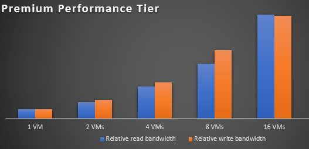
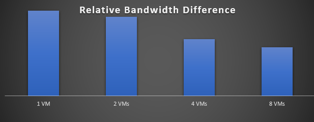

# Network File System (NFS) 3.0 performance considerations in Azure Blob storage

Blob storage now supports the Network File System (NFS) 3.0 protocol. This article contains recommendations that help you to optimize the performance of your storage requests. To learn more about NFS 3.0 support for Azure Blob Storage, see [Network File System (NFS) 3.0 protocol support for Azure Blob storage](network-file-system-protocol-support.md).

## Add clients to increase throughput

Azure Blob Storage scales linearly until it reaches the maximum storage account egress and ingress limit. Therefore, your applications can achieve higher throughput by using more clients. To view storage account egress and ingress limits, see [Scalability and performance targets for standard storage accounts](../common/scalability-targets-standard-account.md).

The following chart shows how bandwidth increases as you add more clients. In this chart, a client is a Virtual Machine (VM) and with a standard general-purpose v2 storage account.

> [!div class="mx-imgBorder"]
> 

The following chart shows this same effect when applied to a premium block blob storage account.

> [!div class="mx-imgBorder"]
> 

## Use premium block blob storage accounts for small scale applications

Not all applications can scale up by adding more clients. For those applications, [Azure premium block blob storage account](../common/storage-account-create.md) offers consistent low-latency and high transaction rates. The premium block blob storage account can reach maximum bandwidth with fewer threads and clients. For example, with a single client, a premium block blob storage account can achieve **2.3x** bandwidth compared to the same setup used with a standard performance general purpose v2 storage account.

Each bar in the following chart shows the difference in achieved bandwidth between premium and standard performance storage accounts. As the number of clients increases, that difference decreases.

> [!div class="mx-imgBorder"]
> 

## Improve read ahead size to increase large file read throughput

The read_ahead_kb kernel parameter represents the amount of additional data that should be read after fulfilling a given read request. You can increase this parameter to 16 MiB to improve large file read throughput.

```
export AZMNT=/your/container/mountpoint

echo 16384 > /sys/class/bdi/0:$(stat -c "%d" $AZMNT)/read_ahead_kb
```

## Avoid frequent overwrites on data

It takes longer time to complete an overwrite operation than a new write operation. That's because an NFS overwrite operation, especially a partial in-place file edit, is a combination of several underlying blob operations: a read, a modify, and a write operation. Therefore, an application that requires frequent in place edits is not suited for NFS enabled blob storage accounts.

## Deploy Azure HPC Cache for latency sensitive applications

Some applications may require low latency in addition to high throughput. You can deploy [Azure HPC Cache](../../hpc-cache/nfs-blob-considerations.md) to improve latency significantly. Learn more about [Latency in Blob storage](storage-blobs-latency.md).

## Other best practice recommendations

- Use VMs with sufficient network bandwidth.

- Use multiple mount points when your workloads allow it.

- Use as many threads as possible.

- Use large block sizes.

- Make storage requests from a client that is located in the same region as the storage account. This can improve network latency.

## Next steps

- To learn more about NFS 3.0 support for Azure Blob Storage, see [Network File System (NFS) 3.0 protocol support for Azure Blob storage](network-file-system-protocol-support.md).

- To get started, see [Mount Blob storage by using the Network File System (NFS) 3.0 protocol](network-file-system-protocol-support-how-to.md).
