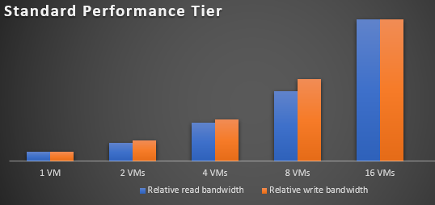
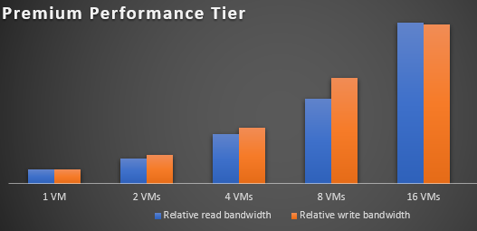
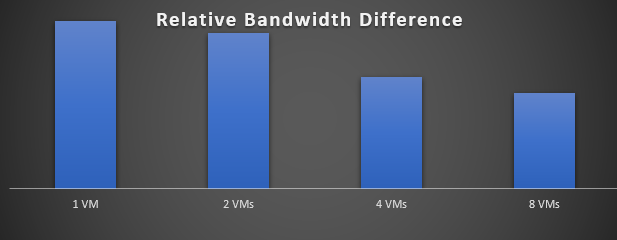

# Network File System (NFS) 3.0 performance considerations in Azure Blob Storage

Azure Blob Storage now supports the Network File System (NFS) 3.0 protocol. This article contains recommendations that help you to optimize the performance of your storage requests. To learn more about NFS 3.0 support for Blob Storage, see [Network File System (NFS) 3.0 protocol support for Azure Blob Storage](network-file-system-protocol-support.md).

## Add clients to increase throughput

Blob Storage scales linearly until it reaches the maximum storage account egress and ingress limit. Therefore, your applications can achieve higher throughput by using more clients. To view storage account egress and ingress limits, see [Scalability and performance targets for standard storage accounts](../common/scalability-targets-standard-account.md).

The following chart shows how bandwidth increases as you add more clients. In this chart, a client is a virtual machine (VM) with a standard general-purpose v2 storage account.

> [!div class="mx-imgBorder"]
> 

The following chart shows this same effect when applied to a premium block blob storage account.

> [!div class="mx-imgBorder"]
> 

## Use premium block blob storage accounts for small-scale applications

Not all applications can scale up by adding more clients. For those applications, [Azure premium block blob storage account](../common/storage-account-create.md) offers consistently low-latency and high-transaction rates. The premium block blob storage account can reach maximum bandwidth with fewer threads and clients. For example, with a single client, a premium block blob storage account can achieve *2.3x* bandwidth compared to the same setup used with a standard performance general-purpose v2 storage account.

Each bar in the following chart shows the difference in achieved bandwidth between premium and standard performance storage accounts. As the number of clients increases, that difference decreases.

> [!div class="mx-imgBorder"]
> 

## Improve read ahead size to increase large file read throughput

The `read_ahead_kb` kernel parameter represents the amount of extra data that should be read after fulfilling a given read request. You can increase this parameter to 16 MiB to improve large file read throughput.

```
export AZMNT=/your/container/mountpoint

echo 16384 > /sys/class/bdi/0:$(stat -c "%d" $AZMNT)/read_ahead_kb
```

## Avoid frequent overwrites on data

It takes longer to complete an overwrite operation than a new write operation. An NFS overwrite operation, especially a partial in-place file edit, is a combination of several underlying blob operations, such as read, modify, and write operations. Therefore, an application that requires frequent in-place edits isn't suited for NFS-enabled Blob Storage accounts.

## Deploy Azure HPC Cache for latency sensitive applications

Some applications might require low latency in addition to high throughput. You can deploy [Azure HPC Cache](../../hpc-cache/nfs-blob-considerations.md) to improve latency significantly. Learn more about [latency in Blob Storage](storage-blobs-latency.md).

## Increase the number of TCP connections

You can use the `nconnect` mount option to get higher aggregate read and write performance from a single VM, but only if your Linux kernel has *Azure nconnect support*.

The `nconnect` option is a client-side Linux mount option that you can use for multiple Transmission Control Protocol (TCP) connections between the client and the blob service endpoint. You can use the `nconnect` option in the mount command to specify the number of TCP connections that you want create (for example: `mount -t aznfs -o nconnect=16,sec=sys,vers=3,nolock,proto=tcp <storage-account-name>.blob.core.windows.net:/<storage-account-name>/<container-name>  /nfsdatain`).

> [!IMPORTANT]
> Although the latest Linux distributions fully support `nconnect`, use this option only if your kernel has Azure `nconnect` support. Using the `nconnect` mount option without Azure `nconnect` support decreases throughput, causes multiple timeouts, and causes commands such as `READDIR` and `READIRPLUS` to work incorrectly.

Azure `nconnect` support is available with most of the recent Ubuntu kernels that you can use with Azure VMs. To find out if Azure `nconnect` support is available for your kernel, run the following command:

```
[ -e /sys/module/sunrpc/parameters/enable_azure_nconnect ] && echo "Yes" || echo "No"
```

If Azure `nconnect` support is available for your kernel, then `Yes` is printed to the console. Otherwise, `No` is printed to the console.

If Azure `nconnect` support is available, run the following command to enable it:

```
echo Y > /sys/module/sunrpc/parameters/enable_azure_nconnect
```

## Other best practices

- Use VMs with sufficient network bandwidth.
- Use multiple mount points when your workloads allow it.
- Use as many threads as possible.
- Use large block sizes.
- Make storage requests from a client that's located in the same region as the storage account to improve network latency.

## Related content

- To learn more about NFS 3.0 support for Blob Storage, see [Network File System (NFS) 3.0 protocol support for Azure Blob Storage](network-file-system-protocol-support.md).
- To get started, see [Mount Blob Storage by using the Network File System (NFS) 3.0 protocol](network-file-system-protocol-support-how-to.md).
