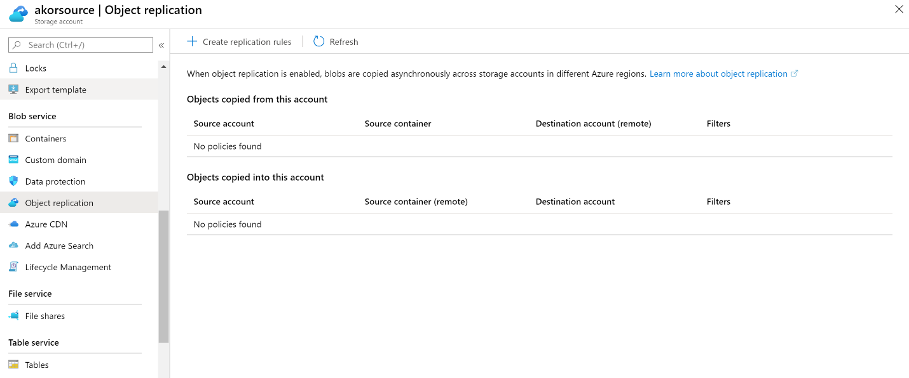
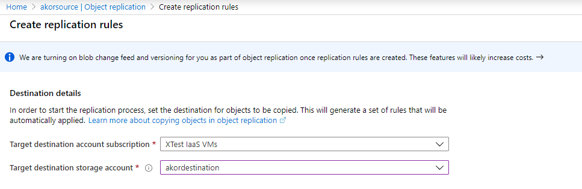
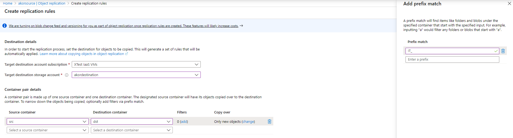
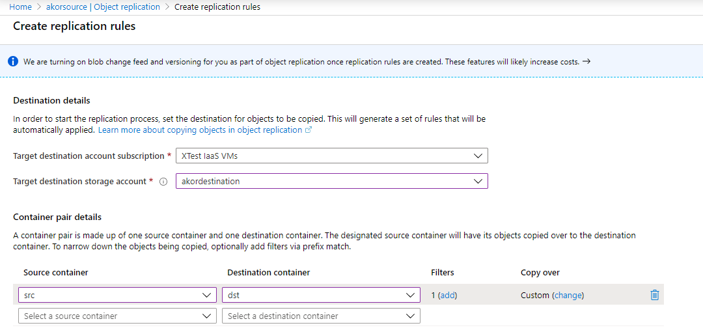
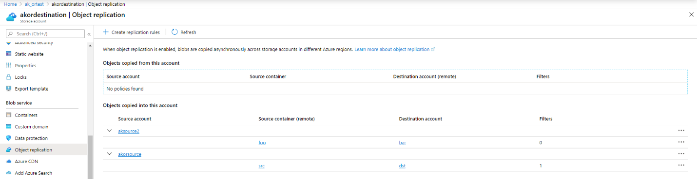

# Object replication (preview)

Object replication (preview) allows you to replicate your block blob data at the blob level from one storage account to another in any Azure region.

Object replication unblocks a new set of common replication scenarios:

-   Minimize latency – have your users consume the data locally rather than     issuing cross-region read requests.

-   Increase efficiency – have your compute clusters process/transform the same     set of objects locally in different regions.

-   Optimize data distribution – have your data consolidated in a single     location for processing/analytics and then distribute only resulting     dashboards to your offices worldwide.

-   Optimize cost – tier down your data to Archive upon replication completion     using Lifecycle Management policies to optimize the cost.

### Regional availability

At this time object replication is available in US East 2, US Central and Europe West with the remaining regions to be added in the near future. To enable Object Replication both source and destination accounts should exist or be created in those regions.

### Prerequisites

Object replication requires:

-   [General purpose v2 storage     account](https://docs.microsoft.com/azure/storage/common/storage-account-overview)     and is available for block blobs only.

-   Versioning to be enabled on both source and destination accounts.

-   Change feed to be enabled only on the source account.

These prerequisites incur additional cost – please refer to [Azure Storage pricing page](https://azure.microsoft.com/pricing/details/storage/) for more details. During preview there will be no additional cost associated with replicating data between storage accounts. Regional replication cost (both within the geography and across geographies) will be announced once the capability reaches general availability.

### Getting started

Make sure you’re already registered for Change feed and Versioning capabilities. To enroll in object replication preview, submit a request to register this feature to your subscription, and once approved (within few business days) you can enable object replication for any new or existing storage accounts in the aforementioned regions.

Enroll by using PowerShell:

Register-AzProviderFeature -FeatureName AllowObjectReplication -ProviderNamespace Microsoft.Storage

Register-AzResourceProvider -ProviderNamespace Microsoft.Storage

Enroll by using Azure CLI:

az feature register --namespace Microsoft.Storage --name AllowObjectReplication

az provider register --namespace 'Microsoft.Storage'

### Configuration

You can enable object replication using various methods including Azure Portal, Azure CLI, Azure PowerShell, ARM and Azure Storage Management SDKs.

#### Portal experience

In the Portal, choose the source account and go to ‘Object replication’ tab.

Click ‘Create replication rules’, choose ‘Target destination account subscription’, ‘Target destination storage account’:

Then specify ‘Source container’, ‘Destination container’, any ‘Filters’ you’d like to use, and the ‘Copy over’ parameter:

‘Copy over’ parameter allows you to specify the replication behavior for the data which existed prior to object replication being enabled. ‘Copy over’ parameter has the following three values:

-   Everything. All the data that existed prior to object replication being     enabled will be replicated to the destination account/container.

-   Only new objects. Only new blobs added after object replication had been     enabled will be replicated to the destination account/container.

-   Custom. Allows you to only replicate the blobs which were created after the     specified time.

Once all required fields are filled in, click ‘Save and apply’:

Using the ‘Object replication’ tab, you can further review the list of policies that are in effect both in which the account is used as a source and as a destination:

#### Azure PowerShell experience

Install and import the PowerShell preview module which supports object replication:

Install-Module Az.Storage –Repository PSGallery -RequiredVersion 1.13.4-preview –AllowPrerelease –AllowClobber –Force

Import-Module Az.Storage -RequiredVersion 1.13.4

To start working with Azure PowerShell, sign in with your Azure credentials.

Connect-AzAccount

Enable both Change feed and Versioning on the source storage account. Make sure
you’re already registered for [Change feed](https://azure.microsoft.com/blog/change-feed-support-now-available-in-preview-for-azure-blob-storage/) and Versioning capabilities.

Update-AzStorageBlobServiceProperty -ResourceGroupName \<resource group\> -StorageAccountName \<source storage account\> -EnableChangeFeed \$true -IsVersioningEnabled \$true

Enable Versioning on the destination storage account.

Update-AzStorageBlobServiceProperty -ResourceGroupName \<resource group\> -StorageAccountName \<destination storage account\> -IsVersioningEnabled \$true

Create source and destination containers you’re planning to replicate the data between.

Get-AzStorageAccount -ResourceGroupName \<resource group\> -StorageAccountName \<source account\> \| New-AzStorageContainer \<source container\>

Get-AzStorageAccount -ResourceGroupName \<resource group\> -StorageAccountName \<destination account\> \| New-AzStorageContainer \<destination container\>

Create a new replication rule and specify the desired prefix and replication behavior for the objects, that existed prior to configuring object replication.

\$rule = New-AzStorageObjectReplicationPolicyRule -SourceContainer \<source container\> -DestinationContainer \<destination container\> -PrefixMatch \<desired prefix match\> -MinCreationTime (Get-Date).AddDays(-3)

For list of available parameters and their values, run Get-Help New-AzStorageObjectReplicationPolicyRule -Full and/or Get-Help New-AzStorageObjectReplicationPolicyRule -Examples.

Create a replication policy on the destination account and pass on the rule you created earlier.

Set-AzStorageObjectReplicationPolicy -ResourceGroupName \<resource group\> -StorageAccountName \<destination storage account\> -PolicyId default -SourceAccount \<source storage account\> -Rule \$rule

Retrieve the replication policy you created and enable object replication on the source account by adding the replication policy to it.

\$dstpolicy = Get-AzStorageObjectReplicationPolicy -ResourceGroupName \<resource group\> -StorageAccountName \<destination storage account\>

Set-AzStorageObjectReplicationPolicy -ResourceGroupName \<resource group\> -StorageAccountName \<source storage account\> -InputObject \$dstpolicy

Get details on the replication policy in effect on the destination account and its associated properties.

\$dstpolicy

\$dstpolicy.Rules

Get details on the replication policy in effect on the source account and its associated properties.

\$srcpolicy = Get-AzStorageObjectReplicationPolicy -ResourceGroupName \<resource group\> -StorageAccountName \<source storage account\>

\$srcpolicy

\$srcpolicy.Rules

When no longer needed, remove the replication policy from the source and destination accounts.

Get-AzStorageObjectReplicationPolicy -ResourceGroupName \<resource group\> -StorageAccountName \<destination storage account\> \| Remove-AzStorageObjectReplicationPolicy

Get-AzStorageObjectReplicationPolicy -ResourceGroupName \<resource group\> -StorageAccountName \<source storage account\> \| Remove-AzStorageObjectReplicationPolicy

#### Azure CLI experience

Refer to [Install the Azure CLI](https://docs.microsoft.com/cli/azure/install-azure-cli?view=azure-cli-latest) article to install and import the preview module supporting object replication capability.

az extension add -n storage-ors-preview

To start working with Azure CLI, sign in with your Azure credentials.

az login

Enable both Change feed and Versioning on the source storage account. Make sure you’re already registered for [Change feed](https://azure.microsoft.com/blog/change-feed-support-now-available-in-preview-for-azure-blob-storage/) and Versioning capabilities.

az storage blob service-properties update --enable-versioning --resource-group \<resource group\> --account-name \<source storage account\>

az storage blob service-properties update --enable-change-feed --resource-group \<resource group\> --account-name \<source storage account\>

Enable Versioning on the destination storage account.

az storage blob service-properties update --enable-versioning --resource-group \<resource group\> --account-name \<destination storage account\>

Create a new replication policy and an associated rule(s) and specify the desired prefix and replication behavior for the objects, that existed prior to configuring object replication.

az storage account ors-policy create \\

\--account-name \<destination storage account\> \\

\--resource-group \<resource group\> \\

\--source-account \<source storage account\> \\

\--destination-account \<destination storage account\> \\

\--source-container \<source container\> \\

\--min-creation-time '2020-02-19T16:05:00Z' \\

\--prefix-match prod\_

For list of available parameters and their values refer to Azure CLI object replication extension documentation.

Enable object replication on the source account by adding the replication policy to it.

az storage account ors-policy show -g \<resource group\> -n \<destination storage account\> --policy-id \<policy id from the previous step\> \| az storage account ors-policy create -g \<resource group\> -n \<source storage account\> -p "\@-"

Save the replication policy ID and the rule ID into variables for further orchestration.

\$policyid = (az storage account ors-policy create --account-name \<source/destination storage account\> --resource-group \<resource group\> --properties \@{path}) --query policyId)

\$ruleid = (az storage account ors-policy create --account-name \<source/destination storage account\> --resource-group \<resource group\> --properties \@{path}) --query rules.ruleId)

List replication policies in effect on a given storage account.

az storage account ors-policy list \\

\--account-name \<source/destination storage account\> \\

\--resource-group \<resource group\>

Retrieve details of a specific replication policy.

az storage account ors-policy show \\

\--policy-id \$policyid \\

\--account-name \<source/destination storage account\> \\

\--resource-group \<resource group\>

Change the source account name by updating the existing replication policy.

az storage account ors-policy update \\

\--policy-id \$policyid \\

\--account-name \<destination storage account\> \\

\--resource-group \<resource group\> \\

\-s \<new source storage account\>

Add rule to an existing replication policy.

az storage account ors-policy rule add \\

\--policy-id \$policyid \\

\--account-name \<destination storage account\> \\

\--resource-group \<resource group\> \\

\--destination-container \<destination container\> \\

\--source-container \<source container\> \\

\--prefix-match test\_ \\

\--min-creation-time '2020-02-19T16:05:00Z'

List all rules in effect for a given replication policy.

az storage account ors-policy rule list \\

\--policy-id \$policyid \\

\--account-name \<source/destination storage account\> \\

\--resource-group \<resource group\>

When no longer needed, remove the replication policy from the source and
destination accounts.

az storage account ors-policy remove \\

\--policy-id \$policyid \\

\--account-name \<source/destination storage account\> \\

\--resource-group \<resource group\>

#### Python SDK

<https://github.com/zfchen95/azure-rest-api-specs-pr/blob/ors1018/specification/storage/resource-manager/Microsoft.Storage/stable/2019-06-01/examples/StorageAccountUpdateObjectReplicationPolicyOnDestination.json>

<https://github.com/zfchen95/azure-rest-api-specs-pr/blob/ors1018/specification/storage/resource-manager/Microsoft.Storage/stable/2019-06-01/examples/StorageAccountUpdateObjectReplicationPolicyOnSource.json>

### Configuration considerations

Once object replication is enabled for a set of source and destination accounts, consider the following user experience:

-   Replication is eventually consistent. This capability replicates the data     object by object (blob by blob) hence the replication latency is dependent     on the size on the object.

-   Changes are read from the Change feed every minute and then replicated to     the destination account.

-   Deletes are propagated to the destination account/container. With Versioning     enabled deleting a blob creates a new historical version of the blob.

-   Data that existed prior to object replication being configured can be     replicated to the destination container by using MinCreationTime parameter.

### Known limitations 

Once object replication is enabled for a set of source and destination accounts, consider the following user experience:

-   When enabling object replication for a pair of source-destination accounts,     a replication policy is created. object replication supports creating 2     replication policies with up to 10 rules within each policy. Rule defines     the scope of the replication.

-   Destination container is read-only. You can configure the destination     container’s Access Policy, delete and tier down the objects to Archive in     the destination container when necessary.
