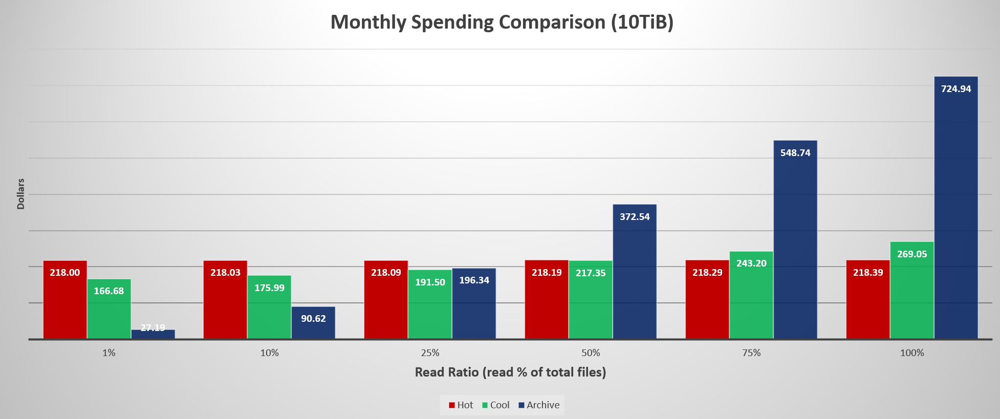

# Reduce costs with access tier best practices

You can reduce costs by placing blob data into the most cost effective access tiers. To learn more, see [Hot, Cool, and Archive access tiers for blob data](access-tiers-overview.md?tabs=azure-portal). For data that is new to Azure Storage, you can save costs by uploading data to the most optimal tier up-front. For data already in Azure Storage, you can analyze your data estate to find cost savings opportunities. This article provides best practice guidance that you can apply to reduce the cost of your data.

> [!NOTE]
> This article uses fictitious prices in all calculations. For official prices, see [Azure Blob Storage pricing](https://azure.microsoft.com/pricing/details/storage/blobs/) or [Azure Data Lake Storage pricing](https://azure.microsoft.com/pricing/details/storage/data-lake/). For more information about how to choose the correct pricing page, see [Understand the full billing model for Azure Blob Storage](../common/storage-plan-manage-costs.md).

## Carefully select the initial access tier

If you upload or migrate data to Azure Storage, try to choose the most appropriate access tier prior up front because it costs money to move data between tiers. You'll incur the cost of reading from the source tier and then writing to the destination tier. If you use a lifecycle management policy to move data, then you'll also incur the cost of listing operations. Also, lifecycle management policies require a day to take effect and a day for the tiering operation to complete.

To determine which tier makes the most sense, analyze the current or expected read patterns of the data that you plan to ingest into Azure. The following chart shows the impact on monthly spending given various read percentages. This chart assumes a monthly ingest of 1,000,000 files totaling 10,240 GB in size.

For example, the second pair of bars assumes that workloads read 100,000 files (10% of 1,000,000 files) and 1,024 GB (10% of 10,240 GB). Assuming the fictitious pricing, the estimated monthly cost of cool storage is $175.99 and the estimated monthly cost of archive storage is $90.62.

> [!div class="mx-imgBorder"]
> 

For guidance about how to upload to a specific access tier, see [Set a blob's access tier](access-tiers-online-manage.md). For offline data movement to the desired tier, see [Azure Data Box](/products/databox/)

## Optimize the costs of data already in Azure Storage

By understanding how your blobs and containers are stored, organized, and used in production, you can better optimize the tradeoffs between cost and performance. Use these articles to help you analyze your data.

- [Tutorial: Analyze blob inventory reports](storage-blob-inventory-report-analytics.md)

- [Calculate blob count and total size per container using Azure Storage inventory](calculate-blob-count-size.md)

You can use lifecycle management policies to move data between tiers and save money. These policies can move data to by using rules that you specify. For example, you might create a rule that moves blobs to the archive tier if that blob hasn't been modified in 90 days. To learn more, see [Manage the Azure Blob Storage lifecycle](lifecycle-management-overview.md?tabs=azure-portal)

If your analysis shows a lot of page and append blobs, you can use lifecycle management to tier those objects as well. You'll have to first convert them to block blobs. See [topic link goes here](archive-cost-estimation.md)

## Optimize for archive storage

If you decide to archive data, see this article to help you estimate the cost of archiving and which pattern of archiving makes most sense to you: [Estimate the cost of archiving data](archive-cost-estimation.md)  

To save costs even further, consider combining objects into a larger files and read costs will be decreased. Put more details here.

## Next steps

- [Set a blob's access tier](access-tiers-online-manage.md)
- [Archive a blob](archive-blob.md)
- [Optimize costs by automatically managing the data lifecycle](lifecycle-management-overview.md)
- [Estimate the cost of archiving data](archive-cost-estimation.md)
