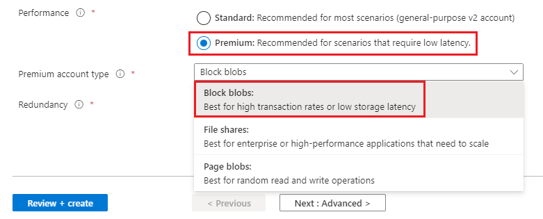

# Premium tier for Azure Data Lake Storage

Azure Data Lake Storage Gen2 now supports [premium block blob storage accounts](storage-blob-block-blob-premium.md). Premium block blob storage accounts are ideal for big data analytics applications and workloads that require low consistent latency and have a high number of transactions. Example workloads include interactive workloads, IoT, streaming analytics, artificial intelligence, and machine learning. 

>[!TIP]
> To learn more about the performance and cost advantages of using a premium block blob storage account, and to see how other Data Lake Storage Gen2 customers have used this type of account, see [Premium block blob storage accounts](storage-blob-block-blob-premium.md).

## Getting started with premium

First, check to make sure your favorite Blob Storage features are compatible with premium block blob storage accounts, then create the account. 

>[!NOTE]
> You can't convert an existing standard general-purpose v2 storage account to a premium block blob storage account. To migrate to a premium block blob storage account, you must create a premium block blob storage account, and migrate the data to the new account. 

### Check for Blob Storage feature compatibility

Some Blob Storage features aren't yet supported or have partial support in premium block blob storage accounts. Before choosing premium, review the [Blob Storage feature support in Azure Storage accounts](storage-feature-support-in-storage-accounts.md) article to determine whether the features that you intend to use are fully supported in your account. Feature support is always expanding so make sure to periodically review this article for updates.

### Create a new Storage account

Create a new Azure Storage account. For complete guidance, see [Create a storage account](../common/storage-account-create.md) account. 

As you create the account, choose the **Premium** performance option and the **Block blobs** account type. 

> [!div class="mx-imgBorder"]
> 

To unlock Azure Data Lake Storage Gen2 capabilities, enable the **Hierarchical namespace** setting in the **Advanced** tab of the **Create storage account** page. 

The following image shows this setting in the **Create storage account** page.

> [!div class="mx-imgBorder"]
> 

## Next steps

Use the premium tier for Azure Data Lake Storage with your favorite analytics service such as Azure Databricks, Azure HDInsight and Azure Synapse Analytics. See [Tutorials that use Azure services with Azure Data Lake Storage Gen2](data-lake-storage-integrate-with-services-tutorials.md).
