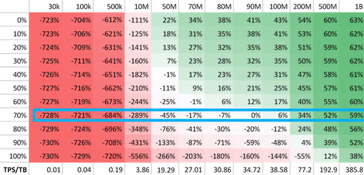
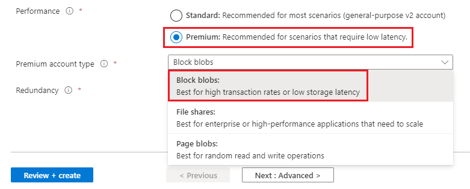

# Premium tier for Azure Data Lake Storage

Azure Data Lake Storage Gen2 now supports the [premium performance tier](storage-blob-performance-tiers.md#premium-performance). The premium performance tier is ideal for big data analytics applications and workloads that require low consistent latency and have a high number of transactions.

## Workloads that can benefit from the premium performance tier

Example workloads include interactive workloads, IoT, streaming analytics, artificial intelligence, and machine learning. 

**Interactive workloads** 

These workloads require instant updates and user feedback, such as e-commerce and mapping applications, interactive video applications, etc. For example, in an e-commerce application, less frequently viewed items are likely not cached. However, they must be instantly displayed to the customer on demand. As another example, data scientists, analysts and developers can derive time-sensitive insights even faster by running queries on data stored in an account that uses the premium performance tier. 

**IoT/streaming analytics** 

In an IoT scenario, lots of smaller write operations might be pushed to the cloud every second. Large amounts of data might be ingested, aggregated for analysis purposes, and then deleted almost immediately. The high ingestion capabilities of the premium performance tier make it efficient for this type of workload. 

**Artificial intelligence/machine learning (AI/ML)** 

AI/ML deals with the consumption and processing of different data types like visuals, speech, and text. This high-performance computing type of workload deals with large amounts of data that requires rapid response and efficient ingestion times for data analysis. 

## Cost effectiveness

The premium performance tier has a higher storage cost but a lower transaction cost as compared to the standard performance tier. If your applications and workloads execute a large number of transactions, the premium performance tier can be cost-effective.

The following table demonstrates the cost-effectiveness of the premium tier for Azure Data Lake Storage. Each column represents the number of transactions in a month.  Each row represents the percentage of transactions that are read transactions. Each cell in the table shows the percentage of cost reduction associated with a read transaction percentage and the number of transactions executed. 

For example, assuming that your account is in the East US 2 region, the number of transactions with your account exceeds 90M, and 70% of those transactions are read transactions, the premium performance tier is more cost-effective.

> [!div class="mx-imgBorder"]
> 

> [!NOTE] 
> If you prefer to evaluate cost effectiveness based on the number of transactions per second for each TB of data, you can use the column headings that appear at the bottom of the table.

For more information about pricing, see the [Azure Data Lake Storage Gen2 pricing](https://azure.microsoft.com/pricing/details/storage/data-lake/) page.

## Feature availability 

Some Blob storage features might not be available or might only have partial support with the premium performance tier. For a complete list, see [Blob storage features available in Azure Data Lake Storage Gen2](data-lake-storage-supported-blob-storage-features.md). Then, review a list of [known issues](data-lake-storage-known-issues.md) to assess any gaps in functionality.

## Enabling the premium performance tier 

You can use the premium tier for Azure Data Lake Storage by creating a BlockBlobStorage account with the **Hierarchical namespace** setting **enabled**. For complete guidance, see [Create a BlockBlobStorage account](storage-blob-create-account-block-blob.md) account.

When you create the account, make sure to choose the **Premium** performance option and the **BlockBlobStorage** account kind.

> [!div class="mx-imgBorder"]
> 

Enable the **Hierarchical namespace** setting in the **Advanced** tab of the **Create storage account** page. You must enable this setting when you create the account. You can't enable it afterwards.

The following image shows this setting in the **Create storage account** page.

> [!div class="mx-imgBorder"]
> 

## Regional availability

Premium tier for Azure Data Lake Storage is available in the following regions.

|Region|Redundancy|
|--|--|
|East US|LRS, ZRS|
|East US 2|LRS, ZRS|
|Central US|LRS|
|West US|LRS|
|West US 2|LRS, ZRS|
|West Central US|LRS|
|South Central US|LRS|
|Canada Central|LRS|
|Canada East|LRS|
|North Europe|LRS, ZRS|
|West Europe|LRS, ZRS|
|UK South|LRS|
|UK West|LRS|
|France Central|LRS|
|Asia East|LRS|
|Korea Central|LRS|
|Korea South|LRS|
|Central India|LRS|
|West India|LRS|
|UAE North|LRS|
|Japan East|LRS|
|Japan West|LRS|
|South East Asia|LRS, ZRS|
|Australia East|LRS, ZRS|
|Australia South East|LRS|
|Brazil South|LRS|
