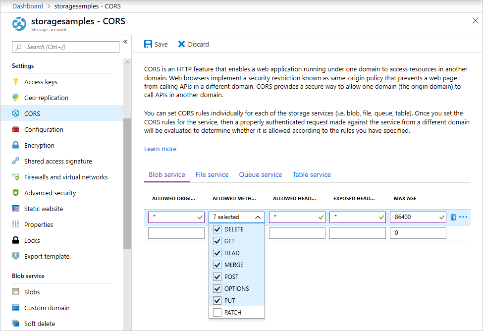

<!-- Customer intent: As a web application developer I want to interface with Azure Blob storage entirely on the client so that I can build a SPA application that is able to upload and delete files on blob storage. -->

# Quickstart: Manage blobs with JavaScript v12 SDK in a browser

In this quickstart, you learn to manage blobs by using JavaScript in a browser. Blobs are objects that can hold large amounts of text or binary data, including images, documents, streaming media, and archive data. You'll upload and list blobs, and you'll create and delete containers.

[API reference documentation](/javascript/api/@azure/storage-blob) | [Library source code](https://github.com/Azure/azure-sdk-for-js/tree/master/sdk/storage/storage-blob) | [Package (bundling)](https://github.com/Azure/azure-sdk-for-js/blob/master/documentation/Bundling.md) | [Samples](https://docs.microsoft.com/azure/storage/common/storage-samples-javascript?toc=%2fazure%2fstorage%2fblobs%2ftoc.json#blob-samples)

> [!NOTE]
> To get started with the previous SDK version, see [Quickstart: Manage blobs with JavaScript v10 SDK in Node.js](storage-quickstart-blobs-nodejs-legacy.md).

## Prerequisites

- [An Azure account with an active subscription](https://azure.microsoft.com/free/?ref=microsoft.com&utm_source=microsoft.com&utm_medium=docs&utm_campaign=visualstudio)
- [An Azure Storage account](../common/storage-account-create.md)
- [Node.js](https://nodejs.org)
- [Visual Studio Code](https://code.visualstudio.com)
- A VS Code extension for browser debugging, such as [Debugger for Chrome](vscode:extension/msjsdiag.debugger-for-chrome) or [Debugger for Microsoft Edge](vscode:extension/msjsdiag.debugger-for-edge).


[!INCLUDE [storage-multi-protocol-access-preview](../../../includes/storage-multi-protocol-access-preview.md)]

## Setting up storage account CORS rules

Before your web application can access a blob storage from the client, you must configure your account to enable [cross-origin resource sharing](https://docs.microsoft.com/rest/api/storageservices/cross-origin-resource-sharing--cors--support-for-the-azure-storage-services), or CORS.

Return to the Azure portal and select your storage account. To define a new CORS rule, navigate to the **Settings** section and click on the **CORS** link. For this quickstart, you create an open CORS rule:



The following table describes each CORS setting and explains the values used to define the rule.

|Setting  |Value  | Description |
|---------|---------|---------|
| Allowed origins | * | Accepts a comma-delimited list of domains set as acceptable origins. Setting the value to `*` allows all domains access to the storage account. |
| Allowed methods     | delete, get, head, merge, post, options, and put | Lists the HTTP verbs allowed to execute against the storage account. For the purposes of this quickstart, select all available options. |
| Allowed headers | * | Defines a list of request headers (including prefixed headers) allowed by the storage account. Setting the value to `*` allows all headers access. |
| Exposed headers | * | Lists the allowed response headers by the account. Setting the value to `*` allows the account to send any header.  |
| Max age (seconds) | 86400 | The maximum amount of time the browser caches the preflight OPTIONS request. A value of *86400* allows the cache to remain for a full day. |

After you fill in the fields with the values from this table, click the **Save** button.

> [!IMPORTANT]
> Ensure any settings you use in production expose the minimum amount of access necessary to your storage account to maintain secure access. The CORS settings described here are appropriate for a quickstart as it defines a lenient security policy. These settings, however, are not recommended for a real-world context.

## Create a shared access signature

The shared access signature (SAS) is used by the code running in the browser to authorize requests to Blob storage. By using the SAS, the client can authorize access to storage resources without the account access key or connection string. For more information on SAS, see [Using shared access signatures (SAS)](../common/storage-sas-overview.md).

You can create a SAS using the Azure CLI, the Azure portal, or Azure Storage Explorer. The following table describes the parameters you need to provide values for to generate a SAS with the CLI.

| Parameter      |Description  | Placeholder |
|----------------|-------------|-------------|
| *expiry*       | The expiration date of the access token in YYYY-MM-DD format. Enter tomorrow's date for use with this quickstart. | <*YYYY-MM-DD*> |
| *account-name* | The storage account name. Use the name set aside in an earlier step. | <*YOUR_STORAGE_ACCOUNT_NAME*> |
| *account-key*  | The storage account key. Use the key set aside in an earlier step. | <*YOUR_STORAGE_ACCOUNT_KEY*> |

Use the following CLI command, with actual values for each placeholder, to generate a SAS that you can use in your JavaScript code.

```azurecli-interactive
az storage account generate-sas \
  --permissions racwdl \
  --resource-types sco \
  --services b \
  --expiry <YYYY-MM-DD> \
  --account-name <YOUR_STORAGE_ACCOUNT_NAME> \
  --account-key <YOUR_STORAGE_ACCOUNT_KEY>
```

You may find the series of values after each parameter a bit cryptic. These parameter values are taken from the first letter of their respective permission. The following table explains where the values come from:

| Parameter        | Value   | Description  |
|------------------|---------|---------|
| *permissions*    | racwdl  | This SAS allows *read*, *append*, *create*, *write*, *delete*, and *list* capabilities. |
| *resource-types* | sco     | The resources affected by the SAS are *service*, *container*, and *object*. |
| *services*       | b       | The service affected by the SAS is the *blob* service. |

Now that the SAS is generated, copy the return value and save it somewhere for use in an upcoming step. If you generated your SAS using a method other than the Azure CLI, you'll need to remove the initial `?` if it's present. This character is a URL separator that is already provided where the SAS is used.

> [!IMPORTANT]
> In production, always pass SAS tokens using SSL. Also, SAS tokens should be generated on the server and sent to the HTML page in order pass back to Azure Blob Storage. One approach you may consider is to use a serverless function to generate SAS tokens. The Azure Portal includes function templates that feature the ability to generate a SAS with a JavaScript function.

## Implement the HTML page

In this section, you'll create a basic web page and configure VS Code debug the page. Before you can launch, you'll need to use Node.js to start a local web server to serve the page to your browser. Next, you'll add JavaScript code to call various blob storage APIs and display results. You can also see the results of these calls in the [Azure portal](https://portal.azure.com).

### Set up the web application

First, create a new folder called *azure-blobs-javaScript* and open it in VS Code. Then create a new file in VS Code, add the following HTML, and save it as *index.html* in the *azure-blobs-javaScript* folder.

```html
<!DOCTYPE html>
<html>

<body>
    <button id="create-container-button">Create container</button>
    <button id="delete-container-button">Delete container</button>
    <button id="select-button">Select and upload files</button>
    <input type="file" id="file-input" multiple style="display: none;" />
    <button id="list-button">List files</button>
    <button id="delete-button">Delete selected files</button>
    <p><b>Status:</b></p>
    <p id="status" style="height:160px; width: 593px; overflow: scroll;" />
    <p><b>Files:</b></p>
    <select id="file-list" multiple style="height:222px; width: 593px; overflow: scroll;" />
</body>

<!-- You'll add code here later in this quickstart. -->

</html>
```

### Configure the debugger

To set up the debugger extension in VS Code, select **Run > Add Configuration...**, then select **Chrome** or **Edge**, depending on which extension you installed in the [Prerequisites](#prerequisites) section earlier. This action creates a *launch.json* file and opens it in the editor.

Next, modify the *launch.json* file so that the `url` value includes `/index.html` as shown:

```json
{
    // Use IntelliSense to learn about possible attributes.
    // Hover to view descriptions of existing attributes.
    // For more information, visit: https://go.microsoft.com/fwlink/?linkid=830387
    "version": "0.2.0",
    "configurations": [
        {
            "type": "edge",
            "request": "launch",
            "name": "Launch Edge against localhost",
            "url": "http://localhost:8080/index.html",
            "webRoot": "${workspaceFolder}"
        }
    ]
}
```

This configuration tells VS Code which browser to launch and which URL to load.

### Launch the web server

To launch the local Node.js web server, select **View > Terminal** to open a console window inside VS Code, then enter the following command.

```console
npx http-server
```

This command will install the *http-server* package and launch the server, making the current folder available through default URLs including the one indicated in the previous step.

### Start debugging

To launch *index.html* in the browser with the VS Code debugger attached, select **Run > Start Debugging** or press F5 in VS Code.

The UI displayed doesn't do anything yet, but you'll add JavaScript code in the following section to implement each function shown. You can then set breakpoints and interact with the debugger when it's paused on your code.

When you make changes to *index.html*, be sure to reload the page to see the changes in the browser. In VS Code, you can also select **Run > Restart Debugging** or press CTRL + SHIFT + F5.

### Add the blob storage client library

To use Azure SDK libraries on a website, convert your code to work inside the browser. You do this using a tool called a bundler. Bundling takes JavaScript code written using [Node.js](https://nodejs.org) conventions and converts it into a format that's understood by browsers.

Follow the process in [Bundling Azure SDK libraries for a browser](https://github.com/Azure/azure-sdk-for-js/blob/master/documentation/Bundling.md#setting-up-your-project). As part of the bundling process, make sure you create the *index.js* file. After you've completed the steps to create your bundle, include the bundle in the *index.html* page via a script tag:

```html
<script src="./dist/main.js"></script>
```

Each time you make an update to the JavaScript code, run the command to recreate the bundle. This command incorporates your updates. For more information, see the [Run and test the web application](#run-and-test-the-web-application) section.

## Object model

Azure Blob storage is optimized for storing massive amounts of unstructured data. Unstructured data is data that doesn't adhere to a particular data model or definition, such as text or binary data. Blob storage offers three types of resources:

* The storage account
* A container in the storage account
* A blob in the container

The following diagram shows the relationship between these resources.


Use the following JavaScript classes to interact with these resources:

* [BlobServiceClient](/javascript/api/@azure/storage-blob/blobserviceclient): The `BlobServiceClient` class allows you to manipulate Azure Storage resources and blob containers.
* [ContainerClient](/javascript/api/@azure/storage-blob/containerclient): The `ContainerClient` class allows you to manipulate Azure Storage containers and their blobs.
* [BlockBlobClient](/javascript/api/@azure/storage-blob/blockblobclient): The `BlockBlobClient` class allows you to manipulate Azure Storage blobs.

## Code examples

These example code snippets show you how to accomplish the following tasks with the Azure Blob storage client library for JavaScript:

* [Add the initial JavaScript code](#add-the-initial-javascript-code)
* [Add your storage account info](#add-your-storage-account-info)
* [Create client objects](#create-client-objects)
* [Create and delete a storage container](#create-and-delete-a-storage-container)
* [List blobs](#list-blobs)
* [Upload blobs](#upload-blobs)
* [Delete blobs](#delete-blobs)

### Add the initial JavaScript code

Next, add the following code to the *index.js* file.

```javascript
const createContainerButton = document.getElementById("create-container-button");
const deleteContainerButton = document.getElementById("delete-container-button");
const selectButton = document.getElementById("select-button");
const fileInput = document.getElementById("file-input");
const listButton = document.getElementById("list-button");
const deleteButton = document.getElementById("delete-button");
const status = document.getElementById("status");
const fileList = document.getElementById("file-list");

const reportStatus = message => {
    status.innerHTML += `${message}<br/>`;
    status.scrollTop = status.scrollHeight;
}
```

This code creates fields for each HTML element that the following code will use, and implements a `reportStatus` function to display output.

In the following sections, add each new block of JavaScript code after the previous block.

### Add your storage account info

Next, add code to access your storage account. Replace the placeholders with your account name and the SAS you generated earlier. Add the following code to the *index.js* file.

```javascript
// Update with your account name and SAS string
const accountName = "<Add your storage account name>";
const sasString = "<Add the SAS you generated earlier>";
```

### Create client objects

Create [BlobServiceClient](/javascript/api/@azure/storage-blob/blobserviceclient) and [ContainerClient](/javascript/api/@azure/storage-blob/containerclient) objects for interacting with the Azure Blob storage service. Add the following code to the *index.js* file.

```javascript
// Create a unique name for the container by 
// appending the current time to the file name
const containerName = "container" + new Date().getTime();

// Create a new BlobServiceClient
const blobServiceClient = new BlobServiceClient(`https://${accountName}.blob.core.windows.net/?${sasString}`);

// Get a container client from the BlobServiceClient
const containerClient = blobServiceClient.getContainerClient(containerName);
```

### Create and delete a storage container

Next, add code to create and delete the storage container when you press the corresponding button. Add the following code to the *index.js* file.

```javascript
const createContainer = async () => {
    try {
        reportStatus(`Creating container "${containerName}"...`);
        await containerClient.create();
        reportStatus(`Done.`);
    } catch (error) {
        reportStatus(error.message);
    }
};

const deleteContainer = async () => {
    try {
        reportStatus(`Deleting container "${containerName}"...`);
        await containerClient.delete();
        reportStatus(`Done.`);
    } catch (error) {
        reportStatus(error.message);
    }
};

createContainerButton.addEventListener("click", createContainer);
deleteContainerButton.addEventListener("click", deleteContainer);
```

This code calls the [ContainerClient.create](/javascript/api/@azure/storage-blob/containerclient#create-containercreateoptions-) and [ContainerClient.delete](/javascript/api/@azure/storage-blob/containerclient#delete-containerdeletemethodoptions-) functions. This code assumes that your storage account has been created and is enabled.

### List blobs

Next, add code to list the contents of the storage container when you press the **List files** button. Add the following code to the *index.js* file.

```javascript
const listFiles = async () => {
    fileList.size = 0;
    fileList.innerHTML = "";
    try {
        reportStatus("Retrieving file list...");
        let iter = containerClient.listBlobsFlat();
        let blobItem = await iter.next();
        while (!blobItem.done) {
            fileList.size += 1;
            fileList.innerHTML += `<option>${blobItem.value.name}</option>`;
            blobItem = await iter.next();
        }
        if (fileList.size > 0) {
            reportStatus("Done.");
        } else {
            reportStatus("The container does not contain any files.");
        }
    } catch (error) {
        reportStatus(error.message);
    }
};

listButton.addEventListener("click", listFiles);
```

This code calls the [ContainerClient.listBlobsFlat](/javascript/api/@azure/storage-blob/containerclient#listblobsflat-containerlistblobsoptions-) function, then uses an iterator to retrieve the name of each [BlobItem](/javascript/api/@azure/storage-blob/blobitem) returned. For each `BlobItem`, it updates the **Files** list with the [name](/javascript/api/@azure/storage-blob/blobitem#name) property value.

### Upload blobs

Next, add code to upload files to the storage container when you press the **Select and upload files** button. Add the following code to the *index.js* file.

```javascript
const uploadFiles = async () => {
    try {
        reportStatus("Uploading files...");
        const promises = [];
        for (const file of fileInput.files) {
            const blockBlobClient = containerClient.getBlockBlobClient(file.name);
            promises.push(blockBlobClient.uploadBrowserData(file));
        }
        await Promise.all(promises);
        reportStatus("Done.");
        listFiles();
    }
    catch (error) {
            reportStatus(error.message);
    }
}

selectButton.addEventListener("click", () => fileInput.click());
fileInput.addEventListener("change", uploadFiles);
```

This code connects the **Select and upload files** button to the hidden `file-input` element. In this way, the button `click` event triggers the file input `click` event and displays the file picker. After you select files and close the dialog box, the `input` event occurs and the `uploadFiles` function is called. This function creates a [BlockBlobClient](/javascript/api/@azure/storage-blob/blockblobclient) object, then calls the browser-only [uploadBrowserData](/javascript/api/@azure/storage-blob/blockblobclient#uploadbrowserdata-blob---arraybuffer---arraybufferview--blockblobparalleluploadoptions-) function for each file you selected. Each call returns a `Promise`. Each `Promise` is added to a list so that they can all be awaited together, causing the files to upload in parallel.

### Delete blobs

Next, add code to delete files from the storage container when you press the **Delete selected files** button. Add the following code to the *index.js* file.

```javascript
const deleteFiles = async () => {
    try {
        if (fileList.selectedOptions.length > 0) {
            reportStatus("Deleting files...");
            for (const option of fileList.selectedOptions) {
                await containerClient.deleteBlob(option.text);
            }
            reportStatus("Done.");
            listFiles();
        } else {
            reportStatus("No files selected.");
        }
    } catch (error) {
        reportStatus(error.message);
    }
};

deleteButton.addEventListener("click", deleteFiles);
```

This code calls the [ContainerClient.deleteBlob](/javascript/api/@azure/storage-blob/containerclient#deleteblob-string--blobdeleteoptions-) function to remove each file selected in the list. It then calls the `listFiles` function shown earlier to refresh the contents of the **Files** list.

## Run and test the web application

From the command line, run the command for your chosen bundler to recreate the bundle with your updated *index.js* file.

**WebPack**

```console
webpack --mode=development
```

**Rollup**

```console
rollup --config
```

**Parcel**

```console
parcel index.html
```

At this point, you can launch the page and experiment to get a feel for how blob storage works. If any errors occur, the **Status** pane will display the error message received. You can also set breakpoints in the JavaScript code to examine the values returned by the storage APIs.

## Clean up resources

To clean up the resources created during this quickstart, go to the [Azure portal](https://portal.azure.com) and delete the resource group you created in the [Prerequisites](#prerequisites) section.

## Next steps

In this quickstart, you learned how to upload, list, and delete blobs using JavaScript. You also learned how to create and delete a blob storage container.

For tutorials, samples, quickstarts, and other documentation, visit:

> [!div class="nextstepaction"]
> [Azure for JavaScript documentation](/azure/javascript/)

* To learn more, see the [Azure Blob storage client library for JavaScript](https://github.com/Azure/azure-sdk-for-js/blob/master/sdk/storage/storage-blob).
* To see Blob storage sample apps, continue to [Azure Blob storage client library v12 JavaScript samples](https://github.com/Azure/azure-sdk-for-js/tree/master/sdk/storage/storage-blob/samples).
