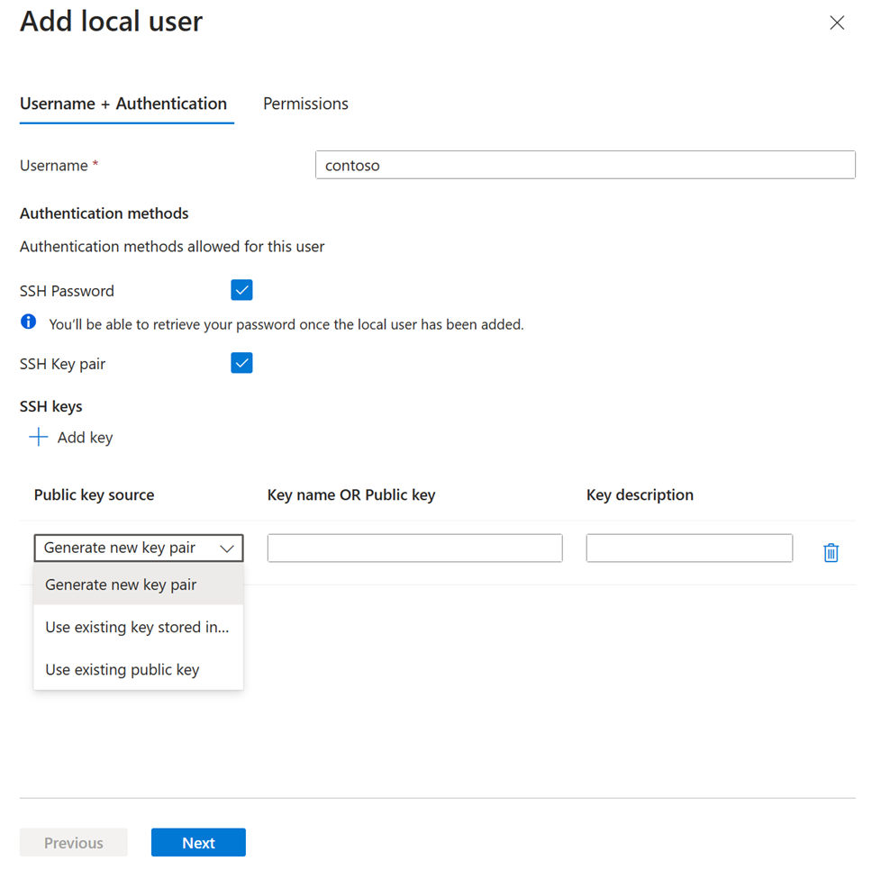
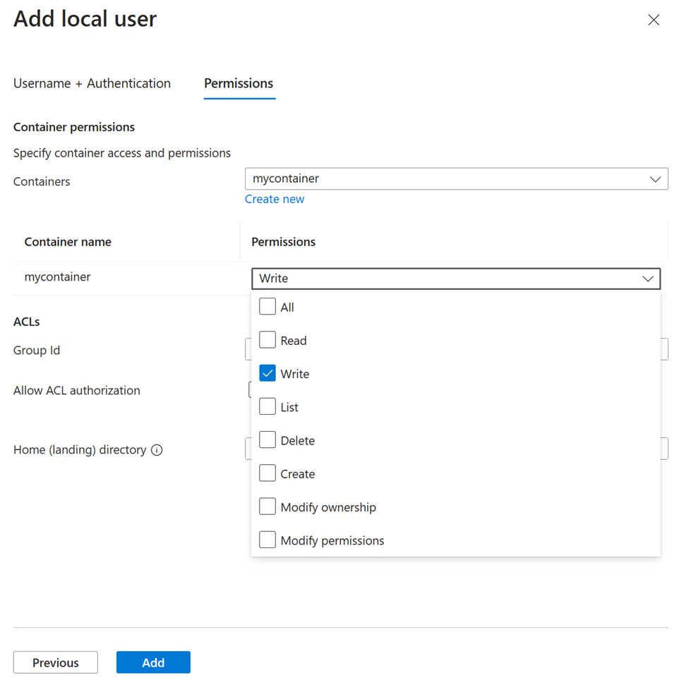

# Authorize access to Azure Blob Storage from an SSH File Transfer Protocol (SFTP) client 

This article shows you how to authorize access to SFTP clients so that can securely connect to the Blob Storage endpoint of your Azure Storage account by using an SFTP client. 

To learn more about SFTP support for Azure Blob Storage, see [SSH File Transfer Protocol (SFTP) in Azure Blob Storage](secure-file-transfer-protocol-support.md).

## Prerequisites

- Enable SFTP support for Azure Blob Storage. See [Enable or disable SFTP support](secure-file-transfer-protocol-support-how-to.md).

## Configure permissions

Azure Storage doesn't support shared access signature (SAS), or Microsoft Entra authentication for accessing the SFTP endpoint. Instead, you must use an identity called local user that can be secured with an Azure generated password or a secure shell (SSH) key pair. To grant access to a connecting client, the storage account must have an identity associated with the password or key pair. That identity is called a *local user*. 

In this section, you'll learn how to create a local user, choose an authentication method, and assign permissions for that local user. 

To learn more about the SFTP permissions model, see [SFTP Permissions model](secure-file-transfer-protocol-support.md#sftp-permission-model).

> [!TIP]
> This section shows you how to configure local users for an existing storage account. To view an Azure Resource Manager template that configures a local user as part of creating an account, see [Create an Azure Storage Account and Blob Container accessible using SFTP protocol on Azure](https://github.com/Azure/azure-quickstart-templates/tree/master/quickstarts/microsoft.storage/storage-sftp).

### [Portal](#tab/azure-portal)

1. In the [Azure portal](https://portal.azure.com/), navigate to your storage account.

2. Under **Settings**, select **SFTP**, and then select **Add local user**. 

   > [!div class="mx-imgBorder"]
   > 

3. In the **Add local user** configuration pane, add the name of a user, and then select which methods of authentication you'd like associate with this local user. You can associate a password and / or an SSH key. 

   > [!IMPORTANT]
   > While you can enable both forms of authentication, SFTP clients can connect by using only one of them. Multifactor authentication, whereby both a valid password and a valid public and private key pair are required for successful authentication is not supported.

   If you select **SSH Password**, then your password will appear when you've completed all of the steps in the **Add local user** configuration pane. SSH passwords are generated by Azure and are minimum 32 characters in length.

   If you select **SSH Key pair**, then select **Public key source** to specify a key source. 

   > [!div class="mx-imgBorder"]
   > 

   The following table describes each key source option:

   | Option | Guidance |
   |----|----|
   | Generate a new key pair | Use this option to create a new public / private key pair. The public key is stored in Azure with the key name that you provide. The private key can be downloaded after the local user has been successfully added. |
   | Use existing key stored in Azure | Use this option if you want to use a public key that is already stored in Azure. To find existing keys in Azure, see [List keys](../../virtual-machines/ssh-keys-portal.md#list-keys). When SFTP clients connect to Azure Blob Storage, those clients need to provide the private key associated with this public key. |
   | Use existing public key | Use this option if you want to upload a public key that is stored outside of Azure. If you don't have a public key, but would like to generate one outside of Azure, see [Generate keys with ssh-keygen](../../virtual-machines/linux/create-ssh-keys-detailed.md#generate-keys-with-ssh-keygen). |
   
   > [!NOTE]
   > The existing public key option currently only supports OpenSSH formatted public keys. The provided key must follow this format: `<key type> <key data>`. For example, RSA keys would look similar to this: `ssh-rsa AAAAB3N...`. If your key is in another format then a tool such as `ssh-keygen` can be used to convert it to OpenSSH format.

4. Select **Next** to open the **Container permissions** tab of the configuration pane.

5. In the **Container permissions** tab, select the containers that you want to make available to this local user. Then, select which types of operations you want to enable this local user to perform.

   > [!div class="mx-imgBorder"]
   > 

   > [!IMPORTANT]
   > The local user must have at least one container permission for the container it is connecting to otherwise the connection attempt will fail.

6. In the **Home directory** edit box, type the name of the container or the directory path (including the container name) that will be the default location associated with this local user. 

   To learn more about the home directory, see [Home directory](secure-file-transfer-protocol-support.md#home-directory).

7. Select the **Add button** to add the local user.

   If you enabled password authentication, then the Azure generated password appears in a dialog box after the local user has been added. 

   > [!IMPORTANT]
   > You can't retrieve this password later, so make sure to copy the password, and then store it in a place where you can find it.

   If you chose to generate a new key pair, then you'll be prompted to download the private key of that key pair after the local user has been added.
   
   > [!NOTE]
   > Local users have a `sharedKey` property that is used for SMB authentication only.

### [PowerShell](#tab/powershell)

1. Decide which containers you want to make available to the local user and the types of operations that you want to enable this local user to perform. Create a permission scope object by using the **New-AzStorageLocalUserPermissionScope** command, and setting the `-Permission` parameter of that command to one or more letters that correspond to access permission levels. Possible values are Read(r), Write (w), Delete (d), List (l), and Create (c).
  
   The following example set creates a permission scope object that gives read and write permission to the `mycontainer` container.  

   ```powershell
   $permissionScope = New-AzStorageLocalUserPermissionScope -Permission rw -Service blob -ResourceName mycontainer 
   ```
   > [!IMPORTANT]
   > The local user must have at least one container permission for the container it is connecting to otherwise the connection attempt will fail.

2. Decide which methods of authentication you'd like associate with this local user. You can associate a password and / or an SSH key. 

   > [!IMPORTANT]
   > While you can enable both forms of authentication, SFTP clients can connect by using only one of them. Multifactor authentication, whereby both a valid password and a valid public and private key pair are required for successful authentication is not supported.

   If you want to use an SSH key, you'll need to public key of the public / private key pair. You can use existing public keys stored in Azure or use any existing public keys outside of Azure.
   
   To find existing keys in Azure, see [List keys](../../virtual-machines/ssh-keys-portal.md#list-keys). When SFTP clients connect to Azure Blob Storage, those clients need to provide the private key associated with this public key.

   If you want to use a public key outside of Azure, but you don't yet have one, then see [Generate keys with ssh-keygen](../../virtual-machines/linux/create-ssh-keys-detailed.md#generate-keys-with-ssh-keygen) for guidance about how to create one.   

   If you want to use a password to authenticate the local user, you can generate one after the local user is created.  

3. If you want to use an SSH key, create a public key object by using the **New-AzStorageLocalUserSshPublicKey** command. Set the `-Key` parameter to a string that contains the key type and public key. In the following example, the key type is `ssh-rsa` and the key is `ssh-rsa a2V5...`.

   ```powershell
   $sshkey = "ssh-rsa a2V5..."
   $sshkey = New-AzStorageLocalUserSshPublicKey -Key $sshkey -Description "description for ssh public key"
   ```

4. Create a local user by using the **Set-AzStorageLocalUser** command. Set the `-PermissionScope` parameter to the permission scope object that you created earlier. If you're using an SSH key, then set the `SshAuthorization` parameter to the public key object that you created in the previous step. If you want to use a password to authenticate this local user, then set the `-HasSshPassword` parameter to `$true`.

   The following example creates a local user and then prints the key and permission scopes to the console.
  
   ```powershell
   $UserName = "mylocalusername"
   $localuser = Set-AzStorageLocalUser -ResourceGroupName $resourceGroupName -StorageAccountName $storageAccountName -UserName $UserName -HomeDirectory "mycontainer" -SshAuthorizedKey $sshkey -PermissionScope $permissionScope -HasSharedKey $true -HasSshKey $true -HasSshPassword $true

	$localuser
	$localuser.SshAuthorizedKeys | ft
	$localuser.PermissionScopes | ft
   ```
   > [!NOTE]
   > Local users also have a `sharedKey` property that is used for SMB authentication only.

5. If you want to use a password to authenticate the user, you can create a password by using the **New-AzStorageLocalUserSshPassword** command. Set the `-UserName` parameter to the user name.

   The following example generates a password for the user.

   ```powershell
   $password = New-AzStorageLocalUserSshPassword -ResourceGroupName $resourceGroupName -StorageAccountName $storageAccountName -UserName $UserName
   $password 
   ```
   > [!IMPORTANT]
   > You can't retrieve this password later, so make sure to copy the password, and then store it in a place where you can find it. If you lose this password, you'll have to generate a new one. Note that SSH passwords are generated by Azure and are minimum 32 characters in length.

### [Azure CLI](#tab/azure-cli)

1. First, decide which methods of authentication you'd like associate with this local user. You can associate a password and / or an SSH key. 

   > [!IMPORTANT]
   > While you can enable both forms of authentication, SFTP clients can connect by using only one of them. Multifactor authentication, whereby both a valid password and a valid public and private key pair are required for successful authentication is not supported.

   If you want to use an SSH key, you'll need to public key of the public / private key pair. You can use existing public keys stored in Azure or use any existing public keys outside of Azure.
   
   To find existing keys in Azure, see [List keys](../../virtual-machines/ssh-keys-portal.md#list-keys). When SFTP clients connect to Azure Blob Storage, those clients need to provide the private key associated with this public key.

   If you want to use a public key outside of Azure, but you don't yet have one, then see [Generate keys with ssh-keygen](../../virtual-machines/linux/create-ssh-keys-detailed.md#generate-keys-with-ssh-keygen) for guidance about how to create one.   

   If you want to use a password to authenticate the local user, you can generate one after the local user is created.

2. Create a local user by using the [az storage account local-user create](/cli/azure/storage/account/local-user#az-storage-account-local-user-create) command. Use the parameters of this command to specify the container and permission level. If you want to use an SSH key, then set the `--has-ssh-key` parameter to a string that contains the key type and public key. If you want to use a password to authenticate this local user, then set the `--has-ssh-password` parameter to `true`.

   The following example gives a local user name `contosouser` read and write access to a container named `contosocontainer`. An ssh-rsa key with a key value of `ssh-rsa a2V5...` is used for authentication.
  
   ```azurecli
   az storage account local-user create --account-name contosoaccount -g contoso-resource-group -n contosouser --home-directory contosocontainer --permission-scope permissions=rw service=blob resource-name=contosocontainer --ssh-authorized-key key="ssh-rsa a2V5..." --has-ssh-key true --has-ssh-password true
   ```
   > [!NOTE]
   > Local users also have a `sharedKey` property that is used for SMB authentication only.
3. If you want to use a password to authenticate the user, you can create a password by using the [az storage account local-user regenerate-password](/cli/azure/storage/account/local-user#az-storage-account-local-user-regenerate-password) command. Set the `-n` parameter to the local user name.

   The following example generates a password for the user.

   ```azurecli
   az storage account local-user regenerate-password --account-name contosoaccount -g contoso-resource-group -n contosouser  
   ```
   > [!IMPORTANT]
   > You can't retrieve this password later, so make sure to copy the password, and then store it in a place where you can find it. If you lose this password, you'll have to generate a new one. Note that SSH passwords are generated by Azure and are minimum 32 characters in length.

--- 

## Next steps

- Connect to Azure Blob Storage by using an SFTP client. See [Connect from an SFTP client](secure-file-transfer-protocol-support-connect.md).

## Related content

- [SSH File Transfer Protocol (SFTP) support for Azure Blob Storage](secure-file-transfer-protocol-support.md)
- [Enable or disable SSH File Transfer Protocol (SFTP) support in Azure Blob Storage](secure-file-transfer-protocol-support-how-to.md)
- [Authorize access to Azure Blob Storage from an SSH File Transfer Protocol (SFTP) client](secure-file-transfer-protocol-support-authorize-access.md)
- [Limitations and known issues with SSH File Transfer Protocol (SFTP) support for Azure Blob Storage](secure-file-transfer-protocol-known-issues.md)
- [Host keys for SSH File Transfer Protocol (SFTP) support for Azure Blob Storage](secure-file-transfer-protocol-host-keys.md)
- [SSH File Transfer Protocol (SFTP) performance considerations in Azure Blob storage](secure-file-transfer-protocol-performance.md)