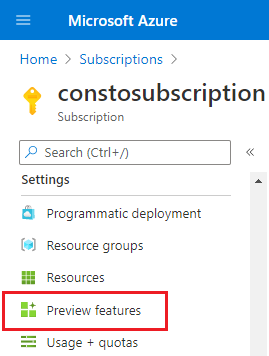
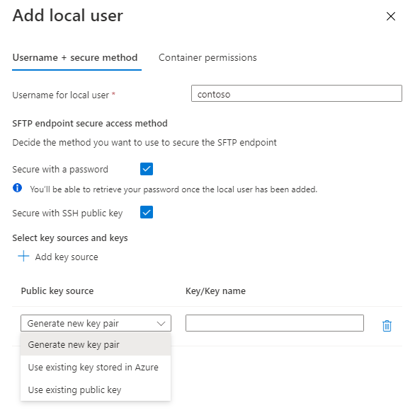
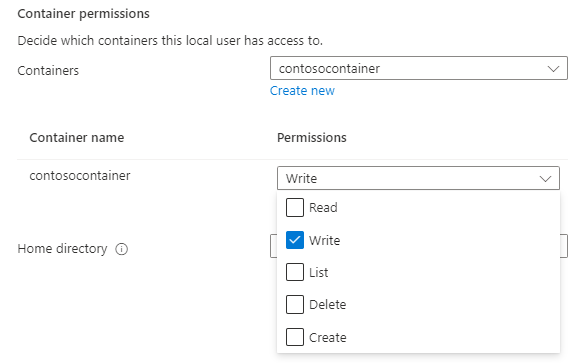
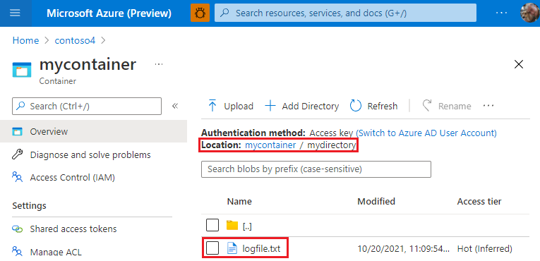

# Connect to Azure Blob Storage by using the SSH File Transfer Protocol (SFTP) (preview)

You can securely connect to the Blob Storage endpoint of an Azure Storage account by using an SFTP client, and then upload and download files. This article shows you how to enable SFTP, and then connect to Blob Storage by using an SFTP client. 

To learn more about SFTP support in Azure Blob Storage, see [SSH File Transfer Protocol (SFTP) in Azure Blob Storage](secure-file-transfer-protocol-support.md).

> [!IMPORTANT]
> SFTP support is currently in PREVIEW and is available in [these regions](secure-file-transfer-protocol-support.md#regional-availability).
>
> See the [Supplemental Terms of Use for Microsoft Azure Previews](https://azure.microsoft.com/support/legal/preview-supplemental-terms/) for legal terms that apply to Azure features that are in beta, preview, or otherwise not yet released into general availability.
>
> To enroll in the preview, complete [this form](https://forms.office.com/r/gZguN0j65Y) AND request to join via 'Preview features' in Azure portal.

## Prerequisites

- A standard general-purpose v2 or premium block blob storage account. You can also enable SFTP as you create the account. For more information on these types of storage accounts, see [Storage account overview](../common/storage-account-overview.md).

- The account redundancy option of the storage account is set to either locally-redundant storage (LRS) or zone-redundant storage (ZRS).

- The hierarchical namespace feature of the account must be enabled. To enable the hierarchical namespace feature, see [Upgrade Azure Blob Storage with Azure Data Lake Storage Gen2 capabilities](upgrade-to-data-lake-storage-gen2-how-to.md).

- If you're connecting from an on-premises network, make sure that your client allows outgoing communication through port 22. The SFTP uses that port.

## Register the feature

Before you can enable SFTP support, you must register the SFTP feature with your subscription.

1. Sign in to the [Azure portal](https://portal.azure.com/).

2. Open the configuration page of your subscription.

3. Under **Settings**, select **Preview features**.

   > [!div class="mx-imgBorder"]
   > 

4. In the **Preview features** page, select the **SFTP support in Azure Blob Storage** feature, and then select **Register**.

### Verify feature registration

Verify that the feature is registered before continuing with the other steps in this article. 

1. Open the **Preview features** page of your subscription. 

2. Locate the **SFTP support in Azure Blob Storage** feature and make sure that **Registered** appears in the **State** column.

## Enable SFTP support

1. In the [Azure portal](https://portal.azure.com/), navigate to your storage account.

2. Under **Settings**, select **SFTP**.

   > [!NOTE]
   > This option appears only if the hierarchical namespace feature of the account has been enabled. To enable the hierarchical namespace feature, see [Upgrade Azure Blob Storage with Azure Data Lake Storage Gen2 capabilities](upgrade-to-data-lake-storage-gen2-how-to.md).

3. Select **Enable SFTP**. 

   > [!div class="mx-imgBorder"]
   > 

   >[!NOTE]
   > If no local users appear in the SFTP configuration page, you'll need to add at least one of them. To add local users, see the next section.

## Configure permissions

Azure Storage does not support shared access signature (SAS), or Azure Active directory (Azure AD) authentication for accessing the SFTP endpoint. Instead, you must use an identity called local user that can be secured with an Azure generated password or a secure shell (SSH) key pair. To grant access to a connecting client, the storage account must have an identity associated with the password or key pair. That identity is called a *local user*. 

In this section, you'll learn how to create a local user, choose an authentication method, and then assign permissions for that local user. 

To learn more about the SFTP permissions model, see [SFTP Permissions model](secure-file-transfer-protocol-support.md#sftp-permissions-model). 

1. In the [Azure portal](https://portal.azure.com/), navigate to your storage account.

2. Under **Settings**, select **SFTP**, and then select **Add local user**. 

   > [!div class="mx-imgBorder"]
   > 

3. In the **Add local user** configuration pane, add the name of a user, and then select which methods of authentication you'd like associate with this local user. You can associate a password and / or an SSH key. 

   > [!IMPORTANT]
   > While you can enable both forms of authentication, SFTP clients can connect by using only one of them. Multifactor authentication, whereby both a valid password and a valid public and private key pair are required for successful authentication is not supported.

   If you select **Secure with a password**, then your password will appear when you've completed all of the steps in the **Add local user** configuration pane.

   If you select **Secure with SSH public key**, then select **Add key source** to specify a key source. 

   > [!div class="mx-imgBorder"]
   > 

   The following table describes each key source option:

   | Option | Guidance |
   |----|----|
   | Generate a new key pair | Use this option to create a new public / private key pair. The public key is stored in Azure with the key name that you provide. The private key can be downloaded after the local user has been successfully added. |
   | Use existing key stored in Azure | Use this option if you want to use a public key that is already stored in Azure. To find existing keys in Azure, see [List keys](../../virtual-machines/ssh-keys-portal.md#list-keys). When SFTP clients connect to Azure Blob Storage, those clients need to provide the private key associated with this public key. |
   | Use existing public key | Use this option if you want to upload a public key that is stored outside of Azure. If you don't have a public key, but would like to generate one outside of Azure, see [Generate keys with ssh-keygen](../../virtual-machines/linux/create-ssh-keys-detailed.md#generate-keys-with-ssh-keygen). |

4. Select **Next** to open the **Container permissions** tab of the configuration pane.

5. In the **Container permissions** tab, select the containers that you want to make available to this local user. Then, select which types of operations you want to enable this local user to perform.

   > [!div class="mx-imgBorder"]
   > 

6. In the **Home directory** edit box, type the name of the container or the directory path (including the container name) that will be the default location associated with this this local user. 

   To learn more about the home directory, see [Home directory](secure-file-transfer-protocol-support.md#home-directory).

7. Select the **Add button** to add the local user.

   If you enabled password authentication, then the Azure generated password appears in a dialog box after the local user has been added. 

   > [!IMPORTANT]
   > You can't retrieve this password later, so make sure you copy the password, and then store it in a place where you can find it.
   > 
   > If you do lose your password, you can generate a new password.

   If you chose to generate a new key pair, then you'll be prompted to download the private key of that key pair after the local user has been added.

## Connect an SFTP client

You can use any SFTP client to securely connect and then transfer files. The following screenshot shows a Windows PowerShell session that uses [Open SSH](/windows-server/administration/openssh/openssh_overview) and password authentication to connect and then upload a file named `logfile.txt`.  

> [!div class="mx-imgBorder"]
> 

> [!NOTE]
> You might be prompted to trust a host key. During the public preview, valid host keys are published [here](secure-file-transfer-protocol-host-keys.md).  

After the transfer is complete, you can view and manage the file in the Azure portal. 

> [!div class="mx-imgBorder"]
> 

> [!NOTE]
> The Azure portal uses the Blob REST API and Data Lake Storage Gen2 REST API. Being able to interact with an uploaded file in the Azure portal demonstrates the interoperability between SFTP and REST.

See the documentation of your SFTP client for guidance about how to connect and transfer files.

## See also

- [SSH File Transfer Protocol (SFTP) support in Azure Blob Storage](secure-file-transfer-protocol-support.md)
- [Known issues with SSH File Transfer Protocol (SFTP) support in Azure Blob Storage](secure-file-transfer-protocol-known-issues.md)
