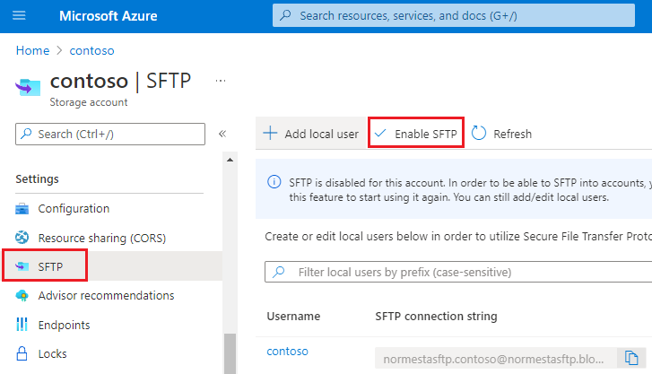
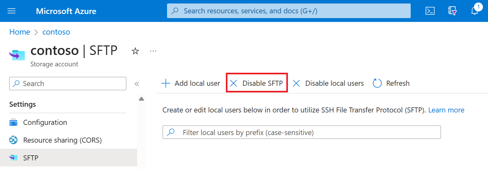

# Enable or disable SSH File Transfer Protocol (SFTP) support in Azure Blob Storage

This article shows you how to enable or disable support for SFTP so that you can securely connect to the Blob Storage endpoint of your Azure Storage account by using an SFTP client. 

To learn more about SFTP support for Azure Blob Storage, see [SSH File Transfer Protocol (SFTP) in Azure Blob Storage](secure-file-transfer-protocol-support.md).

## Prerequisites

- A standard general-purpose v2 or premium block blob storage account. You can also enable SFTP as you create the account. For more information on these types of storage accounts, see [Storage account overview](../common/storage-account-overview.md).

- The hierarchical namespace feature of the account must be enabled. To enable the hierarchical namespace feature, see [Upgrade Azure Blob Storage with Azure Data Lake Storage Gen2 capabilities](upgrade-to-data-lake-storage-gen2-how-to.md).

## Enable SFTP support

This section shows you how to enable SFTP support for an existing storage account. To view an Azure Resource Manager template that enables SFTP support as part of creating the account, see [Create an Azure Storage Account and Blob Container accessible using SFTP protocol on Azure](https://github.com/Azure/azure-quickstart-templates/tree/master/quickstarts/microsoft.storage/storage-sftp). To view the Local User REST APIs and .NET references, see [Local Users](/rest/api/storagerp/local-users) and [LocalUser Class](/dotnet/api/microsoft.azure.management.storage.models.localuser).

### [Portal](#tab/azure-portal)

1. In the [Azure portal](https://portal.azure.com/), navigate to your storage account.

2. Under **Settings**, select **SFTP**.

   > [!NOTE]
   > This option appears only if the hierarchical namespace feature of the account has been enabled. To enable the hierarchical namespace feature, see [Upgrade Azure Blob Storage with Azure Data Lake Storage Gen2 capabilities](upgrade-to-data-lake-storage-gen2-how-to.md).

3. Select **Enable SFTP**. 

   > [!div class="mx-imgBorder"]
   > 

   >[!NOTE]
   > If no local users appear in the SFTP configuration page, you'll need to add at least one of them. To add local users, see the next section.

### [PowerShell](#tab/powershell)

To enable SFTP support, call the [Set-AzStorageAccount](/powershell/module/az.storage/set-azstorageaccount) command and set the `-EnableSftp` parameter to true. Remember to replace the values in angle brackets with your own values:

```powershell
$resourceGroupName = "<resource-group>"
$storageAccountName = "<storage-account>"

Set-AzStorageAccount -ResourceGroupName $resourceGroupName -Name $storageAccountName -EnableSftp $true 
```

### [Azure CLI](#tab/azure-cli)

To enable SFTP support, call the [az storage account update](/cli/azure/storage/account#az-storage-account-update) command and set the `--enable-sftp` parameter to true. Remember to replace the values in angle brackets with your own values:

```azurecli
az storage account update -g <resource-group> -n <storage-account> --enable-sftp=true
```

---

## Disable SFTP support

This section shows you how to disable SFTP support for an existing storage account. Because SFTP support incurs an hourly cost, consider disabling SFTP support when clients aren't actively using SFTP to transfer data. 

### [Portal](#tab/azure-portal)

1. In the [Azure portal](https://portal.azure.com/), navigate to your storage account.

2. Under **Settings**, select **SFTP**.

3. Select **Disable SFTP**. 

   > [!div class="mx-imgBorder"]
   > 

### [PowerShell](#tab/powershell)

To disable SFTP support, call the [Set-AzStorageAccount](/powershell/module/az.storage/set-azstorageaccount) command and set the `-EnableSftp` parameter to false. Remember to replace the values in angle brackets with your own values:

```powershell
$resourceGroupName = "<resource-group>"
$storageAccountName = "<storage-account>"

Set-AzStorageAccount -ResourceGroupName $resourceGroupName -Name $storageAccountName -EnableSftp $false 
```

### [Azure CLI](#tab/azure-cli)

To disable SFTP support, call the [az storage account update](/cli/azure/storage/account#az-storage-account-update) command and set the `--enable-sftp` parameter to false. Remember to replace the values in angle brackets with your own values:

```azurecli
az storage account update -g <resource-group> -n <storage-account> --enable-sftp=false
```

---

## Next steps

- Configure access permissions for SFTP clients. See [Authorize access to SFTP clients](secure-file-transfer-protocol-support-authorize-access.md).
- Connect to Azure Blob Storage by using an SFTP client. See [Connect from an SFTP client](secure-file-transfer-protocol-support-connect.md).
 
## Related content

- [SSH File Transfer Protocol (SFTP) in Azure Blob Storage](secure-file-transfer-protocol-support.md)
- [Enable or disable SSH File Transfer Protocol (SFTP) support in Azure Blob Storage](secure-file-transfer-protocol-support-how-to.md)
- [Limitations and known issues with SSH File Transfer Protocol (SFTP) support for Azure Blob Storage](secure-file-transfer-protocol-known-issues.md)
- [Host keys for SSH File Transfer Protocol (SFTP) support for Azure Blob Storage](secure-file-transfer-protocol-host-keys.md)
- [SSH File Transfer Protocol (SFTP) performance considerations in Azure Blob storage](secure-file-transfer-protocol-performance.md)