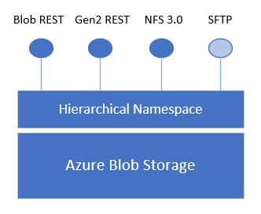

# SSH File Transfer Protocol (SFTP) support for Azure Blob Storage (preview)

Blob storage now supports the SSH File Transfer Protocol (SFTP). This support provides the ability to securely connect to Blob Storage accounts via an SFTP endpoint, allowing you to leverage SFTP for file access, file transfer, as well as file management.  

> [!IMPORTANT]
> SFTP support is currently in PREVIEW and is available on general-purpose v2 and premium block blob accounts. Complete [this form](https://forms.office.com/r/gZguN0j65Y) BEFORE using the feature in preview. Registration via 'preview features' is NOT required and confirmation email will NOT be sent after filling out the form. You can IMMEDIATELY access the feature.
>
> After testing your end-to-end scenarios with SFTP, please share your experience via [this form](https://forms.office.com/r/MgjezFV1NR).
> 
> See the [Supplemental Terms of Use for Microsoft Azure Previews](https://azure.microsoft.com/support/legal/preview-supplemental-terms/) for legal terms that apply to Azure features that are in beta, preview, or otherwise not yet released into general availability.

Azure allows secure data transfer to Blob Storage accounts using Azure Blob service REST API, Azure SDKs, and tools such as AzCopy. However, legacy workloads often use traditional file transfer protocols such as SFTP. You could update custom applications to use the REST API and Azure SDKs, but only by making significant code changes.

Prior to the release of this feature, if you wanted to use SFTP to transfer data to Azure Blob Storage you would have to either purchase a third party product or orchestrate your own solution. You would have to create a virtual machine (VM) in Azure to host an SFTP server, and then figure out a way to move data into the storage account. 

Now, with SFTP support for Azure Blob Storage, you can enable an SFTP endpoint for Blob Storage accounts with a single setting. Then you can set up local user identities for authentication to transfer data securely without the need to do any additional work. 

This article describes SFTP support for Azure Blob Storage. To learn how to enable SFTP for your storage account, see [Connect to Azure Blob Storage by using the SSH File Transfer Protocol (SFTP) (preview)](secure-file-transfer-protocol-support-how-to.md).

## SFTP and the hierarchical namespace

SFTP support requires blobs to be organized into on a hierarchical namespace. The ability to use a hierarchical namespace was introduced by Azure Data Lake Storage Gen2. It organizes objects (files) into a hierarchy of directories and subdirectories in the same way that the file system on your computer is organized. The hierarchical namespace scales linearly and doesn't degrade data capacity or performance. 

Different protocols extend from the hierarchical namespace. The SFTP is one of these available protocols.

> [!div class="mx-imgBorder"]
> 

## SFTP permission model

Azure Blob Storage does not support Azure Active Directory (Azure AD) authentication or authorization via SFTP. Instead, SFTP utilizes a new form of identity management called _local users_. 

Local users must use either a password or a Secure Shell (SSH) private key credential for authentication. You can have a maximum of 1000 local users for a storage account.

To set up access permissions, you will create a local user, and choose authentication methods. Then, for each container in your account, you can specify the level of access you want to give that user.
 
> [!CAUTION]
> Local users do not interoperate with other Azure Storage permission models such as RBAC (role based access control), ABAC (attribute based access control), and ACLs (access control lists). 
>
> For example, user A has an Azure AD identity with only read permission for file _foo.txt_ and a local user identity with delete permission for container _con1_ in which _foo.txt_ is stored. In this case, User A could login in via SFTP using their local user identity and delete _foo.txt_.

For SFTP enabled storage accounts, you can use the full breadth of Azure Blob Storage security settings, to authenticate and authorize users accessing Blob Storage via Azure portal, Azure CLI, Azure PowerShell commands, AzCopy, as well as Azure SDKS, and Azure REST APIs. To learn more, see [Access control model in Azure Data Lake Storage Gen2](data-lake-storage-access-control-model.md)

## Authentication methods

You can authenticate local users connecting via SFTP by using a password or a Secure Shell (SSH) public-private keypair. You can configure both forms of authentication and let connecting local users choose which one to use. However, multifactor authentication, whereby both a valid password and a valid public-private key pair are required for successful authentication is not supported. 

#### Passwords

Passwords are generated for you. If you choose password authentication, then your password will be provided after you finish configuring a local user. Make sure to copy that password and save it in a location where you can find it later. You won't be able to retrieve that password from Azure again. If you lose the password, you will have to generate a new one. For security reasons, you can't set the password yourself.   

#### SSH key pairs

A public-private key pair is the most common form of authentication for Secure Shell (SSH). The private key is secret and should be known only to the local user. The public key is stored in Azure. When an SSH client connects to the storage account using a local user identity, it sends a message with the private key and signature. Azure validates the message and checks that the user and key are recognized by the storage account. To learn more, see [Overview of SSH and keys](../../virtual-machines/linux/ssh-from-windows.md#).

If you choose to authenticate with private-public key pair, you can either generate one, use one already stored in Azure, or provide Azure the public key of an existing public-private key pair. 

## Container permissions

In the current release, you can specify only container-level permissions. Directory-level permissions are not supported. You can choose which containers you want to grant access to and what level of access you want to provide (Read, Write, List, Delete, and Create). Those permissions apply to all directories and subdirectories in the container. You can grant each local user access to as many as 100 containers. Container permissions can also be updated after creating a local user. The following table describes each permission in more detail.

| Permission | Symbol | Description |
|---|---|---|
| Read | r | <li>Read file contents</li> |
| Write | w | <li>Upload file</li><li>Create directory</li><li>Upload directories</li> |
| List | l | <li>List contents within container</li><li>List contents within directories</li> |
| Delete | d | <li>Delete files/directories</li> |
| Create | c | <li>Upload file if file doesn't exist</li><li>Create directory if it doesn't exist</li> |

> [!IMPORTANT]
> When performing write operations on blobs in sub directories, Read permission is required to open the directory and access blob properties.

## Home directory

As you configure permissions, you have the option of setting a home directory for the local user. If no other container is specified in an SFTP connection request, then this is the directory that the user connects to by default. For example, consider the following request made by using [Open SSH](/windows-server/administration/openssh/openssh_overview). This request doesn't specify a container or directory name as part of the `sftp` command.

```powershell
sftp myaccount.myusername@myaccount.blob.core.windows.net
put logfile.txt
```

If you set the home directory of a user to `mycontainer/mydirectory`, then they would connect to that directory. Then, the `logfile.txt` file would be uploaded to `mycontainer/mydirectory`. If you did not set the home directory, then the connection attempt would fail. Instead, connecting users would have to specify a container along with the request and then use SFTP commands to navigate to the target directory before uploading a file. The following example shows this:

```powershell
sftp myaccount.mycontainer.myusername@myaccount.blob.core.windows.net
cd mydirectory
put logfile.txt  
```

> [!Note]
> Home directory is only the initial directory that the connecting local user is placed in. Local users can navigate to any other path in the container they are connected to if they have the appropriate container permissions.

## Supported algorithms

You can use many different SFTP clients to securely connect and then transfer files. Connecting clients must use algorithms specified in table below. 

| Host key | Key exchange | Ciphers/encryption | Integrity/MAC | Public key |
|----------|--------------|--------------------|---------------|------------|
| rsa-sha2-256 | ecdh-sha2-nistp384 | aes128-gcm@openssh.com | hmac-sha2-256 | ssh-rsa |
| rsa-sha2-512 | ecdh-sha2-nistp256 | aes256-gcm@openssh.com | hmac-sha2-512 | ecdsa-sha2-nistp256 |
| ecdsa-sha2-nistp256 | diffie-hellman-group14-sha256 | aes128-cbc| hmac-sha2-256-etm@openssh.com | ecdsa-sha2-nistp384 |
| ecdsa-sha2-nistp384| diffie-hellman-group16-sha512 | aes256-cbc | hmac-sha2-512-etm@openssh.com | 
||| aes192-cbc ||

SFTP support for Azure Blob Storage currently limits its cryptographic algorithm support based on security considerations. We strongly recommend that customers utilize Microsoft Security Development Lifecycle (SDL) approved algorithms to securely access their data. More details can be found [here](/security/sdl/cryptographic-recommendations).

### Known supported clients

The following clients have compatible algorithm support with SFTP for Azure Blob Storage (preview). See [Limitations and known issues with SSH File Transfer Protocol (SFTP) support for Azure Blob Storage](secure-file-transfer-protocol-known-issues.md) if you are having trouble connecting.

- AsyncSSH 2.1.0+
- Cyberduck 7.8.2+
- edtFTPjPRO 7.0.0+
- FileZilla 3.53.0+
- libssh 0.9.5+
- Maverick Legacy 1.7.15+
- OpenSSH 7.4+
- paramiko 2.8.1+
- PuTTY 0.74+
- QualysML 12.3.41.1+
- RebexSSH 5.0.7119.0+
- ssh2js 0.1.20+
- sshj 0.27.0+
- SSH.NET 2020.0.0+
- WinSCP 5.10+

> [!NOTE]
> The supported client list above is not exhaustive and may change over time.

## Connecting with SFTP

To get started, enable SFTP support, create a local user, and assign permissions for that local user. Then, you can use any SFTP client to securely connect and then transfer files. For step-by-step guidance, see [Connect to Azure Blob Storage by using the SSH File Transfer Protocol (SFTP)](secure-file-transfer-protocol-support-how-to.md).

## Limitations and known issues

See the [limitations and known issues article](secure-file-transfer-protocol-known-issues.md) for a complete list of limitations and issues with SFTP support for Azure Blob Storage.

## Pricing and billing

> [!IMPORTANT]
> During the public preview, the use of SFTP does not incur any additional charges. However, the standard transaction, storage, and networking prices for the underlying Azure Data Lake Store Gen2 account still apply. SFTP might incur additional charges when the feature becomes generally available.  

Transaction and storage costs are based on factors such as storage account type and the endpoint that you use to transfer data to the storage account. To learn more, see [Understand the full billing model for Azure Blob Storage](../common/storage-plan-manage-costs.md#understand-the-full-billing-model-for-azure-blob-storage).

## See also

- [Connect to Azure Blob Storage by using the SSH File Transfer Protocol (SFTP)](secure-file-transfer-protocol-support-how-to.md)
- [Limitations and known issues with SSH File Transfer Protocol (SFTP) support for Azure Blob Storage](secure-file-transfer-protocol-known-issues.md)
- [Host keys for SSH File Transfer Protocol (SFTP) support for Azure Blob Storage](secure-file-transfer-protocol-host-keys.md)
- [SSH File Transfer Protocol (SFTP) performance considerations in Azure Blob storage](secure-file-transfer-protocol-performance.md)
