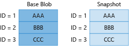
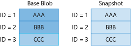
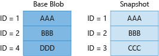
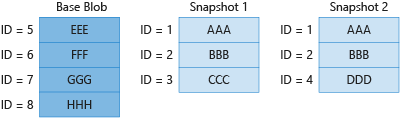

# Blob snapshots

A snapshot is a read-only version of a blob that's taken at a point in time.

> [!NOTE]
> Blob versioning (preview) offers an alternative way to maintain historical copies of a blob. For more information, see [Blob versioning (preview)](versioning-overview.md).

## About blob snapshots

[!INCLUDE [updated-for-az](../../../includes/storage-data-lake-gen2-support.md)]

A snapshot of a blob is identical to its base blob, except that the blob URI has a **DateTime** value appended to the blob URI to indicate the time at which the snapshot was taken. For example, if a page blob URI is `http://storagesample.core.blob.windows.net/mydrives/myvhd`, the snapshot URI is similar to `http://storagesample.core.blob.windows.net/mydrives/myvhd?snapshot=2011-03-09T01:42:34.9360000Z`.

> [!NOTE]
> All snapshots share the base blob's URI. The only distinction between the base blob and the snapshot is the appended **DateTime** value.
>

A blob can have any number of snapshots. Snapshots persist until they are explicitly deleted, meaning that a snapshot cannot outlive its base blob. You can enumerate the snapshots associated with the base blob to track your current snapshots.

When you create a snapshot of a blob, the blob's system properties are copied to the snapshot with the same values. The base blob's metadata is also copied to the snapshot, unless you specify separate metadata for the snapshot when you create it. After you create a snapshot, you can read, copy, or delete it, but you cannot modify it.

Any leases associated with the base blob do not affect the snapshot. You cannot acquire a lease on a snapshot.

A VHD file is used to store the current information and status for a VM disk. You can detach a disk from within the VM or shut down the VM, and then take a snapshot of its VHD file. You can use that snapshot file later to retrieve the VHD file at that point in time and recreate the VM.

## Understand how snapshots accrue charges

Creating a snapshot, which is a read-only copy of a blob, can result in additional data storage charges to your account. When designing your application, it is important to be aware of how these charges might accrue so that you can minimize costs.

### Important billing considerations

The following list includes key points to consider when creating a snapshot.

- Your storage account incurs charges for unique blocks or pages, whether they are in the blob or in the snapshot. Your account does not incur additional charges for snapshots associated with a blob until you update the blob on which they are based. After you update the base blob, it diverges from its snapshots. When this happens, you are charged for the unique blocks or pages in each blob or snapshot.
- When you replace a block within a block blob, that block is subsequently charged as a unique block. This is true even if the block has the same block ID and the same data as it has in the snapshot. After the block is committed again, it diverges from its counterpart in any snapshot, and you will be charged for its data. The same holds true for a page in a page blob that's updated with identical data.
- Replacing a block blob by calling the [UploadFromFile][dotnet_UploadFromFile], [UploadText][dotnet_UploadText], [UploadFromStream][dotnet_UploadFromStream], or [UploadFromByteArray][dotnet_UploadFromByteArray] method replaces all blocks in the blob. If you have a snapshot associated with that blob, all blocks in the base blob and snapshot now diverge, and you will be charged for all the blocks in both blobs. This is true even if the data in the base blob and the snapshot remain identical.
- The Azure Blob service does not have a means to determine whether two blocks contain identical data. Each block that is uploaded and committed is treated as unique, even if it has the same data and the same block ID. Because charges accrue for unique blocks, it's important to consider that updating a blob that has a snapshot results in additional unique blocks and additional charges.

### Minimize cost with snapshot management

We recommend managing your snapshots carefully to avoid extra charges. You can follow these best practices to help minimize the costs incurred by the storage of your snapshots:

- Delete and re-create snapshots associated with a blob whenever you update the blob, even if you are updating with identical data, unless your application design requires that you maintain snapshots. By deleting and re-creating the blob's snapshots, you can ensure that the blob and snapshots do not diverge.
- If you are maintaining snapshots for a blob, avoid calling [UploadFromFile][dotnet_UploadFromFile], [UploadText][dotnet_UploadText], [UploadFromStream][dotnet_UploadFromStream], or [UploadFromByteArray][dotnet_UploadFromByteArray] to update the blob. These methods replace all of the blocks in the blob, causing your base blob and its snapshots to diverge significantly. Instead, update the fewest possible number of blocks by using the [PutBlock][dotnet_PutBlock] and [PutBlockList][dotnet_PutBlockList] methods.

### Snapshot billing scenarios

The following scenarios demonstrate how charges accrue for a block blob and its snapshots.

#### Scenario 1

In scenario 1, the base blob has not been updated after the snapshot was taken, so charges are incurred only for unique blocks 1, 2, and 3.

#### Scenario 2

In scenario 2, the base blob has been updated, but the snapshot has not. Block 3 was updated, and even though it contains the same data and the same ID, it is not the same as block 3 in the snapshot. As a result, the account is charged for four blocks.

#### Scenario 3

In scenario 3, the base blob has been updated, but the snapshot has not. Block 3 was replaced with block 4 in the base blob, but the snapshot still reflects block 3. As a result, the account is charged for four blocks.

#### Scenario 4

In scenario 4, the base blob has been completely updated and contains none of its original blocks. As a result, the account is charged for all eight unique blocks. This scenario can occur if you are using an update method such as [UploadFromFile][dotnet_UploadFromFile], [UploadText][dotnet_UploadText], [UploadFromStream][dotnet_UploadFromStream], or [UploadFromByteArray][dotnet_UploadFromByteArray], because these methods replace all of the contents of a blob.

## Next steps

- [Create and manage a blob snapshot in .NET](snapshots-manage-dotnet.md)
- [Back up Azure unmanaged VM disks with incremental snapshots](../../virtual-machines/windows/incremental-snapshots.md)
