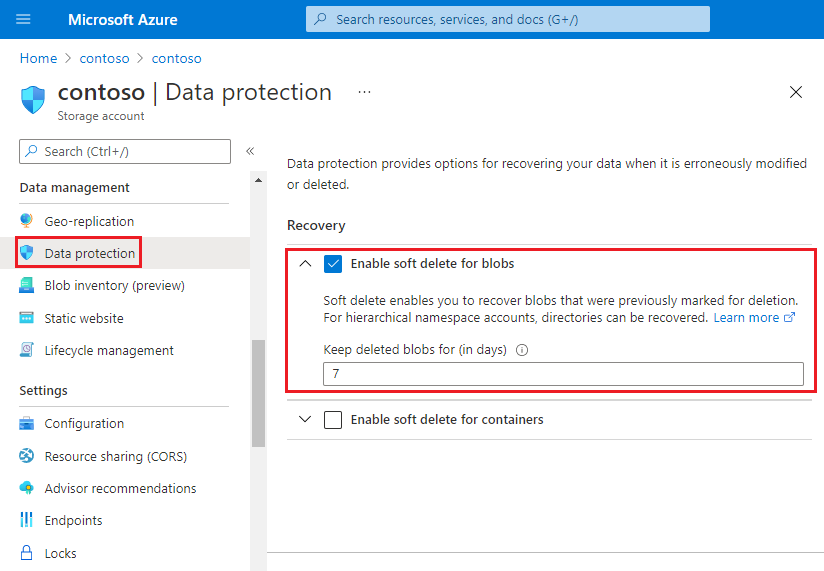

# Enable soft delete for blobs

Blob soft delete protects an individual blob and its versions, snapshots, and metadata from accidental deletes or overwrites by maintaining the deleted data in the system for a specified period of time. During the retention period, you can restore the blob to its state at deletion. After the retention period has expired, the blob is permanently deleted. For more information about blob soft delete, see [Soft delete for blobs](soft-delete-blob-overview.md).

Blob soft delete is part of a comprehensive data protection strategy for blob data. To learn more about Microsoft's recommendations for data protection, see [Data protection overview](data-protection-overview.md).

> [!NOTE]
> Blob soft delete can also protect blobs and directories in accounts that have the hierarchical namespace feature enabled. Blob soft delete for accounts that have the hierarchical namespace feature enabled is currently in public preview, and is available globally in all Azure regions. 

Blob soft delete is disabled by default for a new storage account. You can enable or disable soft delete for a storage account at any time by using the Azure portal, PowerShell, or Azure CLI.

## Enable blob soft delete

### [Portal](#tab/azure-portal)

To enable blob soft delete for your storage account by using the Azure portal, follow these steps:

1. In the [Azure portal](https://portal.azure.com/), navigate to your storage account.
1. Locate the **Data Protection** option under **Blob service**.
1. In the **Recovery** section, select **Turn on soft delete for blobs**.
1. Specify a retention period between 1 and 365 days. Microsoft recommends a minimum retention period of seven days.
1. Save your changes.

:::image type="content" source="media/soft-delete-blob-enable/blob-soft-delete-configuration-portal.png" alt-text="Screenshot showing how to enable soft delete in the Azure portal":::

### [PowerShell](#tab/azure-powershell)

To enable blob soft delete with PowerShell, call the [Enable-AzStorageBlobDeleteRetentionPolicy](/powershell/module/az.storage/enable-azstorageblobdeleteretentionpolicy) command, specifying the retention period in days.

The following example enables blob soft delete and sets the retention period to seven days. Remember to replace the placeholder values in brackets with your own values:

```azurepowershell
Enable-AzStorageBlobDeleteRetentionPolicy -ResourceGroupName <resource-group> `
    -StorageAccountName <storage-account> `
    -RetentionDays 7
```

To check the current settings for blob soft delete, call the [Get-AzStorageBlobServiceProperty](/powershell/module/az.storage/get-azstorageblobserviceproperty) command:

```azurepowershell
$properties = Get-AzStorageBlobServiceProperty -ResourceGroupName <resource-group> `
    -StorageAccountName <storage-account>
$properties.DeleteRetentionPolicy.Enabled
$properties.DeleteRetentionPolicy.Days
```

### [Azure CLI](#tab/azure-CLI)

To enable blob soft delete with Azure CLI, call the [az storage account blob-service-properties update](/cli/azure/storage/account/blob-service-properties#az_storage_account_blob_service_properties_update) command, specifying the retention period in days.

The following example enables blob soft delete and sets the retention period to seven days. Remember to replace the placeholder values in brackets with your own values:

```azurecli-interactive
az storage account blob-service-properties update --account-name <storage-account> \
    --resource-group <resource-group> \
    --enable-delete-retention true \
    --delete-retention-days 7
```

To check the current settings for blob soft delete, call the [az storage account blob-service-properties show](/cli/azure/storage/account/blob-service-properties#az_storage_account_blob_service_properties_show) command:

```azurecli-interactive
az storage account blob-service-properties show --account-name <storage-account> \
    --resource-group <resource-group>
```

---

## Enable blob soft delete (hierarchical namespace)

Blob soft delete can also protect blobs and directories in accounts that have the hierarchical namespace feature enabled on them. 

> [!IMPORTANT]
> Soft delete in accounts that have the hierarchical namespace feature enabled is currently in PREVIEW, and is available globally in all Azure regions.
> See the [Supplemental Terms of Use for Microsoft Azure Previews](https://azure.microsoft.com/support/legal/preview-supplemental-terms/) for legal terms that apply to Azure features that are in beta, preview, or otherwise not yet released into general availability.
>
>
> To enroll in the preview, see [this form](https://forms.office.com/Pages/ResponsePage.aspx?id=v4j5cvGGr0GRqy180BHbR4mEEwKhLjlBjU3ziDwLH-pUOVRVOUpDRUtHVUtDUUtMVTZUR0tUMjZWNy4u).

<a id="enable-blob-soft-delete-hierarchical-namespace"></a>

### [Portal](#tab/azure-portal)

To enable blob soft delete for your storage account by using the Azure portal, follow these steps:

1. In the [Azure portal](https://portal.azure.com/), navigate to your storage account.
1. Locate the **Data Protection** option under **Data Management**.
1. In the **Recovery** section, select **Enable soft delete for blobs**.
1. Specify a retention period between 1 and 365 days. Microsoft recommends a minimum retention period of seven days.
1. Save your changes.

> [!div class="mx-imgBorder"]
> 

### [PowerShell](#tab/azure-powershell)

1. Install the latest **PowershellGet** module. Then, close and reopen the PowerShell console.

    ```powershell
    install-Module PowerShellGet –Repository PSGallery –Force 
    ```

2.	Install **Az.Storage** preview module.

    ```powershell
    Install-Module Az.Storage -Repository PsGallery -RequiredVersion 3.7.1-preview -AllowClobber -AllowPrerelease -Force
    ```
    For more information about how to install PowerShell modules, see [Install the Azure PowerShell module](/powershell/azure/install-az-ps)

3. Obtain storage account authorization by using either a storage account key, a connection string, or Azure Active Directory (Azure AD). See [Connect to the account](data-lake-storage-directory-file-acl-powershell.md#connect-to-the-account).

   The following example obtains authorization by using a storage account key.

   ```powershell
   $ctx = New-AzStorageContext -StorageAccountName '<storage-account-name>' -StorageAccountKey '<storage-account-key>'
   ```

4. To enable blob soft delete with PowerShell, use the [Enable-AzStorageDeleteRetentionPolicy](/powershell/module/az.storage/enable-azstoragedeleteretentionpolicy) command, and specify the retention period in days.

   The following example enables soft delete for an account, and sets the retention period to 4 days. 

   ```powershell
   Enable-AzStorageDeleteRetentionPolicy -RetentionDays 4  -Context $ctx
   ```
5. To check the current settings for blob soft delete, use the `Get-AzStorageServiceProperty` command:

   ```powershell
    Get-AzStorageServiceProperty -ServiceType Blob -Context $ctx
   ```

### [Azure CLI](#tab/azure-CLI)

1. Open the [Azure Cloud Shell](../../cloud-shell/overview.md), or if you've [installed](/cli/azure/install-azure-cli) the Azure CLI locally, open a command console application such as Windows PowerShell.

2. Install the `storage-preview` extension.

   ```azurecli
   az extension add -n storage-preview
   ```
3. Connect to your storage account. See [Connect to the account](data-lake-storage-directory-file-acl-cli.md#connect-to-the-account).

   > [!NOTE]
   > The example presented in this article show Azure Active Directory (Azure AD) authorization. To learn more about authorization methods, see [Authorize access to blob or queue data with Azure CLI](./authorize-data-operations-cli.md).
 
4. To enable soft delete with Azure CLI, call the `az storage fs service-properties update` command, specifying the retention period in days.

   The following example enables blob and directory soft delete and sets the retention period to 5 days. 

   ```azurecli
   az storage fs service-properties update --delete-retention --delete-retention-period 5 --auth-mode login
   ```

5. To check the current settings for blob soft delete, call the `az storage fs service-properties update` command:

   ```azurecli
   az storage fs service-properties update --delete-retention false --connection-string $con
   ```

---

## Next steps

- [Soft delete for blobs](soft-delete-blob-overview.md)
- [Manage and restore soft-deleted blobs](soft-delete-blob-manage.md)