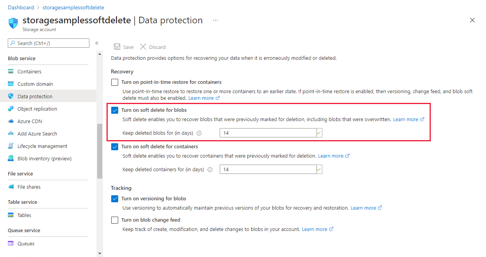
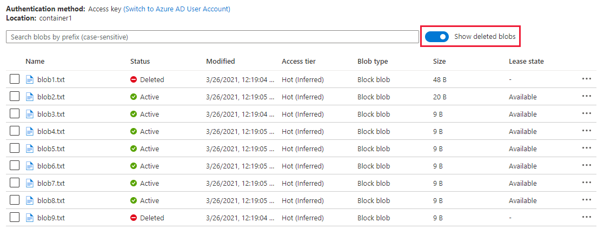
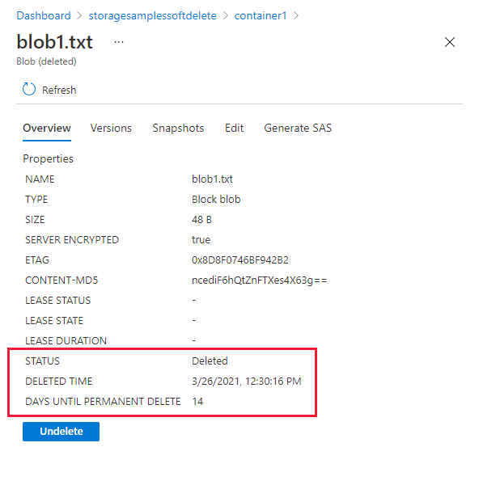

# Enable and manage soft delete for blobs

Blob soft delete protects your data from being accidentally or erroneously modified or deleted. When blob soft delete is enabled for a storage account, blobs, blob versions, and snapshots in that storage account may be recovered after they are deleted, within a retention period that you specify.

If there is a possibility that your data may accidentally be modified or deleted by an application or another storage account user, Microsoft recommends turning on blob soft delete. This article shows how to enable soft delete for blobs. For more details about blob soft delete, see [Soft delete for blobs](soft-delete-blob-overview.md).

To learn how to also enable soft delete for containers, see [Enable and manage soft delete for containers](soft-delete-container-enable.md).

## Enable blob soft delete

# [Portal](#tab/azure-portal)

Enable soft delete for blobs on your storage account by using Azure portal:

1. In the [Azure portal](https://portal.azure.com/), navigate to your storage account.
1. Locate the **Data Protection** option under **Blob service**.
1. Set the **Blob soft delete** property to *Enabled*.
1. Under **Retention policies**, specify how long soft-deleted blobs are retained by Azure Storage.
1. Save your changes.



To view soft deleted blobs, select the **Show deleted blobs** checkbox.



To view soft deleted snapshots for a given blob, select the blob then click **View snapshots**.


Make sure the **Show deleted snapshots** checkbox is selected.


When you click on a soft deleted blob or snapshot, notice the new blob properties. They indicate when the object was deleted, and how many days are left until the blob or blob snapshot is permanently expired. If the soft deleted object is not a snapshot, you will also have the option to undelete it.



Remember that undeleting a blob will also undelete all associated snapshots. To undelete soft deleted snapshots for an active blob, click on the blob and select **Undelete all snapshots**.


Once you undelete a blob's snapshots, you can click **Promote** to copy a snapshot over the root blob, thereby restoring the blob to the snapshot.


# [PowerShell](#tab/azure-powershell)

[!INCLUDE [updated-for-az](../../../includes/updated-for-az.md)]

To enable soft delete, update a blob client's service properties. The following example enables soft delete for a subset of accounts in a subscription:

```powershell
Set-AzContext -Subscription "<subscription-name>"
$MatchingAccounts = Get-AzStorageAccount | where-object{$_.StorageAccountName -match "<matching-regex>"}
$MatchingAccounts | Enable-AzStorageDeleteRetentionPolicy -RetentionDays 7
```

You can verify that soft delete was turned on by using the following command:

```powershell
$MatchingAccounts | $account = Get-AzStorageAccount -ResourceGroupName myresourcegroup -Name storageaccount
   Get-AzStorageServiceProperty -ServiceType Blob -Context $account.Context | Select-Object -ExpandProperty DeleteRetentionPolicy
```

To recover blobs that were accidentally deleted, call **Undelete Blob** on those blobs. Remember that calling **Undelete Blob**, both on active and soft deleted blobs, will restore all associated soft deleted snapshots as active. The following example calls **Undelete Blob** on all soft deleted and active blobs in a container:

```powershell
# Create a context by specifying storage account name and key
$ctx = New-AzStorageContext -StorageAccountName $StorageAccountName -StorageAccountKey $StorageAccountKey

# Get the blobs in a given container and show their properties
$Blobs = Get-AzStorageBlob -Container $StorageContainerName -Context $ctx -IncludeDeleted
$Blobs.ICloudBlob.Properties

# Undelete the blobs
$Blobs.ICloudBlob.Undelete()
```
To find the current soft delete retention policy, use the following command:

```azurepowershell-interactive
   $account = Get-AzStorageAccount -ResourceGroupName myresourcegroup -Name storageaccount
   Get-AzStorageServiceProperty -ServiceType Blob -Context $account.Context
```

# [CLI](#tab/azure-CLI)

To enable soft delete, update a blob client's service properties:

```azurecli-interactive
az storage blob service-properties delete-policy update --days-retained 7  --account-name mystorageaccount --enable true
```

To verify soft delete is turned on, use the following command: 

```azurecli-interactive
az storage blob service-properties delete-policy show --account-name mystorageaccount 
```

# [Python](#tab/python)

To enable soft delete, update a blob client's service properties:

```python
# Make the requisite imports
from azure.storage.blob import BlockBlobService
from azure.storage.common.models import DeleteRetentionPolicy

# Initialize a block blob service
block_blob_service = BlockBlobService(
    account_name='<enter your storage account name>', account_key='<enter your storage account key>')

# Set the blob client's service property settings to enable soft delete
block_blob_service.set_blob_service_properties(
    delete_retention_policy=DeleteRetentionPolicy(enabled=True, days=7))
```

# [.NET v12](#tab/dotnet)

To enable soft delete, update a blob client's service properties:

:::code language="csharp" source="~/azure-storage-snippets/blobs/howto/dotnet/dotnet-v12/DataProtection.cs" id="Snippet_EnableSoftDelete":::

To recover blobs that were accidentally deleted, call Undelete on those blobs. Remember that calling **Undelete**, both on active and soft deleted blobs, will restore all associated soft deleted snapshots as active. The following example calls Undelete on all soft deleted and active blobs in a container:

:::code language="csharp" source="~/azure-storage-snippets/blobs/howto/dotnet/dotnet-v12/DataProtection.cs" id="Snippet_RecoverDeletedBlobs":::

To recover to a specific blob version, first call Undelete on a blob, then copy the desired snapshot over the blob. The following example recovers a block blob to its most recently generated snapshot:

:::code language="csharp" source="~/azure-storage-snippets/blobs/howto/dotnet/dotnet-v12/DataProtection.cs" id="Snippet_RecoverSpecificBlobVersion":::

# [.NET v11](#tab/dotnet11)

To enable soft delete, update a blob client's service properties:

```csharp
// Get the blob client's service property settings
ServiceProperties serviceProperties = blobClient.GetServiceProperties();

// Configure soft delete
serviceProperties.DeleteRetentionPolicy.Enabled = true;
serviceProperties.DeleteRetentionPolicy.RetentionDays = RetentionDays;

// Set the blob client's service property settings
blobClient.SetServiceProperties(serviceProperties);
```

To recover blobs that were accidentally deleted, call **Undelete Blob** on those blobs. Remember that calling **Undelete Blob**, both on active and soft deleted blobs, will restore all associated soft deleted snapshots as active. The following example calls **Undelete Blob** on all soft-deleted and active blobs in a container:

```csharp
// Recover all blobs in a container
foreach (CloudBlob blob in container.ListBlobs(useFlatBlobListing: true, blobListingDetails: BlobListingDetails.Deleted))
{
       await blob.UndeleteAsync();
}
```

To recover to a specific blob version, first call the **Undelete Blob** operation, then copy the desired snapshot over the blob. The following example recovers a block blob to its most recently generated snapshot:

```csharp
// Undelete
await blockBlob.UndeleteAsync();

// List all blobs and snapshots in the container prefixed by the blob name
IEnumerable<IListBlobItem> allBlobVersions = container.ListBlobs(
    prefix: blockBlob.Name, useFlatBlobListing: true, blobListingDetails: BlobListingDetails.Snapshots);

// Restore the most recently generated snapshot to the active blob
CloudBlockBlob copySource = allBlobVersions.First(version => ((CloudBlockBlob)version).IsSnapshot &&
    ((CloudBlockBlob)version).Name == blockBlob.Name) as CloudBlockBlob;
blockBlob.StartCopy(copySource);
```  

---

## Next steps

- [Soft delete for Blob storage](./soft-delete-blob-overview.md)
- [Blob versioning](versioning-overview.md)