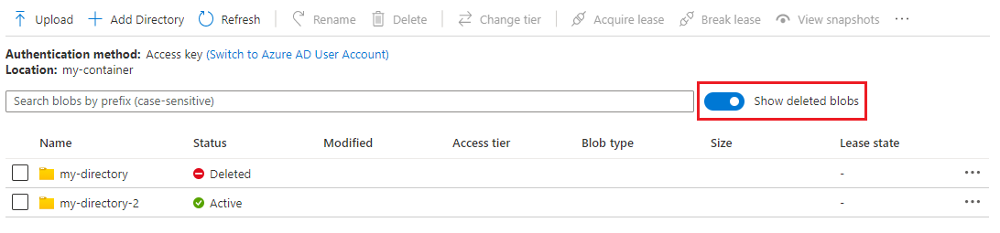
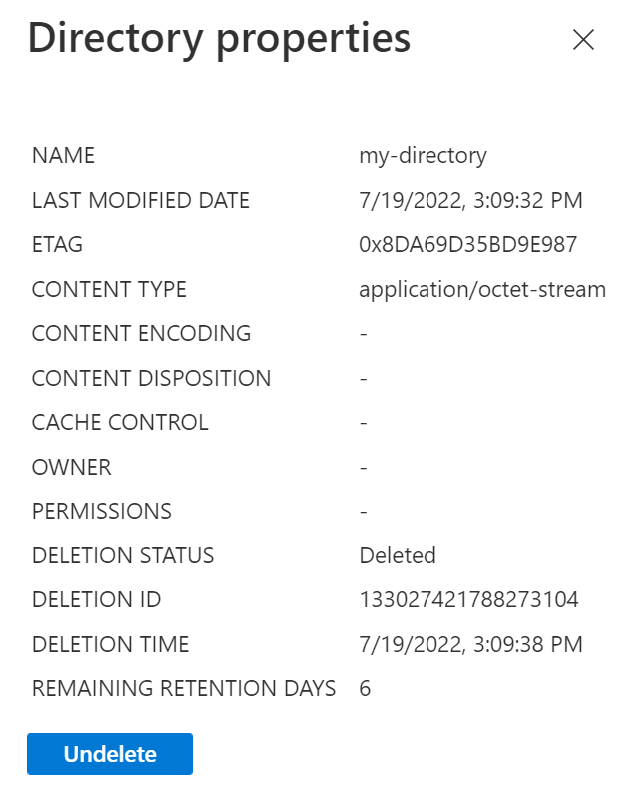
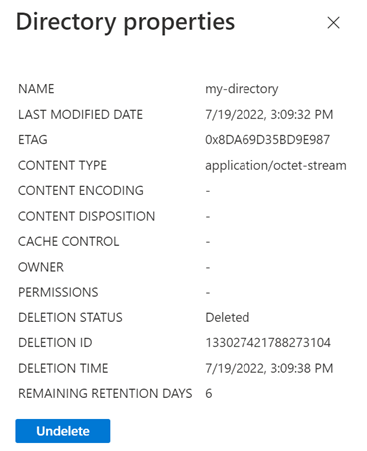

# Manage and restore soft-deleted blobs

Blob soft delete protects an individual blob and its versions, snapshots, and metadata from accidental deletes or overwrites by maintaining the deleted data in the system for a specified period of time. During the retention period, you can restore the blob to its state at deletion. After the retention period has expired, the blob is permanently deleted. You cannot permanently delete a blob that has been soft deleted before the retention period expires. For more information about blob soft delete, see [Soft delete for blobs](soft-delete-blob-overview.md).

Blob soft delete is part of a comprehensive data protection strategy for blob data. To learn more about Microsoft's recommendations for data protection, see [Data protection overview](data-protection-overview.md).

This article shows how to use the Azure portal, PowerShell, or Azure CLI to view and restore soft-deleted blobs and snapshots. You can also use one of the Blob Storage client libraries to manage soft-deleted objects.

## View and manage soft-deleted blobs (flat namespace)

You can use the Azure portal to view and restore soft-deleted blobs and snapshots. Restoring soft-deleted objects is slightly different depending on whether blob versioning is also enabled for your storage account. For more information, see [Restoring a soft-deleted version](versioning-overview.md#restoring-a-soft-deleted-version).

### View deleted blobs

When blobs are soft-deleted, they are invisible in the Azure portal by default. To view soft-deleted blobs, navigate to the **Overview** page for the container and toggle the **Show deleted blobs** setting. Soft-deleted blobs are displayed with a status of **Deleted**.

:::image type="content" source="media/soft-delete-blob-manage/soft-deleted-blobs-list-portal.png" alt-text="Screenshot showing how to list soft-deleted blobs in Azure portal":::

Next, select the deleted blob from the list of blobs to display its properties. Under the **Overview** tab, notice that the blob's status is set to **Deleted**. The portal also displays the number of days until the blob is permanently deleted.

:::image type="content" source="media/soft-delete-blob-manage/soft-deleted-blob-properties-portal.png" alt-text="Screenshot showing properties of soft-deleted blob in Azure portal":::

### View deleted snapshots

Deleting a blob also deletes any snapshots associated with the blob. If a soft-deleted blob has snapshots, the deleted snapshots can also be displayed in the Azure portal. Display the soft-deleted blob's properties, then navigate to the **Snapshots** tab, and toggle **Show deleted snapshots**.

:::image type="content" source="media/soft-delete-blob-manage/soft-deleted-blob-snapshots-portal.png" alt-text="Screenshot showing how to display deleted snapshots in Azure portal.":::

### Restore soft-deleted objects when versioning is disabled

To restore a soft-deleted blob in the Azure portal when blob versioning is not enabled, first display the blob's properties, then select the **Undelete** button on the **Overview** tab. Restoring a blob also restores any snapshots that were deleted during the soft-delete retention period.

:::image type="content" source="media/soft-delete-blob-manage/undelete-soft-deleted-blob-portal.png" alt-text="Screenshot showing how to restore a soft-deleted blob in Azure portal":::

To promote a soft-deleted snapshot to the base blob, first make sure that the blob's soft-deleted snapshots have been restored. Select the **Undelete** button to restore the blob's soft-deleted snapshots, even if the base blob itself has not been soft-deleted. Next, select the snapshot to promote and use the **Promote snapshot** button to overwrite the base blob with the contents of the snapshot.

:::image type="content" source="media/soft-delete-blob-manage/promote-snapshot.png" alt-text="Screenshot showing how to promote a snapshot to the base blob":::

### Restore soft-deleted blobs when versioning is enabled

To restore a soft-deleted blob in the Azure portal when versioning is enabled, select the soft-deleted blob to display its properties, then select the **Versions** tab. Select the version that you want to promote to be the current version, then select **Make current version**.

:::image type="content" source="media/soft-delete-blob-manage/soft-deleted-blob-promote-version-portal.png" alt-text="Screenshot showing how to promote a version to restore a blob in Azure portal":::

To restore deleted versions or snapshots when versioning is enabled, display the blob's properties, then select the **Undelete** button on the **Overview** tab.

> [!NOTE]
> When versioning is enabled, selecting the **Undelete** button on a deleted blob restores any soft-deleted versions or snapshots, but does not restore the base blob. To restore the base blob, you must promote a previous version.

## View and manage soft-deleted blobs and directories (hierarchical namespace)

You can restore soft-deleted blobs and directories in accounts that have a hierarchical namespace.

You can use the Azure portal to view and restore soft-deleted blobs and directories.

### View deleted blobs and directories

When blobs or directories are soft-deleted, they are invisible in the Azure portal by default. To view soft-deleted blobs and directories, navigate to the **Overview** page for the container and toggle the **Show deleted blobs** setting. Soft-deleted blobs and directories are displayed with a status of **Deleted**. The following image shows a soft-deleted directory.

> [!div class="mx-imgBorder"]
> 

> [!NOTE]
> If you rename a directory that contains soft-deleted items (subdirectories and blobs), those soft-deleted items become disconnected from the directory, so they won't appear in the Azure portal when you toggle the **Show deleted blobs** setting. If you want to view them in the Azure portal, you'll have to revert the name of the directory back to its original name or create a separate directory that uses the original directory name.

Next, select the deleted directory or blob from the list display its properties. Under the **Overview** tab, notice that the status is set to **Deleted**. The portal also displays the number of days until the blob is permanently deleted.

> [!div class="mx-imgBorder"]
> 

### Restore soft-deleted blobs and directories

To restore a soft-deleted blob or directory in the Azure portal, first display the blob or directory's properties, then select the **Undelete** button on the **Overview** tab. The following image shows the Undelete button on a soft-deleted directory.

> [!div class="mx-imgBorder"]
> 

#### Restore soft-deleted blobs and directories by using PowerShell

> [!IMPORTANT]
> This section applies only to accounts that have a hierarchical namespace.

1. Ensure that you have the **Az.Storage** preview module installed. For more information, see [Enable blob soft delete via PowerShell](soft-delete-blob-enable.md?tabs=azure-powershell#enable-blob-soft-delete-hierarchical-namespace).

2. Obtain storage account authorization by using either a storage account key, a connection string, or Azure Active Directory (Azure AD). For more information, see [Connect to the account](data-lake-storage-directory-file-acl-powershell.md#connect-to-the-account).

   The following example obtains authorization by using a storage account key.

   ```powershell
   $ctx = New-AzStorageContext -StorageAccountName '<storage-account-name>' -StorageAccountKey '<storage-account-key>'
   ```

3. To restore soft-deleted item, use the `Restore-AzDataLakeGen2DeletedItem` command.

   ```powershell
   $filesystemName = "my-file-system"
   $dirName="my-directory"
   $deletedItems = Get-AzDataLakeGen2DeletedItem -Context $ctx -FileSystem $filesystemName -Path $dirName
   $deletedItems | Restore-AzDataLakeGen2DeletedItem
   ```

   If you rename the directory that contains the soft-deleted items, those items become disconnected from the directory. If you want to restore those items, you'll have to revert the name of the directory back to its original name or create a separate directory that uses the original directory name. Otherwise, you'll receive an error when you attempt to restore those soft-deleted items.

#### Restore soft-deleted blobs and directories by using Azure CLI

> [!IMPORTANT]
> This section applies only to accounts that have a hierarchical namespace.

1. Make sure that you have the `storage-preview` extension installed. For more information, see [Enable blob soft delete by using PowerShell](soft-delete-blob-enable.md?tabs=azure-CLI#enable-blob-soft-delete-hierarchical-namespace).

2. Get a list of deleted items.

   ```azurecli
   $filesystemName = "my-file-system"
   az storage fs list-deleted-path -f $filesystemName --auth-mode login
   ```

3. To restore an item, use the `az storage fs undelete-path` command.

   ```azurecli
   $dirName="my-directory"
   az storage fs undelete-path -f $filesystemName --deleted-path-name $dirName --deletion-id "<deletionId>" --auth-mode login
   ```

   If you rename the directory that contains the soft-deleted items, those items become disconnected from the directory. If you want to restore those items, you'll have to revert the name of the directory back to its original name or create a separate directory that uses the original directory name. Otherwise, you'll receive an error when you attempt to restore those soft-deleted items.

## Next steps

- [Soft delete for Blob storage](soft-delete-blob-overview.md)
- [Enable soft delete for blobs](soft-delete-blob-enable.md)
- [Blob versioning](versioning-overview.md)
