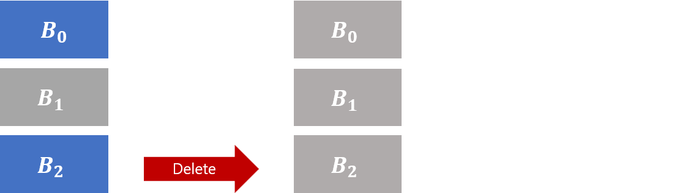

# Soft delete for blobs

Blob soft delete protects an individual blob and its versions, snapshots, and metadata from accidental deletes or overwrites by maintaining the deleted data in the system for a specified period of time. During the retention period, you can restore the blob to its state at deletion. After the retention period has expired, the blob is permanently deleted.

## Recommended data protection configuration

For optimal protection for your blob data, Microsoft recommends enabling all of the following data protection features:

- Container soft delete, to restore a container that has been deleted. To learn how to enable container soft delete, see [Enable and manage soft delete for containers](soft-delete-container-enable.md).
- Blob versioning, to automatically maintain previous versions of a blob. When blob versioning is enabled, you can restore an earlier version of a blob to recover your data if it is erroneously modified or deleted. To learn how to enable blob versioning, see [Enable and manage blob versioning](versioning-enable.md).
- Blob soft delete, to restore a blob or version that has been deleted. To learn how to enable blob soft delete, see [Enable and manage soft delete for blobs](soft-delete-blob-enable.md).

For more information, see [Data protection overview](data-protection-overview.md).

[!INCLUDE [storage-data-lake-gen2-support](../../../includes/storage-data-lake-gen2-support.md)]

## How blob soft delete works

When you enable blob soft delete for a storage account, you specify a retention period for deleted objects of between 1 and 365 days. The retention period indicates how long blob data remains available after it is deleted or overwritten. The clock starts on the retention period as soon as a blob is deleted or overwritten.

While the retention period is active, you can restore a deleted blob, version, or snapshot by calling the [Undelete Blob](/rest/api/storageservices/undelete-blob) operation. The following diagram shows how a deleted blob can be restored when blob soft delete is enabled:

:::image type="content" source="media/soft-delete-blob-overview/blob-soft-delete-diagram.png" alt-text="Diagram showing how a soft-deleted blob may be restored":::

You can change the soft delete retention period at any time. An updated retention period applies only to data that was deleted after the retention period was changed. Any data that was deleted before the retention period was changed is subject to the retention period that was in effect when it was deleted.

If you disable soft delete, you can continue to access and recover soft deleted data in your storage account that was saved while the feature was enabled, until the soft delete retention period has elapsed.

Blob soft delete is available for both new and existing general-purpose v2, general-purpose v1, and Blob storage accounts. Both standard and premium account types are supported. Blob soft delete is available for all storage tiers including hot, cool, and archive. Soft delete is available for unmanaged disks, which are page blobs under the covers, but is not available for managed disks.

Attempting to delete a soft deleted object does not affect its expiry time.

> [!NOTE]
> You can use blob soft delete only to restore an individual blob. To restore a container and its contents, container soft delete must also be enabled for the storage account. Microsoft recommends enabling container soft delete and blob versioning together with blob soft delete to ensure complete protection for blob data.

### Soft delete with delete operations


### Soft delete with overwrite operations


## Blob soft delete and versioning

The behavior of blob soft delete is slightly different depending on whether blob versioning is enabled for the storage account. The following sections outline these differences.

### Blob soft delete with versioning enabled

If blob versioning and blob soft delete are both enabled on the storage account, then deleting or overwriting a blob creates a new version. The new version is not soft-deleted and is not removed when the soft-delete retention period expires. The blob can be restored from the version at any point.

Microsoft recommends enabling both versioning and blob soft delete. For more information about using blob versioning and soft delete together, see [Blob versioning and soft delete](versioning-overview.md#blob-versioning-and-soft-delete).

### Blob soft delete without versioning enabled

If blob soft delete is enabled and blob versioning is not enabled, then deleting a blob marks that blob as soft-deleted. Uploading a blob with the same name as the deleted blob creates a soft-deleted snapshot of the deleted blob.

An overwrite operation 

Overwriting a blob with a blob of the same name creates a soft-deleted snapshot. 

If data in an existing blob or snapshot is deleted while blob soft delete is enabled but blob versioning is not enabled, then a soft-deleted snapshot is generated to save the state of the blob prior to deletion. After the specified retention period has expired, the soft-deleted snapshot is permanently deleted.

???i'm not seeing the snapshots in the portal???

### Saving deleted data

Soft delete preserves your data in many cases where objects are deleted or overwritten.

When a blob is overwritten using **Put Blob**, **Put Block List**, or **Copy Blob**, a version or snapshot of the blob's state prior to the write operation is automatically generated. This object is invisible unless soft-deleted objects are explicitly listed. See the [Recovery](#recovery) section to learn how to list soft deleted objects.


*Soft deleted data is grey, while active data is blue. More recently written data appears beneath older data. When B0 is overwritten with B1, a soft deleted snapshot of B0 is generated. When B1 is overwritten with B2, a soft deleted snapshot of B1 is generated.*

> [!NOTE]  
> Soft delete only affords overwrite protection for copy operations when it is turned on for the destination blob's account.
>
> Soft delete does not afford overwrite protection for blobs in the archive tier. If a blob in archive is overwritten with a new blob in any tier, the overwritten blob is permanently expired.

When **Delete Blob** is called on a snapshot, that snapshot is marked as soft deleted. A new snapshot is not generated.


*Soft deleted data is grey, while active data is blue. More recently written data appears beneath older data. When **Snapshot Blob** is called, B0 becomes a snapshot and B1 is the active state of the blob. When the B0 snapshot is deleted, it is marked as soft deleted.*

When **Delete Blob** is called on a base blob (any blob that is not itself a snapshot), that blob is marked as soft deleted. Consistent with previous behavior, calling **Delete Blob** on a blob that has active snapshots returns an error. Calling **Delete Blob** on a blob with soft deleted snapshots does not return an error. You can still delete a blob and all its snapshots in single operation when soft delete is turned on. Doing so marks the base blob and snapshots as soft deleted.



*Soft deleted data is grey, while active data is blue. More recently written data appears beneath older data. Here, a **Delete Blob** call is made to delete B2 and all associated snapshots. The active blob, B2, and all associated snapshots are marked as soft deleted.*

> [!NOTE]  
> When a soft deleted blob is overwritten, a soft deleted snapshot of the blob's state prior to the write operation is automatically generated. The new blob inherits the tier of the overwritten blob.

Soft delete does not save your data in cases of container or account deletion, nor when blob metadata and blob properties are overwritten. To protect a storage account from deletion, you can configure a lock using the Azure Resource Manager. For more information, see the Azure Resource Manager article [Lock resources to prevent unexpected changes](../../azure-resource-manager/management/lock-resources.md).  To protect containers from accidental deletion, configure container soft delete for the storage account. For more information, see [Soft delete for containers (preview)](soft-delete-container-overview.md).

The following table details expected behavior when soft delete is turned on:

| REST API operation | Resource type | Description | Change in behavior |
|--------------------|---------------|-------------|--------------------|
| [Delete](/rest/api/storagerp/StorageAccounts/Delete) | Account | Deletes the storage account, including all containers and blobs that it contains.                           | No change. Containers and blobs in the deleted account are not recoverable. |
| [Delete Container](/rest/api/storageservices/delete-container) | Container | Deletes the container, including all blobs that it contains. | No change. Blobs in the deleted container are not recoverable. |
| [Put Blob](/rest/api/storageservices/put-blob) | Block, append, and page blobs | Creates a new blob or replaces an existing blob within a container | If used to replace an existing blob, a snapshot of the blob's state prior to the call is automatically generated. This also applies to a previously soft deleted blob if and only if it is replaced by a blob of the same type (Block, append, or Page). If it is replaced by a blob of a different type, all existing soft deleted data will be permanently expired. |
| [Delete Blob](/rest/api/storageservices/delete-blob) | Block, append, and page blobs | Marks a blob or blob snapshot for deletion. The blob or snapshot is later deleted during garbage collection | If used to delete a blob snapshot, that snapshot is marked as soft deleted. If used to delete a blob, that blob is marked as soft deleted. |
| [Copy Blob](/rest/api/storageservices/copy-blob) | Block, append, and page blobs | Copies a source blob to a destination blob in the same storage account or in another storage account. | If used to replace an existing blob, a snapshot of the blob's state prior to the call is automatically generated. This also applies to a previously soft deleted blob if and only if it is replaced by a blob of the same type (Block, append, or Page). If it is replaced by a blob of a different type, all existing soft deleted data will be permanently expired. |
| [Put Block](/rest/api/storageservices/put-block) | Block blobs | Creates a new block to be committed as part of a block blob. | If used to commit a block to a blob that is active, there is no change. If used to commit a block to a blob that is soft deleted, a new blob is created and a snapshot is automatically generated to capture the state of the soft deleted blob. |
| [Put Block List](/rest/api/storageservices/put-block-list) | Block blobs | Commits a blob by specifying the set of block IDs that comprise the block blob. | If used to replace an existing blob, a snapshot of the blob's state prior to the call is automatically generated. This also applies to a previously soft deleted blob if and only if it is a block blob. If it is replaced by a blob of a different type, all existing soft deleted data will be permanently expired. |
| [Put Page](/rest/api/storageservices/put-page) | Page blobs | Writes a range of pages to a page blob. | No change. Page blob data that is overwritten or cleared using this operation is not saved and is not recoverable. |
| [Append Block](/rest/api/storageservices/append-block) | Append Blobs | Writes a block of data to the end of an append blob | No change. |
| [Set Blob Properties](/rest/api/storageservices/set-blob-properties) | Block, append, and page blobs | Sets values for system properties defined for a blob. | No change. Overwritten blob properties are not recoverable. |
| [Set Blob Metadata](/rest/api/storageservices/set-blob-metadata) | Block, append, and page blobs | Sets user-defined metadata for the specified blob as one or more name-value pairs. | No change. Overwritten blob metadata is not recoverable. |

It is important to notice that calling **Put Page** to overwrite or clear ranges of a page blob will not automatically generate snapshots. Virtual machine disks are backed by page blobs and use **Put Page** to write data.

### Recovery

Calling the [Undelete Blob](/rest/api/storageservices/undelete-blob) operation on a soft deleted base blob restores it and all associated soft deleted snapshots as active. Calling the **Undelete Blob** operation on an active base blob restores all associated soft deleted snapshots as active. When snapshots are restored as active, they look like user-generated snapshots; they do not overwrite the base blob.

To restore a blob to a specific soft deleted snapshot, you can call **Undelete Blob** on the base blob. Then, you can copy the snapshot over the now-active blob. You can also copy the snapshot to a new blob.


*Soft deleted data is grey, while active data is blue. More recently written data appears beneath older data. Here, **Undelete Blob** is called on blob B, thereby restoring the base blob, B1, and all associated snapshots, here just B0, as active. In the second step, B0 is copied over the base blob. This copy operation generates a soft deleted snapshot of B1.*

To view soft deleted blobs and blob snapshots, you can choose to include deleted data in **List Blobs**. You can choose to view only soft deleted base blobs, or to include soft deleted blob snapshots as well. For all soft deleted data, you can view the time when the data was deleted as well as the number of days before the data will be permanently expired.

### Example

The following is the console output of a .NET script that uploads, overwrites, snapshots, deletes, and restores a blob named *HelloWorld* when soft delete is turned on:

```bash
Upload:
- HelloWorld (is soft deleted: False, is snapshot: False)

Overwrite:
- HelloWorld (is soft deleted: True, is snapshot: True)
- HelloWorld (is soft deleted: False, is snapshot: False)

Snapshot:
- HelloWorld (is soft deleted: True, is snapshot: True)
- HelloWorld (is soft deleted: False, is snapshot: True)
- HelloWorld (is soft deleted: False, is snapshot: False)

Delete (including snapshots):
- HelloWorld (is soft deleted: True, is snapshot: True)
- HelloWorld (is soft deleted: True, is snapshot: True)
- HelloWorld (is soft deleted: True, is snapshot: False)

Undelete:
- HelloWorld (is soft deleted: False, is snapshot: True)
- HelloWorld (is soft deleted: False, is snapshot: True)
- HelloWorld (is soft deleted: False, is snapshot: False)

Copy a snapshot over the base blob:
- HelloWorld (is soft deleted: False, is snapshot: True)
- HelloWorld (is soft deleted: False, is snapshot: True)
- HelloWorld (is soft deleted: True, is snapshot: True)
- HelloWorld (is soft deleted: False, is snapshot: False)
```

See the [Next steps](#next-steps) section for a pointer to the application that produced this output.

## Pricing and billing

All soft deleted data is billed at the same rate as active data. You will not be charged for data that is permanently deleted after the configured retention period. For a deeper dive into snapshots and how they accrue charges, see [Understanding how snapshots accrue charges](./snapshots-overview.md).

You will not be billed for the transactions related to the automatic generation of snapshots. You will be billed for **Undelete Blob** transactions at the rate for write operations.

For more details on prices for Azure Blob Storage in general, check out the [Azure Blob Storage Pricing Page](https://azure.microsoft.com/pricing/details/storage/blobs/).

When you initially turn on soft delete, Microsoft recommends using a short retention period to better understand how the feature will affect your bill.

Enabling soft delete for frequently overwritten data may result in increased storage capacity charges and increased latency when listing blobs. You can mitigate this additional cost and latency by storing the frequently overwritten data in a separate storage account where soft delete is disabled.

## FAQ

### Can I use the Set Blob Tier API to tier blobs with soft deleted snapshots?

Yes. The soft deleted snapshots will remain in the original tier, but the base blob will move to the new tier.

### Premium storage accounts have a per blob snapshot limit of 100. Do soft deleted snapshots count toward this limit?

No, soft deleted snapshots do not count toward this limit.

### If I delete an entire account or container with soft delete turned on, will all associated blobs be saved?

No, if you delete an entire account or container, all associated blobs will be permanently deleted. For more information about protecting a storage account from being accidentally deleted, see [Lock Resources to Prevent Unexpected Changes](../../azure-resource-manager/management/lock-resources.md).

### Can I view capacity metrics for deleted data?

Soft deleted data is included as a part of your total storage account capacity. For more information on tracking and monitoring storage capacity, see [Storage Analytics](../common/storage-analytics.md).

### Can I read and copy out soft deleted snapshots of my blob?  

Yes, but you must call Undelete on the blob first.

### Is soft delete available for virtual machine disks?  

Soft delete is available for both premium and standard unmanaged disks, which are page blobs under the covers. Soft delete will only help you recover data deleted by **Delete Blob**, **Put Blob**, **Put Block List**, and **Copy Blob** operations. Data overwritten by a call to **Put Page** is not recoverable.

An Azure virtual machine writes to an unmanaged disk using calls to **Put Page**, so using soft delete to undo writes to an unmanaged disk from an Azure VM is not a supported scenario.

### Do I need to change my existing applications to use soft delete?

It is possible to take advantage of soft delete regardless of the API version you are using. However, to list and recover soft deleted blobs and blob snapshots, you will need to use version 2017-07-29 of the [Azure Storage REST API](/rest/api/storageservices/Versioning-for-the-Azure-Storage-Services) or greater. Microsoft recommends always using the latest version of the Azure Storage API.

## Next steps

- [Enable soft delete for blobs](./soft-delete-blob-enable.md)
- [Blob versioning](versioning-overview.md)