# Example Azure role assignment conditions for Blob Storage

This article list some examples of role assignment conditions for controlling access to Azure Blob Storage.

[!INCLUDE [storage-abac-preview](../../../includes/storage-abac-preview.md)]

## Prerequisites

For information about the prerequisites to add or edit role assignment conditions, see [Conditions prerequisites](../../role-based-access-control/conditions-prerequisites.md).

## Summary of examples in this article

Use the following table to quickly locate an example that fits your ABAC scenario. The table includes a brief description of the scenario, plus a list of attributes used in the example by [source](../../role-based-access-control/conditions-format.md#attributes) (environment, principal, request and resource).

| Example | Environment | Principal | Request | Resource |
|---------|-------------|-----------|---------|----------|
| [Read blobs with a blob index tag](#example-read-blobs-with-a-blob-index-tag) | | | | tags |
| [New blobs must include a blob index tag](#example-new-blobs-must-include-a-blob-index-tag) | | | tags | |
| [Existing blobs must have blob index tag keys](#example-existing-blobs-must-have-blob-index-tag-keys) | | | tags | |
| [Existing blobs must have a blob index tag key and values](#example-existing-blobs-must-have-a-blob-index-tag-key-and-values) | | | tags | |
| [Read, write, or delete blobs in named containers](#example-read-write-or-delete-blobs-in-named-containers) | | | | container name |
| [Read blobs in named containers with a path](#example-read-blobs-in-named-containers-with-a-path) | | | | container name</br> blob path |
| [Read or list blobs in named containers with a path](#example-read-or-list-blobs-in-named-containers-with-a-path) | | | blob prefix | container name</br> blob path |
| [Write blobs in named containers with a path](#example-write-blobs-in-named-containers-with-a-path) | | | | container name</br> blob path |
| [Read blobs with a blob index tag and a path](#example-read-blobs-with-a-blob-index-tag-and-a-path) | | | | tags</br> blob path |
| [Read only current blob versions](#example-read-only-current-blob-versions) | | | | isCurrentVersion |
| [Read current blob versions and a specific blob version](#example-read-current-blob-versions-and-a-specific-blob-version) | | | versionId | isCurrentVersion |
| [Delete old blob versions](#example-delete-old-blob-versions) | | | versionId | |
| [Read current blob versions and any blob snapshots](#example-read-current-blob-versions-and-any-blob-snapshots) | | | snapshot | isCurrentVersion |
| [Read only storage accounts with hierarchical namespace enabled](#example-read-only-storage-accounts-with-hierarchical-namespace-enabled) | | | | isHnsEnabled |
| [Read blobs with specific encryption scopes](#example-read-blobs-with-specific-encryption-scopes) | | | | Encryption scope name |
| [Read or write blobs in named storage account with specific encryption scope](#example-read-or-write-blobs-in-named-storage-account-with-specific-encryption-scope) | | | | Storage account name</br> Encryption scope name |
| [Read or write blobs based on blob index tags and custom security attributes](#example-read-or-write-blobs-based-on-blob-index-tags-and-custom-security-attributes) | | ID | tags | tags |
| [Read blobs based on blob index tags and multi-value custom security attributes](#example-read-blobs-based-on-blob-index-tags-and-multi-value-custom-security-attributes) | | ID | | tags |
| [Allow read access to blobs after a specific date and time](#example-allow-read-access-to-blobs-after-a-specific-date-and-time) | UtcNow | | | container name |
| [Allow access to blobs in specific containers from a specific subnet](#example-allow-access-to-blobs-in-specific-containers-from-a-specific-subnet) | Subnet | | | container name |
| [Require private link access to read blobs with high sensitivity](#example-require-private-link-access-to-read-blobs-with-high-sensitivity) | isPrivateLink | | | tags |
| [Allow access to a container only from a specific private endpoint](#example-allow-access-to-a-container-only-from-a-specific-private-endpoint) | Private endpoint | | | container name |
| [Example: Allow read access to highly sensitive blob data only from a specific private endpoint and by users tagged for access](#example-allow-read-access-to-highly-sensitive-blob-data-only-from-a-specific-private-endpoint-and-by-users-tagged-for-access) | Private endpoint | ID | | tags |

## Blob index tags

This section includes examples involving blob index tags.

> [!IMPORTANT]
> Although the `Read content from a blob with tag conditions` suboperation is currently supported for compatibility with conditions implemented during the ABAC feature preview, it has been deprecated and Microsoft recommends using the [`Read a blob`](storage-auth-abac-attributes.md#read-a-blob) action instead.
>
> When configuring ABAC conditions in the Azure portal, you might see **DEPRECATED: Read content from a blob with tag conditions**. Microsoft recommends removing the operation and replacing it with the `Read a blob` action.
>
> If you are authoring your own condition where you want to restrict read access by tag conditions, please refer to [Example: Read blobs with a blob index tag](storage-auth-abac-examples.md#example-read-blobs-with-a-blob-index-tag).

### Example: Read blobs with a blob index tag

This condition allows users to read blobs with a [blob index tag](storage-blob-index-how-to.md) key of Project and a value of Cascade. Attempts to access blobs without this key-value tag will not be allowed.

> [!IMPORTANT]
> For this condition to be effective for a security principal, you must add it to all role assignments for them that include the following actions.

> [!div class="mx-tableFixed"]
> | Action | Notes |
> | --- | --- |
> | `Microsoft.Storage/storageAccounts/blobServices/containers/blobs/read` |  |
> | `Microsoft.Storage/storageAccounts/blobServices/containers/blobs/runAsSuperUser/action` | Add if role definition includes this action, such as Storage Blob Data Owner. |


```
(
 (
  !(ActionMatches{'Microsoft.Storage/storageAccounts/blobServices/containers/blobs/read'} AND NOT SubOperationMatches{'Blob.List'})
 )
 OR 
 (
  @Resource[Microsoft.Storage/storageAccounts/blobServices/containers/blobs/tags:Project<$key_case_sensitive$>] StringEquals 'Cascade'
 )
)
```

#### Azure portal

Here are the settings to add this condition using the Azure portal.

> [!div class="mx-tableFixed"]
> | Condition #1 | Setting |
> | --- | --- |
> | Actions | [Read a blob](storage-auth-abac-attributes.md#read-a-blob) |
> | Attribute source | [Resource](../../role-based-access-control/conditions-format.md#resource-attributes) |
> | Attribute | [Blob index tags [Values in key]](storage-auth-abac-attributes.md#blob-index-tags-values-in-key) |
> | Key | {keyName} |
> | Operator | [StringEquals](../../role-based-access-control/conditions-format.md#stringequals) |
> | Value | {keyValue} |

:::image type="content" source="./media/storage-auth-abac-examples/blob-index-tags-read-portal.png" alt-text="Screenshot of condition editor in Azure portal showing read access to blobs with a blob index tag." lightbox="./media/storage-auth-abac-examples/blob-index-tags-read-portal.png":::

#### Azure PowerShell

Here's how to add this condition using Azure PowerShell.

```azurepowershell
$condition = "((!(ActionMatches{'Microsoft.Storage/storageAccounts/blobServices/containers/blobs/read'} AND NOT SubOperationMatches{'Blob.List'})) OR (@Resource[Microsoft.Storage/storageAccounts/blobServices/containers/blobs/tags:Project<`$key_case_sensitive`$>] StringEquals 'Cascade'))"
$testRa = Get-AzRoleAssignment -Scope $scope -RoleDefinitionName $roleDefinitionName -ObjectId $userObjectID
$testRa.Condition = $condition
$testRa.ConditionVersion = "2.0"
Set-AzRoleAssignment -InputObject $testRa -PassThru
```

Here's how to test this condition.

```azurepowershell
$bearerCtx = New-AzStorageContext -StorageAccountName $storageAccountName
Get-AzStorageBlob -Container <containerName> -Blob <blobName> -Context $bearerCtx 
```

### Example: New blobs must include a blob index tag

This condition requires that any new blobs must include a [blob index tag](storage-blob-index-how-to.md) key of Project and a value of Cascade.

There are two actions that allow you to create new blobs, so you must target both. You must add this condition to any role assignments that include one of the following actions.

> [!div class="mx-tableFixed"]
> | Action | Notes |
> | --- | --- |
> | `Microsoft.Storage/storageAccounts/blobServices/containers/blobs/write` |  |
> | `Microsoft.Storage/storageAccounts/blobServices/containers/blobs/add/action` |  |
> | `Microsoft.Storage/storageAccounts/blobServices/containers/blobs/runAsSuperUser/action` | Add if role definition includes this action, such as Storage Blob Data Owner. |

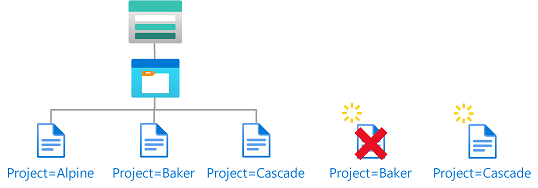

```
(
 (
  !(ActionMatches{'Microsoft.Storage/storageAccounts/blobServices/containers/blobs/write'} AND SubOperationMatches{'Blob.Write.WithTagHeaders'})
  AND
  !(ActionMatches{'Microsoft.Storage/storageAccounts/blobServices/containers/blobs/add/action'} AND SubOperationMatches{'Blob.Write.WithTagHeaders'})
 )
 OR 
 (
  @Request[Microsoft.Storage/storageAccounts/blobServices/containers/blobs/tags:Project<$key_case_sensitive$>] StringEquals 'Cascade'
 )
)
```

#### Azure portal

Here are the settings to add this condition using the Azure portal.

> [!div class="mx-tableFixed"]
> | Condition #1 | Setting |
> | --- | --- |
> | Actions | [Write to a blob with blob index tags](storage-auth-abac-attributes.md#write-to-a-blob-with-blob-index-tags)<br/>[Write to a blob with blob index tags](storage-auth-abac-attributes.md#write-to-a-blob-with-blob-index-tags) |
> | Attribute source | Request |
> | Attribute | [Blob index tags [Values in key]](storage-auth-abac-attributes.md#blob-index-tags-values-in-key) |
> | Key | {keyName} |
> | Operator | [StringEquals](../../role-based-access-control/conditions-format.md#stringequals) |
> | Value | {keyValue} |

:::image type="content" source="./media/storage-auth-abac-examples/blob-index-tags-new-blobs-portal.png" alt-text="Screenshot of condition editor in Azure portal showing new blobs must include a blob index tag." lightbox="./media/storage-auth-abac-examples/blob-index-tags-new-blobs-portal.png":::

#### Azure PowerShell

Here's how to add this condition using Azure PowerShell.

```azurepowershell
$condition = "((!(ActionMatches{'Microsoft.Storage/storageAccounts/blobServices/containers/blobs/write'} AND SubOperationMatches{'Blob.Write.WithTagHeaders'}) AND !(ActionMatches{'Microsoft.Storage/storageAccounts/blobServices/containers/blobs/add/action'} AND SubOperationMatches{'Blob.Write.WithTagHeaders'})) OR (@Request[Microsoft.Storage/storageAccounts/blobServices/containers/blobs/tags:Project<`$key_case_sensitive`$>] StringEquals 'Cascade'))"
$testRa = Get-AzRoleAssignment -Scope $scope -RoleDefinitionName $roleDefinitionName -ObjectId $userObjectID
$testRa.Condition = $condition
$testRa.ConditionVersion = "2.0"
Set-AzRoleAssignment -InputObject $testRa -PassThru
```

Here's how to test this condition.

```azurepowershell
$localSrcFile = # path to an example file, can be an empty txt
$ungrantedTag = @{'Project'='Baker'}
$grantedTag = @{'Project'='Cascade'}
# Get new context for request
$bearerCtx = New-AzStorageContext -StorageAccountName $storageAccountName
# try ungranted tags
$content = Set-AzStorageBlobContent -File $localSrcFile -Container example2 -Blob "Example2.txt" -Tag $ungrantedTag -Context $bearerCtx
# try granted tags
$content = Set-AzStorageBlobContent -File $localSrcFile -Container example2 -Blob "Example2.txt" -Tag $grantedTag -Context $bearerCtx
```

### Example: Existing blobs must have blob index tag keys

This condition requires that any existing blobs be tagged with at least one of the allowed [blob index tag](storage-blob-index-how-to.md) keys: Project or Program. This condition is useful for adding governance to existing blobs.

There are two actions that allow you to update tags on existing blobs, so you must target both. You must add this condition to any role assignments that include one of the following actions.

> [!div class="mx-tableFixed"]
> | Action | Notes |
> | --- | --- |
> | `Microsoft.Storage/storageAccounts/blobServices/containers/blobs/write` |  |
> | `Microsoft.Storage/storageAccounts/blobServices/containers/blobs/tags/write` |  |
> | `Microsoft.Storage/storageAccounts/blobServices/containers/blobs/runAsSuperUser/action` | Add if role definition includes this action, such as Storage Blob Data Owner. |

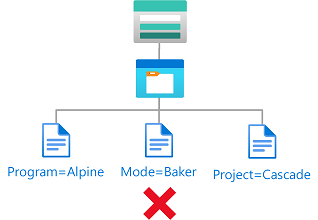

```
(
 (
  !(ActionMatches{'Microsoft.Storage/storageAccounts/blobServices/containers/blobs/write'} AND SubOperationMatches{'Blob.Write.WithTagHeaders'})
  AND
  !(ActionMatches{'Microsoft.Storage/storageAccounts/blobServices/containers/blobs/tags/write'})
 )
 OR 
 (
  @Request[Microsoft.Storage/storageAccounts/blobServices/containers/blobs/tags&$keys$&] ForAllOfAnyValues:StringEquals {'Project', 'Program'}
 )
)
```

#### Azure portal

Here are the settings to add this condition using the Azure portal.

> [!div class="mx-tableFixed"]
> | Condition #1 | Setting |
> | --- | --- |
> | Actions | [Write to a blob with blob index tags](storage-auth-abac-attributes.md#write-to-a-blob-with-blob-index-tags)<br/>[Write blob index tags](storage-auth-abac-attributes.md#write-blob-index-tags) |
> | Attribute source | Request |
> | Attribute | [Blob index tags [Keys]](storage-auth-abac-attributes.md#blob-index-tags-keys) |
> | Operator | [ForAllOfAnyValues:StringEquals](../../role-based-access-control/conditions-format.md#forallofanyvalues) |
> | Value | {keyName1}<br/>{keyName2} |

:::image type="content" source="./media/storage-auth-abac-examples/blob-index-tags-keys-portal.png" alt-text="Screenshot of condition editor in Azure portal showing existing blobs must have blob index tag keys." lightbox="./media/storage-auth-abac-examples/blob-index-tags-keys-portal.png":::

#### Azure PowerShell

Here's how to add this condition using Azure PowerShell.

```azurepowershell
$condition = "((!(ActionMatches{'Microsoft.Storage/storageAccounts/blobServices/containers/blobs/write'} AND SubOperationMatches{'Blob.Write.WithTagHeaders'}) AND !(ActionMatches{'Microsoft.Storage/storageAccounts/blobServices/containers/blobs/tags/write'})) OR (@Request[Microsoft.Storage/storageAccounts/blobServices/containers/blobs/tags&`$keys`$&] ForAllOfAnyValues:StringEquals {'Project', 'Program'}))"
$testRa = Get-AzRoleAssignment -Scope $scope -RoleDefinitionName $roleDefinitionName -ObjectId $userObjectID
$testRa.Condition = $condition
$testRa.ConditionVersion = "2.0"
Set-AzRoleAssignment -InputObject $testRa -PassThru
```

Here's how to test this condition.

```azurepowershell
$localSrcFile = # path to an example file, can be an empty txt
$ungrantedTag = @{'Mode'='Baker'}
$grantedTag = @{'Program'='Alpine';'Project'='Cascade'}
# Get new context for request
$bearerCtx = New-AzStorageContext -StorageAccountName $storageAccountName
# try ungranted tags
$content = Set-AzStorageBlobContent -File $localSrcFile -Container example3 -Blob "Example3.txt" -Tag $ungrantedTag -Context $bearerCtx
# try granted tags
$content = Set-AzStorageBlobContent -File $localSrcFile -Container example3 -Blob "Example3.txt" -Tag $grantedTag -Context $bearerCtx
```

### Example: Existing blobs must have a blob index tag key and values

This condition requires that any existing blobs to have a [blob index tag](storage-blob-index-how-to.md) key of Project and values of Cascade, Baker, or Skagit. This condition is useful for adding governance to existing blobs.

There are two actions that allow you to update tags on existing blobs, so you must target both. You must add this condition to any role assignments that include one of the following actions.

> [!div class="mx-tableFixed"]
> | Action | Notes |
> | --- | --- |
> | `Microsoft.Storage/storageAccounts/blobServices/containers/blobs/write` |  |
> | `Microsoft.Storage/storageAccounts/blobServices/containers/blobs/tags/write` |  |
> | `Microsoft.Storage/storageAccounts/blobServices/containers/blobs/runAsSuperUser/action` | Add if role definition includes this action, such as Storage Blob Data Owner. |


```
(
 (
  !(ActionMatches{'Microsoft.Storage/storageAccounts/blobServices/containers/blobs/write'} AND SubOperationMatches{'Blob.Write.WithTagHeaders'})
  AND
  !(ActionMatches{'Microsoft.Storage/storageAccounts/blobServices/containers/blobs/tags/write'})
 )
 OR 
 (
  @Request[Microsoft.Storage/storageAccounts/blobServices/containers/blobs/tags&$keys$&] ForAnyOfAnyValues:StringEquals {'Project'}
  AND
  @Request[Microsoft.Storage/storageAccounts/blobServices/containers/blobs/tags:Project<$key_case_sensitive$>] ForAllOfAnyValues:StringEquals {'Cascade', 'Baker', 'Skagit'}
 )
)
```

#### Azure portal

Here are the settings to add this condition using the Azure portal.

> [!div class="mx-tableFixed"]
> | Condition #1 | Setting |
> | --- | --- |
> | Actions | [Write to a blob with blob index tags](storage-auth-abac-attributes.md#write-to-a-blob-with-blob-index-tags)<br/>[Write blob index tags](storage-auth-abac-attributes.md#write-blob-index-tags) |
> | Attribute source | Request |
> | Attribute | [Blob index tags [Keys]](storage-auth-abac-attributes.md#blob-index-tags-keys) |
> | Operator | [ForAnyOfAnyValues:StringEquals](../../role-based-access-control/conditions-format.md#foranyofanyvalues) |
> | Value | {keyName} |
> | Operator | And |
> | **Expression 2** |  |
> | Attribute source | Request |
> | Attribute | [Blob index tags [Values in key]](storage-auth-abac-attributes.md#blob-index-tags-values-in-key) |
> | Key | {keyName} |
> | Operator | [ForAllOfAnyValues:StringEquals](../../role-based-access-control/conditions-format.md#forallofanyvalues) |
> | Value | {keyValue1}<br/>{keyValue2}<br/>{keyValue3} |

:::image type="content" source="./media/storage-auth-abac-examples/blob-index-tags-key-values-portal.png" alt-text="Screenshot of condition editor in Azure portal showing existing blobs must have a blob index tag key and values." lightbox="./media/storage-auth-abac-examples/blob-index-tags-key-values-portal.png":::

#### Azure PowerShell

Here's how to add this condition using Azure PowerShell.

```azurepowershell
$condition = "((!(ActionMatches{'Microsoft.Storage/storageAccounts/blobServices/containers/blobs/write'} AND SubOperationMatches{'Blob.Write.WithTagHeaders'}) AND !(ActionMatches{'Microsoft.Storage/storageAccounts/blobServices/containers/blobs/tags/write'})) OR (@Request[Microsoft.Storage/storageAccounts/blobServices/containers/blobs/tags&`$keys`$&] ForAnyOfAnyValues:StringEquals {'Project'} AND @Request[Microsoft.Storage/storageAccounts/blobServices/containers/blobs/tags:Project<`$key_case_sensitive`$>] ForAllOfAnyValues:StringEquals {'Cascade', 'Baker', 'Skagit'}))"
$testRa = Get-AzRoleAssignment -Scope $scope -RoleDefinitionName $roleDefinitionName -ObjectId $userObjectID
$testRa.Condition = $condition
$testRa.ConditionVersion = "2.0"
Set-AzRoleAssignment -InputObject $testRa -PassThru
```

Here's how to test this condition.

```azurepowershell
$localSrcFile = <pathToLocalFile>
$ungrantedTag = @{'Project'='Alpine'}
$grantedTag1 = @{'Project'='Cascade'}
$grantedTag2 = @{'Project'='Baker'}
$grantedTag3 = @{'Project'='Skagit'}
# Get new context for request
$bearerCtx = New-AzStorageContext -StorageAccountName $storageAccountName
# try ungranted tags
Set-AzStorageBlobTag -Container example4 -Blob "Example4.txt" -Tag $ungrantedTag -Context $bearerCtx
# try granted tags
Set-AzStorageBlobTag -Container example4 -Blob "Example4.txt" -Tag $grantedTag1 -Context $bearerCtx
Set-AzStorageBlobTag -Container example4 -Blob "Example4.txt" -Tag $grantedTag2 -Context $bearerCtx
Set-AzStorageBlobTag -Container example4 -Blob "Example4.txt" -Tag $grantedTag3 -Context $bearerCtx
```

## Blob container names or paths

This section includes examples showing how to restrict access to objects based on container name or blob path.

### Example: Read, write, or delete blobs in named containers

This condition allows users to read, write, or delete blobs in storage containers named blobs-example-container. This condition is useful for sharing specific storage containers with other users in a subscription.

There are five actions for read, write, and delete of existing blobs. You must add this condition to any role assignments that include one of the following actions.

> [!div class="mx-tableFixed"]
> | Action | Notes |
> | --- | --- |
> | `Microsoft.Storage/storageAccounts/blobServices/containers/blobs/delete` |  |
> | `Microsoft.Storage/storageAccounts/blobServices/containers/blobs/read` |  |
> | `Microsoft.Storage/storageAccounts/blobServices/containers/blobs/write` |  |
> | `Microsoft.Storage/storageAccounts/blobServices/containers/blobs/add/action` |  |
> | `Microsoft.Storage/storageAccounts/blobServices/containers/blobs/runAsSuperUser/action` | Add if role definition includes this action, such as Storage Blob Data Owner.<br/>Add if the storage accounts included in this condition have hierarchical namespace enabled or might be enabled in the future. |

Suboperations are not used in this condition because the subOperation is needed only when conditions are authored based on tags.


Storage Blob Data Owner

```
(
 (
  !(ActionMatches{'Microsoft.Storage/storageAccounts/blobServices/containers/blobs/delete'})
  AND
  !(ActionMatches{'Microsoft.Storage/storageAccounts/blobServices/containers/blobs/read'})
  AND
  !(ActionMatches{'Microsoft.Storage/storageAccounts/blobServices/containers/blobs/write'})
  AND
  !(ActionMatches{'Microsoft.Storage/storageAccounts/blobServices/containers/blobs/add/action'})
  AND
  !(ActionMatches{'Microsoft.Storage/storageAccounts/blobServices/containers/blobs/runAsSuperUser/action'})
 )
 OR 
 (
  @Resource[Microsoft.Storage/storageAccounts/blobServices/containers:name] StringEquals 'blobs-example-container'
 )
)
```

Storage Blob Data Contributor

```
(
 (
  !(ActionMatches{'Microsoft.Storage/storageAccounts/blobServices/containers/blobs/delete'})
  AND
  !(ActionMatches{'Microsoft.Storage/storageAccounts/blobServices/containers/blobs/read'})
  AND
  !(ActionMatches{'Microsoft.Storage/storageAccounts/blobServices/containers/blobs/write'})
  AND
  !(ActionMatches{'Microsoft.Storage/storageAccounts/blobServices/containers/blobs/add/action'})
 )
 OR 
 (
  @Resource[Microsoft.Storage/storageAccounts/blobServices/containers:name] StringEquals 'blobs-example-container'
 )
)
```

#### Azure portal

Here are the settings to add this condition using the Azure portal.

> [!div class="mx-tableFixed"]
> | Condition #1 | Setting |
> | --- | --- |
> | Actions | [Delete a blob](storage-auth-abac-attributes.md#delete-a-blob)<br/>[Read a blob](storage-auth-abac-attributes.md#read-a-blob)<br/>[Write to a blob](storage-auth-abac-attributes.md#write-to-a-blob)<br/>[Create a blob or snapshot, or append data](storage-auth-abac-attributes.md#create-a-blob-or-snapshot-or-append-data)<br/>[All data operations for accounts with hierarchical namespace enabled](storage-auth-abac-attributes.md#all-data-operations-for-accounts-with-hierarchical-namespace-enabled) (if applicable) |
> | Attribute source | [Resource](../../role-based-access-control/conditions-format.md#resource-attributes) |
> | Attribute | [Container name](storage-auth-abac-attributes.md#container-name) |
> | Operator | [StringEquals](../../role-based-access-control/conditions-format.md#stringequals) |
> | Value | {containerName} |

:::image type="content" source="./media/storage-auth-abac-examples/containers-read-write-delete-portal.png" alt-text="Screenshot of condition editor in Azure portal showing read, write, or delete blobs in named containers." lightbox="./media/storage-auth-abac-examples/containers-read-write-delete-portal.png":::

#### Azure PowerShell

Here's how to add this condition using Azure PowerShell.

```azurepowershell
$condition = "((!(ActionMatches{'Microsoft.Storage/storageAccounts/blobServices/containers/blobs/delete'}) AND !(ActionMatches{'Microsoft.Storage/storageAccounts/blobServices/containers/blobs/read'}) AND !(ActionMatches{'Microsoft.Storage/storageAccounts/blobServices/containers/blobs/write'}) AND !(ActionMatches{'Microsoft.Storage/storageAccounts/blobServices/containers/blobs/add/action'}) AND !(ActionMatches{'Microsoft.Storage/storageAccounts/blobServices/containers/blobs/runAsSuperUser/action'})) OR (@Resource[Microsoft.Storage/storageAccounts/blobServices/containers:name] StringEquals 'blobs-example-container'))"
$testRa = Get-AzRoleAssignment -Scope $scope -RoleDefinitionName $roleDefinitionName -ObjectId $userObjectID
$testRa.Condition = $condition
$testRa.ConditionVersion = "2.0"
Set-AzRoleAssignment -InputObject $testRa -PassThru
```

Here's how to test this condition.

```azurepowershell
$localSrcFile = <pathToLocalFile>
$grantedContainer = "blobs-example-container"
$ungrantedContainer = "ungranted"
# Get new context for request
$bearerCtx = New-AzStorageContext -StorageAccountName $storageAccountName
# Ungranted Container actions
$content = Set-AzStorageBlobContent -File $localSrcFile -Container $ungrantedContainer -Blob "Example5.txt" -Context $bearerCtx
$content = Get-AzStorageBlobContent -Container $ungrantedContainer -Blob "Example5.txt" -Context $bearerCtx
$content = Remove-AzStorageBlob -Container $ungrantedContainer -Blob "Example5.txt" -Context $bearerCtx
# Granted Container actions
$content = Set-AzStorageBlobContent -File $localSrcFile -Container $grantedContainer -Blob "Example5.txt" -Context $bearerCtx
$content = Get-AzStorageBlobContent -Container $grantedContainer -Blob "Example5.txt" -Context $bearerCtx
$content = Remove-AzStorageBlob -Container $grantedContainer -Blob "Example5.txt" -Context $bearerCtx
```

### Example: Read blobs in named containers with a path

This condition allows read access to storage containers named blobs-example-container with a blob path of readonly/*. This condition is useful for sharing specific parts of storage containers for read access with other users in the subscription.

You must add this condition to any role assignments that include the following actions.

> [!div class="mx-tableFixed"]
> | Action | Notes |
> | --- | --- |
> | `Microsoft.Storage/storageAccounts/blobServices/containers/blobs/read` |  |
> | `Microsoft.Storage/storageAccounts/blobServices/containers/blobs/runAsSuperUser/action` | Add if role definition includes this action, such as Storage Blob Data Owner.<br/>Add if the storage accounts included in this condition have hierarchical namespace enabled or might be enabled in the future. |

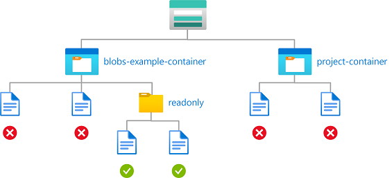

Storage Blob Data Owner

```
(
 (
  !(ActionMatches{'Microsoft.Storage/storageAccounts/blobServices/containers/blobs/read'} AND NOT SubOperationMatches{'Blob.List'})
  AND
  !(ActionMatches{'Microsoft.Storage/storageAccounts/blobServices/containers/blobs/runAsSuperUser/action'})
 )
 OR 
 (
  @Resource[Microsoft.Storage/storageAccounts/blobServices/containers:name] StringEquals 'blobs-example-container'
  AND
  @Resource[Microsoft.Storage/storageAccounts/blobServices/containers/blobs:path] StringLike 'readonly/*'
 )
)
```

Storage Blob Data Reader, Storage Blob Data Contributor

```
(
 (
  !(ActionMatches{'Microsoft.Storage/storageAccounts/blobServices/containers/blobs/read'} AND NOT SubOperationMatches{'Blob.List'})
 )
 OR 
 (
  @Resource[Microsoft.Storage/storageAccounts/blobServices/containers:name] StringEquals 'blobs-example-container'
  AND
  @Resource[Microsoft.Storage/storageAccounts/blobServices/containers/blobs:path] StringLike 'readonly/*'
 )
)
```

#### Azure portal

Here are the settings to add this condition using the Azure portal.

> [!div class="mx-tableFixed"]
> | Condition #1 | Setting |
> | --- | --- |
> | Actions | [Read a blob](storage-auth-abac-attributes.md#read-a-blob)<br/>[All data operations for accounts with hierarchical namespace enabled](storage-auth-abac-attributes.md#all-data-operations-for-accounts-with-hierarchical-namespace-enabled) (if applicable) |
> | Attribute source | [Resource](../../role-based-access-control/conditions-format.md#resource-attributes) |
> | Attribute | [Container name](storage-auth-abac-attributes.md#container-name) |
> | Operator | [StringEquals](../../role-based-access-control/conditions-format.md#stringequals) |
> | Value | {containerName} |
> | **Expression 2** |  |
> | Operator | And |
> | Attribute source | [Resource](../../role-based-access-control/conditions-format.md#resource-attributes) |
> | Attribute | [Blob path](storage-auth-abac-attributes.md#blob-path) |
> | Operator | [StringLike](../../role-based-access-control/conditions-format.md#stringlike) |
> | Value | {pathString} |

:::image type="content" source="./media/storage-auth-abac-examples/containers-path-read-portal.png" alt-text="Screenshot of condition editor in Azure portal showing read access to blobs in named containers with a path." lightbox="./media/storage-auth-abac-examples/containers-path-read-portal.png":::

#### Azure PowerShell

Here's how to add this condition using Azure PowerShell.

```azurepowershell
$condition = "((!(ActionMatches{'Microsoft.Storage/storageAccounts/blobServices/containers/blobs/read'} AND NOT SubOperationMatches{'Blob.List'}) AND !(ActionMatches{'Microsoft.Storage/storageAccounts/blobServices/containers/blobs/runAsSuperUser/action'})) OR (@Resource[Microsoft.Storage/storageAccounts/blobServices/containers:name] StringEquals 'blobs-example-container' AND @Resource[Microsoft.Storage/storageAccounts/blobServices/containers/blobs:path] StringLike 'readonly/*'))"
$testRa = Get-AzRoleAssignment -Scope $scope -RoleDefinitionName $roleDefinitionName -ObjectId $userObjectID
$testRa.Condition = $condition
$testRa.ConditionVersion = "2.0"
Set-AzRoleAssignment -InputObject $testRa -PassThru
```

Here's how to test this condition.

```azurepowershell
$grantedContainer = "blobs-example-container"
# Get new context for request
$bearerCtx = New-AzStorageContext -StorageAccountName $storageAccountName
# Try to get ungranted blob
$content = Get-AzStorageBlobContent -Container $grantedContainer -Blob "Ungranted.txt" -Context $bearerCtx
# Try to get granted blob
$content = Get-AzStorageBlobContent -Container $grantedContainer -Blob "readonly/Example6.txt" -Context $bearerCtx
```

### Example: Read or list blobs in named containers with a path

This condition allows read access and also list access to storage containers named blobs-example-container with a blob path of readonly/*. Condition #1 applies to read actions excluding list blobs. Condition #2 applies to list blobs. This condition is useful for sharing specific parts of storage containers for read or list access with other users in the subscription.

You must add this condition to any role assignments that include the following actions.

> [!div class="mx-tableFixed"]
> | Action | Notes |
> | --- | --- |
> | `Microsoft.Storage/storageAccounts/blobServices/containers/blobs/read` |  |
> | `Microsoft.Storage/storageAccounts/blobServices/containers/blobs/runAsSuperUser/action` | Add if role definition includes this action, such as Storage Blob Data Owner.<br/>Add if the storage accounts included in this condition have hierarchical namespace enabled or might be enabled in the future. |


Storage Blob Data Owner

```
(
 (
  !(ActionMatches{'Microsoft.Storage/storageAccounts/blobServices/containers/blobs/read'} AND NOT SubOperationMatches{'Blob.List'})
  AND
  !(ActionMatches{'Microsoft.Storage/storageAccounts/blobServices/containers/blobs/runAsSuperUser/action'})
 )
 OR 
 (
  @Resource[Microsoft.Storage/storageAccounts/blobServices/containers:name] StringEquals 'blobs-example-container'
  AND
  @Resource[Microsoft.Storage/storageAccounts/blobServices/containers/blobs:path] StringStartsWith 'readonly/'
 )
)
AND
(
 (
  !(ActionMatches{'Microsoft.Storage/storageAccounts/blobServices/containers/blobs/read'} AND SubOperationMatches{'Blob.List'})
  AND
  !(ActionMatches{'Microsoft.Storage/storageAccounts/blobServices/containers/blobs/runAsSuperUser/action'})
 )
 OR 
 (
  @Resource[Microsoft.Storage/storageAccounts/blobServices/containers:name] StringEquals 'blobs-example-container'
  AND
  @Request[Microsoft.Storage/storageAccounts/blobServices/containers/blobs:prefix] StringStartsWith 'readonly/'
 )
)
```

Storage Blob Data Reader, Storage Blob Data Contributor

```
(
 (
  !(ActionMatches{'Microsoft.Storage/storageAccounts/blobServices/containers/blobs/read'} AND NOT SubOperationMatches{'Blob.List'})
 )
 OR 
 (
  @Resource[Microsoft.Storage/storageAccounts/blobServices/containers:name] StringEquals 'blobs-example-container'
  AND
  @Resource[Microsoft.Storage/storageAccounts/blobServices/containers/blobs:path] StringStartsWith 'readonly/'
 )
)
AND
(
 (
  !(ActionMatches{'Microsoft.Storage/storageAccounts/blobServices/containers/blobs/read'} AND SubOperationMatches{'Blob.List'})
 )
 OR 
 (
  @Resource[Microsoft.Storage/storageAccounts/blobServices/containers:name] StringEquals 'blobs-example-container'
  AND
  @Request[Microsoft.Storage/storageAccounts/blobServices/containers/blobs:prefix] StringStartsWith 'readonly/'
 )
)
```

#### Azure portal

Here are the settings to add this condition using the Azure portal.

> [!NOTE]
> The Azure portal uses prefix='' to list blobs from container's root directory. After the condition is added with the list blobs operation using prefix StringStartsWith 'readonly/', targeted users won't be able to list blobs from container's root directory in the Azure portal.

> [!div class="mx-tableFixed"]
> | Condition #1 | Setting |
> | --- | --- |
> | Actions | [Read a blob](storage-auth-abac-attributes.md#read-a-blob)<br/>[All data operations for accounts with hierarchical namespace enabled](storage-auth-abac-attributes.md#all-data-operations-for-accounts-with-hierarchical-namespace-enabled) (if applicable) |
> | Attribute source | [Resource](../../role-based-access-control/conditions-format.md#resource-attributes) |
> | Attribute | [Container name](storage-auth-abac-attributes.md#container-name) |
> | Operator | [StringEquals](../../role-based-access-control/conditions-format.md#stringequals) |
> | Value | {containerName} |
> | **Expression 2** |  |
> | Operator | And |
> | Attribute source | [Resource](../../role-based-access-control/conditions-format.md#resource-attributes) |
> | Attribute | [Blob path](storage-auth-abac-attributes.md#blob-path) |
> | Operator | [StringStartsWith](../../role-based-access-control/conditions-format.md#stringstartswith) |
> | Value | {pathString} |

> [!div class="mx-tableFixed"]
> | Condition #2 | Setting |
> | --- | --- |
> | Actions | [List blobs](storage-auth-abac-attributes.md#list-blobs)<br/>[All data operations for accounts with hierarchical namespace enabled](storage-auth-abac-attributes.md#all-data-operations-for-accounts-with-hierarchical-namespace-enabled) (if applicable) |
> | Attribute source | [Resource](../../role-based-access-control/conditions-format.md#resource-attributes) |
> | Attribute | [Container name](storage-auth-abac-attributes.md#container-name) |
> | Operator | [StringEquals](../../role-based-access-control/conditions-format.md#stringequals) |
> | Value | {containerName} |
> | **Expression 2** |  |
> | Operator | And |
> | Attribute source | Request |
> | Attribute | [Blob prefix](storage-auth-abac-attributes.md#blob-prefix) |
> | Operator | [StringStartsWith](../../role-based-access-control/conditions-format.md#stringstartswith) |
> | Value | {pathString} |

### Example: Write blobs in named containers with a path

This condition allows a partner (a Microsoft Entra guest user) to drop files into storage containers named Contosocorp with a path of uploads/contoso/*. This condition is useful for allowing other users to put data in storage containers.

You must add this condition to any role assignments that include the following actions.

> [!div class="mx-tableFixed"]
> | Action | Notes |
> | --- | --- |
> | `Microsoft.Storage/storageAccounts/blobServices/containers/blobs/write` |  |
> | `Microsoft.Storage/storageAccounts/blobServices/containers/blobs/add/action` |  |
> | `Microsoft.Storage/storageAccounts/blobServices/containers/blobs/runAsSuperUser/action` | Add if role definition includes this action, such as Storage Blob Data Owner.<br/>Add if the storage accounts included in this condition have hierarchical namespace enabled or might be enabled in the future. |


Storage Blob Data Owner

```
(
 (
  !(ActionMatches{'Microsoft.Storage/storageAccounts/blobServices/containers/blobs/write'})
  AND
  !(ActionMatches{'Microsoft.Storage/storageAccounts/blobServices/containers/blobs/add/action'})
  AND
  !(ActionMatches{'Microsoft.Storage/storageAccounts/blobServices/containers/blobs/runAsSuperUser/action'})
 )
 OR 
 (
  @Resource[Microsoft.Storage/storageAccounts/blobServices/containers:name] StringEquals 'contosocorp'
  AND
  @Resource[Microsoft.Storage/storageAccounts/blobServices/containers/blobs:path] StringLike 'uploads/contoso/*'
 )
)
```

Storage Blob Data Contributor

```
(
 (
  !(ActionMatches{'Microsoft.Storage/storageAccounts/blobServices/containers/blobs/write'})
  AND
  !(ActionMatches{'Microsoft.Storage/storageAccounts/blobServices/containers/blobs/add/action'})
 )
 OR 
 (
  @Resource[Microsoft.Storage/storageAccounts/blobServices/containers:name] StringEquals 'contosocorp'
  AND
  @Resource[Microsoft.Storage/storageAccounts/blobServices/containers/blobs:path] StringLike 'uploads/contoso/*'
 )
)
```

#### Azure portal

Here are the settings to add this condition using the Azure portal.

> [!div class="mx-tableFixed"]
> | Condition #1 | Setting |
> | --- | --- |
> | Actions | [Write to a blob](storage-auth-abac-attributes.md#write-to-a-blob)<br/>[Create a blob or snapshot, or append data](storage-auth-abac-attributes.md#create-a-blob-or-snapshot-or-append-data)<br/>[All data operations for accounts with hierarchical namespace enabled](storage-auth-abac-attributes.md#all-data-operations-for-accounts-with-hierarchical-namespace-enabled) (if applicable) |
> | Attribute source | [Resource](../../role-based-access-control/conditions-format.md#resource-attributes) |
> | Attribute | [Container name](storage-auth-abac-attributes.md#container-name) |
> | Operator | [StringEquals](../../role-based-access-control/conditions-format.md#stringequals) |
> | Value | {containerName} |
> | **Expression 2** |  |
> | Operator | And |
> | Attribute source | [Resource](../../role-based-access-control/conditions-format.md#resource-attributes) |
> | Attribute | [Blob path](storage-auth-abac-attributes.md#blob-path) |
> | Operator | [StringLike](../../role-based-access-control/conditions-format.md#stringlike) |
> | Value | {pathString} |

:::image type="content" source="./media/storage-auth-abac-examples/containers-path-write-portal.png" alt-text="Screenshot of condition editor in Azure portal showing write access to blobs in named containers with a path." lightbox="./media/storage-auth-abac-examples/containers-path-write-portal.png":::

#### Azure PowerShell

Here's how to add this condition using Azure PowerShell.

```azurepowershell
$condition = "((!(ActionMatches{'Microsoft.Storage/storageAccounts/blobServices/containers/blobs/write'}) AND !(ActionMatches{'Microsoft.Storage/storageAccounts/blobServices/containers/blobs/add/action'}) AND !(ActionMatches{'Microsoft.Storage/storageAccounts/blobServices/containers/blobs/runAsSuperUser/action'})) OR (@Resource[Microsoft.Storage/storageAccounts/blobServices/containers:name] StringEquals 'contosocorp' AND @Resource[Microsoft.Storage/storageAccounts/blobServices/containers/blobs:path] StringLike 'uploads/contoso/*'))"
$testRa = Get-AzRoleAssignment -Scope $scope -RoleDefinitionName $roleDefinitionName -ObjectId $userObjectID
$testRa.Condition = $condition
$testRa.ConditionVersion = "2.0"
Set-AzRoleAssignment -InputObject $testRa -PassThru
```

Here's how to test this condition.

```azurepowershell
$grantedContainer = "contosocorp"
$localSrcFile = <pathToLocalFile>
$bearerCtx = New-AzStorageContext -StorageAccountName $storageAccountName
# Try to set ungranted blob
$content = Set-AzStorageBlobContent -Container $grantedContainer -Blob "Example7.txt" -Context $bearerCtx -File $localSrcFile
# Try to set granted blob
$content = Set-AzStorageBlobContent -Container $grantedContainer -Blob "uploads/contoso/Example7.txt" -Context $bearerCtx -File $localSrcFile
```

### Example: Read blobs with a blob index tag and a path

This condition allows a user to read blobs with a [blob index tag](storage-blob-index-how-to.md) key of Program, a value of Alpine, and a blob path of logs*. The blob path of logs* also includes the blob name.

You must add this condition to any role assignments that include the following action.

> [!div class="mx-tableFixed"]
> | Action | Notes |
> | --- | --- |
> | `Microsoft.Storage/storageAccounts/blobServices/containers/blobs/read` |  |
> | `Microsoft.Storage/storageAccounts/blobServices/containers/blobs/runAsSuperUser/action` | Add if role definition includes this action, such as Storage Blob Data Owner. |

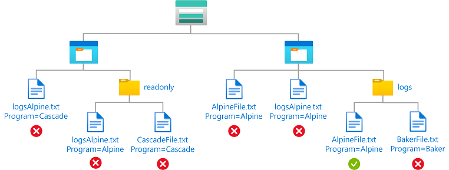

```
(
 (
  !(ActionMatches{'Microsoft.Storage/storageAccounts/blobServices/containers/blobs/read'} AND NOT SubOperationMatches{'Blob.List'})
 )
 OR 
 (
  @Resource[Microsoft.Storage/storageAccounts/blobServices/containers/blobs/tags:Program<$key_case_sensitive$>] StringEquals 'Alpine'
 )
)
AND
(
 (
  !(ActionMatches{'Microsoft.Storage/storageAccounts/blobServices/containers/blobs/read'} AND NOT SubOperationMatches{'Blob.List'})
 )
 OR 
 (
  @Resource[Microsoft.Storage/storageAccounts/blobServices/containers/blobs:path] StringLike 'logs*'
 )
)
```

#### Azure portal

Here are the settings to add this condition using the Azure portal.

> [!div class="mx-tableFixed"]
> | Condition #1 | Setting |
> | --- | --- |
> | Actions | [Read a blob](storage-auth-abac-attributes.md#read-a-blob) |
> | Attribute source | [Resource](../../role-based-access-control/conditions-format.md#resource-attributes) |
> | Attribute | [Blob index tags [Values in key]](storage-auth-abac-attributes.md#blob-index-tags-values-in-key) |
> | Key | {keyName} |
> | Operator | [StringEquals](../../role-based-access-control/conditions-format.md#stringequals) |
> | Value | {keyValue} |

:::image type="content" source="./media/storage-auth-abac-examples/blob-index-tags-path-read-condition-1-portal.png" alt-text="Screenshot of condition 1 editor in Azure portal showing read access to blobs with a blob index tag and a path." lightbox="./media/storage-auth-abac-examples/blob-index-tags-path-read-condition-1-portal.png":::

> [!div class="mx-tableFixed"]
> | Condition #2 | Setting |
> | --- | --- |
> | Actions | [Read a blob](storage-auth-abac-attributes.md#read-a-blob) |
> | Attribute source | [Resource](../../role-based-access-control/conditions-format.md#resource-attributes) |
> | Attribute | [Blob path](storage-auth-abac-attributes.md#blob-path) |
> | Operator | [StringLike](../../role-based-access-control/conditions-format.md#stringlike) |
> | Value | {pathString} |

:::image type="content" source="./media/storage-auth-abac-examples/blob-index-tags-path-read-condition-2-portal.png" alt-text="Screenshot of condition 2 editor in Azure portal showing read access to blobs with a blob index tag and a path." lightbox="./media/storage-auth-abac-examples/blob-index-tags-path-read-condition-2-portal.png":::

#### Azure PowerShell

Here's how to add this condition using Azure PowerShell.

```azurepowershell
$condition = "((!(ActionMatches{'Microsoft.Storage/storageAccounts/blobServices/containers/blobs/read'} AND NOT SubOperationMatches{'Blob.List'})) OR (@Resource[Microsoft.Storage/storageAccounts/blobServices/containers/blobs/tags:Program<`$key_case_sensitive`$>] StringEquals 'Alpine')) AND ((!(ActionMatches{'Microsoft.Storage/storageAccounts/blobServices/containers/blobs/read'} AND NOT SubOperationMatches{'Blob.List'})) OR (@Resource[Microsoft.Storage/storageAccounts/blobServices/containers/blobs:path] StringLike 'logs*'))"
$testRa = Get-AzRoleAssignment -Scope $scope -RoleDefinitionName $roleDefinitionName -ObjectId $userObjectID
$testRa.Condition = $condition
$testRa.ConditionVersion = "2.0"
Set-AzRoleAssignment -InputObject $testRa -PassThru
```

Here's how to test this condition.

```azurepowershell
$grantedContainer = "contosocorp"
# Get new context for request
$bearerCtx = New-AzStorageContext -StorageAccountName $storageAccountName
# Try to get ungranted blobs
# Wrong name but right tags
$content = Get-AzStorageBlobContent -Container $grantedContainer -Blob "AlpineFile.txt" -Context $bearerCtx
# Right name but wrong tags
$content = Get-AzStorageBlobContent -Container $grantedContainer -Blob "logsAlpine.txt" -Context $bearerCtx
# Try to get granted blob
$content = Get-AzStorageBlobContent -Container $grantedContainer -Blob "logs/AlpineFile.txt" -Context $bearerCtx
```

## Blob versions or blob snapshots

This section includes examples showing how to restrict access to objects based on the blob version or snapshot.

### Example: Read only current blob versions

This condition allows a user to only read current blob versions. The user cannot read other blob versions.

You must add this condition to any role assignments that include the following actions.

> [!div class="mx-tableFixed"]
> | Action | Notes |
> | --- | --- |
> | `Microsoft.Storage/storageAccounts/blobServices/containers/blobs/read` |  |
> | `Microsoft.Storage/storageAccounts/blobServices/containers/blobs/runAsSuperUser/action` | Add if role definition includes this action, such as Storage Blob Data Owner. |

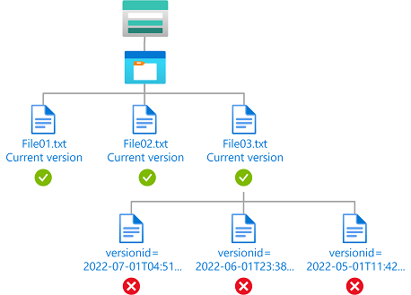

Storage Blob Data Owner

```
(
 (
  !(ActionMatches{'Microsoft.Storage/storageAccounts/blobServices/containers/blobs/read'} AND NOT SubOperationMatches{'Blob.List'})
  AND
  !(ActionMatches{'Microsoft.Storage/storageAccounts/blobServices/containers/blobs/runAsSuperUser/action'})
 )
 OR 
 (
  @Resource[Microsoft.Storage/storageAccounts/blobServices/containers/blobs:isCurrentVersion] BoolEquals true
 )
)
```

Storage Blob Data Reader, Storage Blob Data Contributor

```
(
 (
  !(ActionMatches{'Microsoft.Storage/storageAccounts/blobServices/containers/blobs/read'} AND NOT SubOperationMatches{'Blob.List'})
 )
 OR 
 (
  @Resource[Microsoft.Storage/storageAccounts/blobServices/containers/blobs:isCurrentVersion] BoolEquals true
 )
)
```

#### Azure portal

Here are the settings to add this condition using the Azure portal.

> [!div class="mx-tableFixed"]
> | Condition #1 | Setting |
> | --- | --- |
> | Actions | [Read a blob](storage-auth-abac-attributes.md#read-a-blob)<br/>[All data operations for accounts with hierarchical namespace enabled](storage-auth-abac-attributes.md#all-data-operations-for-accounts-with-hierarchical-namespace-enabled) (if applicable) |
> | Attribute source | [Resource](../../role-based-access-control/conditions-format.md#resource-attributes) |
> | Attribute | [Is Current Version](storage-auth-abac-attributes.md#is-current-version) |
> | Operator | [BoolEquals](../../role-based-access-control/conditions-format.md#boolean-comparison-operators) |
> | Value | True |

### Example: Read current blob versions and a specific blob version

This condition allows a user to read current blob versions as well as read blobs with a version ID of 2022-06-01T23:38:32.8883645Z. The user cannot read other blob versions. The [Version ID](storage-auth-abac-attributes.md#version-id) attribute is available only for storage accounts where hierarchical namespace is not enabled.

You must add this condition to any role assignments that include the following action.

> [!div class="mx-tableFixed"]
> | Action | Notes |
> | --- | --- |
> | `Microsoft.Storage/storageAccounts/blobServices/containers/blobs/read` |  |

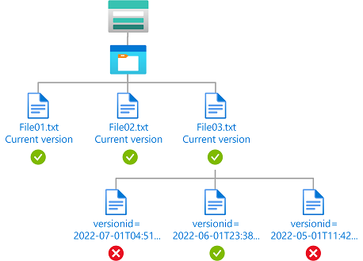

```
(
 (
  !(ActionMatches{'Microsoft.Storage/storageAccounts/blobServices/containers/blobs/read'} AND NOT SubOperationMatches{'Blob.List'})
 )
 OR 
 (
  @Request[Microsoft.Storage/storageAccounts/blobServices/containers/blobs:versionId] DateTimeEquals '2022-06-01T23:38:32.8883645Z'
  OR
  @Resource[Microsoft.Storage/storageAccounts/blobServices/containers/blobs:isCurrentVersion] BoolEquals true
 )
)
```

#### Azure portal

Here are the settings to add this condition using the Azure portal.

> [!div class="mx-tableFixed"]
> | Condition #1 | Setting |
> | --- | --- |
> | Actions | [Read a blob](storage-auth-abac-attributes.md#read-a-blob) |
> | Attribute source | Request |
> | Attribute | [Version ID](storage-auth-abac-attributes.md#version-id) |
> | Operator | [DateTimeEquals](../../role-based-access-control/conditions-format.md#datetime-comparison-operators) |
> | Value | &lt;blobVersionId&gt; |
> | **Expression 2** |  |
> | Operator | Or |
> | Attribute source | [Resource](../../role-based-access-control/conditions-format.md#resource-attributes) |
> | Attribute | [Is Current Version](storage-auth-abac-attributes.md#is-current-version) |
> | Operator | [BoolEquals](../../role-based-access-control/conditions-format.md#boolean-comparison-operators) |
> | Value | True |

### Example: Delete old blob versions

This condition allows a user to delete versions of a blob that are older than 06/01/2022 to perform clean up. The [Version ID](storage-auth-abac-attributes.md#version-id) attribute is available only for storage accounts where hierarchical namespace is not enabled.

You must add this condition to any role assignments that include the following actions.

> [!div class="mx-tableFixed"]
> | Action | Notes |
> | --- | --- |
> | `Microsoft.Storage/storageAccounts/blobServices/containers/blobs/delete` |  |
> | `Microsoft.Storage/storageAccounts/blobServices/containers/blobs/deleteBlobVersion/action` |  |

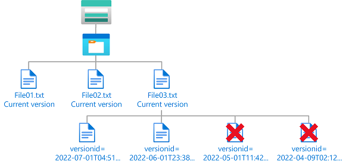

```
(
 (
  !(ActionMatches{'Microsoft.Storage/storageAccounts/blobServices/containers/blobs/delete'})
  AND
  !(ActionMatches{'Microsoft.Storage/storageAccounts/blobServices/containers/blobs/deleteBlobVersion/action'})
 )
 OR 
 (
  @Request[Microsoft.Storage/storageAccounts/blobServices/containers/blobs:versionId] DateTimeLessThan '2022-06-01T00:00:00.0Z'
 )
)
```

#### Azure portal

Here are the settings to add this condition using the Azure portal.

> [!div class="mx-tableFixed"]
> | Condition #1 | Setting |
> | --- | --- |
> | Actions | [Delete a blob](storage-auth-abac-attributes.md#delete-a-blob)<br/>[Delete a version of a blob](storage-auth-abac-attributes.md#delete-a-version-of-a-blob) |
> | Attribute source | Request |
> | Attribute | [Version ID](storage-auth-abac-attributes.md#version-id) |
> | Operator | [DateTimeLessThan](../../role-based-access-control/conditions-format.md#datetime-comparison-operators) |
> | Value | &lt;blobVersionId&gt; |

### Example: Read current blob versions and any blob snapshots

This condition allows a user to read current blob versions and any blob snapshots. The [Version ID](storage-auth-abac-attributes.md#version-id) attribute is available only for storage accounts where hierarchical namespace is not enabled. The [Snapshot](storage-auth-abac-attributes.md#snapshot) attribute is available for storage accounts where hierarchical namespace is not enabled and currently in preview for storage accounts where hierarchical namespace is enabled.

You must add this condition to any role assignments that include the following action.

> [!div class="mx-tableFixed"]
> | Action | Notes |
> | --- | --- |
> | `Microsoft.Storage/storageAccounts/blobServices/containers/blobs/read` |  |
> | `Microsoft.Storage/storageAccounts/blobServices/containers/blobs/runAsSuperUser/action` | Add if role definition includes this action, such as Storage Blob Data Owner. |

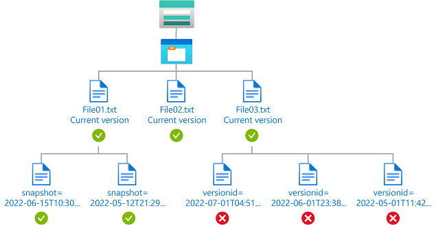

Storage Blob Data Owner

```
(
 (
  !(ActionMatches{'Microsoft.Storage/storageAccounts/blobServices/containers/blobs/read'} AND NOT SubOperationMatches{'Blob.List'})
  AND
  !(ActionMatches{'Microsoft.Storage/storageAccounts/blobServices/containers/blobs/runAsSuperUser/action'})
 )
 OR 
 (
  Exists @Request[Microsoft.Storage/storageAccounts/blobServices/containers/blobs:snapshot]
  OR
  @Resource[Microsoft.Storage/storageAccounts/blobServices/containers/blobs:isCurrentVersion] BoolEquals true
 )
)
```

Storage Blob Data Reader, Storage Blob Data Contributor

```
(
 (
  !(ActionMatches{'Microsoft.Storage/storageAccounts/blobServices/containers/blobs/read'} AND NOT SubOperationMatches{'Blob.List'})
 )
 OR 
 (
  Exists @Request[Microsoft.Storage/storageAccounts/blobServices/containers/blobs:snapshot]
  OR
  @Resource[Microsoft.Storage/storageAccounts/blobServices/containers/blobs:isCurrentVersion] BoolEquals true
 )
)
```

#### Azure portal

Here are the settings to add this condition using the Azure portal.

> [!div class="mx-tableFixed"]
> | Condition #1 | Setting |
> | --- | --- |
> | Actions | [Read a blob](storage-auth-abac-attributes.md#read-a-blob)<br/>[All data operations for accounts with hierarchical namespace enabled](storage-auth-abac-attributes.md#all-data-operations-for-accounts-with-hierarchical-namespace-enabled) (if applicable) |
> | Attribute source | Request |
> | Attribute | [Snapshot](storage-auth-abac-attributes.md#snapshot) |
> | Exists | [Checked](../../role-based-access-control/conditions-format.md#exists) |
> | **Expression 2** |  |
> | Operator | Or |
> | Attribute source | [Resource](../../role-based-access-control/conditions-format.md#resource-attributes) |
> | Attribute | [Is Current Version](storage-auth-abac-attributes.md#is-current-version) |
> | Operator | [BoolEquals](../../role-based-access-control/conditions-format.md#boolean-comparison-operators) |
> | Value | True |

## Hierarchical namespace

This section includes examples showing how to restrict access to objects based on whether hierarchical namespace is enabled for a storage account.

### Example: Read only storage accounts with hierarchical namespace enabled

This condition allows a user to only read blobs in storage accounts with [hierarchical namespace](data-lake-storage-namespace.md) enabled. This condition is applicable only at resource group scope or above.

You must add this condition to any role assignments that include the following actions.

> [!div class="mx-tableFixed"]
> | Action | Notes |
> | --- | --- |
> | `Microsoft.Storage/storageAccounts/blobServices/containers/blobs/read` |  |
> | `Microsoft.Storage/storageAccounts/blobServices/containers/blobs/runAsSuperUser/action` | Add if role definition includes this action, such as Storage Blob Data Owner. |

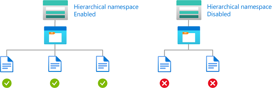

Storage Blob Data Owner

```
(
 (
  !(ActionMatches{'Microsoft.Storage/storageAccounts/blobServices/containers/blobs/read'} AND NOT SubOperationMatches{'Blob.List'})
  AND
  !(ActionMatches{'Microsoft.Storage/storageAccounts/blobServices/containers/blobs/runAsSuperUser/action'})
 )
 OR 
 (
  @Resource[Microsoft.Storage/storageAccounts:isHnsEnabled] BoolEquals true
 )
)
```

Storage Blob Data Reader, Storage Blob Data Contributor

```
(
 (
  !(ActionMatches{'Microsoft.Storage/storageAccounts/blobServices/containers/blobs/read'} AND NOT SubOperationMatches{'Blob.List'})
 )
 OR 
 (
  @Resource[Microsoft.Storage/storageAccounts:isHnsEnabled] BoolEquals true
 )
)
```

#### Azure portal

Here are the settings to add this condition using the Azure portal.

> [!div class="mx-tableFixed"]
> | Condition #1 | Setting |
> | --- | --- |
> | Actions | [Read a blob](storage-auth-abac-attributes.md#read-a-blob)<br/>[All data operations for accounts with hierarchical namespace enabled](storage-auth-abac-attributes.md#all-data-operations-for-accounts-with-hierarchical-namespace-enabled) (if applicable) |
> | Attribute source | [Resource](../../role-based-access-control/conditions-format.md#resource-attributes) |
> | Attribute | [Is hierarchical namespace enabled](storage-auth-abac-attributes.md#is-hierarchical-namespace-enabled) |
> | Operator | [BoolEquals](../../role-based-access-control/conditions-format.md#boolean-comparison-operators) |
> | Value | True |

## Encryption scope

This section includes examples showing how to restrict access to objects with an approved encryption scope.

### Example: Read blobs with specific encryption scopes

This condition allows a user to read blobs encrypted with encryption scope `validScope1` or `validScope2`.

You must add this condition to any role assignments that include the following action.

> [!div class="mx-tableFixed"]
> | Action | Notes |
> | --- | --- |
> | `Microsoft.Storage/storageAccounts/blobServices/containers/blobs/read` |  |
> | `Microsoft.Storage/storageAccounts/blobServices/containers/blobs/runAsSuperUser/action` | Add if role definition includes this action, such as Storage Blob Data Owner. |

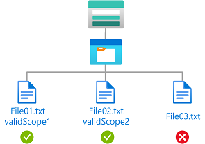

```
(
 (
  !(ActionMatches{'Microsoft.Storage/storageAccounts/blobServices/containers/blobs/read'} AND NOT SubOperationMatches{'Blob.List'})
 )
 OR 
 (
  @Resource[Microsoft.Storage/storageAccounts/encryptionScopes:name] ForAnyOfAnyValues:StringEquals {'validScope1', 'validScope2'}
 )
)
```

#### Azure portal

Here are the settings to add this condition using the Azure portal.

> [!div class="mx-tableFixed"]
> | Condition #1 | Setting |
> | --- | --- |
> | Actions | [Read a blob](storage-auth-abac-attributes.md#read-a-blob) |
> | Attribute source | [Resource](../../role-based-access-control/conditions-format.md#resource-attributes) |
> | Attribute | [Encryption scope name](storage-auth-abac-attributes.md#encryption-scope-name) |
> | Operator | [ForAnyOfAnyValues:StringEquals](../../role-based-access-control/conditions-format.md#foranyofanyvalues) |
> | Value | &lt;scopeName&gt; |

### Example: Read or write blobs in named storage account with specific encryption scope

This condition allows a user to read or write blobs in a storage account named `sampleaccount` and encrypted with encryption scope `ScopeCustomKey1`. If blobs are not encrypted or decrypted with `ScopeCustomKey1`, request will return forbidden.

You must add this condition to any role assignments that include the following actions.

> [!div class="mx-tableFixed"]
> | Action | Notes |
> | --- | --- |
> | `Microsoft.Storage/storageAccounts/blobServices/containers/blobs/read` |  |
> | `Microsoft.Storage/storageAccounts/blobServices/containers/blobs/write` |  |
> | `Microsoft.Storage/storageAccounts/blobServices/containers/blobs/add/action` |  |
> | `Microsoft.Storage/storageAccounts/blobServices/containers/blobs/runAsSuperUser/action` | Add if role definition includes this action, such as Storage Blob Data Owner. |

> [!NOTE]
> Since encryption scopes for different storage accounts could be different, it's recommended to use the `storageAccounts:name` attribute with the `encryptionScopes:name` attribute to restrict the specific encryption scope to be allowed.

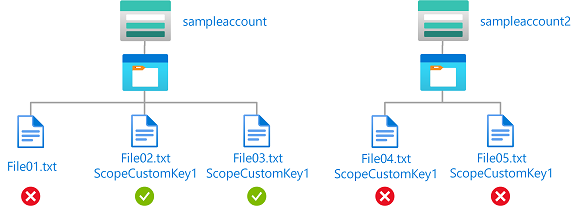

```
(
 (
  !(ActionMatches{'Microsoft.Storage/storageAccounts/blobServices/containers/blobs/read'} AND NOT SubOperationMatches{'Blob.List'})
  AND
  !(ActionMatches{'Microsoft.Storage/storageAccounts/blobServices/containers/blobs/write'})
  AND
  !(ActionMatches{'Microsoft.Storage/storageAccounts/blobServices/containers/blobs/add/action'})
 )
 OR 
 (
  @Resource[Microsoft.Storage/storageAccounts:name] StringEquals 'sampleaccount'
  AND
  @Resource[Microsoft.Storage/storageAccounts/encryptionScopes:name] ForAnyOfAnyValues:StringEquals {'ScopeCustomKey1'}
 )
)
```

#### Azure portal

Here are the settings to add this condition using the Azure portal.

> [!div class="mx-tableFixed"]
> | Condition #1 | Setting |
> | --- | --- |
> | Actions | [Read a blob](storage-auth-abac-attributes.md#read-a-blob)<br/>[Write to a blob](storage-auth-abac-attributes.md#write-to-a-blob)<br/>[Create a blob or snapshot, or append data](storage-auth-abac-attributes.md#create-a-blob-or-snapshot-or-append-data) |
> | Attribute source | [Resource](../../role-based-access-control/conditions-format.md#resource-attributes) |
> | Attribute | [Account name](storage-auth-abac-attributes.md#account-name) |
> | Operator | [StringEquals](../../role-based-access-control/conditions-format.md#stringequals) |
> | Value | &lt;accountName&gt; |
> | **Expression 2** |  |
> | Operator | And |
> | Attribute source | [Resource](../../role-based-access-control/conditions-format.md#resource-attributes) |
> | Attribute | [Encryption scope name](storage-auth-abac-attributes.md#encryption-scope-name) |
> | Operator | [ForAnyOfAnyValues:StringEquals](../../role-based-access-control/conditions-format.md#foranyofanyvalues) |
> | Value | &lt;scopeName&gt; |

## Principal attributes

This section includes examples showing how to restrict access to objects based on custom security principals.

### Example: Read or write blobs based on blob index tags and custom security attributes

This condition allows read or write access to blobs if the user has a [custom security attribute](../../active-directory/fundamentals/custom-security-attributes-overview.md) that matches the [blob index tag](storage-blob-index-how-to.md).

For example, if Brenda has the attribute `Project=Baker`, she can only read or write blobs with the `Project=Baker` blob index tag. Similarly, Chandra can only read or write blobs with `Project=Cascade`.

You must add this condition to any role assignments that include the following actions.

> [!div class="mx-tableFixed"]
> | Action | Notes |
> | --- | --- |
> | `Microsoft.Storage/storageAccounts/blobServices/containers/blobs/read` |  |
> | `Microsoft.Storage/storageAccounts/blobServices/containers/blobs/write` |  |
> | `Microsoft.Storage/storageAccounts/blobServices/containers/blobs/add/action` |  |
> | `Microsoft.Storage/storageAccounts/blobServices/containers/blobs/runAsSuperUser/action` | Add if role definition includes this action, such as Storage Blob Data Owner. |

For more information, see [Allow read access to blobs based on tags and custom security attributes](../../role-based-access-control/conditions-custom-security-attributes.md).

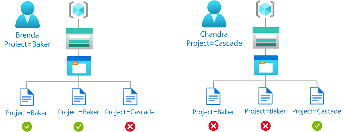

```
(
 (
  !(ActionMatches{'Microsoft.Storage/storageAccounts/blobServices/containers/blobs/read'} AND NOT SubOperationMatches{'Blob.List'})
 )
 OR 
 (
  @Principal[Microsoft.Directory/CustomSecurityAttributes/Id:Engineering_Project] StringEquals @Resource[Microsoft.Storage/storageAccounts/blobServices/containers/blobs/tags:Project<$key_case_sensitive$>]
 )
)
AND
(
 (
  !(ActionMatches{'Microsoft.Storage/storageAccounts/blobServices/containers/blobs/write'} AND SubOperationMatches{'Blob.Write.WithTagHeaders'})
  AND
  !(ActionMatches{'Microsoft.Storage/storageAccounts/blobServices/containers/blobs/add/action'} AND SubOperationMatches{'Blob.Write.WithTagHeaders'})
 )
 OR 
 (
  @Principal[Microsoft.Directory/CustomSecurityAttributes/Id:Engineering_Project] StringEquals @Request[Microsoft.Storage/storageAccounts/blobServices/containers/blobs/tags:Project<$key_case_sensitive$>]
 )
)
```

#### Azure portal

Here are the settings to add this condition using the Azure portal.

> [!div class="mx-tableFixed"]
> | Condition #1 | Setting |
> | --- | --- |
> | Actions | [Read a blob conditions](storage-auth-abac-attributes.md#read-content-from-a-blob-with-tag-conditions) |
> | Attribute source | [Principal](../../role-based-access-control/conditions-format.md#principal-attributes) |
> | Attribute | &lt;attributeset&gt;_&lt;key&gt; |
> | Operator | [StringEquals](../../role-based-access-control/conditions-format.md#stringequals) |
> | Option | Attribute |
> | Attribute source | [Resource](../../role-based-access-control/conditions-format.md#resource-attributes) |
> | Attribute | [Blob index tags [Values in key]](storage-auth-abac-attributes.md#blob-index-tags-values-in-key) |
> | Key | &lt;key&gt; |

> [!div class="mx-tableFixed"]
> | Condition #2 | Setting |
> | --- | --- |
> | Actions | [Write to a blob with blob index tags](storage-auth-abac-attributes.md#write-to-a-blob-with-blob-index-tags)<br/>[Write to a blob with blob index tags](storage-auth-abac-attributes.md#write-to-a-blob-with-blob-index-tags) |
> | Attribute source | [Principal](../../role-based-access-control/conditions-format.md#principal-attributes) |
> | Attribute | &lt;attributeset&gt;_&lt;key&gt; |
> | Operator | [StringEquals](../../role-based-access-control/conditions-format.md#stringequals) |
> | Option | Attribute |
> | Attribute source | Request |
> | Attribute | [Blob index tags [Values in key]](storage-auth-abac-attributes.md#blob-index-tags-values-in-key) |
> | Key | &lt;key&gt; |

### Example: Read blobs based on blob index tags and multi-value custom security attributes

This condition allows read access to blobs if the user has a [custom security attribute](../../active-directory/fundamentals/custom-security-attributes-overview.md) with any values that matches the [blob index tag](storage-blob-index-how-to.md).

For example, if Chandra has the Project attribute with the values Baker and Cascade, she can only read blobs with the `Project=Baker` or `Project=Cascade` blob index tag.

You must add this condition to any role assignments that include the following action.

> [!div class="mx-tableFixed"]
> | Action | Notes |
> | --- | --- |
> | `Microsoft.Storage/storageAccounts/blobServices/containers/blobs/read` |  |
> | `Microsoft.Storage/storageAccounts/blobServices/containers/blobs/runAsSuperUser/action` | Add if role definition includes this action, such as Storage Blob Data Owner. |

For more information, see [Allow read access to blobs based on tags and custom security attributes](../../role-based-access-control/conditions-custom-security-attributes.md).


```
(
 (
  !(ActionMatches{'Microsoft.Storage/storageAccounts/blobServices/containers/blobs/read'} AND NOT SubOperationMatches{'Blob.List'})
 )
 OR 
 (
  @Resource[Microsoft.Storage/storageAccounts/blobServices/containers/blobs/tags:Project<$key_case_sensitive$>] ForAnyOfAnyValues:StringEquals @Principal[Microsoft.Directory/CustomSecurityAttributes/Id:Engineering_Project]
 )
)
```

#### Azure portal

Here are the settings to add this condition using the Azure portal.

> [!div class="mx-tableFixed"]
> | Condition #1 | Setting |
> | --- | --- |
> | Actions | [Read a blob conditions](storage-auth-abac-attributes.md#read-content-from-a-blob-with-tag-conditions) |
> | Attribute source | [Resource](../../role-based-access-control/conditions-format.md#resource-attributes) |
> | Attribute | [Blob index tags [Values in key]](storage-auth-abac-attributes.md#blob-index-tags-values-in-key) |
> | Key | &lt;key&gt; |
> | Operator | [ForAnyOfAnyValues:StringEquals](../../role-based-access-control/conditions-format.md#foranyofanyvalues) |
> | Option | Attribute |
> | Attribute source | [Principal](../../role-based-access-control/conditions-format.md#principal-attributes) |
> | Attribute | &lt;attributeset&gt;_&lt;key&gt; |

## Environment attributes

This section includes examples showing how to restrict access to objects based on the network environment or the current date and time.

### Example: Allow read access to blobs after a specific date and time

This condition allows read access to blob container `container1` only after 1 PM on May 1, 2023 Universal Coordinated Time (UTC).

There are two potential actions for reading existing blobs. To make this condition effective for principals that have multiple role assignments, you must add this condition to all role assignments that include any of the following actions.

> [!div class="mx-tableFixed"]
> | Action | Notes |
> | --- | --- |
> | `Microsoft.Storage/storageAccounts/blobServices/containers/blobs/read` |  |
> | `Microsoft.Storage/storageAccounts/blobServices/containers/blobs/runAsSuperUser/action` | Add if role definition includes this action, such as Storage Blob Data Owner. |

The condition can be added to a role assignment using either the Azure portal or Azure PowerShell. The portal has two tools for building ABAC conditions - the visual editor and the code editor. You can switch between the two editors in the Azure portal to see your conditions in different views. Switch between the **Visual editor** tab and the **Code editor** tabs below to view the examples for your preferred portal editor.

# [Portal: Visual editor](#tab/portal-visual-editor)

#### Add action

Select **Add action**, then select only the **Read a blob** suboperation as shown in the following table.

| Action                                    | Suboperation |
| ----------------------------------------- | ------------ |
| All read operations                       | Read a blob  |

Do not select the top-level **All read operations** action or any other suboperations as shown in the following image:

:::image type="content" source="./media/storage-auth-abac-examples/environ-action-select-read-a-blob-portal.png" alt-text="Screenshot of condition editor in Azure portal showing selection of just the read operation." lightbox="./media/storage-auth-abac-examples/environ-action-select-read-a-blob-portal.png":::

#### Build expression

Use the values in the following table to build the expression portion of the condition:

> | Setting | Value |
> | ------- | ----- |
> | Attribute source | [Resource](../../role-based-access-control/conditions-format.md#resource-attributes) |
> | Attribute | [Container name](storage-auth-abac-attributes.md#container-name) |
> | Operator | [StringEquals](../../role-based-access-control/conditions-format.md#stringequals) |
> | Value | `container1` |
> | Logical operator | ['AND'](../../role-based-access-control/conditions-format.md#and) |
> | Attribute source | [Environment](../../role-based-access-control/conditions-format.md#environment-attributes) |
> | Attribute | [UtcNow](storage-auth-abac-attributes.md#utc-now) |
> | Operator | [DateTimeGreaterThan](../../role-based-access-control/conditions-format.md#datetime-comparison-operators) |
> | Value | `2023-05-01T13:00:00.000Z` |

The following image shows the condition after the settings have been entered into the Azure portal. Note that you must group expressions to ensure correct evaluation.

:::image type="content" source="./media/storage-auth-abac-examples/environ-utcnow-containers-read-portal.png" alt-text="Screenshot of the condition editor in the Azure portal showing read access allowed after a specific date and time." lightbox="./media/storage-auth-abac-examples/environ-utcnow-containers-read-portal.png":::

# [Portal: Code editor](#tab/portal-code-editor)

To add the condition using the code editor, copy the condition code sample below and paste it into the code editor.

```
( 
 ( 
  !(ActionMatches{'Microsoft.Storage/storageAccounts/blobServices/containers/blobs/read'}) 
 ) 
 OR  
 ( 
  @Resource[Microsoft.Storage/storageAccounts/blobServices/containers:name] StringEquals 'container1'
  AND 
  @Environment[UtcNow] DateTimeGreaterThan '2023-05-01T13:00:00.000Z' 
 ) 
) 
```

After entering your code, switch back to the visual editor to validate it.

# [PowerShell](#tab/azure-powershell)

Here's how to add this condition for the Storage Blob Data Reader role using Azure PowerShell.

```azurepowershell
$subId = "<your subscription id>"
$rgName = "<resource group name>"
$storageAccountName = "<storage account name>"
$roleDefinitionName = "Storage Blob Data Reader"
$userUpn = "<user UPN>"
$userObjectID = (Get-AzADUser -UserPrincipalName $userUpn).Id
$containerName = "container1"
$dateTime = "2023-05-01T13:00:00.000Z"
$scope = "/subscriptions/$subId/resourceGroups/$rgName/providers/Microsoft.Storage/storageAccounts/$storageAccountName"

$condition = `
"( `
 ( `
 !(ActionMatches{'Microsoft.Storage/storageAccounts/blobServices/containers/blobs/read'}) `
 ) `
 OR ` 
 ( `
  @Resource[Microsoft.Storage/storageAccounts/blobServices/containers:name] StringEquals '$containerName' `
  AND `
  @Environment[UtcNow] DateTimeGreaterThan '$dateTime' `
 ) `
)"

$testRa = Get-AzRoleAssignment -Scope $scope -RoleDefinitionName $roleDefinitionName -ObjectId $userObjectID
$testRa.Condition = $condition
$testRa.ConditionVersion = "2.0"
Set-AzRoleAssignment -InputObject $testRa -PassThru
```

---

### Example: Allow access to blobs in specific containers from a specific subnet

This condition allows read, write, add and delete access to blobs in `container1` only from subnet `default` on virtual network `virtualnetwork1`.

There are five potential actions for read, write, add and delete access to existing blobs. To make this condition effective for principals that have multiple role assignments, you must add this condition to all role assignments that include any of the following actions.

| Action | Notes |
| ------ | ----- |
| `Microsoft.Storage/storageAccounts/blobServices/containers/blobs/read`                  |  |
| `Microsoft.Storage/storageAccounts/blobServices/containers/blobs/write`                 |  |
| `Microsoft.Storage/storageAccounts/blobServices/containers/blobs/add/action`            |  |
| `Microsoft.Storage/storageAccounts/blobServices/containers/blobs/delete`                |  |
| `Microsoft.Storage/storageAccounts/blobServices/containers/blobs/runAsSuperUser/action` | Add if role definition includes this action, such as Storage Blob Data Owner. |

The condition can be added to a role assignment using either the Azure portal or Azure PowerShell. The portal has two tools for building ABAC conditions - the visual editor and the code editor. You can switch between the two editors in the Azure portal to see your conditions in different views. Switch between the **Visual editor** tab and the **Code editor** tabs below to view the examples for your preferred portal editor.

# [Portal: Visual editor](#tab/portal-visual-editor)

#### Add action

Select **Add action**, then select only the top-level actions shown in the following table.

| Action                                    | Suboperation |
| ----------------------------------------- | ------------ |
| All read operations                       | *n/a*        |
| Write to a blob                           | *n/a*        |
| Create a blob or snapshot, or append data | *n/a*        |
| Delete a blob                             | *n/a*        |

Do not select any individual suboperations as shown in the following image:

:::image type="content" source="./media/storage-auth-abac-examples/environ-private-endpoint-containers-select-read-write-delete-portal.png" alt-text="Screenshot of condition editor in Azure portal showing selection of read, write, add and delete operations." lightbox="./media/storage-auth-abac-examples/environ-private-endpoint-containers-select-read-write-delete-portal.png":::

#### Build expression

Use the values in the following table to build the expression portion of the condition:

> | Setting | Value |
> | ------- | ----- |
> | Attribute source | [Resource](../../role-based-access-control/conditions-format.md#resource-attributes) |
> | Attribute | [Container name](storage-auth-abac-attributes.md#container-name) |
> | Operator | [StringEquals](../../role-based-access-control/conditions-format.md#stringequals) |
> | Value | `container1` |
> | Logical operator | ['AND'](../../role-based-access-control/conditions-format.md#and) |
> | Attribute source | [Environment](../../role-based-access-control/conditions-format.md#environment-attributes) |
> | Attribute | [Subnet](storage-auth-abac-attributes.md#subnet) |
> | Operator | [StringEqualsIgnoreCase](../../role-based-access-control/conditions-format.md#stringequals) |
> | Value | `/subscriptions/<your subscription id>/resourceGroups/<resource group name>/providers/Microsoft.Network/virtualNetworks/virtualnetwork1/subnets/default` |

The following image shows the condition after the settings have been entered into the Azure portal. Note that you must group expressions to ensure correct evaluation.

:::image type="content" source="./media/storage-auth-abac-examples/environ-subnet-containers-read-write-delete-portal.png" alt-text="Screenshot of the condition editor in the Azure portal showing read access to specific containers allowed from a specific subnet." lightbox="./media/storage-auth-abac-examples/environ-subnet-containers-read-write-delete-portal.png":::

# [Portal: Code editor](#tab/portal-code-editor)

To add the condition using the code editor, copy the condition code sample below and paste it into the code editor.

```
(
 (
  !(ActionMatches{'Microsoft.Storage/storageAccounts/blobServices/containers/blobs/read'})
  AND
  !(ActionMatches{'Microsoft.Storage/storageAccounts/blobServices/containers/blobs/write'})
  AND
  !(ActionMatches{'Microsoft.Storage/storageAccounts/blobServices/containers/blobs/add/action'})
  AND
  !(ActionMatches{'Microsoft.Storage/storageAccounts/blobServices/containers/blobs/delete'})
 )
 OR
 (
  @Resource[Microsoft.Storage/storageAccounts/blobServices/containers:name]StringEquals 'container1'
  AND
  @Environment[Microsoft.Network/virtualNetworks/subnets] StringEqualsIgnoreCase '/subscriptions/<your subscription id>/resourceGroups/example-group/providers/Microsoft.Network/virtualNetworks/virtualnetwork1/subnets/default'
 )
)
```

After entering your code, switch back to the visual editor to validate it.

# [PowerShell](#tab/azure-powershell)

Here's how to add this condition for the Storage Blob Data Contributor role using Azure PowerShell.

```azurepowershell
$subId = "<your subscription id>"
$rgName = "<resource group name>"
$storageAccountName = "<storage account name>"
$roleDefinitionName = "Storage Blob Data Contributor"
$userUpn = "<user UPN>"
$userObjectID = (Get-AzADUser -UserPrincipalName $userUpn).Id
$containerName = "container1"
$vnetName = "virtualnetwork1"
$subnetName = "default"
$scope = "/subscriptions/$subId/resourceGroups/$rgName/providers/Microsoft.Storage/storageAccounts/$storageAccountName"

$condition = `
"( `
 ( `
  !(ActionMatches{'Microsoft.Storage/storageAccounts/blobServices/containers/blobs/read'}) `
  AND `
  !(ActionMatches{'Microsoft.Storage/storageAccounts/blobServices/containers/blobs/write'}) `
  AND `
  !(ActionMatches{'Microsoft.Storage/storageAccounts/blobServices/containers/blobs/add/action'}) `
  AND `
 !(ActionMatches{'Microsoft.Storage/storageAccounts/blobServices/containers/blobs/delete'}) `
 ) `
 OR ` 
 ( `
  @Resource[Microsoft.Storage/storageAccounts/blobServices/containers:name] StringEquals '$containerName' `
  AND `
  @Environment[Microsoft.Network/virtualNetworks/subnets] StringEqualsIgnoreCase '/subscriptions/$subId/resourceGroups/$rgName/providers/Microsoft.Network/virtualNetworks/$vnetName/subnets/$subnetName' `
 ) `
)"

$testRa = Get-AzRoleAssignment -Scope $scope -RoleDefinitionName $roleDefinitionName -ObjectId $userObjectID
$testRa.Condition = $condition
$testRa.ConditionVersion = "2.0"
Set-AzRoleAssignment -InputObject $testRa -PassThru
```

---

### Example: Require private link access to read blobs with high sensitivity

This condition requires requests to read blobs where blob index tag **sensitivity** has a value of `high` to be over a private link (any private link). This means all attempts to read highly sensitive blobs from the public internet will not be allowed. Users can read blobs from the public internet that have **sensitivity** set to some value other than `high`.

A truth table for this ABAC sample condition follows:

| Action      | Sensitivity | Private link | Access      |
|-------------|-------------|--------------|-------------|
| Read a blob | high        | Yes          | Allowed     |
| Read a blob | high        | No           | Not Allowed |
| Read a blob | NOT high    | Yes          | Allowed     |
| Read a blob | NOT high    | No           | Allowed     |

There are two potential actions for reading existing blobs. To make this condition effective for principals that have multiple role assignments, you must add this condition to all role assignments that include any of the following actions.

> | Action | Notes |
> | --- | --- |
> | `Microsoft.Storage/storageAccounts/blobServices/containers/blobs/read` |  |
> | `Microsoft.Storage/storageAccounts/blobServices/containers/blobs/runAsSuperUser/action` | Add if role definition includes this action, such as Storage Blob Data Owner. |

The condition can be added to a role assignment using either the Azure portal or Azure PowerShell. The portal has two tools for building ABAC conditions - the visual editor and the code editor. You can switch between the two editors in the Azure portal to see your conditions in different views. Switch between the **Visual editor** tab and the **Code editor** tabs below to view the examples for your preferred portal editor.

# [Portal: Visual editor](#tab/portal-visual-editor)

Here are the settings to add this condition using the visual condition editor in the Azure portal.

#### Add action

Select **Add action**, then select only the **Read a blob** suboperation as shown in the following table.

| Action                                    | Suboperation |
| ----------------------------------------- | ------------ |
| All read operations                       | Read a blob  |

Do not select the top-level **All read operations** action of any other suboperations as shown in the following image:

:::image type="content" source="./media/storage-auth-abac-examples/environ-action-select-read-a-blob-portal.png" alt-text="Screenshot of condition editor in Azure portal showing selection of just the read operation." lightbox="./media/storage-auth-abac-examples/environ-action-select-read-a-blob-portal.png":::

#### Build expression

Use the values in the following table to build the expression portion of the condition:

> | Group | Setting | Value |
> | ----- | ------- | ----- |
> | Group #1 | | |
> | | Attribute source | [Resource](../../role-based-access-control/conditions-format.md#resource-attributes) |
> | | Attribute | [Blob index tags [Values in key]](storage-auth-abac-attributes.md#container-name) |
> | | Key | `sensitivity` |
> | | Operator | [StringEquals](../../role-based-access-control/conditions-format.md#stringequals) |
> | | Value | `high` |
> | | Logical operator | 'AND' |
> | | Attribute source | [Environment](../../role-based-access-control/conditions-format.md#environment-attributes) |
> | | Attribute | [Is private link](storage-auth-abac-attributes.md#is-private-link) |
> | | Operator | [BoolEquals](../../role-based-access-control/conditions-format.md#stringequals) |
> | | Value | `True` |
> | End of Group #1 | | |
> | | Logical operator | ['OR'](../../role-based-access-control/conditions-format.md#or) |
> | | Attribute source | [Resource](../../role-based-access-control/conditions-format.md#resource-attributes) |
> | | Attribute | [Blob index tags [Values in key]](storage-auth-abac-attributes.md#container-name) |
> | | Key | `sensitivity` |
> | | Operator | [StringNotEquals](../../role-based-access-control/conditions-format.md#stringequals) |
> | | Value | `high` |

The following image shows the condition after the settings have been entered into the Azure portal. Note that you must group expressions to ensure correct evaluation.

:::image type="content" source="./media/storage-auth-abac-examples/environ-private-link-sensitive-read-portal.png" alt-text="Screenshot of the condition editor in the Azure portal showing read access requiring any private link for sensitive data." lightbox="./media/storage-auth-abac-examples/environ-private-link-sensitive-read-portal.png":::

# [Portal: Code editor](#tab/portal-code-editor)

To add the condition using the code editor, copy the condition code sample below and paste it into the code editor.

```
(
 (
  !(ActionMatches{'Microsoft.Storage/storageAccounts/blobServices/containers/blobs/read'} AND NOT SubOperationMatches{'Blob.List'})
 )
 OR
 (
  (
   @Resource[Microsoft.Storage/storageAccounts/blobServices/containers/blobs/tags:sensitivity<$key_case_sensitive$>] StringEquals 'high'
   AND
   @Environment[isPrivateLink] BoolEquals true
  )
  OR
  @Resource[Microsoft.Storage/storageAccounts/blobServices/containers/blobs/tags:sensitivity<$key_case_sensitive$>] StringNotEquals 'high'
 )
)
```

After entering your code, switch back to the visual editor to validate it.

# [PowerShell](#tab/azure-powershell)

Here's how to add this condition for the Storage Blob Data Reader role using Azure PowerShell.

```azurepowershell
$subId = "<your subscription id>"
$rgName = "<resource group name>"
$storageAccountName = "<storage account name>"
$roleDefinitionName = "Storage Blob Data Reader"
$userUpn = "<user UPN>"
$userObjectID = (Get-AzADUser -UserPrincipalName $userUpn).Id
$scope = "/subscriptions/$subId/resourceGroups/$rgName/providers/Microsoft.Storage/storageAccounts/$storageAccountName"

$condition = `
"( `
 ( `
  !(ActionMatches{'Microsoft.Storage/storageAccounts/blobServices/containers/blobs/read'} AND NOT SubOperationMatches{'Blob.List'}) `
 ) `
 OR `
 ( `
  ( `
   @Resource[Microsoft.Storage/storageAccounts/blobServices/containers/blobs/tags:sensitivity<`$key_case_sensitive`$>] StringEquals 'high' `
   AND `
   @Environment[isPrivateLink] BoolEquals true `
  ) `
  OR `
  @Resource[Microsoft.Storage/storageAccounts/blobServices/containers/blobs/tags:sensitivity<`$key_case_sensitive`$>] StringNotEquals 'high' `
 ) `
)"

$testRa = Get-AzRoleAssignment -Scope $scope -RoleDefinitionName $roleDefinitionName -ObjectId $userObjectID
$testRa.Condition = $condition
$testRa.ConditionVersion = "2.0"
Set-AzRoleAssignment -InputObject $testRa -PassThru
```

---

### Example: Allow access to a container only from a specific private endpoint

This condition requires that all read, write, add and delete operations for blobs in a storage container named `container1` be made through a private endpoint named `privateendpoint1`. For all other containers not named `container1`, access does not need to be through the private endpoint.

There are five potential actions for read, write and delete of existing blobs. To make this condition effective for principals that have multiple role assignments, you must add this condition to all role assignments that include any of the following actions.

| Action                                                                                  | Notes |
| --------------------------------------------------------------------------------------- | ----- |
| `Microsoft.Storage/storageAccounts/blobServices/containers/blobs/read`                  |       |
| `Microsoft.Storage/storageAccounts/blobServices/containers/blobs/write`                 |       |
| `Microsoft.Storage/storageAccounts/blobServices/containers/blobs/add/action`            |       |
| `Microsoft.Storage/storageAccounts/blobServices/containers/blobs/delete`                |       |
| `Microsoft.Storage/storageAccounts/blobServices/containers/blobs/runAsSuperUser/action` | Add if role definition includes this action, such as Storage Blob Data Owner.<br/>Add if the storage accounts included in this condition have hierarchical namespace enabled or might be enabled in the future. |

The condition can be added to a role assignment using either the Azure portal or Azure PowerShell. The portal has two tools for building ABAC conditions - the visual editor and the code editor. You can switch between the two editors in the Azure portal to see your conditions in different views. Switch between the **Visual editor** tab and the **Code editor** tabs below to view the examples for your preferred portal editor.

# [Portal: Visual editor](#tab/portal-visual-editor)

Here are the settings to add this condition using the visual condition editor in the Azure portal.

#### Add action

Select **Add action**, then select only the top-level actions shown in the following table.

| Action                                    | Suboperation |
| ----------------------------------------- | ------------ |
| All read operations                       | *n/a*        |
| Write to a blob                           | *n/a*        |
| Create a blob or snapshot, or append data | *n/a*        |
| Delete a blob                             | *n/a*        |

Do not select any individual suboperations as shown in the following image:

:::image type="content" source="./media/storage-auth-abac-examples/environ-private-endpoint-containers-select-read-write-delete-portal.png" alt-text="Screenshot of condition editor in Azure portal showing selection of read, write, add and delete operations." lightbox="./media/storage-auth-abac-examples/environ-private-endpoint-containers-select-read-write-delete-portal.png":::

#### Build expression

Use the values in the following table to build the expression portion of the condition:

> | Group | Setting | Value |
> | ----- | ------- | ----- |
> | Group #1 | | |
> | | Attribute source | [Resource](../../role-based-access-control/conditions-format.md#resource-attributes) |
> | | Attribute | [Container name](storage-auth-abac-attributes.md#container-name) |
> | | Operator | [StringEquals](../../role-based-access-control/conditions-format.md#stringequals) |
> | | Value | `container1` |
> | | Logical operator | 'AND' |
> | | Attribute source | [Environment](../../role-based-access-control/conditions-format.md#environment-attributes) |
> | | Attribute | [Private endpoint](storage-auth-abac-attributes.md#private-endpoint) |
> | | Operator | [StringEqualsIgnoreCase](../../role-based-access-control/conditions-format.md#stringequals) |
> | | Value | `/subscriptions/<your subscription id>/resourceGroups/<resource group name>/providers/Microsoft.Network/privateEndpoints/privateendpoint1` |
> | End of Group #1 | | |
> | | Logical operator | ['OR'](../../role-based-access-control/conditions-format.md#or) |
> | | Attribute source | [Resource](../../role-based-access-control/conditions-format.md#resource-attributes) |
> | | Attribute | [Container name](storage-auth-abac-attributes.md#container-name) |
> | | Operator | [StringNotEquals](../../role-based-access-control/conditions-format.md#stringnotequals) |
> | | Value | `container1` |

The following image shows the condition after the settings have been entered into the Azure portal. Note that you must group expressions to ensure correct evaluation.

:::image type="content" source="./media/storage-auth-abac-examples/environ-private-endpoint-containers-read-write-delete-portal.png" alt-text="Screenshot of condition editor in Azure portal showing read, write, or delete blobs in named containers with private endpoint environment attribute." lightbox="./media/storage-auth-abac-examples/environ-private-endpoint-containers-read-write-delete-portal.png":::

# [Portal: Code editor](#tab/portal-code-editor)

To add the condition using the code editor, choose one of the condition code samples below, depending on the role associated with the assignment.

**Storage Blob Data Owner:**

```
(
 (
  !(ActionMatches{'Microsoft.Storage/storageAccounts/blobServices/containers/blobs/read'})
  AND
  !(ActionMatches{'Microsoft.Storage/storageAccounts/blobServices/containers/blobs/write'})
  AND
  !(ActionMatches{'Microsoft.Storage/storageAccounts/blobServices/containers/blobs/add/action'})
  AND
  !(ActionMatches{'Microsoft.Storage/storageAccounts/blobServices/containers/blobs/delete'})
  AND
  !(ActionMatches{'Microsoft.Storage/storageAccounts/blobServices/containers/blobs/runAsSuperUser/action'})
 )
 OR
 (
  (
   @Resource[Microsoft.Storage/storageAccounts/blobServices/containers:name] StringEquals 'container1'
   AND
   @Environment[Microsoft.Network/privateEndpoints] StringEqualsIgnoreCase '/subscriptions/<your subscription id>/resourceGroups/example-group/providers/Microsoft.Network/privateEndpoints/privateendpoint1'
  )
  OR
  @Resource[Microsoft.Storage/storageAccounts/blobServices/containers:name] StringNotEquals 'container1'
 )
)
```

**Storage Blob Data Contributor:**

```
(
 (
  !(ActionMatches{'Microsoft.Storage/storageAccounts/blobServices/containers/blobs/read'})
  AND
  !(ActionMatches{'Microsoft.Storage/storageAccounts/blobServices/containers/blobs/write'})
  AND
  !(ActionMatches{'Microsoft.Storage/storageAccounts/blobServices/containers/blobs/add/action'})
  AND
  !(ActionMatches{'Microsoft.Storage/storageAccounts/blobServices/containers/blobs/delete'})
 )
 OR
 (
  (
   @Resource[Microsoft.Storage/storageAccounts/blobServices/containers:name] StringEquals 'container1'
   AND
   @Environment[Microsoft.Network/privateEndpoints] StringEqualsIgnoreCase '/subscriptions/<your subscription id>/resourceGroups/example-group/providers/Microsoft.Network/privateEndpoints/privateendpoint1'
  )
  OR
  @Resource[Microsoft.Storage/storageAccounts/blobServices/containers:name] StringNotEquals 'container1'
 )
)
```

After entering your code, switch back to the visual editor to validate it.

# [PowerShell](#tab/azure-powershell)

Here's how to add this condition for the Storage Blob Data Contributor role using Azure PowerShell.

```azurepowershell
$subId = "<your subscription id>"
$rgName = "<resource group name>"
$storageAccountName = "<storage account name>"
$roleDefinitionName = "Storage Blob Data Contributor"
$userUpn = "<user UPN>"
$userObjectID = (Get-AzADUser -UserPrincipalName $userUpn).Id
$containerName = "container1"
$privateEndpointName = "privateendpoint1"
$scope = "/subscriptions/$subId/resourceGroups/$rgName/providers/Microsoft.Storage/storageAccounts/$storageAccountName"

$condition = `
"( `
 ( `
  !(ActionMatches{'Microsoft.Storage/storageAccounts/blobServices/containers/blobs/read'}) `
  AND `
  !(ActionMatches{'Microsoft.Storage/storageAccounts/blobServices/containers/blobs/write'}) `
  AND `
  !(ActionMatches{'Microsoft.Storage/storageAccounts/blobServices/containers/blobs/add/action'}) `
  AND `
  !(ActionMatches{'Microsoft.Storage/storageAccounts/blobServices/containers/blobs/delete'}) `
 ) `
 OR `
 ( `
  ( `
   @Resource[Microsoft.Storage/storageAccounts/blobServices/containers:name] StringEquals '$containerName' `
   AND `
   @Environment[Microsoft.Network/privateEndpoints] StringEqualsIgnoreCase '/subscriptions/$subId/resourceGroups/$rgName/providers/Microsoft.Network/privateEndpoints/$privateEndpointName' `
  ) `
  OR `
  @Resource[Microsoft.Storage/storageAccounts/blobServices/containers:name] StringNotEquals '$containerName' `
 ) `
)"

$testRa = Get-AzRoleAssignment -Scope $scope -RoleDefinitionName $roleDefinitionName -ObjectId $userObjectID
$testRa.Condition = $condition
$testRa.ConditionVersion = "2.0"
Set-AzRoleAssignment -InputObject $testRa -PassThru
```

---

### Example: Allow read access to highly sensitive blob data only from a specific private endpoint and by users tagged for access

This condition requires that blobs with index tag **sensitivity** set to `high` can be read only by users that have a matching value for their **sensitivity** security attribute. Additionally, they must be accessed over a private endpoint named `privateendpoint1`. Blobs that have a different value for the **sensitivity** tag can be accessed over other endpoints or the Internet.

There are two potential actions for reading existing blobs. To make this condition effective for principals that have multiple role assignments, you must add this condition to all role assignments that include any of the following actions.

> | Action | Notes |
> | --- | --- |
> | `Microsoft.Storage/storageAccounts/blobServices/containers/blobs/read` |  |
> | `Microsoft.Storage/storageAccounts/blobServices/containers/blobs/runAsSuperUser/action` | Add if role definition includes this action, such as Storage Blob Data Owner. |

The condition can be added to a role assignment using either the Azure portal or Azure PowerShell. The portal has two tools for building ABAC conditions - the visual editor and the code editor. You can switch between the two editors in the Azure portal to see your conditions in different views. Switch between the **Visual editor** tab and the **Code editor** tabs below to view the examples for your preferred portal editor.

# [Portal: Visual editor](#tab/portal-visual-editor)

Here are the settings to add this condition using the visual condition editor in the Azure portal.

#### Add action

Select **Add action**, then select only the **Read a blob** suboperation as shown in the following table.

| Action                                    | Suboperation |
| ----------------------------------------- | ------------ |
| All read operations                       | Read a blob  |

Do not select the top-level action as shown in the following image:

:::image type="content" source="./media/storage-auth-abac-examples/environ-action-select-read-a-blob-portal.png" alt-text="Screenshot of condition editor in Azure portal showing selection of read a blob operation." lightbox="./media/storage-auth-abac-examples/environ-action-select-read-a-blob-portal.png":::

#### Build expression

Use the values in the following table to build the expression portion of the condition:

| Group | Setting | Value |
| ----- | ------- | ----- |
| Group #1 | | |
| | Attribute source | [Principal](../../role-based-access-control/conditions-format.md#principal-attributes) |
| | Attribute | &lt;attributeset&gt;_&lt;key&gt; |
| | Operator | [StringEquals](../../role-based-access-control/conditions-format.md#stringequals) |
| | Option | Attribute |
| | Logical operator | 'AND' |
| | Attribute source | [Resource](../../role-based-access-control/conditions-format.md#resource-attributes) |
| | Attribute | [Blob index tags [Values in key]](storage-auth-abac-attributes.md#blob-index-tags-values-in-key) |
| | Key | &lt;key&gt; |
| | Logical operator | 'AND' |
| | Attribute source | [Environment](../../role-based-access-control/conditions-format.md#environment-attributes) |
| | Attribute | [Private endpoint](storage-auth-abac-attributes.md#private-endpoint) |
| | Operator | [StringEqualsIgnoreCase](../../role-based-access-control/conditions-format.md#stringequals) |
| | Value | `/subscriptions/<your subscription id>/resourceGroups/<resource group name>/providers/Microsoft.Network/privateEndpoints/privateendpoint1` |
| End of Group #1 | | |
| | Logical operator | ['OR'](../../role-based-access-control/conditions-format.md#or) |
| | Attribute source | [Resource](../../role-based-access-control/conditions-format.md#resource-attributes) |
| | Attribute | [Blob index tags [Values in key]](storage-auth-abac-attributes.md#container-name) |
| | Key | `sensitivity` |
| | Operator | [StringNotEquals](../../role-based-access-control/conditions-format.md#stringequals) |
| | Value | `high` |

The following image shows the condition after the settings have been entered into the Azure portal. Note that you must group expressions to ensure correct evaluation.

:::image type="content" source="./media/storage-auth-abac-examples/environ-specific-private-link-sensitive-read-tagged-users-portal.png" alt-text="Screenshot of condition editor in Azure portal showing read access allowed over a specific private endpoint for tagged users." lightbox="./media/storage-auth-abac-examples/environ-specific-private-link-sensitive-read-tagged-users-portal.png":::

# [Portal: Code editor](#tab/portal-code-editor)

To add the condition using the code editor, copy the condition code sample below and paste it into the code editor.

```
(
 (
  !(ActionMatches{'Microsoft.Storage/storageAccounts/blobServices/containers/blobs/read'} AND NOT SubOperationMatches{'Blob.List'})
 )
 OR
 (
  (
   @Principal[Microsoft.Directory/CustomSecurityAttributes/Id:sensitivity] StringEqualsIgnoreCase @Resource[Microsoft.Storage/storageAccounts/blobServices/containers/blobs/tags:sensitivity<$key_case_sensitive$>]
   AND
   @Environment[Microsoft.Network/privateEndpoints] StringEqualsIgnoreCase '/subscriptions/<your subscription id>/resourceGroups/example-group/providers/Microsoft.Network/privateEndpoints/privateendpoint1'
  )
  OR
  @Resource[Microsoft.Storage/storageAccounts/blobServices/containers/blobs/tags:sensitivity<$key_case_sensitive$>] StringNotEquals 'high'
 )
)
```

After entering your code, switch back to the visual editor to validate it.

# [PowerShell](#tab/azure-powershell)

Here's how to add this condition for the Storage Blob Data Reader role using Azure PowerShell.

```azurepowershell
$subId = "<your subscription id>"
$rgName = "<resource group name>"
$storageAccountName = "<storage account name>"
$roleDefinitionName = "Storage Blob Data Reader"
$userUpn = "<user UPN>"
$userObjectID = (Get-AzADUser -UserPrincipalName $userUpn).Id
$privateEndpointName = "privateendpoint1"
$scope = "/subscriptions/$subId/resourceGroups/$rgName/providers/Microsoft.Storage/storageAccounts/$storageAccountName"

$condition = `
"( `
 ( `
  !(ActionMatches{'Microsoft.Storage/storageAccounts/blobServices/containers/blobs/read'} AND NOT SubOperationMatches{'Blob.List'}) `
 ) `
 OR `
 ( `
  ( `
   @Principal[Microsoft.Directory/CustomSecurityAttributes/Id:sensitivity] StringEqualsIgnoreCase @Resource[Microsoft.Storage/storageAccounts/blobServices/containers/blobs/tags:sensitivity<`$key_case_sensitive`$>] `
   AND `
   @Environment[Microsoft.Network/privateEndpoints] StringEqualsIgnoreCase '/subscriptions/$subid/resourceGroups/$rgname/providers/Microsoft.Network/privateEndpoints/$privateEndpointName' `
  ) `
  OR `
  @Resource[Microsoft.Storage/storageAccounts/blobServices/containers/blobs/tags:sensitivity<`$key_case_sensitive`$>] StringNotEquals 'high' `
 ) `
)"

$testRa = Get-AzRoleAssignment -Scope $scope -RoleDefinitionName $roleDefinitionName -ObjectId $userObjectID
$testRa.Condition = $condition
$testRa.ConditionVersion = "2.0"
Set-AzRoleAssignment -InputObject $testRa -PassThru
```

---

## Next steps

- [Tutorial: Add a role assignment condition to restrict access to blobs using the Azure portal](storage-auth-abac-portal.md)
- [Actions and attributes for Azure role assignment conditions for Azure Blob Storage](storage-auth-abac-attributes.md)
- [Azure role assignment condition format and syntax](../../role-based-access-control/conditions-format.md)
- [Troubleshoot Azure role assignment conditions](../../role-based-access-control/conditions-troubleshoot.md)
