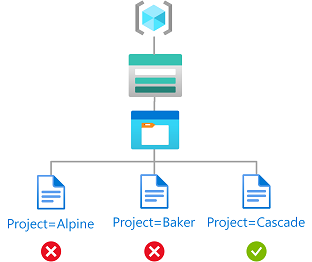

# Tutorial: Add a role assignment condition to restrict access to blobs using Azure PowerShell

In most cases, a role assignment grants the permissions you need to Azure resources. However, in some cases you might want to provide more granular access control by adding a role assignment condition.

In this tutorial, you learn how to:

> [!div class="checklist"]
>
> - Add a condition to a role assignment
> - Restrict access to blobs based on a blob index tag

[!INCLUDE [storage-abac-preview](../../../includes/storage-abac-preview.md)]

## Prerequisites

For information about the prerequisites to add or edit role assignment conditions, see [Conditions prerequisites](../../role-based-access-control/conditions-prerequisites.md).

## Condition

In this tutorial, you restrict access to blobs with a specific tag. For example, you add a condition to a role assignment so that Chandra can only read files with the tag Project=Cascade.


If Chandra tries to read a blob without the tag Project=Cascade, access isn't allowed.



Here's what the condition looks like in code:

```
(
    (
        !(ActionMatches{'Microsoft.Storage/storageAccounts/blobServices/containers/blobs/read'}
        AND NOT
        SubOperationMatches{'Blob.List'})
    )
    OR
    (
        @Resource[Microsoft.Storage/storageAccounts/blobServices/containers/blobs/tags:Project<$key_case_sensitive$>] StringEquals 'Cascade'
    )
)
```

## Step 1: Install prerequisites

1. Open a PowerShell window.

1. Use [Get-InstalledModule](/powershell/module/powershellget/get-installedmodule) to check versions of installed modules.

    ```azurepowershell
    Get-InstalledModule -Name Az
    Get-InstalledModule -Name Az.Resources
    Get-InstalledModule -Name Az.Storage
    ```

1. If necessary, use [Install-Module](/powershell/module/powershellget/install-module) to install the required versions for the [Az](https://www.powershellgallery.com/packages/Az/), [Az.Resources](https://www.powershellgallery.com/packages/Az.Resources/), and [Az.Storage](https://www.powershellgallery.com/packages/Az.Storage/2.5.2-preview) modules.

    ```azurepowershell
    Install-Module -Name Az -RequiredVersion 5.5.0
    Install-Module -Name Az.Resources -RequiredVersion 3.2.1
    Install-Module -Name Az.Storage -RequiredVersion 2.5.2-preview -AllowPrerelease
    ```

1. Close and reopen PowerShell to refresh session.

## Step 2: Sign in to Azure

1. Use the [Connect-AzAccount](/powershell/module/az.accounts/connect-azaccount) command and follow the instructions that appear to sign in to your directory as [User Access Administrator](../../role-based-access-control/built-in-roles.md#user-access-administrator) or [Owner](../../role-based-access-control/built-in-roles.md#owner).

    ```azurepowershell
    Connect-AzAccount
    ```

1. Use [Get-AzSubscription](/powershell/module/az.accounts/get-azsubscription) to list all of your subscriptions.

    ```azurepowershell
    Get-AzSubscription
    ```

1. Determine the subscription ID and initialize the variable.

    ```azurepowershell
    $subscriptionId = "<subscriptionId>"
    ```

1. Set the subscription as the active subscription.

    ```azurepowershell
    $context = Get-AzSubscription -SubscriptionId $subscriptionId
    Set-AzContext $context
    ```

## Step 3: Create a user

1. Use [New-AzureADUser](/powershell/module/azuread/new-azureaduser) to create a user or find an existing user. This tutorial uses Chandra as the example.

1. Initialize the variable for the object ID of the user.

    ```azurepowershell
    $userObjectId = "<userObjectId>"
    ```

## Step 4: Set up storage

1. Use [New-AzStorageAccount](/powershell/module/az.storage/new-azstorageaccount) to create a storage account that is compatible with the blob index feature. For more information, see [Manage and find Azure Blob data with blob index tags](storage-manage-find-blobs.md#regional-availability-and-storage-account-support).

1. Use [New-AzStorageContainer](/powershell/module/az.storage/new-azstoragecontainer) to create a new blob container within the storage account and set the anonymous access level to **Private (no anonymous access)**.

1. Use [Set-AzStorageBlobContent](/powershell/module/az.storage/set-azstorageblobcontent) to upload a text file to the container.

1. Add the following blob index tag to the text file. For more information, see [Use blob index tags to manage and find data on Azure Blob Storage](storage-blob-index-how-to.md).

    > [!NOTE]
    > Blobs also support the ability to store arbitrary user-defined key-value metadata. Although metadata is similar to blob index tags, you must use blob index tags with conditions.

    | Key | Value |
    | --- | --- |
    | Project  | Cascade |

1. Upload a second text file to the container.

1. Add the following blob index tag to the second text file.

    | Key | Value |
    | --- | --- |
    | Project  | Baker |

1. Initialize the following variables with the names you used.

    ```azurepowershell
    $resourceGroup = "<resourceGroup>"
    $storageAccountName = "<storageAccountName>"
    $containerName = "<containerName>"
    $blobNameCascade = "<blobNameCascade>"
    $blobNameBaker = "<blobNameBaker>"
    ```

## Step 5: Assign a role with a condition

1. Initialize the [Storage Blob Data Reader](../../role-based-access-control/built-in-roles.md#storage-blob-data-reader) role variables.

    ```azurepowershell
    $roleDefinitionName = "Storage Blob Data Reader"
    $roleDefinitionId = "2a2b9908-6ea1-4ae2-8e65-a410df84e7d1"
    ```

1. Initialize the scope for the resource group.

    ```azurepowershell
    $scope = "/subscriptions/$subscriptionId/resourceGroups/$resourceGroup"
    ```

1. Initialize the condition.

    ```azurepowershell
    $condition = "((!(ActionMatches{'Microsoft.Storage/storageAccounts/blobServices/containers/blobs/read'} AND NOT SubOperationMatches{'Blob.List'})) OR (@Resource[Microsoft.Storage/storageAccounts/blobServices/containers/blobs/tags:Project<`$key_case_sensitive`$>] StringEquals 'Cascade'))"
    ```

    In PowerShell, if your condition includes a dollar sign ($), you must prefix it with a backtick (\`). For example, this condition uses dollar signs to delineate the tag key name.

1. Initialize the condition version and description.

    ```azurepowershell
    $conditionVersion = "2.0"
    $description = "Read access to blobs with the tag Project=Cascade"
    ```

1. Use [New-AzRoleAssignment](/powershell/module/az.resources/new-azroleassignment) to assign the [Storage Blob Data Reader](../../role-based-access-control/built-in-roles.md#storage-blob-data-reader) role with a condition to the user at a resource group scope.

    ```azurepowershell
    New-AzRoleAssignment -ObjectId $userObjectId -Scope $scope -RoleDefinitionId $roleDefinitionId -Description $description -Condition $condition -ConditionVersion $conditionVersion
    ```

    Here's an example of the output:

    ```azurepowershell
    RoleAssignmentId   : /subscriptions/<subscriptionId>/resourceGroups/<resourceGroup>/providers/Microso
                         ft.Authorization/roleAssignments/<roleAssignmentId>
    Scope              : /subscriptions/<subscriptionId>/resourceGroups/<resourceGroup>
    DisplayName        : Chandra
    SignInName         : chandra@contoso.com
    RoleDefinitionName : Storage Blob Data Reader
    RoleDefinitionId   : 2a2b9908-6ea1-4ae2-8e65-a410df84e7d1
    ObjectId           : <userObjectId>
    ObjectType         : User
    CanDelegate        : False
    Description        : Read access to blobs with the tag Project=Cascade
    ConditionVersion   : 2.0
    Condition          : ((!(ActionMatches{'Microsoft.Storage/storageAccounts/blobServices/containers/blobs/read'} AND NOT
                         SubOperationMatches{'Blob.List'})) OR
                         (@Resource[Microsoft.Storage/storageAccounts/blobServices/co
                         ntainers/blobs/tags:Project<$key_case_sensitive$>] StringEquals 'Cascade'))
    ```

## Step 6: (Optional) View the condition in the Azure portal

1. In the Azure portal, open the resource group.

1. Select **Access control (IAM)**.

1. On the Role assignments tab, find the role assignment.

1. In the **Condition** column, select **View/Edit** to view the condition.

:::image type="content" source="./media/shared/condition-view.png" alt-text="Screenshot of Add role assignment condition in the Azure portal." lightbox="./media/shared/condition-view.png":::

## Step 7: Test the condition

1. Open a new PowerShell window.

1. Use [Connect-AzAccount](/powershell/module/az.accounts/connect-azaccount) to sign in as Chandra.

    ```azurepowershell
    Connect-AzAccount
    ```

1. Initialize the following variables with the names you used.

    ```azurepowershell
    $storageAccountName = "<storageAccountName>"
    $containerName = "<containerName>"
    $blobNameBaker = "<blobNameBaker>"
    $blobNameCascade = "<blobNameCascade>"
    ```

1. Use [New-AzStorageContext](/powershell/module/az.storage/new-azstoragecontext) to create a specific context to access your storage account more easily.

    ```azurepowershell
    $bearerCtx = New-AzStorageContext -StorageAccountName $storageAccountName
    ```

1. Use [Get-AzStorageBlob](/powershell/module/az.storage/get-azstorageblob) to try to read the file for the Baker project.

    ```azurepowershell
    Get-AzStorageBlob -Container $containerName -Blob $blobNameBaker -Context $bearerCtx 
    ```

    Here's an example of the output. Notice that you **can't** read the file because of the condition you added.

    ```azurepowershell
    Get-AzStorageBlob : This request is not authorized to perform this operation using this permission. HTTP Status Code:
    403 - HTTP Error Message: This request is not authorized to perform this operation using this permission.
    ErrorCode: AuthorizationPermissionMismatch
    ErrorMessage: This request is not authorized to perform this operation using this permission.
    RequestId: <requestId>
    Time: Sat, 24 Apr 2021 13:26:25 GMT
    At line:1 char:1
    + Get-AzStorageBlob -Container $containerName -Blob $blobNameBaker -Con ...
    + ~~~~~~~~~~~~~~~~~~~~~~~~~~~~~~~~~~~~~~~~~~~~~~~~~~~~~~~~~~~~~~~~~~~~~
        + CategoryInfo          : CloseError: (:) [Get-AzStorageBlob], StorageException
        + FullyQualifiedErrorId : StorageException,Microsoft.WindowsAzure.Commands.Storage.Blob.Cmdlet.GetAzureStorageBlob
       Command
    ```

1. Read the file for the Cascade project.

    ```azurepowershell
    Get-AzStorageBlob -Container $containerName -Blob $blobNameCascade -Context $bearerCtx 
    ```

    Here's an example of the output. Notice that you can read the file because it has the tag Project=Cascade.

    ```azurepowershell
       AccountName: <storageAccountName>, ContainerName: <containerName>

    Name                 BlobType  Length          ContentType                    LastModified         AccessTier SnapshotT
                                                                                                                  ime
    ----                 --------  ------          -----------                    ------------         ---------- ---------
    CascadeFile.txt      BlockBlob 7               text/plain                     2021-04-24 05:35:24Z Hot
    ```

## Step 8: (Optional) Edit the condition

1. In the other PowerShell window, use [Get-AzRoleAssignment](/powershell/module/az.resources/get-azroleassignment) to get the role assignment you added.

    ```azurepowershell
    $testRa = Get-AzRoleAssignment -Scope $scope -RoleDefinitionName $roleDefinitionName -ObjectId $userObjectId
    ```

1. Edit the condition.

    ```azurepowershell
    $condition = "((!(ActionMatches{'Microsoft.Storage/storageAccounts/blobServices/containers/blobs/read'} AND NOT SubOperationMatches{'Blob.List'})) OR (@Resource[Microsoft.Storage/storageAccounts/blobServices/containers/blobs/tags:Project<`$key_case_sensitive`$>] StringEquals 'Cascade' OR @Resource[Microsoft.Storage/storageAccounts/blobServices/containers/blobs/tags:Project<`$key_case_sensitive`$>] StringEquals 'Baker'))"
    ```

1. Initialize the condition and description.

    ```azurepowershell
    $testRa.Condition = $condition
    $testRa.Description = "Read access to blobs with the tag Project=Cascade or Project=Baker"
    ```

1. Use [Set-AzRoleAssignment](/powershell/module/az.resources/set-azroleassignment) to update the condition for the role assignment.

    ```azurepowershell
    Set-AzRoleAssignment -InputObject $testRa -PassThru
    ```

    Here's an example of the output:

    ```azurepowershell
    RoleAssignmentId   : /subscriptions/<subscriptionId>/resourceGroups/<resourceGroup>/providers/Microso
                         ft.Authorization/roleAssignments/<roleAssignmentId>
    Scope              : /subscriptions/<subscriptionId>/resourceGroups/<resourceGroup>
    DisplayName        : Chandra
    SignInName         : chandra@contoso.com
    RoleDefinitionName : Storage Blob Data Reader
    RoleDefinitionId   : 2a2b9908-6ea1-4ae2-8e65-a410df84e7d1
    ObjectId           : <userObjectId>
    ObjectType         : User
    CanDelegate        : False
    Description        : Read access to blobs with the tag Project=Cascade or Project=Baker
    ConditionVersion   : 2.0
    Condition          : ((!(ActionMatches{'Microsoft.Storage/storageAccounts/blobServices/containers/blobs/read'} AND NOT
                         SubOperationMatches{'Blob.List'})) OR
                         (@Resource[Microsoft.Storage/storageAccounts/blobServices/co
                         ntainers/blobs/tags:Project<$key_case_sensitive$>] StringEquals 'Cascade' OR @Resource[Microsoft.S
                         torage/storageAccounts/blobServices/containers/blobs/tags:Project<$key_case_sensitive$>]
                         StringEquals 'Baker'))
    ```

## Step 9: Clean up resources

1. Use [Remove-AzRoleAssignment](/powershell/module/az.resources/remove-azroleassignment) to remove the role assignment and condition you added.

    ```azurepowershell
    Remove-AzRoleAssignment -ObjectId $userObjectId -RoleDefinitionName $roleDefinitionName -ResourceGroupName $resourceGroup
    ```

1. Delete the storage account you created.

1. Delete the user you created.

## Next steps

- [Example Azure role assignment conditions](storage-auth-abac-examples.md)
- [Actions and attributes for Azure role assignment conditions in Azure Storage](storage-auth-abac-attributes.md)
- [Azure role assignment condition format and syntax](../../role-based-access-control/conditions-format.md)
