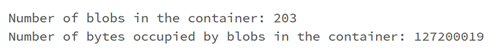
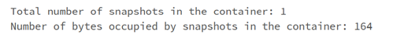
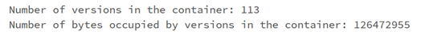
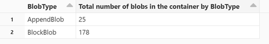
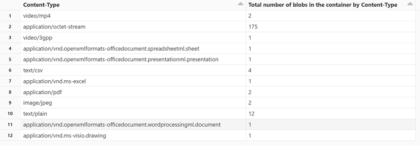

# Tutorial: Calculate container statistics by using Databricks

This tutorial shows you how to gather statistics about your containers by using Azure Blob Storage inventory along with Azure Databricks.

In this tutorial, you learn how to:

> [!div class="checklist"]
> * Generate an inventory report
> * Create an Azure Databricks workspace, cluster, and notebook
> * Read the blob inventory file
> * Get the number and total size of blobs, snapshots, and versions
> * Get the number of blobs by blob type and content type

## Prerequisites

- An Azure subscription - [create an account for free](https://azure.microsoft.com/free/?WT.mc_id=A261C142F)

- An Azure storage account - [create a storage account](../common/storage-account-create.md) 
  
  Make sure that your user identity has the [Storage Blob Data Contributor role](assign-azure-role-data-access.md) assigned to it.

## Generate an inventory report

Enable blob inventory reports for your storage account. See [Enable Azure Storage blob inventory reports](blob-inventory-how-to.md). 

Use the following configuration settings:

| Setting | Value |
|---------|-------|
| Rule name | blobinventory |
| Container | \<name of your container\> |
| Object type to inventory | Blob |
| Blob types | Block blobs, Page blobs, and Append blobs |
| Subtypes | include blob versions, include snapshots, include deleted blobs |
| Blob inventory fields | All |
| Inventory frequency | Daily |
| Export format | CSV |

You might have to wait up to 24 hours after enabling inventory reports for your first report to be generated.

## Configure Azure Databricks

In this section, you create an Azure Databricks workspace, cluster, and notebook. Later in this tutorial, you paste code snippets into notebook cells, and then run them to gather container statistics. 

1. Create an Azure Databricks workspace. See [Create an Azure Databricks workspace](/azure/databricks/getting-started/#--create-an-azure-databricks-workspace).

2. Create a cluster. See [Create a cluster](/azure/databricks/getting-started/quick-start#step-1-create-a-cluster).

3. Create a notebook and choose Python as the default language of the notebook. See [Create a notebook](/azure/databricks/notebooks/notebooks-manage#--create-a-notebook).  

## Read the blob inventory file

1. Copy and paste the following code block into the first cell, but don't run this code yet.

   ```python
   from pyspark.sql.types import StructType, StructField, IntegerType, StringType
   import pyspark.sql.functions as F  
      storage_account_name = "<storage-account-name>"
      storage_account_key = "<storage-account-key>"
      container = "<container-name>"
      blob_inventory_file = "<blob-inventory-file-name>" 
      hierarchial_namespace_enabled = False

   if hierarchial_namespace_enabled == False:
     spark.conf.set("fs.azure.account.key.{0}.blob.core.windows.net".format(storage_account_name), storage_account_key)
     df = spark.read.csv("wasbs://{0}@{1}.blob.core.windows.net/{2}".format(container, storage_account_name, blob_inventory_file), header='true', inferSchema='true')

    else:
     spark.conf.set("fs.azure.account.key.{0}.dfs.core.windows.net".format(storage_account_name), storage_account_key)
     df = spark.read.csv("abfss://{0}@{1}.dfs.core.windows.net/{2}".format(container, storage_account_name, blob_inventory_file), header='true', inferSchema='true')     
      ```

2. In this code block, replace the following values:

   - Replace the `<storage-account-name>` placeholder value with the name of your storage account.

   - Replace the `<storage-account-key>` placeholder value with the account key of your storage account.

   - Replace the `<container-name>` placeholder value with the container that holds the inventory reports.

   - Replace the `<blob-inventory-file-name>` placeholder with the fully qualified name of the inventory file (For example: `2023/02/02/02-16-17/blobinventory/blobinventory_1000000_0.csv`).

   - If your account has a hierarchical namespace, set the `hierarchical_namespace_enabled` variable to `True`.

3. Press the SHIFT + ENTER keys to run the code in this block.

## Get blob count and size

1. In a new cell, paste the following code:

   ```python
   print("Number of blobs in the container:", df.count())
   print("Number of bytes occupied by blobs in the container:", df.agg({'Content-Length': 'sum'}).first()['sum(Content-Length)'])
   ```

2. Press SHIFT + ENTER to run the cell. 

   The notebook displays the number of blobs in a container and the number of bytes occupied by blobs in the container.

   > [!div class="mx-imgBorder"]
   > 

## Get snapshot count and size

1. In a new cell, paste the following code:

   ```python
   from pyspark.sql.functions import *

   print("Number of snapshots in the container:", df.where(~(col("Snapshot")).like("Null")).count())
   dfT = df.where(~(col("Snapshot")).like("Null"))
   print("Number of bytes occupied by snapshots in the container:", dfT.agg({'Content-Length': 'sum'}).first()['sum(Content-Length)'])
   ```

2. Press SHIFT + ENTER to run the cell. 

   The notebook displays the number of snapshots and total number of bytes occupied by blob snapshots.

   > [!div class="mx-imgBorder"]
   > 

## Get version count and size

1. In a new cell, paste the following code:

   ```python
   from pyspark.sql.functions import *

   print("Number of versions in the container:", df.where(~(col("VersionId")).like("Null")).count())
   dfT = df.where(~(col("VersionId")).like("Null"))
   print("Number of bytes occupied by versions in the container:", dfT.agg({'Content-Length': 'sum'}).first()['sum(Content-Length)'])
   ```

2. Press SHIFT + ENTER to run the cell. 

   The notebook displays the number of blob versions and total number of bytes occupied by blob versions.

   > [!div class="mx-imgBorder"]
   > 


## Get blob count by blob type

1. In a new cell, paste the following code:

   ```python
   display(df.groupBy('BlobType').count().withColumnRenamed("count", "Total number of blobs in the container by BlobType"))
   ```

2. Press SHIFT + ENTER to run the cell. 

   The notebook displays the number of blob types by type.

    > [!div class="mx-imgBorder"]
    > 

## Get blob count by content type

1. In a new cell, paste the following code:

   ```python
   display(df.groupBy('Content-Type').count().withColumnRenamed("count", "Total number of blobs in the container by Content-Type"))
   ```

2. Press SHIFT + ENTER to run the cell. 

   The notebook displays the number of blobs associated with each content type.

   > [!div class="mx-imgBorder"]
   > 

## Terminate the cluster

To avoid unnecessary billing, make sure to terminate the cluster. See [Terminate a cluster](/azure/databricks/clusters/clusters-manage#--terminate-a-cluster).
  
## Next steps

- Learn how to use Azure Synapse to calculate the blob count and total size of blobs per container. See [Calculate blob count and total size per container using Azure Storage inventory](calculate-blob-count-size.md)

- Learn how to generate and visualize statistics that describes containers and blobs. See [Tutorial: Analyze blob inventory reports](storage-blob-inventory-report-analytics.md)

- Learn about ways to optimize your costs based on the analysis of your blobs and containers. See these articles:

  [Plan and manage costs for Azure Blob Storage](../common/storage-plan-manage-costs.md)

  [Estimate the cost of archiving data](archive-cost-estimation.md)

  [Optimize costs by automatically managing the data lifecycle](lifecycle-management-overview.md)