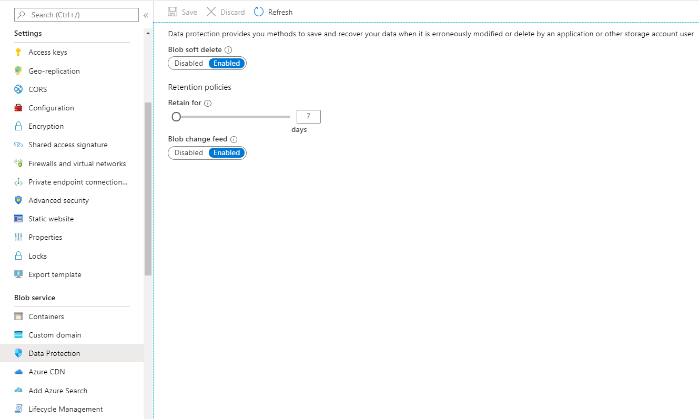

# Change feed support in Azure Blob Storage (Preview)

The purpose of the change feed is to provide transaction logs of all the changes that occur to the blobs and the blob metadata in your storage account. The change feed provides **ordered**, **guaranteed**, **durable**, **immutable**, **read-only** log of these changes. Client applications can read these logs at any time, either in streaming or in batch mode. The change feed enables you to build efficient and scalable solutions that process change events that occur in your Blob Storage account at a low cost.

[!INCLUDE [updated-for-az](../../../includes/storage-data-lake-gen2-support.md)]

The change feed is stored as [blobs](https://docs.microsoft.com/rest/api/storageservices/understanding-block-blobs--append-blobs--and-page-blobs) in a special container in your storage account at standard [blob pricing](https://azure.microsoft.com/pricing/details/storage/blobs/) cost. You can control the retention period of these files based on your requirements (See the [conditions](#conditions) of the current release). Change events are appended to the change feed as records in the [Apache Avro](https://avro.apache.org/docs/1.8.2/spec.html) format specification: a compact, fast, binary format that provides rich data structures with inline schema. This format is widely used in the Hadoop ecosystem, Stream Analytics, and Azure Data Factory.

You can process these logs asynchronously, incrementally or in-full. Any number of client applications can independently read the change feed, in parallel, and at their own pace. Analytics applications such as [Apache Drill](https://drill.apache.org/docs/querying-avro-files/) or [Apache Spark](https://spark.apache.org/docs/latest/sql-data-sources-avro.html) can consume logs directly as Avro files, which let you process them at a low-cost, with high-bandwidth, and without having to write a custom application.

Change feed support is well-suited for scenarios that process data based on objects that have changed. For example, applications can:

  - Update a secondary index, synchronize with a cache, search-engine, or any other content-management scenarios.
  
  - Extract business analytics insights and metrics, based on changes that occur to your objects, either in a streaming manner or batched mode.
  
  - Store, audit, and analyze changes to your objects, over any period of time, for security, compliance or intelligence for enterprise data management.

  - Build solutions to backup, mirror, or replicate object state in your account for disaster management or compliance.

  - Build connected application pipelines that react to change events or schedule executions based on created or changed object.
  
Change feed is a prerequisite feature for [Object Replication](object-replication-overview.md) and [Point-in-time restore for block blobs](point-in-time-restore-overview.md).

> [!NOTE]
> Change feed provides a durable, ordered log model of the changes that occur to a blob. Changes are written and made available in your change feed log  within an order of a few minutes of the change. If your application has to react to events much quicker than this, consider using [Blob Storage events](storage-blob-event-overview.md) instead. [Blob Storage Events](storage-blob-event-overview.md) provides real-time one-time events which enable your Azure Functions or applications to quickly react to changes that occur to a blob. 

## Enable and disable the change feed

You must enable the change feed on your storage account to begin capturing and recording changes. Disable the change feed to stop capturing changes. You can enable and disable changes by using Azure Resource Manager templates on Portal or PowerShell.

Here's a few things to keep in mind when you enable the change feed.

- There's only one change feed for the blob service in each storage account and is stored in the **$blobchangefeed** container.

- Create, Update, and Delete changes are captured only at the blob service level.

- The change feed captures *all* of the changes for all of the available events that occur on the account. Client applications can filter out event types as required. (See the [conditions](#conditions) of the current release).

- Only GPv2 and Blob storage accounts can enable Change feed. Premium BlockBlobStorage accounts, and hierarchical namespace enabled accounts are not currently supported. GPv1 storage accounts are not supported but can be upgraded to GPv2 with no downtime, see [Upgrade to a GPv2 storage account](../common/storage-account-upgrade.md) for more information.

> [!IMPORTANT]
> The change feed is in public preview, and is available in the **West Central US**, **West US 2**, **France Central**, **France South**, **Canada Central**, and **Canada East** regions. See the [conditions](#conditions) section of this article. To enroll in the preview, see the [Register your subscription](#register) section of this article. You must register your subscription before you can enable change feed on your storage accounts.

### [Portal](#tab/azure-portal)

Enable change feed on your storage account by using Azure portal:

1. In the [Azure portal](https://portal.azure.com/), select your storage account.

2. Navigate to the **Data Protection** option under **Blob Service**.

3. Click **Enabled** under **Blob change feed**.

4. Choose the **Save** button to confirm your **Data Protection** settings.

    

### [PowerShell](#tab/azure-powershell)

Enable change feed by using PowerShell:

1. Install the latest PowershellGet.

   ```powershell
   Install-Module PowerShellGet –Repository PSGallery –Force
   ```

2. Close, and then reopen the PowerShell console.

3. Install the **Az.Storage** preview module.

   ```powershell
   Install-Module Az.Storage –Repository PSGallery -RequiredVersion 1.8.1-preview –AllowPrerelease –AllowClobber –Force
   ```

4. Sign in to your Azure subscription with the `Connect-AzAccount` command and follow the on-screen directions to authenticate.

   ```powershell
   Connect-AzAccount
   ```

5. Enable change feed for your storage account.

   ```powershell
   Update-AzStorageBlobServiceProperty -EnableChangeFeed $true
   ```

### [Template](#tab/template)
Use an Azure Resource Manager template to enable Change feed on your existing storage account via Azure portal:

1. In the Azure portal, choose **Create a resource**.

2. In **Search the Marketplace**, type **template deployment**, and then press **ENTER**.

3. Choose **[Deploy a custom template](https://portal.azure.com/#create/Microsoft.Template)**, then choose **Build your own template in the editor**.

4. In the template editor, paste in the following json. Replace the `<accountName>` placeholder with the name of your storage account.

   ```json
   {
       "$schema": "https://schema.management.azure.com/schemas/2015-01-01/deploymentTemplate.json#",
       "contentVersion": "1.0.0.0",
       "parameters": {},
       "variables": {},
       "resources": [{
           "type": "Microsoft.Storage/storageAccounts/blobServices",
           "apiVersion": "2019-04-01",
           "name": "<accountName>/default",
           "properties": {
               "changeFeed": {
                   "enabled": true
               }
           } 
        }]
   }
   ```
    
5. Choose the **Save** button, specify the resource group of the account, and then choose the **Purchase** button to deploy the template and enable the change feed.

---

## Consume the change feed

The change feed produces several metadata and log files. These files are located in the **$blobchangefeed** container of the storage account. 

> [!NOTE]
> In the current release, the **$blobchangefeed** container is not visible in Azure Storage Explorer or the Azure portal. You currently cannot see the $blobchangefeed container when you call ListContainers API but you are able to call the ListBlobs API directly on the container to see the blobs.

Your client applications can consume the change feed by using the blob change feed processor library that is provided with the Change feed processor SDK. 

See [Process change feed logs in Azure Blob Storage](storage-blob-change-feed-how-to.md).

## Understand change feed organization

<a id="segment-index"></a>

### Segments

The change feed is a log of changes that are organized into **hourly** *segments* but appended to and updated every few minutes. These segments are created only when there are blob change events that occur in that hour. This enables your client application to consume changes that occur within specific ranges of time without having to search through the entire log. To learn more, see the [Specifications](#specifications).

An available hourly segment of the change feed is described in a manifest file that specifies the paths to the change feed files for that segment. The listing of the `$blobchangefeed/idx/segments/` virtual directory shows these segments ordered by time. The path of the segment describes the start of the hourly time-range that the segment represents. You can use that list to filter out the segments of logs that are interest to you.

```text
Name                                                                    Blob Type    Blob Tier      Length  Content Type    
----------------------------------------------------------------------  -----------  -----------  --------  ----------------
$blobchangefeed/idx/segments/1601/01/01/0000/meta.json                  BlockBlob                      584  application/json
$blobchangefeed/idx/segments/2019/02/22/1810/meta.json                  BlockBlob                      584  application/json
$blobchangefeed/idx/segments/2019/02/22/1910/meta.json                  BlockBlob                      584  application/json
$blobchangefeed/idx/segments/2019/02/23/0110/meta.json                  BlockBlob                      584  application/json
```

> [!NOTE]
> The `$blobchangefeed/idx/segments/1601/01/01/0000/meta.json` is automatically created when you enable the change feed. You can safely ignore this file. It is an always empty initialization file. 

The segment manifest file (`meta.json`) shows the path of the change feed files for that segment in the `chunkFilePaths` property. Here's an example of a segment manifest file.

```json
{
    "version": 0,
    "begin": "2019-02-22T18:10:00.000Z",
    "intervalSecs": 3600,
    "status": "Finalized",
    "config": {
        "version": 0,
        "configVersionEtag": "0x8d698f0fba563db",
        "numShards": 2,
        "recordsFormat": "avro",
        "formatSchemaVersion": 1,
        "shardDistFnVersion": 1
    },
    "chunkFilePaths": [
        "$blobchangefeed/log/00/2019/02/22/1810/",
        "$blobchangefeed/log/01/2019/02/22/1810/"
    ],
    "storageDiagnostics": {
        "version": 0,
        "lastModifiedTime": "2019-02-22T18:11:01.187Z",
        "data": {
            "aid": "55e507bf-8006-0000-00d9-ca346706b70c"
        }
    }
}
```

> [!NOTE]
> The `$blobchangefeed` container appears only after you've enabled the change feed feature on your account. You'll have to wait a few minutes after you enable the change feed before you can list the blobs in the container. 

<a id="log-files"></a>

### Change event records

The change feed files contain a series of change event records. Each change event record corresponds to one change to an individual blob. The records are serialized and written to the file using the [Apache Avro](https://avro.apache.org/docs/1.8.2/spec.html) format specification. The records can be read by using the Avro file format specification. There are several libraries available to process files in that format.

Change feed files are stored in the `$blobchangefeed/log/` virtual directory as [append blobs](https://docs.microsoft.com/rest/api/storageservices/understanding-block-blobs--append-blobs--and-page-blobs#about-append-blobs). The first change feed file under each path will have `00000` in the file name (For example `00000.avro`). The name of each subsequent log file added to that path will increment by 1 (For example: `00001.avro`).

The following event types are captured in the Change feed records:
- BlobCreated
- BlobDeleted
- BlobPropertiesUpdated
- BlobSnapshotCreated

Here's an example of change event record from change feed file converted to Json.

```json
{
     "schemaVersion": 1,
     "topic": "/subscriptions/dd40261b-437d-43d0-86cf-ef222b78fd15/resourceGroups/sadodd/providers/Microsoft.Storage/storageAccounts/mytestaccount",
     "subject": "/blobServices/default/containers/mytestcontainer/blobs/mytestblob",
     "eventType": "BlobCreated",
     "eventTime": "2019-02-22T18:12:01.079Z",
     "id": "55e5531f-8006-0000-00da-ca3467000000",
     "data": {
         "api": "PutBlob",
         "clientRequestId": "edf598f4-e501-4750-a3ba-9752bb22df39",
         "requestId": "00000000-0000-0000-0000-000000000000",
         "etag": "0x8D698F13DCB47F6",
         "contentType": "application/octet-stream",
         "contentLength": 128,
         "blobType": "BlockBlob",
         "url": "",
         "sequencer": "000000000000000100000000000000060000000000006d8a",
         "storageDiagnostics": {
             "bid": "11cda41c-13d8-49c9-b7b6-bc55c41b3e75",
             "seq": "(6,5614,28042,28038)",
             "sid": "591651bd-8eb3-c864-1001-fcd187be3efd"
         }
  }
}
```

For a description of each property, see [Azure Event Grid event schema for Blob Storage](https://docs.microsoft.com/azure/event-grid/event-schema-blob-storage?toc=%2fazure%2fstorage%2fblobs%2ftoc.json#event-properties). The BlobPropertiesUpdated and BlobSnapshotCreated events are currently exclusive to Change feed and not yet supported for Blob Storage Events.

> [!NOTE]
> The change feed files for a segment don't immediately appear after a segment is created. The length of delay is within the normal interval of publishing latency of the change feed which is within a few minutes of the change.

<a id="specifications"></a>

## Specifications

- Change events records are only appended to the change feed. Once these records are appended, they are immutable and record-position is stable. Client applications can maintain their own checkpoint on the read position of the change feed.

- Change event records are appended within an order of few minutes of the change. Client applications can choose to consume records as they are appended for streaming access or in bulk at any other time.

- Change event records are ordered by modification order **per blob**. Order of changes across blobs is undefined in Azure Blob Storage. All changes in a prior segment are before any changes in subsequent segments.

- Change event records are serialized into the log file by using the [Apache Avro 1.8.2](https://avro.apache.org/docs/1.8.2/spec.html) format specification.

- Change event records where the `eventType` has a value of `Control` are internal system records and don't reflect a change to objects in your account. You can safely ignore those records.

- Values in the `storageDiagnonstics` property bag are for internal use only and not designed for use by your application. Your applications shouldn't have a contractual dependency on that data. You can safely ignore those properties.

- The time represented by the segment is **approximate** with bounds of 15 minutes. So to ensure consumption of all records within a specified time, consume the consecutive previous and next hour segment.

- Each segment can have a different number of `chunkFilePaths` due to internal partitioning of the log stream to manage publishing throughput. The log files in each `chunkFilePath` are guaranteed to contain mutually exclusive blobs, and can be consumed and processed in parallel without violating the ordering of modifications per blob during the iteration.

- The Segments start out in `Publishing` status. Once the appending of the records to the segment is complete, it will be `Finalized`. Log files in any segment that is dated after the date of the `LastConsumable` property in the `$blobchangefeed/meta/Segments.json` file, should not be consumed by your application. Here's an example of the `LastConsumable`property in a `$blobchangefeed/meta/Segments.json` file:

```json
{
    "version": 0,
    "lastConsumable": "2019-02-23T01:10:00.000Z",
    "storageDiagnostics": {
        "version": 0,
        "lastModifiedTime": "2019-02-23T02:24:00.556Z",
        "data": {
            "aid": "55e551e3-8006-0000-00da-ca346706bfe4",
            "lfz": "2019-02-22T19:10:00.000Z"
        }
    }
}

```

<a id="register"></a>

## Register your subscription (Preview)

Because the change feed is only in public preview, you'll need to register your subscription to use the feature.

### Register by using PowerShell

In a PowerShell console, run these commands:

```powershell
Register-AzProviderFeature -FeatureName Changefeed -ProviderNamespace Microsoft.Storage
Register-AzResourceProvider -ProviderNamespace Microsoft.Storage
```
   
### Register by using Azure CLI

In Azure Cloud Shell, run these commands:

```azurecli
az feature register --namespace Microsoft.Storage --name Changefeed
az provider register --namespace 'Microsoft.Storage'
```

<a id="conditions"></a>

## Conditions and known issues (Preview)

This section describes known issues and conditions in the current public preview of the change feed. 
- For preview, you must first [register your subscription](#register) before you can enable change feed for your storage account in the West Central US, West US 2, France Central, France South, Canada Central, and Canada East regions. 
- The change feed captures only create, update, delete, and copy operations. Blob property and metadata changes are also captured. However the access tier property is not currently captured. 
- Change event records for any single change might appear more than once in your change feed.
- You can't yet manage the lifetime of change feed log files by setting time-based retention policy on them and you cannot delete the blobs.
- The `url` property of the log file is currently always empty.
- The `LastConsumable` property of the segments.json file does not list the very first segment that the change feed finalizes. This issue occurs only after the first segment is finalized. All subsequent segments after the first hour are accurately captured in the `LastConsumable` property.
- You currently cannot see the **$blobchangefeed** container when you call ListContainers API and the container does not show up on Azure portal or Storage Explorer. You can view the contents by calling the ListBlobs API on the $blobchangefeed container directly.
- Storage accounts that have previously initiated an [account failover](../common/storage-disaster-recovery-guidance.md) may have issues with the log file not appearing. Any future account failovers may also impact the log file during preview.

## FAQ

### What is the difference between Change feed and Storage Analytics logging?
Analytics logs have records of all read, write, list, and delete operations with successful and failed requests across all operations. Analytics logs are best-effort and no ordering is guaranteed.

Change feed is a solution that provides transactional log of successful mutations or changes to your account such as blob creation, modification, and deletions. Change feed guarantees all events to be recorded and displayed in the order of successful changes per blob, thus you do not have to filter out noise from a huge volume of read operations or failed requests. Change feed is fundamentally designed and optimized for application development that require certain guarantees.

### Should I use Change feed or Storage events?
You can leverage both features as Change feed and [Blob storage events](storage-blob-event-overview.md) provide the same information with the same delivery reliability guarantee, with the main difference being the latency, ordering, and storage of event records. Change feed publishes records to the log within few minutes of the change and also guarantees the order of change operations per blob. Storage events are pushed in real time and might not be ordered. Change feed events are durably stored inside your storage account as read-only stable logs with your own defined retention, while storage events are transient to be consumed by the event handler unless you explicitly store them. With Change feed, any number of your applications can consume the logs at their own convenience using blob APIs or SDKs. 

## Next steps

- See an example of how to read the change feed by using a .NET client application. See [Process change feed logs in Azure Blob Storage](storage-blob-change-feed-how-to.md).
- Learn about how to react to events in real time. See [Reacting to Blob Storage events](storage-blob-event-overview.md)
- Learn more about detailed logging information for both successful and failed operations for all requests. See [Azure Storage analytics logging](../common/storage-analytics-logging.md)
