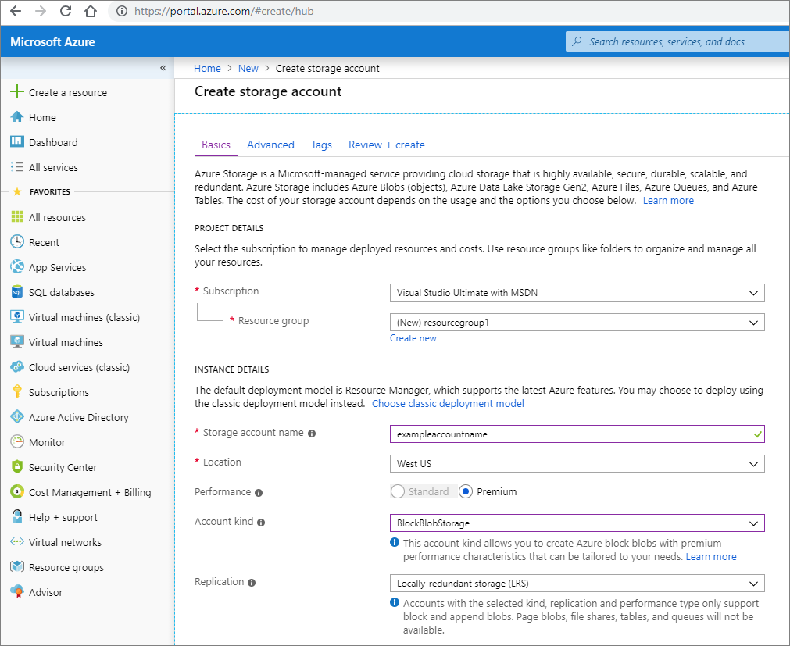

# Create a BlockBlobStorage account

The BlockBlobStorage account kind lets you create block blobs with premium performance characteristics. This type of storage account is optimized for workloads with high transactions rates or that require very fast access times. This article shows how to create a BlockBlobStorage account by using the Azure portal, the Azure CLI, or Azure PowerShell.

> [!NOTE]
> The hierarchical namespace feature in a block blob storage account is in public preview, and is available in the US East, US East 2, US Central, US South Central, US West 2, UK South, Canada Central and Australia East regions. To review limitations, see [Blob storage features available in Azure Data Lake Storage Gen2](data-lake-storage-supported-blob-storage-features.md) and [Known issues](data-lake-storage-known-issues.md). To enroll in the preview, see [this form](https://aka.ms/adlspremiumonboard).

For more information about BlockBlobStorage accounts, see [Azure storage account overview](https://docs.microsoft.com/azure/storage/common/storage-account-overview).

## Prerequisites

If you don't have an Azure subscription, create a [free account](https://azure.microsoft.com/free/) before you begin.

# [Portal](#tab/azure-portal)

None.

# [PowerShell](#tab/azure-powershell)

This how-to article requires the Azure PowerShell module Az version 1.2.0 or later. Run `Get-Module -ListAvailable Az` to find your current version. If you need to install or upgrade, see [Install Azure PowerShell module](/powershell/azure/install-Az-ps).

# [Azure CLI](#tab/azure-cli)

You can sign in to Azure and run Azure CLI commands in one of two ways:

- You can run CLI commands from within the Azure portal, in Azure Cloud Shell.
- You can install the CLI and run CLI commands locally.

### Use Azure Cloud Shell

Azure Cloud Shell is a free Bash shell that you can run directly within the Azure portal. The Azure CLI is pre-installed and configured to use with your account. Click the **Cloud Shell** button on the menu in the upper-right section of the Azure portal:

[](https://portal.azure.com)

The button launches an interactive shell that you can use to run the steps outlined in this how-to article:

[](https://portal.azure.com)

### Install the CLI locally

You can also install and use the Azure CLI locally. This how-to article requires that you are running the Azure CLI version 2.0.46 or later. Run `az --version` to find the version. If you need to install or upgrade, see [Install the Azure CLI](/cli/azure/install-azure-cli). 

---

## Sign in to Azure

# [Portal](#tab/azure-portal)

Sign in to the [Azure portal](https://portal.azure.com).

# [PowerShell](#tab/azure-powershell)

Sign in to your Azure subscription with the `Connect-AzAccount` command and follow the on-screen directions to authenticate.

```powershell
Connect-AzAccount
```

# [Azure CLI](#tab/azure-cli)

To launch Azure Cloud Shell, sign in to the [Azure portal](https://portal.azure.com).

To log into your local installation of the CLI, run the [az login](/cli/azure/reference-index#az-login) command:

```azurecli
az login
```

---

## Create a BlockBlobStorage account

## [Portal](#tab/azure-portal)
To create a BlockBlobStorage account in the Azure portal, follow these steps:

1. In the Azure portal, select **All services** > the **Storage** category > **Storage accounts**.

2. Under **Storage accounts**, select **Add**.

3. In the **Subscription** field, select the subscription in which to create the storage account.

4. In the **Resource group** field, select an existing resource group or select **Create new**, and enter a name for the new resource group.

5. In the **Storage account name** field, enter a name for the account. Note the following guidelines:

   - The name must be unique across Azure.
   - The name must be between three and 24 characters long.
   - The name can include only numbers and lowercase letters.

6. In the **Location** field, select a location for the storage account, or use the default location.

7. For the rest of the settings, configure the following:

   |Field     |Value  |
   |---------|---------|
   |**Performance**    |  Select **Premium**.   |
   |**Account kind**    | Select **BlockBlobStorage**.      |
   |**Replication**    |  Leave the default setting of **Locally-redundant storage (LRS)**.      |

   

8. Choose the **Advanced** tab.

9. If you want to optimize your storage account for data analytics, then set **Hierarchical namespace** to **Enabled**. Otherwise, leave this option set to it's default value.

   To learn more, see [Introduction to Azure Data Lake Storage Gen2](data-lake-storage-introduction.md).

   > [!NOTE]
   > The hierarchical namespace feature in a block blob storage account is in public preview, and is available in the US East, US East 2, US Central, US South Central, US West 2, UK South, Canada Central and Australia East regions. To review limitations, see [Blob storage features available in Azure Data Lake Storage Gen2](data-lake-storage-supported-blob-storage-features.md) and [Known issues](data-lake-storage-known-issues.md). To enroll in the preview, see [this form](https://aka.ms/adlspremiumonboard).

8. Select **Review + create** to review the storage account settings.

9. Select **Create**.

## [Azure PowerShell](#tab/azure-powershell)

[!INCLUDE [updated-for-az](../../../includes/updated-for-az.md)]

1. Open an elevated Windows PowerShell session (Run as administrator).

2. Run the following command to make sure the latest version of the `Az` PowerShell module is installed.

   ```powershell
   Install-Module -Name Az -AllowClobber
   ```

3. Open a new PowerShell console and sign in with your Azure account.

   ```powershell
   Connect-AzAccount -SubscriptionId <SubscriptionID>
   ```

4. If needed, create a new resource group. Replace the values in quotations, and run the following command.

   ```powershell
   $resourcegroup = "new_resource_group_name"
   $location = "region_name"
   New-AzResourceGroup -Name $resourceGroup -Location $location
   ```

5. Create the BlockBlobStorage account. Replace the values in quotations, and run the following command.

   ```powershell
   $resourcegroup = "resource_group_name"
   $storageaccount = "new_storage_account_name"
   $location = "region_name"

   New-AzStorageAccount -ResourceGroupName $resourcegroup -Name $storageaccount -Location $location -Kind "BlockBlobStorage" -SkuName "Premium_LRS"
   ```
   If you want to optimize your storage account for data analytics, then add `-EnableHierarchicalNamespace $True` to the command. To learn more, see [Introduction to Azure Data Lake Storage Gen2](data-lake-storage-introduction.md).

   > [!NOTE]
   > The hierarchical namespace feature in a block blob storage account is in public preview, and is available in the US East, US East 2, US Central, US South Central, US West 2, UK South, Canada Central and Australia East regions. To review limitations, see [Blob storage features available in Azure Data Lake Storage Gen2](data-lake-storage-supported-blob-storage-features.md) and [Known issues](data-lake-storage-known-issues.md). To enroll in the preview, see [this form](https://aka.ms/adlspremiumonboard).

## [Azure CLI](#tab/azure-cli)

To create a block blob account by using the Azure CLI, you must first install Azure CLI v. 2.0.46 or a later version. Run `az --version` to find the version. If you need to install or upgrade, see [Install the Azure CLI](/cli/azure/install-azure-cli).

1. Sign in to your Azure subscription.

   ```azurecli
   az login
   ```

2. If needed, create a new resource group. Replace the values in brackets (including the brackets), and run the following command.

   ```azurecli
   az group create \
    --name "<new_resource_group_name>" \
    --location "<location>"
   ```

3. Create the BlockBlobStorage account. Replace the values in brackets (including the brackets), and run the following command.

   ```azurecli
   az storage account create \
    --location "<location>" \
    --name "<new_storage_account_name>" \
    --resource-group "<resource_group_name>" \
    --kind "BlockBlobStorage" \
    --sku "Premium_LRS"
   ```

   If you want to optimize your storage account for data analytics, then add `--hierarchical-namespace true` to the command. To learn more, see [Introduction to Azure Data Lake Storage Gen2](data-lake-storage-introduction.md).

   > [!NOTE]
   > The hierarchical namespace feature in a block blob storage account is in public preview, and is available in the US East, US East 2, US Central, US South Central, US West 2, UK South, Canada Central and Australia East regions. To review limitations, see [Blob storage features available in Azure Data Lake Storage Gen2](data-lake-storage-supported-blob-storage-features.md) and [Known issues](data-lake-storage-known-issues.md). To enroll in the preview, see [this form](https://aka.ms/adlspremiumonboard).
   
---

## Next steps

- For more information about storage accounts, see [Azure storage account overview](https://docs.microsoft.com/azure/storage/common/storage-account-overview).

- For more information about resource groups, see [Azure Resource Manager overview](https://docs.microsoft.com/azure/azure-resource-manager/resource-group-overview).
