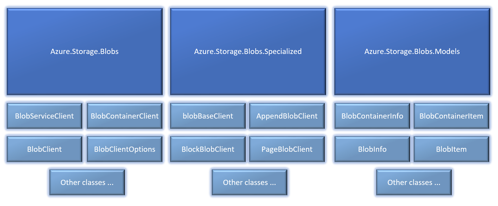

# Explore the .NET object model for Azure Blob Storage

This article gives you a tour of the Azure Blob Storage client library v12 for .NET. Use this guide to become familiar with the basic building blocks of the client object model. 

[Get started guide](storage-blob-dotnet-get-started.md) | [Package (NuGet)](https://www.nuget.org/packages/Azure.Storage.Blobs) | [Samples](../common/storage-samples-dotnet.md?toc=%2fazure%2fstorage%2fblobs%2ftoc.json#blob-samples) | [API reference](/dotnet/api/azure.storage.blobs) | [Library source code](https://github.com/Azure/azure-sdk-for-net/tree/master/sdk/storage/Azure.Storage.Blobs) | [Give Feedback](https://github.com/Azure/azure-sdk-for-net/issues)

## Shape of the library

The Azure Blob Storage client library v12 for .NET is organized into the three namespaces:

- [Azure.Storage.Blobs](/dotnet/api/azure.storage.blobs): Contains the primary classes that you can use to operate on the service, containers, and blobs.
- [Azure.Storage.Blobs.Specialized](/dotnet/api/azure.storage.blobs.specialized): Contains classes that you can use to perform operations specific to a blob type (For example: append blobs).
- [Azure.Storage.Blobs.Models](/dotnet/api/azure.storage.blobs.models): All other utility classes, structures, and enumeration types.

The following image shows each namespace and some of the classes available in them.

> [!div class="mx-imgBorder"]
> 


## Service, container, and blob clients

Blob storage offers three types of resources:

- The storage account
- A container in the storage account
- A blob in the container

The following diagram shows the relationship between these resources.


Each resource has .NET class. These are the primary classes: 

- [BlobServiceClient](/dotnet/api/azure.storage.blobs.blobserviceclient): The `BlobServiceClient` class allows you to manipulate Azure Storage resources and blob containers.
- [BlobContainerClient](/dotnet/api/azure.storage.blobs.blobcontainerclient): The `BlobContainerClient` class allows you to manipulate Azure Storage containers and their blobs.
- [BlobClient](/dotnet/api/azure.storage.blobs.blobclient): The `BlobClient` class allows you to manipulate Azure Storage blobs.

There also some more specialized classes that are described later in this article. 

## Service client

To interact with resources in the service instance, create a [BlobServiceClient](/dotnet/api/azure.storage.blobs.blobserviceclient). You can create one by using a constructor. You'll have to pass the constructor an authorization credential. You can use any of the following types of credentials.

- Azure Active Directory (Azure AD) token credential
- SAS token 
- Account key credential
- Connection string

The following example authorizes access by using a [DefaultAzureCredential](/dotnet/api/azure.identity.defaultazurecredential) instance. For more examples of how to create a service object instance, see [Get started with Azure Blob Storage and .NET](storage-blob-dotnet-get-started.md).


```csharp
public static void GetBlobServiceClient(ref BlobServiceClient blobServiceClient, string accountName)
{
    TokenCredential credential = new DefaultAzureCredential();

    string blobUri = "https://" + accountName + ".blob.core.windows.net";

        blobServiceClient = new BlobServiceClient(new Uri(blobUri), credential);          
}
```


## Container client

To interact with a container, create a [BlobContainerClient](/dotnet/api/azure.storage.blobs.blobcontainerclient). 

To work with an existing container, call the [GetBlobContainerClient](/dotnet/api/azure.storage.blobs.blobserviceclient.getblobcontainerclient) method of a [BlobServiceClient](/dotnet/api/azure.storage.blobs.blobserviceclient) instance. To create a container, call the [CreateBlobContainer](/dotnet/api/azure.storage.blobs.blobserviceclient.createblobcontainer) or [CreateBlobContainerAsync](/dotnet/api/azure.storage.blobs.blobserviceclient.createblobcontainerasync) method of a [BlobServiceClient](/dotnet/api/azure.storage.blobs.blobserviceclient) instance.

You can also create a container by using the one of the constructors of the [BlobContainerClient](/dotnet/api/azure.storage.blobs.blobcontainerclient) class. If you use a constructor, you'll have to authorize access to the Blob Storage service. You can use any of the following types of credentials.

- Azure Active Directory (Azure AD) token credential
- SAS token 
- Account key credential
- Connection string

The following example creates a container by calling the [GetBlobContainerClient](/dotnet/api/azure.storage.blobs.blobserviceclient.getblobcontainerclient) method of a [BlobServiceClient](/dotnet/api/azure.storage.blobs.blobserviceclient) instance.

```csharp
private static async Task<BlobContainerClient> 
    CreateSampleContainerAsync(BlobServiceClient blobServiceClient)
{
    string containerName = "container-" + Guid.NewGuid();

    BlobContainerClient container = await blobServiceClient.CreateBlobContainerAsync(containerName);

    if (await container.ExistsAsync())
    {
        Console.WriteLine("Created container {0}", container.Name);
        return container;
    }

    return null;
}
```

The following articles provide examples of how to use a [BlobContainerClient](/dotnet/api/azure.storage.blobs.blobcontainerclient) class.

- [Create a container](storage-blob-container-create.md)
- [Delete and restore a container](storage-blob-container-delete.md)
- [Manage container properties and metadata](storage-blob-container-properties-metadata.md)
- [List blobs in a container](storage-blobs-list.md)


## Blob client

To interact with a blob, create a [BlobClient](/dotnet/api/azure.storage.blobs.blobclient). 

You can create a [BlobClient](/dotnet/api/azure.storage.blobs.blobclient) by calling the [GetBlobClient](/dotnet/api/azure.storage.blobs.blobcontainerclient.getblobclient) method of a [BlobContainerClient](/dotnet/api/azure.storage.blobs.blobcontainerclient) instance. You can also create one by using a constructor. If you use a constructor, you'll have to authorize access to the Blob Storage service. You can use any of the following types of credentials.

- Azure Active Directory (Azure AD) token credential
- SAS token 
- Account key credential
- Connection string

The following example creates a [BlobClient](/dotnet/api/azure.storage.blobs.blobclient) by calling the [GetBlobClient](/dotnet/api/azure.storage.blobs.blobcontainerclient.getblobclient) method of a [BlobContainerClient](/dotnet/api/azure.storage.blobs.blobcontainerclient) instance. 

```csharp
public static async Task UploadFile
    (BlobContainerClient containerClient, string localFilePath)
{
    string fileName = Path.GetFileName(localFilePath);
    BlobClient blobClient = containerClient.GetBlobClient(fileName);

    await blobClient.UploadAsync(localFilePath, true);
}
```

The following articles provide examples of how to use a [BlobClient](/dotnet/api/azure.storage.blobs.blobclient).

- [Upload a blob](storage-blob-upload.md)
- [Download a blob](storage-blob-download.md)
- [Copy a blob](storage-blob-copy.md)
- [Delete and restore a blob](storage-blob-delete.md)
- [Find and use tags](storage-blob-tags.md)
- [Manage blob properties and metadata](storage-blob-properties-metadata.md)

### Specialized blob clients

There are three types of blobs: append blob, block blob, and page blob. See [this article](/rest/api/storageservices/understanding-block-blobs--append-blobs--and-page-blobs) to learn more about each one. 

The [BlobClient](/dotnet/api/azure.storage.blobs.blobclient) class contains methods and properties that apply to all of these blob types. For operations that are specific to a blob type, create one of the following specialized blob client classes.

- [AppendBlobClient](/dotnet/api/azure.storage.blobs.specialized.appendblobclient)
- [BlockBlobClient](/dotnet/api/azure.storage.blobs.specialized.blockblobclient)
- [PageBlobClient](/dotnet/api/azure.storage.blobs.specialized.pageblobclient)

For example, if you want to periodically append data to a log in Blob Storage, you'll need to create an append blob. To create an append blob, you'll need to create an instance of the [AppendBlobClient](/dotnet/api/azure.storage.blobs.specialized.appendblobclient) class. You can use methods in that class to append data to an append blob. You can still use the [BlobClient](/dotnet/api/azure.storage.blobs.blobclient) class to perform other operations on that blob. However, you'll have to use an [AppendBlobClient](/dotnet/api/azure.storage.blobs.specialized.appendblobclient) to perform append operations because those operations are specific to append blobs.

You can create an instance of any specialized client classes by using extension methods that are available on a [BlobContainerClient](/dotnet/api/azure.storage.blobs.blobcontainerclient) instance. The following example creates an [AppendBlobClient](/dotnet/api/azure.storage.blobs.specialized.appendblobclient) by calling the [GetAppendBlobClient](/dotnet/api/azure.storage.blobs.specialized.specializedblobextensions.getappendblobclient) extension method of the [BlobContainerClient](/dotnet/api/azure.storage.blobs.blobcontainerclient) instance.

```csharp
public static async void CreateAppendBlob
    (BlobContainerClient containerClient, string logBlobName)
{
   AppendBlobClient appendBlobClient = containerClient.GetAppendBlobClient(logBlobName);
   appendBlobClient.CreateIfNotExists();
}

```

For a complete example, see [Append data to a blob in Azure Storage using the .NET client library](storage-blob-append.md).

You can also create an instance of any specialized client classes by using one of their constructors. 

## See also

[Get started with Azure Blob Storage and .NET](storage-blob-dotnet-get-started.md)