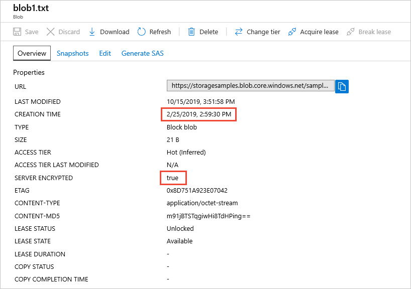

# Check the encryption status of a blob

Every block blob, append blob, or page blob in Azure Storage is encrypted with Azure Storage encryption. This article shows how to determine whether a specific blob has been encrypted.

For more information about Azure Storage encryption, see [Azure Storage encryption for data at rest](../common/storage-service-encryption.md).

## Check a blob's encryption status

Use the Azure portal, PowerShell, or Azure CLI to determine whether a blob is encrypted without code.

### [Azure portal](#tab/portal)

To use the Azure portal to check whether a blob has been encrypted, follow these steps:

1. In the Azure portal, navigate to your storage account.
1. Select **Containers** to navigate to a list of containers in the account.
1. Locate the blob and display its **Overview** tab.
1. View the **Server Encrypted** property. If **True**, as shown in the following image, then the blob is encrypted. Notice that the blob's properties also include the date and time that the blob was created.

    

### [PowerShell](#tab/powershell)

To use PowerShell to check whether a blob has been encrypted, check the blob's **IsServerEncrypted** property. Remember to replace placeholder values in angle brackets with your own values:

```powershell
$account = Get-AzStorageAccount -ResourceGroupName <resource-group> `
    -Name <storage-account>
$blob = Get-AzStorageBlob -Context $account.Context `
    -Container <container> `
    -Blob <blob>
$blob.ICloudBlob.Properties.IsServerEncrypted
```

To determine when the blob was created, check the value of the **Created** property:

```powershell
$blob.ICloudBlob.Properties.IsServerEncrypted
```

### [Azure CLI](#tab/cli)

To use Azure CLI to check whether a blob has been encrypted, check the blob's **IsServerEncrypted** property. Remember to replace placeholder values in angle brackets with your own values:

```azurecli-interactive
az storage blob show \
    --account-name <storage-account> \
    --container-name <container> \
    --name <blob> \
    --query "properties.serverEncrypted"
```

To determine when the blob was created, check the value of the **created** property.

---

## Next steps

[Azure Storage encryption for data at rest](../common/storage-service-encryption.md)
