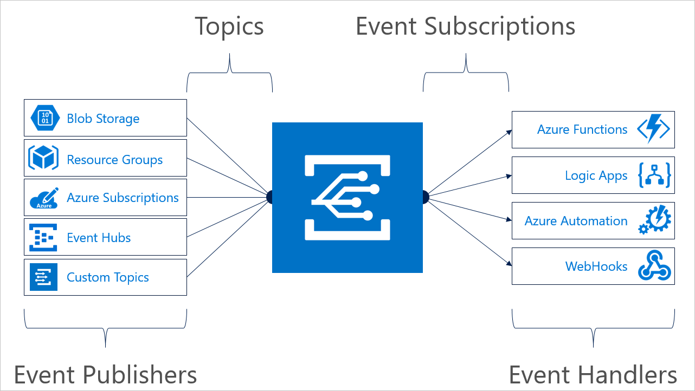

# Reacting to Blob storage events

Azure Storage events allow applications to react to events, such as the creation and deletion of blobs. It does so without the need for complicated code or expensive and inefficient polling services. The best part is you only pay for what you use.

Blob storage events are pushed using [Azure Event Grid](https://azure.microsoft.com/services/event-grid/) to subscribers such as Azure Functions, Azure Logic Apps, or even to your own http listener. Event Grid provides reliable event delivery to your applications through rich retry policies and dead-lettering.

See the [Blob storage events schema](../../event-grid/event-schema-blob-storage.md?toc=/azure/storage/blobs/toc.json) article to view the full list of the events that Blob storage supports.

Common Blob storage event scenarios include image or video processing, search indexing, or any file-oriented workflow. Asynchronous file uploads are a great fit for events. When changes are infrequent, but your scenario requires immediate responsiveness, event-based architecture can be especially efficient.

If you want to try blob storage events, see any of these quickstart articles:

|If you want to use this tool:    |See this article: |
|--|-|
|Azure portal    |[Quickstart: Route Blob storage events to web endpoint with the Azure portal](../../event-grid/blob-event-quickstart-portal.md?toc=/azure/storage/blobs/toc.json)|
|PowerShell    |[Quickstart: Route storage events to web endpoint with PowerShell](./storage-blob-event-quickstart-powershell.md?toc=/azure/storage/blobs/toc.json)|
|Azure CLI    |[Quickstart: Route storage events to web endpoint with Azure CLI](./storage-blob-event-quickstart.md?toc=/azure/storage/blobs/toc.json)|

To view in-depth examples of reacting to Blob storage events by using Azure functions, see these articles:

- [Tutorial: Use Azure Data Lake Storage Gen2 events to update a Databricks Delta table](data-lake-storage-events.md).
- [Tutorial: Automate resizing uploaded images using Event Grid](../../event-grid/resize-images-on-storage-blob-upload-event.md?tabs=dotnet)

> [!NOTE]
> **Storage (general purpose v1)** does *not* support integration with Event Grid.
++Storage accounts with CORS setting enabled should have the allowed orgins as * or Wildcard origin could only be at top level with http(s):// prefix, or simply * other wise the event subscription would fail to create.
## The event model

Event Grid uses [event subscriptions](../../event-grid/concepts.md#event-subscriptions) to route event messages to subscribers. This image illustrates the relationship between event publishers, event subscriptions, and event handlers.



First, subscribe an endpoint to an event. Then, when an event is triggered, the Event Grid service will send data about that event to the endpoint.

See the [Blob storage events schema](../../event-grid/event-schema-blob-storage.md?toc=/azure/storage/blobs/toc.json) article to view:

- A complete list of Blob storage events and how each event is triggered.

- An example of the data the Event Grid would send for each of these events.

- The purpose of each key value pair that appears in the data.

## Filtering events

Blob [events can be filtered](/cli/azure/eventgrid/event-subscription) by the event type, container name, or name of the object that was created/deleted. Filters in Event Grid match the beginning or end of the subject so events with a matching subject go to the subscriber.

To learn more about how to apply filters, see [Filter events for Event Grid](../../event-grid/how-to-filter-events.md).

The subject of Blob storage events uses the format:

```
/blobServices/default/containers/<containername>/blobs/<blobname>
```

To match all events for a storage account, you can leave the subject filters empty.

To match events from blobs created in a set of containers sharing a prefix, use a `subjectBeginsWith` filter like:

```
/blobServices/default/containers/containerprefix
```

To match events from blobs created in specific container, use a `subjectBeginsWith` filter like:

```
/blobServices/default/containers/containername/
```

To match events from blobs created in specific container sharing a blob name prefix, use a `subjectBeginsWith` filter like:

```
/blobServices/default/containers/containername/blobs/blobprefix
```

To match events from blobs created in specific container sharing a blob suffix, use a `subjectEndsWith` filter like ".log" or ".jpg". For more information, see [Event Grid Concepts](../../event-grid/concepts.md#event-subscriptions).

## Practices for consuming events

Applications that handle Blob storage events should follow a few recommended practices:

- As multiple subscriptions can be configured to route events to the same event handler, it is important not to assume events are from a particular source, but to check the topic of the message to ensure that it comes from the storage account you are expecting.

- Similarly, check that the eventType is one you are prepared to process, and do not assume that all events you receive will be the types you expect.

- There is no service level agreement around the time it takes for a message to arrive. It's not uncommon for messages to arrive anywhere from 30 minutes to two hours. As messages can arrive after some delay, use the etag fields to understand if your information about objects is still up-to-date. To learn how to use the etag field, see [Managing concurrency in Blob storage](./concurrency-manage.md?toc=/azure/storage/blobs/toc.json#managing-concurrency-in-blob-storage).  

- As messages can arrive out of order, use the sequencer fields to understand the order of events on any particular object. The sequencer field is a string value that represents the logical sequence of events for any particular blob name. You can use standard string comparison to understand the relative sequence of two events on the same blob name.

- Storage events guarantees at-least-once delivery to subscribers, which ensures that all messages are outputted. However due to retries between backend nodes and services or availability of subscriptions, duplicate messages may occur. To learn more about message delivery and retry, see [Event Grid message delivery and retry](../../event-grid/delivery-and-retry.md).

- Use the blobType field to understand what type of operations are allowed on the blob, and which client library types you should use to access the blob. Valid values are either `BlockBlob` or `PageBlob`.

- Use the url field with the `CloudBlockBlob` and `CloudAppendBlob` constructors to access the blob.

- Ignore fields you don't understand. This practice will help keep you resilient to new features that might be added in the future.

- If you want to ensure that the **Microsoft.Storage.BlobCreated** event is triggered only when a Block Blob is completely committed, filter the event for the `CopyBlob`, `PutBlob`, `PutBlockList` or `FlushWithClose` REST API calls. These API calls trigger the **Microsoft.Storage.BlobCreated** event only after data is fully committed to a Block Blob. To learn how to create a filter, see [Filter events for Event Grid](../../event-grid/how-to-filter-events.md).

## Feature support

[!INCLUDE [Blob Storage feature support in Azure Storage accounts](../../../includes/azure-storage-feature-support.md)]

## Next steps

Learn more about Event Grid and give Blob storage events a try:

- [About Event Grid](../../event-grid/overview.md)
- [Blob storage events schema](../../event-grid/event-schema-blob-storage.md?toc=/azure/storage/blobs/toc.json)
- [Route Blob storage Events to a custom web endpoint](storage-blob-event-quickstart.md)
