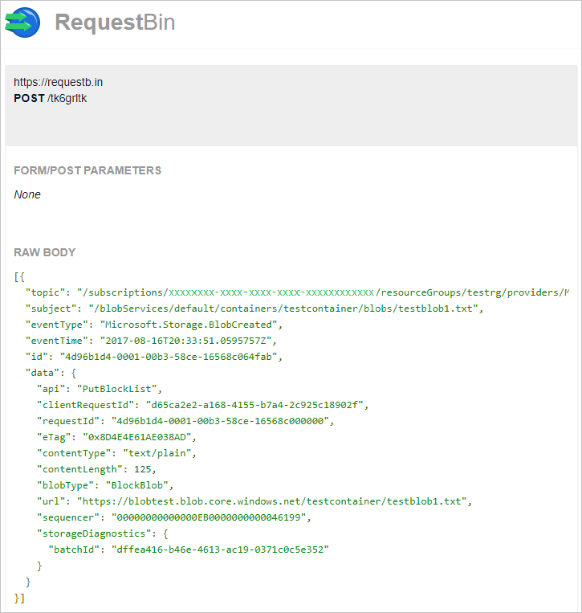

# Route Blob storage events to a custom web endpoint with PowerShell

Azure Event Grid is an eventing service for the cloud. In this article, you use Azure PowerShell to subscribe to Blob storage events, trigger an event, and view the result. 

Typically, you send events to an endpoint that responds to the event, such as a webhook or Azure Function. To simplify the example shown in this article, events are sent to a URL that merely collects the messages. You create this URL by using third-party tools from either [RequestBin](https://requestb.in/) or [Hookbin](https://hookbin.com/).

> [!NOTE]
> **RequestBin** and **Hookbin** are not intended for high throughput usage. The use of these tools is purely demonstrative. If you push more than one event at a time, you might not see all of your events in the tool.

When you complete the steps described in this article, you see that the event data has been sent to an endpoint.



## Setup

This article requires that you are running the latest version of Azure PowerShell. If you need to install or upgrade, see [Install and configure Azure PowerShell](/powershell/azure/install-azurerm-ps).

## Log in to Azure

Log in to your Azure subscription with the `Login-AzureRmAccount` command and follow the on-screen directions to authenticate.

```powershell
Login-AzureRmAccount
```

> [!NOTE]
> Availability for Storage events is tied to Event Grid [availability](../../event-grid/overview.md) and will become available in other regions as Event Grid does.

This example uses **westus2** and stores the selection in a variable for use throughout.

```powershell
$location = "westus2"
```

## Create a resource group

Event Grid topics are Azure resources, and must be placed in an Azure resource group. The resource group is a logical collection into which Azure resources are deployed and managed.

Create a resource group with the [New-AzureRmResourceGroup](/powershell/module/azurerm.resources/new-azurermresourcegroup) command.

The following example creates a resource group named **gridResourceGroup** in the **westus2** location.  

```powershell
$resourceGroup = "gridResourceGroup"
New-AzureRmResourceGroup -Name $resourceGroup -Location $location
```

## Create a storage account

To use Blob storage events, you need either a [Blob storage account](../common/storage-create-storage-account.md?toc=%2fazure%2fstorage%2fblobs%2ftoc.json#blob-storage-accounts) or a [General Purpose v2 storage account](../common/storage-account-options.md#general-purpose-v2). **General Purpose v2 (GPv2)** are storage accounts that support all features for all storage services, including Blobs, Files, Queues, and Tables. A **Blob storage account** is a specialized storage account for storing your unstructured data as blobs (objects) in Azure Storage. Blob storage accounts are like general-purpose storage accounts and share all the great durability, availability, scalability, and performance features that you use today including 100% API consistency for block blobs and append blobs. For applications requiring only block or append blob storage, we recommend using Blob storage accounts.  

Create a Blob storage account with LRS replication using [New-AzureRmStorageAccount](/powershell/module/azurerm.storage/New-AzureRmStorageAccount), then retrieve the storage account context that defines the storage account to be used. When acting on a storage account, you reference the context instead of repeatedly providing the credentials. This example creates a storage account called **gridstorage** with locally redundant storage(LRS) and blob encryption (enabled by default). 

> [!NOTE]
> Storage account names are in a global name space so you need to append some random characters to the name provided in this script.

```powershell
$storageName = "gridstorage"
$storageAccount = New-AzureRmStorageAccount -ResourceGroupName $resourceGroup `
  -Name $storageName `
  -Location $location `
  -SkuName Standard_LRS `
  -Kind BlobStorage `
  -AccessTier Hot

$ctx = $storageAccount.Context
```

## Create a message endpoint

Before subscribing to the topic, let's create the endpoint for the event message. Rather than write code to respond to the event, let's create an endpoint that collects the messages so you can view them. RequestBin and Hookbin are third-party tools that enable you to create an endpoint, and view requests that are sent to it. Go to [RequestBin](https://requestb.in/), and click **Create a RequestBin**, or go to [Hookbin](https://hookbin.com/) and click **Create New Endpoint**. Copy the bin URL and replace `<bin URL>` in the following script.

```powershell
$binEndPoint = "<bin URL>"
```

## Subscribe to your storage account

You subscribe to a topic to tell Event Grid which events you want to track. The following example subscribes to the storage account you created, and passes the URL from RequestBin or Hookbin as the endpoint for event notification. 

```powershell
$storageId = (Get-AzureRmStorageAccount -ResourceGroupName $resourceGroup -AccountName $storageName).Id
New-AzureRmEventGridSubscription `
  -EventSubscriptionName gridBlobQuickStart `
  -Endpoint $binEndPoint `
  -ResourceId $storageId
```

## Trigger an event from Blob storage

Now, let's trigger an event to see how Event Grid distributes the message to your endpoint. First, let's create a container and an object. Then, let's upload the object into the container.

```powershell
$containerName = "gridcontainer"
New-AzureStorageContainer -Name $containerName -Context $ctx

echo $null >> gridTestFile.txt

Set-AzureStorageBlobContent -File gridTestFile.txt -Container $containerName -Context $ctx -Blob gridTestFile.txt
```

You have triggered the event, and Event Grid sent the message to the endpoint you configured when subscribing. Browse to the endpoint URL that you created earlier. Or, click refresh in your open browser. You see the event you just sent. 

```json
[{
  "topic": "/subscriptions/xxxxxxxx-xxxx-xxxx-xxxx-xxxxxxxxxxxx/resourceGroups/myrg/providers/Microsoft.Storage/storageAccounts/myblobstorageaccount",
  "subject": "/blobServices/default/containers/gridcontainer/blobs/gridTestFile.txt",
  "eventType": "Microsoft.Storage.BlobCreated",
  "eventTime": "2017-08-16T20:33:51.0595757Z",
  "id": "4d96b1d4-0001-00b3-58ce-16568c064fab",
  "data": {
    "api": "PutBlockList",
    "clientRequestId": "Azure-Storage-PowerShell-d65ca2e2-a168-4155-b7a4-2c925c18902f",
    "requestId": "4d96b1d4-0001-00b3-58ce-16568c000000",
    "eTag": "0x8D4E4E61AE038AD",
    "contentType": "application/octet-stream",
    "contentLength": 0,
    "blobType": "BlockBlob",
    "url": "https://myblobstorageaccount.blob.core.windows.net/gridcontainer/gridTestFile.txt",
    "sequencer": "00000000000000EB0000000000046199",
    "storageDiagnostics": {
      "batchId": "dffea416-b46e-4613-ac19-0371c0c5e352"
    }
  },
  "dataVersion": "",
  "metadataVersion": "1"
}]

```

## Clean up resources
If you plan to continue working with this storage account and event subscription, do not clean up the resources created in this article. If you do not plan to continue, use the following command to delete the resources you created in this article.

```powershell
Remove-AzureRmResourceGroup -Name $resourceGroup
```

## Next steps

Now that you know how to create topics and event subscriptions, learn more about Blob storage Events and what Event Grid can help you do:

- [Reacting to Blob storage events](storage-blob-event-overview.md)
- [About Event Grid](../../event-grid/overview.md)
