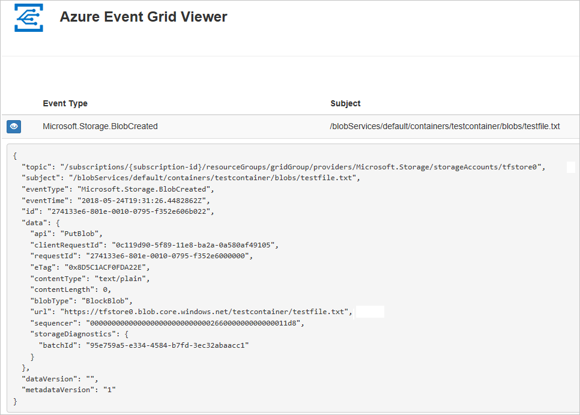

# Quickstart: Route storage events to web endpoint with PowerShell

Azure Event Grid is an eventing service for the cloud. In this article, you use Azure PowerShell to subscribe to Blob storage events, trigger an event, and view the result. 

Typically, you send events to an endpoint that processes the event data and takes actions. However, to simplify this article, you send the events to a web app that collects and displays the messages.

When you're finished, you see that the event data has been sent to the web app.



## Setup

[!INCLUDE [updated-for-az](../../../includes/updated-for-az.md)]

This article requires that you're running the latest version of Azure PowerShell. If you need to install or upgrade, see [Install and configure Azure PowerShell](/powershell/azure/install-Az-ps).

## Sign in to Azure

Sign in to your Azure subscription with the `Connect-AzAccount` command and follow the on-screen directions to authenticate.

```powershell
Connect-AzAccount
```

This example uses **westus2** and stores the selection in a variable for use throughout.

```powershell
$location = "westus2"
```

## Create a resource group

Event Grid topics are Azure resources, and must be placed in an Azure resource group. The resource group is a logical collection into which Azure resources are deployed and managed.

Create a resource group with the [New-AzResourceGroup](/powershell/module/az.resources/new-azresourcegroup) command.

The following example creates a resource group named **gridResourceGroup** in the **westus2** location.  

```powershell
$resourceGroup = "gridResourceGroup"
New-AzResourceGroup -Name $resourceGroup -Location $location
```

## Create a storage account

Blob storage events are available in general-purpose v2 storage accounts and Blob storage accounts. **General-purpose v2** storage accounts  support all features for all storage services, including Blobs, Files, Queues, and Tables. A **Blob storage account** is a specialized storage account for storing your unstructured data as blobs (objects) in Azure Storage. Blob storage accounts are like general-purpose storage accounts and share all the great durability, availability, scalability, and performance features that you use today including 100% API consistency for block blobs and append blobs. For more information, see [Azure storage account overview](../common/storage-account-overview.md).

Create a Blob storage account with LRS replication using [New-AzStorageAccount](/powershell/module/az.storage/New-azStorageAccount), then retrieve the storage account context that defines the storage account to be used. When acting on a storage account, you reference the context instead of repeatedly providing the credentials. This example creates a storage account called **gridstorage** with locally redundant storage (LRS). 

> [!NOTE]
> Storage account names are in a global name space so you need to append some random characters to the name provided in this script.

```powershell
$storageName = "gridstorage"
$storageAccount = New-AzStorageAccount -ResourceGroupName $resourceGroup `
  -Name $storageName `
  -Location $location `
  -SkuName Standard_LRS `
  -Kind BlobStorage `
  -AccessTier Hot

$ctx = $storageAccount.Context
```

## Create a message endpoint

Before subscribing to the topic, let's create the endpoint for the event message. Typically, the endpoint takes actions based on the event data. To simplify this quickstart, you deploy a [pre-built web app](https://github.com/Azure-Samples/azure-event-grid-viewer) that displays the event messages. The deployed solution includes an App Service plan, an App Service web app, and source code from GitHub.

Replace `<your-site-name>` with a unique name for your web app. The web app name must be unique because it's part of the DNS entry.

```powershell
$sitename="<your-site-name>"

New-AzResourceGroupDeployment `
  -ResourceGroupName $resourceGroup `
  -TemplateUri "https://raw.githubusercontent.com/Azure-Samples/azure-event-grid-viewer/master/azuredeploy.json" `
  -siteName $sitename `
  -hostingPlanName viewerhost
```

The deployment may take a few minutes to complete. After the deployment has succeeded, view your web app to make sure it's running. In a web browser, navigate to: `https://<your-site-name>.azurewebsites.net`

You should see the site with no messages currently displayed.

[!INCLUDE [event-grid-register-provider-powershell.md](../../../includes/event-grid-register-provider-powershell.md)]

## Subscribe to your storage account

You subscribe to a topic to tell Event Grid which events you want to track. The following example subscribes to the storage account you created, and passes the URL from your web app as the endpoint for event notification. The endpoint for your web app must include the suffix `/api/updates/`.

```powershell
$storageId = (Get-AzStorageAccount -ResourceGroupName $resourceGroup -AccountName $storageName).Id
$endpoint="https://$sitename.azurewebsites.net/api/updates"

New-AzEventGridSubscription `
  -EventSubscriptionName gridBlobQuickStart `
  -Endpoint $endpoint `
  -ResourceId $storageId
```

View your web app again, and notice that a subscription validation event has been sent to it. Select the eye icon to expand the event data. Event Grid sends the validation event so the endpoint can verify that it wants to receive event data. The web app includes code to validate the subscription.


## Trigger an event from Blob storage

Now, let's trigger an event to see how Event Grid distributes the message to your endpoint. First, let's create a container and an object. Then, let's upload the object into the container.

```powershell
$containerName = "gridcontainer"
New-AzStorageContainer -Name $containerName -Context $ctx

echo $null >> gridTestFile.txt

Set-AzStorageBlobContent -File gridTestFile.txt -Container $containerName -Context $ctx -Blob gridTestFile.txt
```

You've triggered the event, and Event Grid sent the message to the endpoint you configured when subscribing. View your web app to see the event you just sent.

```json
[{
  "topic": "/subscriptions/xxxxxxxx-xxxx-xxxx-xxxx-xxxxxxxxxxxx/resourceGroups/myrg/providers/Microsoft.Storage/storageAccounts/myblobstorageaccount",
  "subject": "/blobServices/default/containers/gridcontainer/blobs/gridTestFile.txt",
  "eventType": "Microsoft.Storage.BlobCreated",
  "eventTime": "2017-08-16T20:33:51.0595757Z",
  "id": "4d96b1d4-0001-00b3-58ce-16568c064fab",
  "data": {
    "api": "PutBlockList",
    "clientRequestId": "Azure-Storage-PowerShell-d65ca2e2-a168-4155-b7a4-2c925c18902f",
    "requestId": "4d96b1d4-0001-00b3-58ce-16568c000000",
    "eTag": "0x8D4E4E61AE038AD",
    "contentType": "application/octet-stream",
    "contentLength": 0,
    "blobType": "BlockBlob",
    "url": "https://myblobstorageaccount.blob.core.windows.net/gridcontainer/gridTestFile.txt",
    "sequencer": "00000000000000EB0000000000046199",
    "storageDiagnostics": {
      "batchId": "dffea416-b46e-4613-ac19-0371c0c5e352"
    }
  },
  "dataVersion": "",
  "metadataVersion": "1"
}]

```

## Clean up resources
If you plan to continue working with this storage account and event subscription, don't clean up the resources created in this article. If you don't plan to continue, use the following command to delete the resources you created in this article.

```powershell
Remove-AzResourceGroup -Name $resourceGroup
```

## Next steps

Now that you know how to create topics and event subscriptions, learn more about Blob storage Events and what Event Grid can help you do:

- [Reacting to Blob storage events](storage-blob-event-overview.md)
- [About Event Grid](../../event-grid/overview.md)
