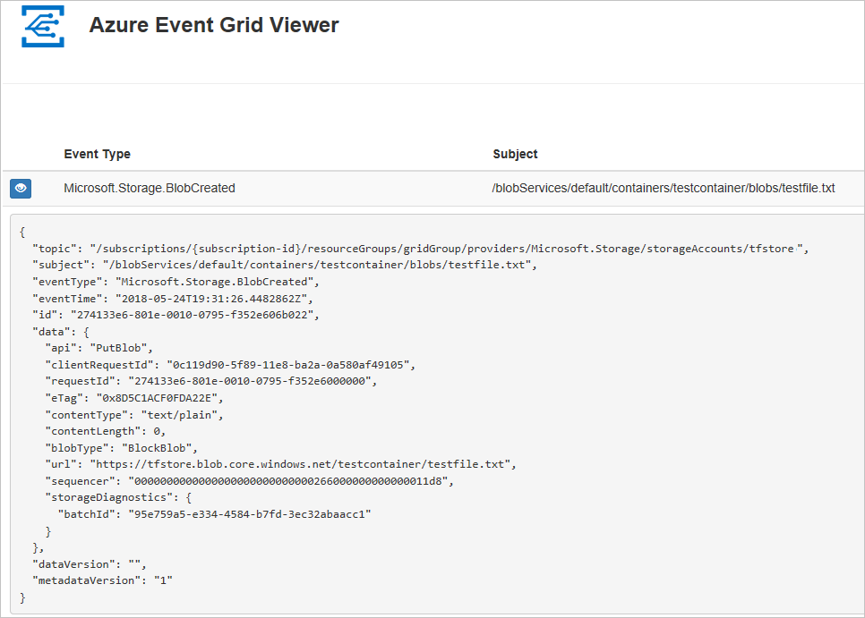

# Route Blob storage events to a custom web endpoint with Azure CLI

Azure Event Grid is an eventing service for the cloud. In this article, you use the Azure CLI to subscribe to Blob storage events, and trigger the event to view the result.

Typically, you send events to an endpoint that processes the event data and takes actions. However, to simplify this article, you send the events to a web app that collects and displays the messages.

When you complete the steps described in this article, you see that the event data has been sent to the web app.




[!INCLUDE [quickstarts-free-trial-note.md](../../../includes/quickstarts-free-trial-note.md)]

[!INCLUDE [cloud-shell-try-it.md](../../../includes/cloud-shell-try-it.md)]

If you choose to install and use the CLI locally, this article requires that you are running the latest version of Azure CLI (2.0.24 or later). To find the version, run `az --version`. If you need to install or upgrade, see [Install Azure CLI](/cli/azure/install-azure-cli).

If you are not using Cloud Shell, you must first sign in using `az login`.

## Create a resource group

Event Grid topics are Azure resources, and must be placed in an Azure resource group. The resource group is a logical collection into which Azure resources are deployed and managed.

Create a resource group with the [az group create](/cli/azure/group#az_group_create) command. 

The following example creates a resource group named `<resource_group_name>` in the *westcentralus* location.  Replace `<resource_group_name>` with a unique name for your resource group.

```azurecli-interactive
az group create --name <resource_group_name> --location westcentralus
```

## Create a storage account

Blob storage events are available in general-purpose v2 storage accounts and Blob storage accounts. **General-purpose v2** storage accounts  support all features for all storage services, including Blobs, Files, Queues, and Tables. A **Blob storage account** is a specialized storage account for storing your unstructured data as blobs (objects) in Azure Storage. Blob storage accounts are like general-purpose storage accounts and share all the great durability, availability, scalability, and performance features that you use today including 100% API consistency for block blobs and append blobs. For more information, see [Azure storage account overview](../common/storage-account-overview.md).

Replace `<storage_account_name>` with a unique name for your storage account, and `<resource_group_name>` with the resource group you created earlier.

```azurecli-interactive
az storage account create \
  --name <storage_account_name> \
  --location westcentralus \
  --resource-group <resource_group_name> \
  --sku Standard_LRS \
  --kind BlobStorage \
  --access-tier Hot
```

## Create a message endpoint

Before subscribing to the topic, let's create the endpoint for the event message. Typically, the endpoint takes actions based on the event data. To simplify this quickstart, you deploy a [pre-built web app](https://github.com/Azure-Samples/azure-event-grid-viewer) that displays the event messages. The deployed solution includes an App Service plan, an App Service web app, and source code from GitHub.

Replace `<your-site-name>` with a unique name for your web app. The web app name must be unique because it's part of the DNS entry.

```azurecli-interactive
sitename=<your-site-name>

az group deployment create \
  --resource-group <resource_group_name> \
  --template-uri "https://raw.githubusercontent.com/Azure-Samples/azure-event-grid-viewer/master/azuredeploy.json" \
  --parameters siteName=$sitename hostingPlanName=viewerhost
```

The deployment may take a few minutes to complete. After the deployment has succeeded, view your web app to make sure it's running. In a web browser, navigate to: `https://<your-site-name>.azurewebsites.net`

You should see the site with no messages currently displayed.

[!INCLUDE [event-grid-register-provider-cli.md](../../../includes/event-grid-register-provider-cli.md)]

## Subscribe to your storage account

You subscribe to a topic to tell Event Grid which events you want to track and where to send those events. The following example subscribes to the storage account you created, and passes the URL from your web app as the endpoint for event notification. Replace `<event_subscription_name>` with a name for your event subscription. For `<resource_group_name>` and `<storage_account_name>`, use the values you created earlier.

The endpoint for your web app must include the suffix `/api/updates/`.

```azurecli-interactive
storageid=$(az storage account show --name <storage_account_name> --resource-group <resource_group_name> --query id --output tsv)
endpoint=https://$sitename.azurewebsites.net/api/updates

az eventgrid event-subscription create \
  --resource-id $storageid \
  --name <event_subscription_name> \
  --endpoint $endpoint
```

View your web app again, and notice that a subscription validation event has been sent to it. Select the eye icon to expand the event data. Event Grid sends the validation event so the endpoint can verify that it wants to receive event data. The web app includes code to validate the subscription.


## Trigger an event from Blob storage

Now, let's trigger an event to see how Event Grid distributes the message to your endpoint. First, let's configure the name and key for the storage account, then we create a container, then create and upload a file. Again, use the values for `<storage_account_name>` and `<resource_group_name>`  you created earlier.

```azurecli-interactive
export AZURE_STORAGE_ACCOUNT=<storage_account_name>
export AZURE_STORAGE_ACCESS_KEY="$(az storage account keys list --account-name <storage_account_name> --resource-group <resource_group_name> --query "[0].value" --output tsv)"

az storage container create --name testcontainer

touch testfile.txt
az storage blob upload --file testfile.txt --container-name testcontainer --name testfile.txt
```

You have triggered the event, and Event Grid sent the message to the endpoint you configured when subscribing. View your web app to see the event you just sent.


```json
[{
  "topic": "/subscriptions/xxxxxxxx-xxxx-xxxx-xxxx-xxxxxxxxxxxx/resourceGroups/myrg/providers/Microsoft.Storage/storageAccounts/myblobstorageaccount",
  "subject": "/blobServices/default/containers/testcontainer/blobs/testfile.txt",
  "eventType": "Microsoft.Storage.BlobCreated",
  "eventTime": "2017-08-16T20:33:51.0595757Z",
  "id": "4d96b1d4-0001-00b3-58ce-16568c064fab",
  "data": {
    "api": "PutBlockList",
    "clientRequestId": "d65ca2e2-a168-4155-b7a4-2c925c18902f",
    "requestId": "4d96b1d4-0001-00b3-58ce-16568c000000",
    "eTag": "0x8D4E4E61AE038AD",
    "contentType": "text/plain",
    "contentLength": 0,
    "blobType": "BlockBlob",
    "url": "https://myblobstorageaccount.blob.core.windows.net/testcontainer/testblob1.txt",
    "sequencer": "00000000000000EB0000000000046199",
    "storageDiagnostics": {
      "batchId": "dffea416-b46e-4613-ac19-0371c0c5e352"
    }
  },
  "dataVersion": "",
  "metadataVersion": "1"
}]

```

## Clean up resources
If you plan to continue working with this storage account and event subscription, do not clean up the resources created in this article. If you do not plan to continue, use the following command to delete the resources you created in this article.

Replace `<resource_group_name>` with the resource group you created above.

```azurecli-interactive
az group delete --name <resource_group_name>
```

## Next steps

Now that you know how to create topics and event subscriptions, learn more about Blob storage Events and what Event Grid can help you do:

- [Reacting to Blob storage events](storage-blob-event-overview.md)
- [About Event Grid](../../event-grid/overview.md)
