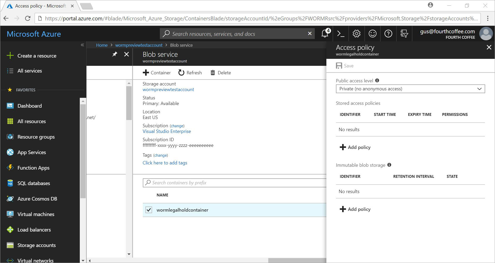
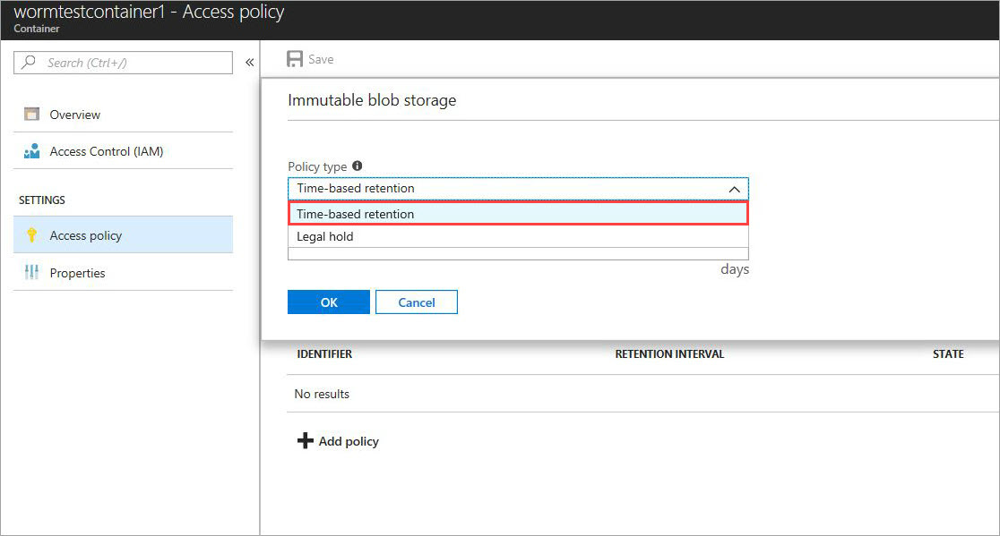
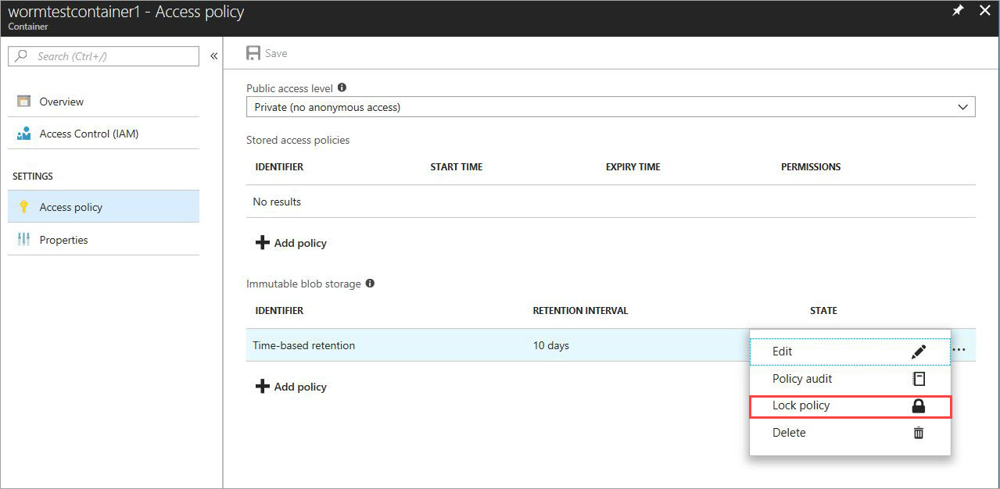
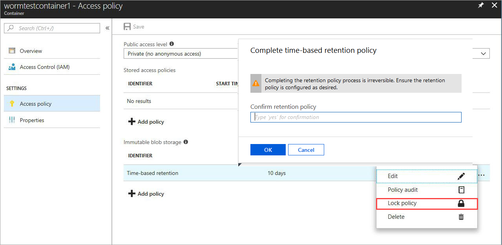
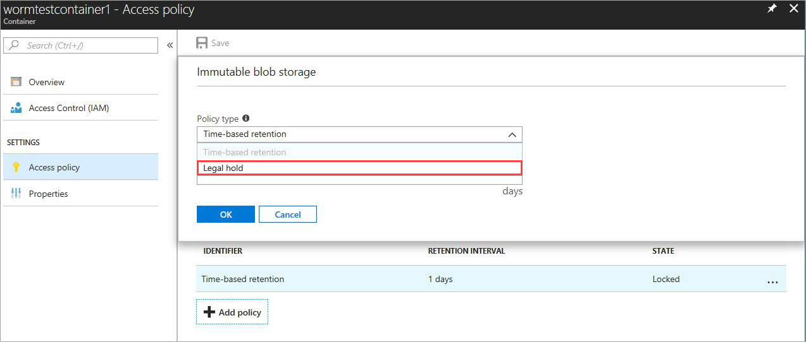
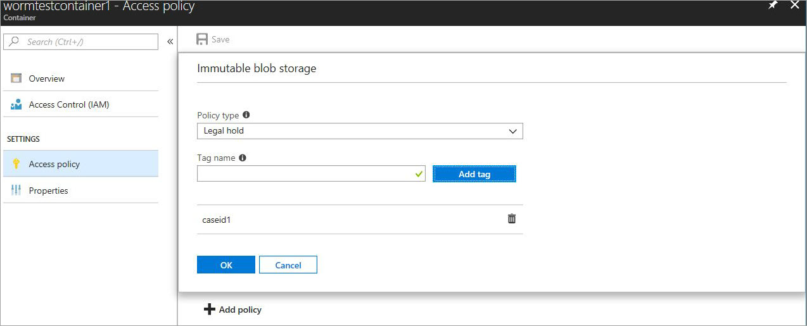
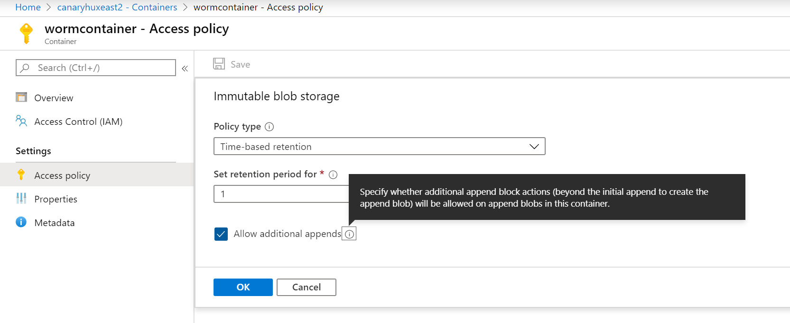

# Set and manage immutability policies for Blob storage

Immutable storage for Azure Blob storage enables users to store business-critical data objects in a WORM (Write Once, Read Many) state. This state makes the data non-erasable and non-modifiable for a user-specified interval. For the duration of the retention interval, blobs can be created and read, but cannot be modified or deleted. Immutable storage is available for general-purpose v2 and Blob storage accounts in all Azure regions.

This article shows how to set and manage immutability policies and legal holds for data in Blob storage using the Azure portal, PowerShell, or Azure CLI. For more information about immutable storage, see [Store business-critical blob data with immutable storage](storage-blob-immutable-storage.md).

## Prerequisites

The following prerequisites are required to use version-level WORM:

- Blob versioning must be enabled for the storage account. To learn how to enable blob versioning, see [Enable and manage blob versioning](versioning-enable.md).
- The storage account must be either a general-purpose v2 storage account or a premium storage account for block blobs.

All access tiers and redundancy configurations are supported. However, if the storage account is geo-replicated to a secondary region, then customer-initiated failover is not supported.

Storage accounts with a hierarchical namespace are not supported.

## Enable version-level immutability for a container

To use a version-level immutability policy, you must explicitly enable support for version-level WORM on the container. You can enable support for version-level WORM either when you create the container, or when you add a version-level immutability policy to an existing container.

To create a container that supports version-level immutability in the Azure portal, follow these steps:

1. Navigate to the **Containers** page for your storage account in the Azure portal, and select **Add**.
1. In the **New container** dialog, provide a name for your container, then expand the **Advanced** section.
1. Select **Enable version-level immutability support** to enable ??? for the container.

    :::image type="content" source="media/storage-blob-immutability-policies-manage/create-container-version-level-immutability.png" alt-text="Screenshot showing how to create a container with version-level immutability enabled":::

## Apply a default immutability policy to a container

To apply a default version-level immutability policy to a container in the Azure portal, follow these steps:

1. In the Azure portal, navigate to the **Containers** page, and locate the container to which you want to apply the policy.
1. Select the **More** button to the right of the container name, and choose **Access policy**.
1. In the **Access policy** dialog, under the **Immutable blob storage** section, choose **Add policy**.
1. Select the type of policy you wish to apply to the container, either a time-based retention policy or a legal hold.
1. 

## Migrate a container-based policy to a version-level policy

To enable support for version-level immutability for an existing container that has one or more blobs???, you must migrate the container to 

## Set retention policies and legal holds

### [Portal](#tab/azure-portal)

1. Create a new container or select an existing container to store the blobs that need to be kept in the immutable state. The container must be in a general-purpose v2 or Blob storage account.

2. Select **Access policy** in the container settings. Then select **Add policy** under **Immutable blob storage**.

    

3. To enable time-based retention, select **Time-based retention** from the drop-down menu.

    

4. Enter the retention interval in days (acceptable values are 1 to 146000 days).

    

    The initial state of the policy is unlocked allowing you to test the feature and make changes to the policy before you lock it. Locking the policy is essential for compliance with regulations like SEC 17a-4.

5. Lock the policy. Right-click the ellipsis (**...**), and the following menu appears with additional actions:

    

6. Select **Lock Policy** and confirm the lock. The policy is now locked and cannot be deleted, only extensions of the retention interval will be allowed. Blob deletes and overrides are not permitted. 

    

7. To enable legal holds, select **Add Policy**. Select **Legal hold** from the drop-down menu.

    

8. Create a legal hold with one or more tags.

    

9. To clear a legal hold, remove the applied legal hold identifier tag.

### [Azure CLI](#tab/azure-cli)

The feature is included in the following command groups:
`az storage container immutability-policy`  and `az storage container legal-hold`. Run `-h` on them to see the commands.

### [PowerShell](#tab/azure-powershell)

[!INCLUDE [updated-for-az](../../../includes/updated-for-az.md)]

The Az.Storage module supports immutable storage.  To enable the feature, follow these steps:

1. Ensure that you have the latest version of PowerShellGet installed: `Install-Module PowerShellGet –Repository PSGallery –Force`.
2. Remove any previous installation of Azure PowerShell.
3. Install Azure PowerShell: `Install-Module Az –Repository PSGallery –AllowClobber`.

The following sample PowerShell script is for reference. This script creates a new storage account and container. It then shows you how to set and clear legal holds, create, and lock a time-based retention policy (also known as an immutability policy), and extend the retention interval.

First, create an Azure Storage account:

```powershell
$resourceGroup = "<Enter your resource group>"
$storageAccount = "<Enter your storage account name>"
$container = "<Enter your container name>"
$location = "<Enter the storage account location>"

# Log in to Azure
Connect-AzAccount
Register-AzResourceProvider -ProviderNamespace "Microsoft.Storage"

# Create your Azure resource group
New-AzResourceGroup -Name $resourceGroup -Location $location

# Create your Azure storage account
$account = New-AzStorageAccount -ResourceGroupName $resourceGroup -StorageAccountName `
    $storageAccount -SkuName Standard_ZRS -Location $location -Kind StorageV2

# Create a new container using the context
$container = New-AzStorageContainer -Name $container -Context $account.Context

# List the containers in the account
Get-AzStorageContainer -Context $account.Context

# Remove a container
Remove-AzStorageContainer -Name $container -Context $account.Context
```

Set and clear legal holds:

```powershell
# Set a legal hold
Add-AzRmStorageContainerLegalHold -ResourceGroupName $resourceGroup `
    -StorageAccountName $storageAccount -Name $container -Tag <tag1>,<tag2>,...

# Clear a legal hold
Remove-AzRmStorageContainerLegalHold -ResourceGroupName $resourceGroup `
    -StorageAccountName $storageAccount -Name $container -Tag <tag3>
```

Create or update time-based immutability policies:

```powershell
# Create a time-based immutability policy
Set-AzRmStorageContainerImmutabilityPolicy -ResourceGroupName $resourceGroup `
    -StorageAccountName $storageAccount -ContainerName $container -ImmutabilityPeriod 10
```

Retrieve immutability policies:

```powershell
# Get an immutability policy
Get-AzRmStorageContainerImmutabilityPolicy -ResourceGroupName $resourceGroup `
    -StorageAccountName $storageAccount -ContainerName $container
```

Lock immutability policies (add `-Force` to dismiss the prompt):

```powershell
# Lock immutability policies
$policy = Get-AzRmStorageContainerImmutabilityPolicy -ResourceGroupName `
    $resourceGroup -StorageAccountName $storageAccount -ContainerName $container
Lock-AzRmStorageContainerImmutabilityPolicy -ResourceGroupName `
    $resourceGroup -StorageAccountName $storageAccount -ContainerName $container `
    -Etag $policy.Etag
```

Extend immutability policies:

```powershell
# Extend immutability policies
$policy = Get-AzRmStorageContainerImmutabilityPolicy -ResourceGroupName `
    $resourceGroup -StorageAccountName $storageAccount -ContainerName $container

Set-AzRmStorageContainerImmutabilityPolicy -ImmutabilityPolicy `
    $policy -ImmutabilityPeriod 11 -ExtendPolicy
```

Remove an unlocked immutability policy (add `-Force` to dismiss the prompt):

```powershell
# Remove an unlocked immutability policy
$policy = Get-AzRmStorageContainerImmutabilityPolicy -ResourceGroupName `
    $resourceGroup -StorageAccountName $storageAccount -ContainerName $container

Remove-AzRmStorageContainerImmutabilityPolicy -ImmutabilityPolicy $policy
```

---

## Enabling allow protected append blobs writes

### [Portal](#tab/azure-portal)



### [Azure CLI](#tab/azure-cli)

The feature is included in the following command groups:
`az storage container immutability-policy`  and `az storage container legal-hold`. Run `-h` on them to see the commands.

### [PowerShell](#tab/azure-powershell)

```powershell
# Create an immutability policy with appends allowed
Set-AzRmStorageContainerImmutabilityPolicy -ResourceGroupName $resourceGroup `
    -StorageAccountName $storageAccount -ContainerName $container -ImmutabilityPeriod 10 -AllowProtectedAppendWrite $true
```

---

## Next steps

[Store business-critical blob data with immutable storage](storage-blob-immutable-storage.md)
