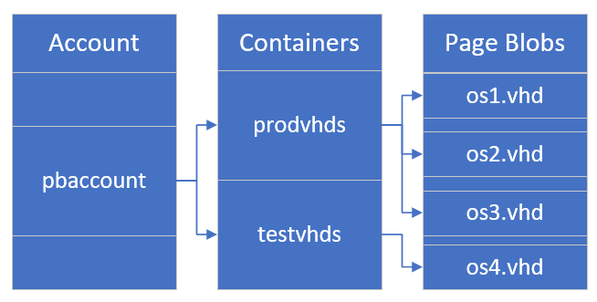
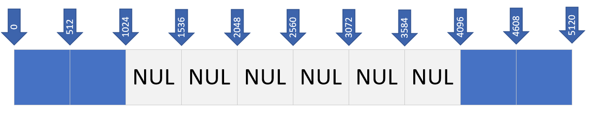
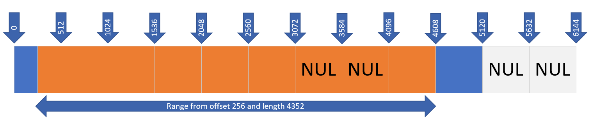

# Overview of Azure page blobs

Azure Storage offers three types of blob storage: Block Blobs, Append Blobs and page blobs. Block blobs are composed of blocks and are ideal for storing text or binary files, and for uploading large files efficiently. Append blobs are also made up of blocks, but they are optimized for append operations, making them ideal for logging scenarios. Page blobs are made up of 512-byte pages up to 8 TB in total size and are designed for frequent random read/write operations. Page blobs are the foundation of Azure IaaS Disks. This article focuses on explaining the features and benefits of page blobs.

Page blobs are a collection of 512-byte pages, which provide the ability to read/write arbitrary ranges of bytes. Hence, page blobs are ideal for storing index-based and sparse data structures like OS and data disks for Virtual Machines and Databases. For example, Azure SQL DB uses page blobs as the underlying persistent storage for its databases. Moreover, page blobs are also often used for files with Range-Based updates.

Key features of Azure page blobs are its REST interface, the durability of the underlying storage, and the seamless migration capabilities to Azure. These features are discussed in more detail in the next section. In addition, Azure page blobs are currently supported on two types of storage: Premium Storage and Standard Storage. Premium Storage is designed specifically for workloads requiring consistent high performance and low latency making premium page blobs ideal for high performance storage scenarios. Standard storage accounts are more cost effective for running latency-insensitive workloads.

## Restrictions

Page blobs can only use the **Hot** access tier, they cannot use either the **Cool** or **Archive** tiers. For more information on access tiers, see [Hot, Cool, and Archive access tiers for blob data](access-tiers-overview.md).

## Sample use cases

Let's discuss a couple of use cases for page blobs starting with Azure IaaS Disks. Azure page blobs are the backbone of the virtual disks platform for Azure IaaS. Both Azure OS and data disks are implemented as virtual disks where data is durably persisted in the Azure Storage platform and then delivered to the virtual machines for maximum performance. Azure Disks are persisted in Hyper-V [VHD format](/previous-versions/windows/it-pro/windows-7/dd979539(v=ws.10)) and stored as a [page blob](/rest/api/storageservices/Understanding-Block-Blobs--Append-Blobs--and-Page-Blobs#about-page-blobs) in Azure Storage. In addition to using virtual disks for Azure IaaS VMs, page blobs also enable PaaS and DBaaS scenarios such as Azure SQL DB service, which currently uses page blobs for storing SQL data, enabling fast random read-write operations for the database. Another example would be if you have a PaaS service for shared media access for collaborative video editing applications, page blobs enable fast access to random locations in the media. It also enables fast and efficient editing and merging of the same media by multiple users.

First party Microsoft services like Azure Site Recovery, Azure Backup, as well as many third-party developers have implemented industry-leading innovations using page blob's REST interface. Following are some of the unique scenarios implemented on Azure:

- Application-directed incremental snapshot management: Applications can leverage page blob snapshots and REST APIs for saving the application checkpoints without incurring costly duplication of data. Azure Storage supports local snapshots for page blobs, which don't require copying the entire blob. These public snapshot APIs also enable accessing and copying of deltas between snapshots.
- Live migration of application and data from on premises to cloud: Copy the on premises data and use REST APIs to write directly to an Azure page blob while the on premises VM continues to run. Once the target has caught up, you can quickly failover to Azure VM using that data. In this way, you can migrate your VMs and virtual disks from on premises to cloud with minimal downtime since the data migration occurs in the background while you continue to use the VM and the downtime needed for failover will be short (in minutes).
- [SAS-based](../common/storage-sas-overview.md) shared access, which enables scenarios like multiple-readers and single-writer with support for concurrency control.

Unmanaged disks are being retired, for details see [Migrate your Azure unmanaged disks by September 30, 2025](../../virtual-machines/unmanaged-disks-deprecation.md).

## Pricing

Both types of storage offered with page blobs have their own pricing model. Premium page blobs follow the managed disks pricing model, while standard page blobs are billed on used size and with each transaction. For more information, see the [Azure Page Blobs pricing page](https://azure.microsoft.com/pricing/details/storage/page-blobs/).

## Page blob features

### REST API

Refer to the following document to get started with [developing using page blobs](./storage-quickstart-blobs-dotnet.md). As an example, look at how to access page blobs using Storage Client Library for .NET.

The following diagram describes the overall relationships between account, containers, and page blobs.

#### Creating an empty page blob of a specified size

First, get a reference to a container. To create a page blob, call the GetPageBlobClient method, and then call the [PageBlobClient.Create](/dotnet/api/azure.storage.blobs.specialized.pageblobclient.create) method. Pass in the max size for the blob to create. That size must be a multiple of 512 bytes.

:::code language="csharp" source="~/azure-storage-snippets/blobs/howto/dotnet/dotnet-v12/CRUD.cs" id="Snippet_CreatePageBlob":::

#### Resizing a page blob

To resize a page blob after creation, use the [Resize](/dotnet/api/azure.storage.blobs.specialized.pageblobclient.resize) method. The requested size should be a multiple of 512 bytes.

:::code language="csharp" source="~/azure-storage-snippets/blobs/howto/dotnet/dotnet-v12/CRUD.cs" id="Snippet_ResizePageBlob":::

#### Writing pages to a page blob

To write pages,  use the [PageBlobClient.UploadPages](/dotnet/api/azure.storage.blobs.specialized.pageblobclient.uploadpages) method.

:::code language="csharp" source="~/azure-storage-snippets/blobs/howto/dotnet/dotnet-v12/CRUD.cs" id="Snippet_WriteToPageBlob":::

This allows you to write a sequential set of pages up to 4MBs. The offset being written to must start on a 512-byte boundary (startingOffset % 512 == 0), and end on a 512 boundary - 1.

As soon as a write request for a sequential set of pages succeeds in the blob service and is replicated for durability and resiliency, the write has committed, and success is returned back to the client.

The below diagram shows 2 separate write operations:

1. A Write operation starting at offset 0 of length 1024 bytes 
2. A Write operation starting at offset 4096 of length 1024

#### Reading pages from a page blob

To read pages, use the [PageBlobClient.Download](/dotnet/api/azure.storage.blobs.specialized.blobbaseclient.downloadto) method to read a range of bytes from the page blob.

:::code language="csharp" source="~/azure-storage-snippets/blobs/howto/dotnet/dotnet-v12/CRUD.cs" id="Snippet_ReadFromPageBlob":::

This allows you to download the full blob or range of bytes starting from any offset in the blob. When reading, the offset does not have to start on a multiple of 512. When reading bytes from a NUL page, the service returns zero bytes.

The following figure shows a Read operation with an offset of 256 and a range size of 4352. Data returned is highlighted in orange. Zeros are returned for NUL pages.

If you have a sparsely populated blob, you may want to just download the valid page regions to avoid paying for egressing of zero bytes and to reduce download latency.

To determine which pages are backed by data, use PageBlobClient.GetPageRanges. You can then enumerate the returned ranges and download the data in each range.

:::code language="csharp" source="~/azure-storage-snippets/blobs/howto/dotnet/dotnet-v12/CRUD.cs" id="Snippet_ReadValidPageRegionsFromPageBlob":::

#### Leasing a page blob

The Lease Blob operation establishes and manages a lock on a blob for write and delete operations. This operation is useful in scenarios where a page blob is being accessed from multiple clients to ensure only one client can write to the blob at a time. Azure Disks, for example,  leverages this leasing mechanism to ensure the disk is only managed by a single VM. The lock duration can be 15 to 60 seconds, or can be infinite. See the documentation [here](/rest/api/storageservices/lease-blob) for more details.

In addition to rich REST APIs, page blobs also provide shared access, durability, and enhanced security. We will cover those benefits in more detail in the next paragraphs.

### Concurrent access

The page blobs REST API and its leasing mechanism allows applications to access the page blob from multiple clients. For example, let's say you need to build a distributed cloud service that shares storage objects with multiple users. It could be a web application serving a large collection of images to several users. One option for implementing this is to use a VM with attached disks. Downsides of this include, (i) the constraint that a disk can only be attached to a single VM thus limiting the scalability, flexibility, and increasing risks. If there is a problem with the VM or the service running on the VM, then due to the lease, the image is inaccessible until the lease expires or is broken; and (ii) Additional cost of having an IaaS VM.

An alternative option is to use the page blobs directly via Azure Storage REST APIs. This option eliminates the need for costly IaaS VMs, offers full flexibility of direct access from multiple clients, simplifies the classic deployment model by eliminating the need to attach/detach disks, and eliminates the risk of issues on the VM. And, it provides the same level of performance for random read/write operations as a disk

### Durability and high availability

Both standard and premium storage are durable storage where the page blob data is always replicated to ensure durability and high availability.Azure has consistently delivered enterprise-grade durability for IaaS disks and page blobs, with an industry-leading zero percent [Annualized Failure Rate](https://en.wikipedia.org/wiki/Annualized_failure_rate).

For more information about Azure Storage redundancy for standard and premium storage accounts, see [Azure Storage redundancy](../common/storage-redundancy.md), and these two sections specifically:

- [Supported Azure Storage services](../common/storage-redundancy.md#supported-azure-storage-services)
- [Supported storage account types](../common/storage-redundancy.md#supported-storage-account-types)

### Seamless migration to Azure

For the customers and developers who are interested in implementing their own customized backup solution, Azure also offers incremental snapshots that only hold the deltas. This feature avoids the cost of the initial full copy, which greatly lowers the backup cost. Along with the ability to efficiently read and copy differential data, this is another powerful capability that enables even more innovations from developers, leading to a best-in-class backup and disaster recovery (DR) experience on Azure. You can set up your own backup or DR solution for your VMs on Azure using [Blob Snapshot](/rest/api/storageservices/snapshot-blob) along with the [Get Page Ranges](/rest/api/storageservices/get-page-ranges) API and the [Incremental Copy Blob](/rest/api/storageservices/incremental-copy-blob) API, which you can use for easily copying the incremental data for DR.

Moreover, many enterprises have critical workloads already running in on-premises datacenters. For migrating the workload to the cloud, one of the main concerns would be the amount of downtime needed for copying the data, and the risk of unforeseen issues after the switchover. In many cases, the downtime can be a showstopper for migration to the cloud. Using the page blobs REST API, Azure addresses this problem by enabling cloud migration with minimal disruption to critical workloads.

For examples on how to take a snapshot and how to restore a page blob from a snapshot, please refer to the [setup a backup process using incremental snapshots](../../virtual-machines/windows/incremental-snapshots.md) article.
