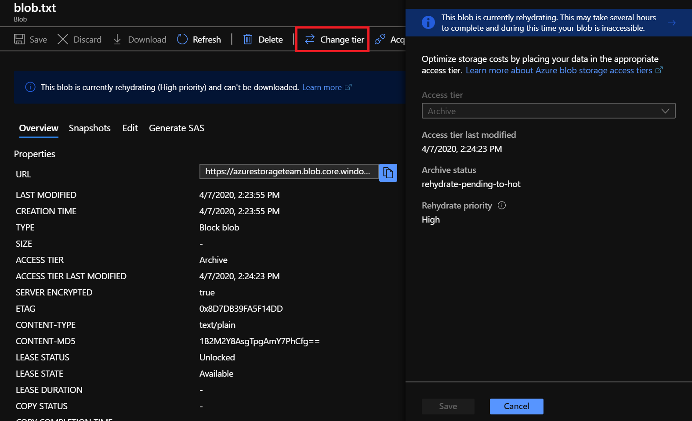

# Rehydrate blob data from the archive tier

While a blob is in the archive access tier, it's considered offline and can't be read or modified. The blob metadata remains online and available, allowing you to list the blob and its properties. Reading and modifying blob data is only available with online tiers such as hot or cool. There are two options to retrieve and access data stored in the archive access tier.

1. [Rehydrate an archived blob to an online tier](#rehydrate-an-archived-blob-to-an-online-tier) - Rehydrate an archive blob to hot or cool by changing its tier using the [Set Blob Tier](https://docs.microsoft.com/rest/api/storageservices/set-blob-tier) operation.
2. [Copy an archived blob to an online tier](#copy-an-archived-blob-to-an-online-tier) - Create a new copy of an archive blob by using the [Copy Blob](https://docs.microsoft.com/rest/api/storageservices/copy-blob) operation. Specify a different blob name and a destination tier of hot or cool.

 For more information on tiers, see [Azure Blob storage: hot, cool, and archive access tiers](storage-blob-storage-tiers.md).

## Rehydrate an archived blob to an online tier

[!INCLUDE [storage-blob-rehydration](../../../includes/storage-blob-rehydrate-include.md)]

## Copy an archived blob to an online tier

If you don't want to rehydrate your archive blob, you can choose to do a [Copy Blob](https://docs.microsoft.com/rest/api/storageservices/copy-blob) operation. Your original blob will remain unmodified in archive while a new blob is created in the online hot or cool tier for you to work on. In the Copy Blob operation, you may also set the optional *x-ms-rehydrate-priority* property to Standard or High to specify the priority at which you want your blob copy created.

Copying a blob from archive can take hours to complete depending on the rehydrate priority selected. Behind the scenes, the **Copy Blob** operation reads your archive source blob to create a new online blob in the selected destination tier. The new blob may be visible when you list blobs but the data is not available until the read from the source archive blob is complete and data is written to the new online destination blob. The new blob is as an independent copy and any modification or deletion to it does not affect the source archive blob.

> [!IMPORTANT]
> Do not delete the the source blob until the copy is completed successfully at the destination. If the source blob is deleted then the destination blob may not complete copying and will be empty. You may check the *x-ms-copy-status* to determine the state of the copy operation.

Archive blobs can only be copied to online destination tiers within the same storage account. Copying an archive blob to another archive blob is not supported. The following table indicates CopyBlob's capabilities.

|                                           | **Hot tier source**   | **Cool tier source** | **Archive tier source**    |
| ----------------------------------------- | --------------------- | -------------------- | ------------------- |
| **Hot tier destination**                  | Supported             | Supported            | Supported within the same account; pending rehydrate               |
| **Cool tier destination**                 | Supported             | Supported            | Supported within the same account; pending rehydrate               |
| **Archive tier destination**              | Supported             | Supported            | Unsupported         |

## Pricing and billing

Rehydrating blobs out of archive into hot or cool tiers are charged as read operations and data retrieval. Using High priority has higher operation and data retrieval costs compared to standard priority. High priority rehydration shows up as a separate line item on your bill. If a high priority request to return an archive blob of a few gigabytes takes over 5 hours, you won't be charged the high priority retrieval rate. However, standard retrieval rates still apply as the rehydration was prioritized over other requests.

Copying blobs from archive into hot or cool tiers are charged as read operations and data retrieval. A write operation is charged for the creation of the new blob copy. Early deletion fees don't apply when you copy to an online blob because the source blob remains unmodified in the archive tier. High priority retrieval charges do apply if selected.

Blobs in the archive tier should be stored for a minimum of 180 days. Deleting or rehydrating archived blobs before 180 days will incur early deletion fees.

> [!NOTE]
> For more information about pricing for block blobs and data rehydration, see [Azure Storage Pricing](https://azure.microsoft.com/pricing/details/storage/blobs/). For more information on outbound data transfer charges, see [Data Transfers Pricing Details](https://azure.microsoft.com/pricing/details/data-transfers/).

## Quickstart scenarios

### Rehydrate an archive blob to an online tier
# [Portal](#tab/azure-portal)
1. Sign in to the [Azure portal](https://portal.azure.com).

1. In the Azure portal, search for and select **All Resources**.

1. Select your storage account.

1. Select your container and then select your blob.

1. In the **Blob properties**, select **Change tier**.

1. Select the **Hot** or **Cool** access tier. 

1. Select a Rehydrate Priority of **Standard** or **High**.

1. Select **Save** at the bottom.




# [PowerShell](#tab/azure-powershell)
The following PowerShell script can be used to change the blob tier of an archive blob. The `$rgName` variable must be initialized with your resource group name. The `$accountName` variable must be initialized with your storage account name. The `$containerName` variable must be initialized with your container name. The `$blobName` variable must be initialized with your blob name. 
```powershell
#Initialize the following with your resource group, storage account, container, and blob names
$rgName = ""
$accountName = ""
$containerName = ""
$blobName = ""

#Select the storage account and get the context
$storageAccount =Get-AzStorageAccount -ResourceGroupName $rgName -Name $accountName
$ctx = $storageAccount.Context

#Select the blob from a container
$blobs = Get-AzStorageBlob -Container $containerName -Blob $blobName -Context $ctx

#Change the blob’s access tier to Hot using Standard priority rehydrate
$blob.ICloudBlob.SetStandardBlobTier("Hot", "Standard")
```
---

### Copy an archive blob to a new blob with an online tier
The following PowerShell script can be used to copy an archive blob to a new blob within the same storage account. The `$rgName` variable must be initialized with your resource group name. The `$accountName` variable must be initialized with your storage account name. The `$srcContainerName` and `$destContainerName` variables must be initialized with your container names. The `$srcBlobName` and `$destBlobName` variables must be initialized with your blob names. 
```powershell
#Initialize the following with your resource group, storage account, container, and blob names
$rgName = ""
$accountName = ""
$srcContainerName = ""
$destContainerName = ""
$srcBlobName = ""
$destBlobName = ""

#Select the storage account and get the context
$storageAccount =Get-AzStorageAccount -ResourceGroupName $rgName -Name $accountName
$ctx = $storageAccount.Context

#Copy source blob to a new destination blob with access tier hot using standard rehydrate priority
Start-AzStorageBlobCopy -SrcContainer $srcContainerName -SrcBlob $srcBlobName -DestContainer $destContainerName -DestBlob $destBlobName -StandardBlobTier Hot -RehydratePriority Standard -Context $ctx
```

## Next Steps

* [Learn about Blob Storage Tiers](storage-blob-storage-tiers.md)
* [Check hot, cool, and archive pricing in Blob storage and GPv2 accounts by region](https://azure.microsoft.com/pricing/details/storage/)
* [Manage the Azure Blob storage lifecycle](storage-lifecycle-management-concepts.md)
* [Check data transfers pricing](https://azure.microsoft.com/pricing/details/data-transfers/)
