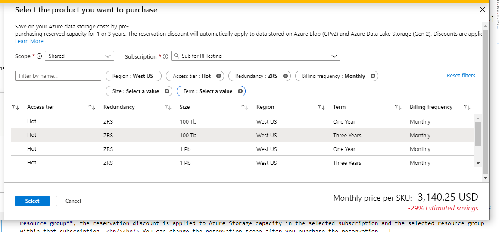
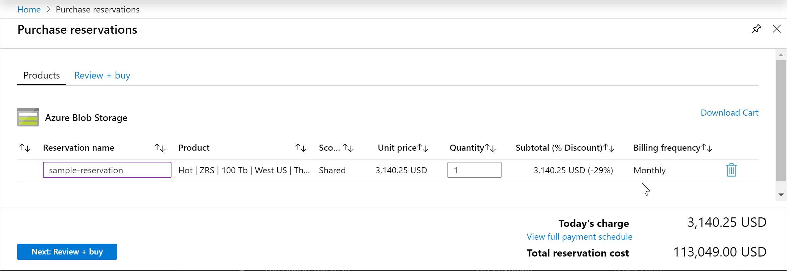

# Optimize costs for Blob storage with reserved capacity

You can save money on storage costs for blob data with Azure Storage reserved capacity. Azure Storage reserved capacity offers you a discount on capacity for block blobs and for Azure Data Lake Storage Gen2 data in standard storage accounts when you commit to a reservation for either one year or three years. A reservation provides a fixed amount of storage capacity for the term of the reservation.

Azure Storage reserved capacity can significantly reduce your capacity costs for block blobs and Azure Data Lake Storage Gen2 data. The cost savings achieved depend on the duration of your reservation, the total capacity you choose to reserve, and the access tier and type of redundancy that you've chosen for your storage account. Reserved capacity provides a billing discount and doesn't affect the state of your Azure Storage resources.

For information about Azure Storage reservation pricing, see [Block blob pricing](https://azure.microsoft.com/pricing/details/storage/blobs/) and [Azure Data Lake Storage Gen 2 pricing](https://azure.microsoft.com/pricing/details/storage/data-lake/).

## Reservation terms for Azure Storage

The following sections describe the terms of an Azure Storage reservation.

### Reservation capacity

You can purchase Azure Storage reserved capacity in units of 100 TiB and 1 PiB per month for a one-year or three-year term.

### Reservation scope

Azure Storage reserved capacity is available for a single subscription, multiple subscriptions (shared scope), and management groups. When scoped to a single subscription, the reservation discount is applied to the selected subscription only. When scoped to multiple subscriptions, the reservation discount is shared across those subscriptions within the customer's billing context. When scoped to management group, the reservation discount is shared across the subscriptions that are a part of both the management group and billing scope.

When you purchase Azure Storage reserved capacity, you can use your reservation for both block blob and Azure Data Lake Storage Gen2 data. A reservation is applied to your usage within the purchased scope and cannot be limited to a specific storage account, container, or object within the subscription.

An Azure Storage reservation covers only the amount of data that is stored in a subscription or shared resource group. Early deletion, operations, bandwidth, and data transfer charges are not included in the reservation. As soon as you buy a reservation, the capacity charges that match the reservation attributes are charged at the discount rates instead of at the pay-as-you go rates. For more information on Azure reservations, see [What are Azure Reservations?](../../cost-management-billing/reservations/save-compute-costs-reservations.md).

### Supported account types, tiers, and redundancy options

Azure Storage reserved capacity is available for resources in standard storage accounts, including general-purpose v2 (GPv2) and Blob storage accounts.

Hot, cool, and archive tier are supported for reservations. For more information on access tiers, see [Hot, Cool, and Archive access tiers for blob data](access-tiers-overview.md).

All types of redundancy are supported for reservations. For more information about redundancy options, see [Azure Storage redundancy](../common/storage-redundancy.md).

> [!NOTE]
> Azure Storage reserved capacity is not available for premium storage accounts, general-purpose v1 (GPv1) storage accounts, Azure Data Lake Storage Gen1, page blobs, Azure Queue storage, or Azure Table storage. For information about reserved capacity for Azure Files, see [Optimize costs for Azure Files with reserved capacity](../files/files-reserve-capacity.md).

### Security requirements for purchase

To purchase reserved capacity:

- You must be in the **Owner** role for at least one Enterprise or individual subscription with pay-as-you-go rates.
- For Enterprise subscriptions, **Add Reserved Instances** must be enabled in the EA portal. Or, if that setting is disabled, you must be an EA Admin on the subscription.
- For the Cloud Solution Provider (CSP) program, only admin agents or sales agents can buy Azure Blob Storage reserved capacity.

## Determine required capacity before purchase

When you purchase an Azure Storage reservation, you must choose the region, access tier, and redundancy option for the reservation. Your reservation is valid only for data stored in that region, access tier, and redundancy level. For example, suppose you purchase a reservation for data in US West for the hot tier using zone-redundant storage (ZRS). You cannot use the same reservation for data in US East, data in the archive tier, or data in geo-redundant storage (GRS). However, you can purchase another reservation for your additional needs.

Reservations are available today for 100 TiB or 1 PiB blocks, with higher discounts for 1 PiB blocks. When you purchase a reservation in the Azure portal, Microsoft may provide you with recommendations based on your previous usage to help determine which reservation you should purchase.

## Purchase Azure Storage reserved capacity

You can purchase Azure Storage reserved capacity through the [Azure portal](https://portal.azure.com). Pay for the reservation up front or with monthly payments. For more information about purchasing with monthly payments, see [Purchase Azure reservations with up front or monthly payments](../../cost-management-billing/reservations/prepare-buy-reservation.md).

For help with identifying the reservation terms that are right for your scenario, see [Understand the Azure Storage reserved capacity discount](../../cost-management-billing/reservations/understand-storage-charges.md).

Follow these steps to purchase reserved capacity:

1. Navigate to the [Purchase reservations](https://portal.azure.com/#blade/Microsoft_Azure_Reservations/CreateBlade/referrer/Browse_AddCommand) pane in the Azure portal.
1. Select **Azure Blob Storage** to buy a new reservation.
1. Fill in the required fields as described in the following table:

    

   |Field  |Description  |
   |---------|---------|
   |**Scope**   |  Indicates how many subscriptions can use the billing benefit associated with the reservation. It also controls how the reservation is applied to specific subscriptions.    If you select **Shared**, the reservation discount is applied to Azure Storage capacity in any subscription within your billing context. The billing context is based on how you signed up for Azure. For enterprise customers, the shared scope is the enrollment and includes all subscriptions within the enrollment. For pay-as-you-go customers, the shared scope includes all individual subscriptions with pay-as-you-go rates created by the account administrator.      If you select **Single subscription**, the reservation discount is applied to Azure Storage capacity in the selected subscription.    If you select **Single resource group**, the reservation discount is applied to Azure Storage capacity in the selected subscription and the selected resource group within that subscription.    You can change the reservation scope after you purchase the reservation.  |
   |**Subscription**  | The subscription that's used to pay for the Azure Storage reservation. The payment method on the selected subscription is used in charging the costs. The subscription must be one of the following types:     Enterprise Agreement (offer numbers: MS-AZR-0017P or MS-AZR-0148P): For an Enterprise subscription, the charges are deducted from the enrollment's Azure Prepayment (previously called monetary commitment) balance or charged as overage.    Individual subscription with pay-as-you-go rates (offer numbers: MS-AZR-0003P or MS-AZR-0023P): For an individual subscription with pay-as-you-go rates, the charges are billed to the credit card or invoice payment method on the subscription.    |
   | **Region** | The region where the reservation is in effect. |
   | **Access tier** | The access tier where the for which the reservation is in effect. Options include *Hot*, *Cool*, or *Archive*. For more information about access tiers, see [Hot, Cool, and Archive access tiers for blob data](access-tiers-overview.md). |
   | **Redundancy** | The redundancy option for the reservation. Options include *LRS*, *ZRS*, *GRS*, *GZRS*, *RA-GRS*, and *RA-GZRS*. For more information about redundancy options, see [Azure Storage redundancy](../common/storage-redundancy.md). |
   | **Billing frequency** | Indicates how often the account is billed for the reservation. Options include *Monthly* or *Upfront*. |
   | **Size** | The amount of capacity to reserve. |
   |**Term**  | One year or three years.   |

1. After you select the parameters for your reservation, the Azure portal displays the cost. The portal also shows the discount percentage over pay-as-you-go billing.

1. In the **Purchase reservations** pane, review the total cost of the reservation. You can also provide a name for the reservation.

    

After you purchase a reservation, it is automatically applied to any existing Azure Storage block blob or Azure Data Lake Storage Gen2 resources that matches the terms of the reservation. If you haven't created any Azure Storage resources yet, the reservation will apply whenever you create a resource that matches the terms of the reservation. In either case, the term of the reservation begins immediately after a successful purchase.

## Exchange or refund a reservation

You can exchange or refund a reservation, with certain limitations. These limitations are described in the following sections.

To exchange or refund a reservation, navigate to the reservation details in the Azure portal. Select **Exchange** or **Refund**, and follow the instructions to submit a support request. When the request has been processed, Microsoft will send you an email to confirm completion of the request.

For more information about Azure Reservations policies, see [Self-service exchanges and refunds for Azure Reservations](../../cost-management-billing/reservations/exchange-and-refund-azure-reservations.md).

### Exchange a reservation

Exchanging a reservation enables you to receive a prorated refund based on the unused portion of the reservation. You can then apply the refund to the purchase price of a new Azure Storage reservation.

There's no limit on the number of exchanges you can make. Additionally, there's no fee associated with an exchange. The new reservation that you purchase must be of equal or greater value than the prorated credit from the original reservation. An Azure Storage reservation can be exchanged only for another Azure Storage reservation, and not for a reservation for any other Azure service.

### Refund a reservation

You may cancel an Azure Storage reservation at any time. When you cancel, you'll receive a prorated refund based on the remaining term of the reservation. The maximum refund per year is $50,000.

Cancelling a reservation immediately terminates the reservation and returns the remaining months to Microsoft. The remaining prorated balance, minus the fee, will be refunded to your original form of purchase.

## Expiration of a reservation

When a reservation expires, any Azure Storage capacity that you are using under that reservation is billed at the pay-as-you go rate. Reservations don't renew automatically.

You will receive an email notification 30 days prior to the expiration of the reservation, and again on the expiration date. To continue taking advantage of the cost savings that a reservation provides, renew it no later than the expiration date.

## Need help? Contact us

If you have questions or need help, [create a support request](https://go.microsoft.com/fwlink/?linkid=2083458).

## Next steps

- [What are Azure Reservations?](../../cost-management-billing/reservations/save-compute-costs-reservations.md)
- [Understand how the reservation discount is applied to Azure Storage](../../cost-management-billing/reservations/understand-storage-charges.md)
