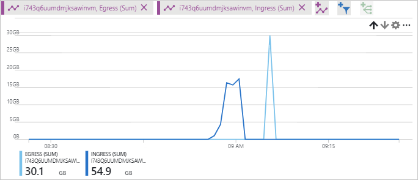

# Verify throughput and latency metrics for a storage account

This tutorial is part four and the final part of a series. In the previous tutorials you learned how to upload and download larges amounts of random data to an Azure storage account. This tutorial shows you how you can use metrics to view throughput and latency in the Azure portal.

In part four of the series, you learn how to:

> [!div class="checklist"]
> * Configure charts in the Azure portal
> * Verify throughput and latency metrics

[Azure storage metrics](../common/storage-metrics-in-azure-monitor.md?toc=%2fazure%2fstorage%2fblobs%2ftoc.json) uses Azure monitor to provide a unified view into the performance and availability of your storage account.

## Configure metrics

Navigate to **Metrics (preview)** under **SETTINGS** in your storage account.

Choose Blob from the **SUB SERVICE** drop-down.

Under **Metric**, select one of the metrics found in the following table:

|Metric|Defintion|
|---|---|
|Success E2E Latency|The average end-to-end latency of successful requests made to a storage service or the specified API operation. This value includes the required processing time within Azure Storage to read the request, send the response, and receive acknowledgment of the response.|
|Success Server Latency|The average time used to process a successful request by Azure Storage. This value does not include the network latency specified in SuccessE2ELatency. |
|Transactions|The number of requests made to a storage service or the specified API operation. This number includes successful and failed requests, as well as requests that produced errors.|
|Ingress|The amount of ingress data. This number includes ingress from an external client into Azure Storage as well as ingress within Azure. |
|Egress|The amount of egress data. This number includes egress from an external client into Azure Storage as well as egress within Azure. As a result, this number does not reflect billable egress. |

Select **Last 24 hours (Automatic)** next to **Time**. Choose **Last hour** and **Minute** for **Time granularity**, then click **Apply**.

The example in this tutorial takes around 5 minutes to upload and download the files, but choosing minute you get the minute averages of the metric results.

## Viewing metrics

The following screenshots show sample data from running the example.

### Transactions

In the example chart below, there are 1k transactions. Each 100MB chuck of data transferred in this example is considered a transaction.

### Throughput

Ingress and egress traffic are shown in the same chart. You can check the [scalability targets](../common/storage-scalability-targets.md?toc=%2fazure%2fstorage%2fblobs%2ftoc.json#scalability-targets-for-a-storage-account) of both ingress and egress traffic to get an understanding of the limits.

### Latency

Both end-to-end latency and server latency are shown in the following example. Some things that can increase the latency are... 

## Next steps

In part four of the series, you learned about viewing metrics for the example solution, such as how to:

> [!div class="checklist"]
> * Configure charts in the Azure portal
> * Verify throughput and latency metrics

Follow this link to see pre-built storage samples.

> [!div class="nextstepaction"]
> [Azure storage script samples](storage-samples-blobs-cli.md)

[previous-tutorial]: storage-blob-scalable-app-download-files.md