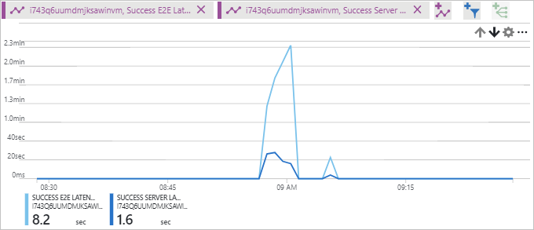

# Verify throughput and latency metrics for a storage account

This tutorial is part four and the final part of a series. In the previous tutorials you learned how to upload and download larges amounts of random data to an Azure storage account. This tutorial shows you how you can use metrics to view throughput and latency in the Azure portal.

In part four of the series, you learn how to:

> [!div class="checklist"]
> * Configure charts in the Azure portal
> * Verify throughput and latency metrics

[Azure storage metrics](../common/storage-metrics-in-azure-monitor)

## 

Navigate to **Metrics (preview)** under **SETTINGS** in your storage account.

Choose Blob from the **SUB SERVICE** drop-down.

Select **SUccess E2E LAtency** under **Metric**.

Select **Last 24 hours (Automatic)** next to **Time**. CHoose Last hour and click **Apply**

Select **Minute** for ** Time granularity..

## Throughput

Click **+ Add Chart** to add an additional chart.

## Latency

## Next steps

In part two of the series, you learned about uploading large amounts of random data to a storage account in parallel, such as how to:

> [!div class="checklist"]
> * Configure charts in the Azure portal
> * Verify throughput and latency metrics

Follow this link to see pre-built storage samples.

> [!div class="nextstepaction"]
> [Azure storage script samples](storage-samples-blobs-cli.md)

[previous-tutorial]: storage-blob-scalable-app-download-files.md