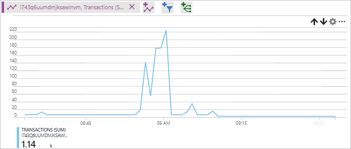

# Verify throughput and latency metrics for a storage account

This tutorial is part four and the final part of a series. In the previous tutorials, you learned how to upload and download larges amounts of random data to an Azure storage account. This tutorial shows you how you can use metrics to view throughput and latency in the Azure portal.

In part four of the series, you learn how to:

> [!div class="checklist"]
> * Configure charts in the Azure portal
> * Verify throughput and latency metrics

[Azure storage metrics](../common/storage-metrics-in-azure-monitor.md?toc=%2fazure%2fstorage%2fblobs%2ftoc.json) uses Azure monitor to provide a unified view into the performance and availability of your storage account.

## Configure metrics

Navigate to **Metrics (preview)** under **SETTINGS** in your storage account.

Choose Blob from the **SUB SERVICE** drop-down.

Under **METRIC**, select one of the metrics found in the following table:

The following metrics give you an idea of the latency and throughput of the application. The metrics you configure in the portal are in 1-minute averages. If a transaction finished in the middle of a minute that minute data is halfed for the average. In the application, the upload and download operations were timed and provided you output of the actual amount of time it took to upload and download the files. This information can be used in conjunction with the portal metrics to fully understand throughput.

|Metric|Definition|
|---|---|
|**Success E2E Latency**|The average end-to-end latency of successful requests made to a storage service or the specified API operation. This value includes the required processing time within Azure Storage to read the request, send the response, and receive acknowledgment of the response.|
|**Success Server Latency**|The average time used to process a successful request by Azure Storage. This value does not include the network latency specified in SuccessE2ELatency. |
|**Transactions**|The number of requests made to a storage service or the specified API operation. This number includes successful and failed requests, as well as requests that produced errors. In the example, the block size was set to 100 MB. In this case, each 100-MB block is considered a transaction.|
|**Ingress**|The amount of ingress data. This number includes ingress from an external client into Azure Storage as well as ingress within Azure. |
|**Egress**|The amount of egress data. This number includes egress from an external client into Azure Storage as well as egress within Azure. As a result, this number does not reflect billable egress. |

Select **Last 24 hours (Automatic)** next to **Time**. Choose **Last hour** and **Minute** for **Time granularity**, then click **Apply**.

Charts can have more than one metric assigned to them, but assigning more than one metric disables the ability to group by dimensions.

## Dimensions

[Dimensions](../common/storage-metrics-in-azure-monitor.md?toc=%2fazure%2fstorage%2fblobs%2ftoc.json#metrics-dimensions) are used to look deeper into the charts and get more detailed information. Different metrics have different dimensions. One dimension that is available is the **API name** dimension. This dimension breaks out the chart into each separate API call. The first image below shows an example chart of total transactions for a storage account. The second image shows the same chart but with the API name dimension selected. As you can see, each transaction is listed giving more details into how many calls were made by API name.

## Clean up resources

When no longer needed, delete the resource group, virtual machine, and all related resources. To do so, select the resource group for the VM and click Delete.

## Next steps

In part four of the series, you learned about viewing metrics for the example solution, such as how to:

> [!div class="checklist"]
> * Configure charts in the Azure portal
> * Verify throughput and latency metrics

Follow this link to see pre-built storage samples.

> [!div class="nextstepaction"]
> [Azure storage script samples](storage-samples-blobs-cli.md)

[previous-tutorial]: storage-blob-scalable-app-download-files.md
