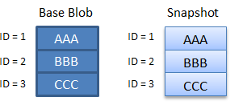
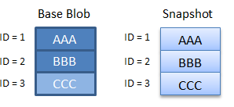

# Create a blob snapshot

A snapshot is a read-only version of a blob that's taken at a point in time. Snapshots are useful for backing up blobs. After you create a snapshot, you can read, copy, or delete it, but you cannot modify it.

A snapshot of a blob is identical to its base blob, except that the blob URI has a **DateTime** value appended to the blob URI to indicate the time at which the snapshot was taken. For example, if a page blob URI is `http://storagesample.core.blob.windows.net/mydrives/myvhd`, the snapshot URI is similar to `http://storagesample.core.blob.windows.net/mydrives/myvhd?snapshot=2011-03-09T01:42:34.9360000Z`.

> [!NOTE]
> All snapshots share the base blob's URI. The only distinction between the base blob and the snapshot is the appended **DateTime** value.
>

A blob can have any number of snapshots. Snapshots persist until they are explicitly deleted. A snapshot cannot outlive its base blob. You can enumerate the snapshots associated with the base blob to track your current snapshots.

When you create a snapshot of a blob, the blob's system properties are copied to the snapshot with the same values. The base blob's metadata is also copied to the snapshot, unless you specify separate metadata for the snapshot when you create it.

Any leases associated with the base blob do not affect the snapshot. You cannot acquire a lease on a snapshot.

A VHD file is used to store the current information and status for a VM disk. You can detach a disk from within the VM or shut down the VM, and then take a snapshot of its VHD file. You can use that snapshot file later to retrieve the VHD file at that point in time and recreate the VM.

## Create a snapshot
The following code example shows how to create a snapshot by using the [Azure Storage Client Library for .NET](/dotnet/api/overview/azure/storage/client). This example specifies additional metadata for the snapshot when it is created.

```csharp
private static async Task CreateBlockBlobSnapshot(CloudBlobContainer container)
{
    // Create a new block blob in the container.
    CloudBlockBlob baseBlob = container.GetBlockBlobReference("sample-base-blob.txt");

    // Add blob metadata.
    baseBlob.Metadata.Add("ApproxBlobCreatedDate", DateTime.UtcNow.ToString());

    try
    {
        // Upload the blob to create it, with its metadata.
        await baseBlob.UploadTextAsync(string.Format("Base blob: {0}", baseBlob.Uri.ToString()));

        // Sleep 5 seconds.
        System.Threading.Thread.Sleep(5000);

        // Create a snapshot of the base blob.
        // Specify metadata at the time that the snapshot is created to specify unique metadata for the snapshot.
        // If no metadata is specified when the snapshot is created, the base blob's metadata is copied to the snapshot.
        Dictionary<string, string> metadata = new Dictionary<string, string>();
        metadata.Add("ApproxSnapshotCreatedDate", DateTime.UtcNow.ToString());
        await baseBlob.CreateSnapshotAsync(metadata, null, null, null);
    }
    catch (StorageException e)
    {
        Console.WriteLine(e.Message);
        Console.ReadLine();
        throw;
    }
}
```

## Copy snapshots
Copy operations involving blobs and snapshots follow these rules:

* You can copy a snapshot over its base blob. By promoting a snapshot to the position of the base blob, you can restore an earlier version of a blob. The snapshot remains, but the base blob is overwritten with a writable copy of the snapshot.
* You can copy a snapshot to a destination blob with a different name. The resulting destination blob is a writable blob and not a snapshot.
* When a source blob is copied, any snapshots of the source blob are not copied to the destination. When a destination blob is overwritten with a copy, any snapshots associated with the original destination blob remain intact.
* When you create a snapshot of a block blob, the blob's committed block list is also copied to the snapshot. Any uncommitted blocks are not copied.

## Specify an access condition
When you call [CreateSnapshotAsync][dotnet_CreateSnapshotAsync], you can specify an access condition so that the snapshot is created only if a condition is met. To specify an access condition, use the [AccessCondition][dotnet_AccessCondition] parameter. If the specified condition is not met, the snapshot is not created, and the Blob service returns status code [HTTPStatusCode][dotnet_HTTPStatusCode].PreconditionFailed.

## Delete snapshots
You can't delete a blob with snapshots unless the snapshots are also deleted. You can delete a snapshot individually, or specify that all snapshots be deleted when the source blob is deleted. If you attempt to delete a blob that still has snapshots, an error results.

The following code example shows how to delete a blob and its snapshots in .NET, where `blockBlob` is an object of type [CloudBlockBlob][dotnet_CloudBlockBlob]:

```csharp
await blockBlob.DeleteIfExistsAsync(DeleteSnapshotsOption.IncludeSnapshots, null, null, null);
```

## Snapshots with Azure Premium Storage
When using snapshots with Premium Storage, the following rules apply:

* The maximum number of snapshots per page blob in a premium storage account is 100. If that limit is exceeded, the Snapshot Blob operation returns error code 409 (`SnapshotCountExceeded`).
* You can take a snapshot of a page blob in a premium storage account once every 10 minutes. If that rate is exceeded, the Snapshot Blob operation returns error code 409 (`SnapshotOperationRateExceeded`).
* To read a snapshot, you can use the Copy Blob operation to copy a snapshot to another page blob in the account. The destination blob for the copy operation must not have any existing snapshots. If the destination blob does have snapshots, then the Copy Blob operation returns error code 409 (`SnapshotsPresent`).

## Return the absolute URI to a snapshot
This C# code example creates a snapshot and writes out the absolute URI for the primary location.

```csharp
//Create the blob service client object.
const string ConnectionString = "DefaultEndpointsProtocol=https;AccountName=account-name;AccountKey=account-key";

CloudStorageAccount storageAccount = CloudStorageAccount.Parse(ConnectionString);
CloudBlobClient blobClient = storageAccount.CreateCloudBlobClient();

//Get a reference to a container.
CloudBlobContainer container = blobClient.GetContainerReference("sample-container");
container.CreateIfNotExists();

//Get a reference to a blob.
CloudBlockBlob blob = container.GetBlockBlobReference("sampleblob.txt");
blob.UploadText("This is a blob.");

//Create a snapshot of the blob and write out its primary URI.
CloudBlockBlob blobSnapshot = blob.CreateSnapshot();
Console.WriteLine(blobSnapshot.SnapshotQualifiedStorageUri.PrimaryUri);
```

## Understand how snapshots accrue charges
Creating a snapshot, which is a read-only copy of a blob, can result in additional data storage charges to your account. When designing your application, it is important to be aware of how these charges might accrue so that you can minimize costs.

### Important billing considerations
The following list includes key points to consider when creating a snapshot.

* Your storage account incurs charges for unique blocks or pages, whether they are in the blob or in the snapshot. Your account does not incur additional charges for snapshots associated with a blob until you update the blob on which they are based. After you update the base blob, it diverges from its snapshots. When this happens, you are charged for the unique blocks or pages in each blob or snapshot.
* When you replace a block within a block blob, that block is subsequently charged as a unique block. This is true even if the block has the same block ID and the same data as it has in the snapshot. After the block is committed again, it diverges from its counterpart in any snapshot, and you will be charged for its data. The same holds true for a page in a page blob that's updated with identical data.
* Replacing a block blob by calling the [UploadFromFile][dotnet_UploadFromFile], [UploadText][dotnet_UploadText], [UploadFromStream][dotnet_UploadFromStream], or [UploadFromByteArray][dotnet_UploadFromByteArray] method replaces all blocks in the blob. If you have a snapshot associated with that blob, all blocks in the base blob and snapshot now diverge, and you will be charged for all the blocks in both blobs. This is true even if the data in the base blob and the snapshot remain identical.
* The Azure Blob service does not have a means to determine whether two blocks contain identical data. Each block that is uploaded and committed is treated as unique, even if it has the same data and the same block ID. Because charges accrue for unique blocks, it's important to consider that updating a blob that has a snapshot results in additional unique blocks and additional charges.

### Minimize cost with snapshot management

We recommend managing your snapshots carefully to avoid extra charges. You can follow these best practices to help minimize the costs incurred by the storage of your snapshots:

* Delete and re-create snapshots associated with a blob whenever you update the blob, even if you are updating with identical data, unless your application design requires that you maintain snapshots. By deleting and re-creating the blob's snapshots, you can ensure that the blob and snapshots do not diverge.
* If you are maintaining snapshots for a blob, avoid calling [UploadFromFile][dotnet_UploadFromFile], [UploadText][dotnet_UploadText], [UploadFromStream][dotnet_UploadFromStream], or [UploadFromByteArray][dotnet_UploadFromByteArray] to update the blob. These methods replace all of the blocks in the blob, causing your base blob and its snapshots to diverge significantly. Instead, update the fewest possible number of blocks by using the [PutBlock][dotnet_PutBlock] and [PutBlockList][dotnet_PutBlockList] methods.

### Snapshot billing scenarios
The following scenarios demonstrate how charges accrue for a block blob and its snapshots.

**Scenario 1**

In scenario 1, the base blob has not been updated after the snapshot was taken, so charges are incurred only for unique blocks 1, 2, and 3.



**Scenario 2**

In scenario 2, the base blob has been updated, but the snapshot has not. Block 3 was updated, and even though it contains the same data and the same ID, it is not the same as block 3 in the snapshot. As a result, the account is charged for four blocks.



**Scenario 3**

In scenario 3, the base blob has been updated, but the snapshot has not. Block 3 was replaced with block 4 in the base blob, but the snapshot still reflects block 3. As a result, the account is charged for four blocks.


**Scenario 4**

In scenario 4, the base blob has been completely updated and contains none of its original blocks. As a result, the account is charged for all eight unique blocks. This scenario can occur if you are using an update method such as [UploadFromFile][dotnet_UploadFromFile], [UploadText][dotnet_UploadText], [UploadFromStream][dotnet_UploadFromStream], or [UploadFromByteArray][dotnet_UploadFromByteArray], because these methods replace all of the contents of a blob.


## Next steps

* You can find more information about working with virtual machine (VM) disk snapshots in [Back up Azure unmanaged VM disks with incremental snapshots](../../virtual-machines/windows/incremental-snapshots.md)

* For additional code examples using Blob storage, see [Azure Code Samples](https://azure.microsoft.com/documentation/samples/?service=storage&term=blob). You can download a sample application and run it, or browse the code on GitHub.

[dotnet_AccessCondition]: https://docs.microsoft.com/java/api/com.microsoft.azure.documentdb.accesscondition
[dotnet_CloudBlockBlob]: https://docs.microsoft.com/java/api/com.microsoft.azure.storage.blob._cloud_block_blob
[dotnet_CreateSnapshotAsync]: https://docs.microsoft.com/java/api/com.microsoft.azure.storage.blob.generatedblobs.createsnapshotasync
[dotnet_HTTPStatusCode]: https://docs.microsoft.com/java/api/com.microsoft.store.partnercenter.network.httpstatuscode
[dotnet_PutBlockList]: /dotnet/api/microsoft.azure.storage.blob.cloudblockblob.putblocklist
[dotnet_PutBlock]: /dotnet/api/microsoft.azure.storage.blob.cloudblockblob.putblock
[dotnet_UploadFromByteArray]: https://docs.microsoft.com/java/api/com.microsoft.azure.storage.blob._cloud_blob.uploadfrombytearray
[dotnet_UploadFromFile]: https://docs.microsoft.com/java/api/com.microsoft.azure.storage.blob._cloud_blob.uploadfromfile
[dotnet_UploadFromStream]: /dotnet/api/microsoft.azure.storage.blob.cloudappendblob.uploadfromstream
[dotnet_UploadText]: /dotnet/api/microsoft.azure.storage.blob.cloudappendblob.uploadtext