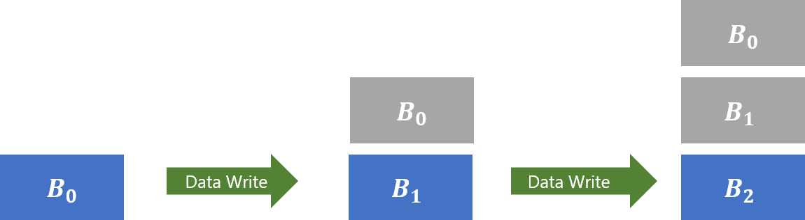
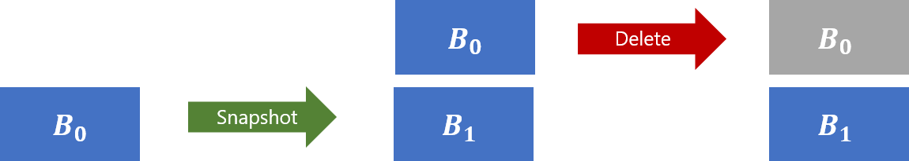
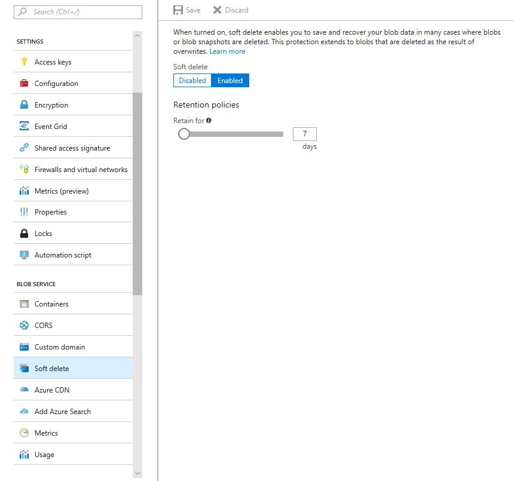
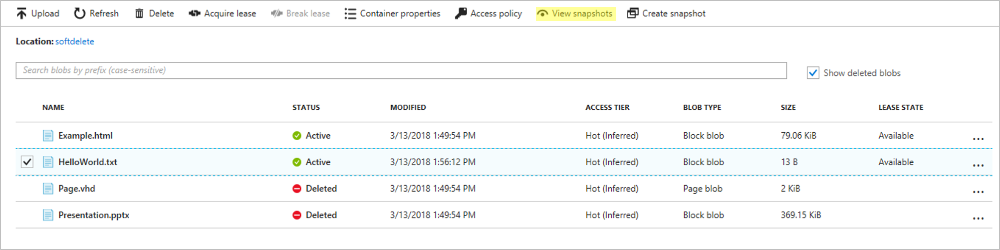
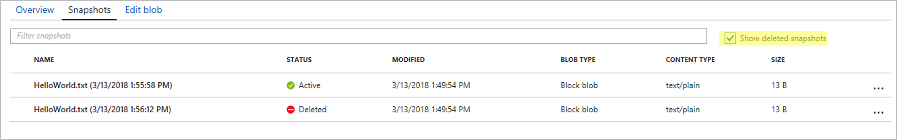
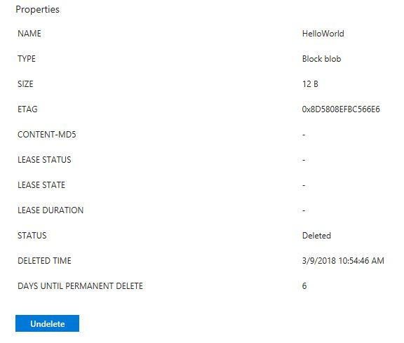
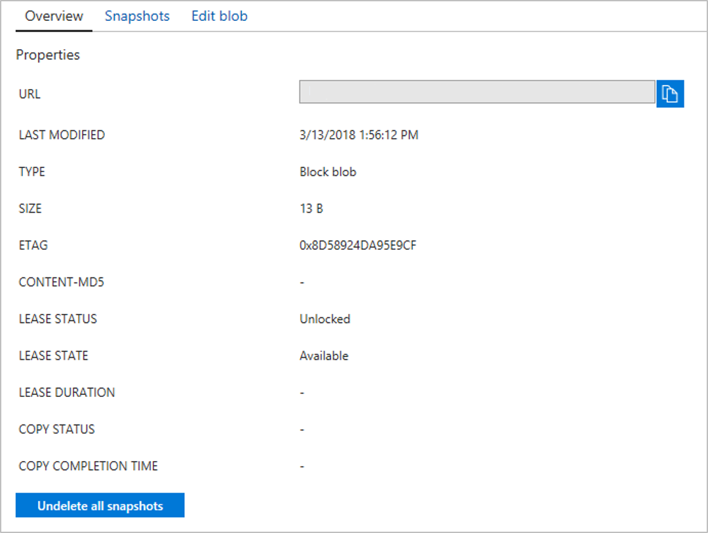
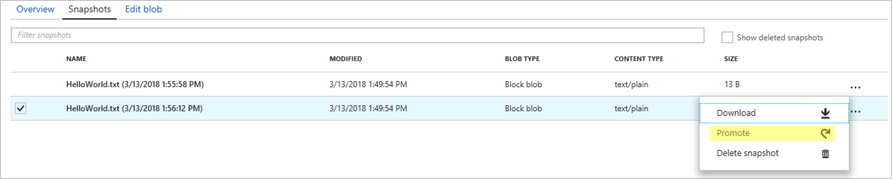

# Soft delete for Azure Storage blobs

Azure Storage now offers soft delete for blob objects so that you can more easily recover your data when it is erroneously modified or deleted by an application or other storage account user.

## How soft delete works

When enabled, soft delete enables you to save and recover your data when blobs or blob snapshots are deleted. This protection extends to blob data that is erased as the result of an overwrite.

When data is deleted, it transitions to a soft deleted state instead of being permanently erased. When soft delete is on and you overwrite data, a soft deleted snapshot is generated to save the state of the overwritten data. Soft deleted objects are invisible unless explicitly listed. You can configure the amount of time soft deleted data is recoverable before it is permanently expired.

Soft delete is backwards compatible, so you don't have to make any changes to your applications to take advantage of the protections this feature affords. However, [data recovery](#recovery) introduces a new **Undelete Blob** API.

### Configuration settings

When you create a new account, soft delete is off by default. Soft delete is also off by default for existing storage accounts. You can toggle the feature on and off at any time during the life of a storage account.

You will still be able to access and recover soft deleted data when the feature is turned off, assuming that soft deleted data was saved when the feature was previously turned on. When you turn on soft delete, you also need to configure the retention period.

The retention period indicates the amount of time that soft deleted data is stored and available for recovery. For blobs and blob snapshots that are explicitly deleted, the retention period clock starts when the data is deleted. For soft deleted snapshots generated by the soft delete feature when data is overwritten, the clock starts when the snapshot is generated. Currently you can retain soft deleted data for between 1 and 365 days.

You can change the soft delete retention period at any time. An updated retention period will only apply to newly deleted data. Previously deleted data will expire based on the retention period that was configured when that data was deleted. Attempting to delete a soft deleted object will not affect its expiry time.

### Saving deleted data

Soft delete preserves your data in many cases where blobs or blob snapshots are deleted or overwritten.

When a blob is overwritten using **Put Blob**, **Put Block**, **Put Block List**, or **Copy Blob** a snapshot of the blob's state prior to the write operation is automatically generated. This snapshot is a soft deleted snapshot; it is invisible unless soft deleted objects are explicitly listed. See the [Recovery](#recovery) section to learn how to list soft deleted objects.



*Soft deleted data is grey, while active data is blue. More recently written data appears beneath older data. When B0 is overwritten with B1, a soft deleted snapshot of B0 is generated. When B1 is overwritten with B2, a soft deleted snapshot of B1 is generated.*

> [!NOTE]  
> Soft delete only affords overwrite protection for copy operations when it is turned on for the destination blob's account.

> [!NOTE]  
> Soft delete does not afford overwrite protection for blobs in the archive tier. If a blob in archive is overwritten with a new blob in any tier, the overwritten blob is permanently expired.

When **Delete Blob** is called on a snapshot, that snapshot is marked as soft deleted. A new snapshot is not generated.



*Soft deleted data is grey, while active data is blue. More recently written data appears beneath older data. When **Snapshot Blob** is called, B0 becomes a snapshot and B1 is the active state of the blob. When the B0 snapshot is deleted, it is marked as soft deleted.*

When **Delete Blob** is called on a base blob (any blob that is not itself a snapshot), that blob is marked as soft deleted. Consistent with previous behavior, calling **Delete Blob** on a blob that has active snapshots returns an error. Calling **Delete Blob** on a blob with soft deleted snapshots does not return an error. You can still delete a blob and all its snapshots in single operation when soft delete is turned on. Doing so marks the base blob and snapshots as soft deleted.


*Soft deleted data is grey, while active data is blue. More recently written data appears beneath older data. Here, a **Delete Blob** call is made to delete B2 and all associated snapshots. The active blob, B2, and all associated snapshots are marked as soft deleted.*

> [!NOTE]  
> When a soft deleted blob is overwritten, a soft deleted snapshot of the blob's state prior to the write operation is automatically generated. The new blob inherits the tier of the overwritten blob.

Soft delete does not save your data in cases of container or account deletes, nor when blob metadata and blob properties are overwritten. To protect a storage account from erroneous deletion, you can configure a lock using the Azure Resource Manager. Please see the Azure Resource Manager article [Lock Resources to Prevent Unexpected
Changes](../../azure-resource-manager/management/lock-resources.md) to learn more.

The following table details expected behavior when soft delete is turned on:

| REST API operation | Resource type | Description | Change in behavior |
|--------------------|---------------|-------------|--------------------|
| [Delete](/rest/api/storagerp/StorageAccounts/Delete) | Account | Deletes the storage account, including all containers and blobs that it contains.                           | No change. Containers and blobs in the deleted account are not recoverable. |
| [Delete Container](/rest/api/storageservices/delete-container) | Container | Deletes the container, including all blobs that it contains. | No change. Blobs in the deleted container are not recoverable. |
| [Put Blob](/rest/api/storageservices/put-blob) | Block, Append, and Page Blobs | Creates a new blob or replaces an existing blob within a container | If used to replace an existing blob, a snapshot of the blob's state prior to the call is automatically generated. This also applies to a previously soft deleted blob if and only if it is replaced by a blob of the same type (Block, Append, or Page). If it is replaced by a blob of a different type, all existing soft deleted data will be permanently expired. |
| [Delete Blob](/rest/api/storageservices/delete-blob) | Block, Append, and Page Blobs | Marks a blob or blob snapshot for deletion. The blob or snapshot is later deleted during garbage collection | If used to delete a blob snapshot, that snapshot is marked as soft deleted. If used to delete a blob, that blob is marked as soft deleted. |
| [Copy Blob](/rest/api/storageservices/copy-blob) | Block, Append, and Page Blobs | Copies a source blob to a destination blob in the same storage account or in another storage account. | If used to replace an existing blob, a snapshot of the blob's state prior to the call is automatically generated. This also applies to a previously soft deleted blob if and only if it is replaced by a blob of the same type (Block, Append, or Page). If it is replaced by a blob of a different type, all existing soft deleted data will be permanently expired. |
| [Put Block](/rest/api/storageservices/put-block) | Block Blobs | Creates a new block to be committed as part of a block blob. | If used to commit a block to a blob that is active, there is no change. If used to commit a block to a blob that is soft deleted, a new blob is created and a snapshot is automatically generated to capture the state of the soft deleted blob. |
| [Put Block List](/rest/api/storageservices/put-block-list) | Block Blobs | Commits a blob by specifying the set of block IDs that comprise the block blob. | If used to replace an existing blob, a snapshot of the blob's state prior to the call is automatically generated. This also applies to a previously soft deleted blob if and only if it is a Block Blob. If it is replaced by a blob of a different type, all existing soft deleted data will be permanently expired. |
| [Put Page](/rest/api/storageservices/put-page) | Page Blobs | Writes a range of pages to a Page Blob. | No change. Page Blob data that is overwritten or cleared using this operation is not saved and is not recoverable. |
| [Append Block](/rest/api/storageservices/append-block) | Append Blobs | Writes a block of data to the end of an Append Blob | No change. |
| [Set Blob Properties](/rest/api/storageservices/set-blob-properties) | Block, Append, and Page Blobs | Sets values for system properties defined for a blob. | No change. Overwritten blob properties are not recoverable. |
| [Set Blob Metadata](/rest/api/storageservices/set-blob-metadata) | Block, Append, and Page Blobs | Sets user-defined metadata for the specified blob as one or more name-value pairs. | No change. Overwritten blob metadata is not recoverable. |

It is important to notice that calling "Put Page" to overwrite or clear ranges of a Page Blob will not automatically generate snapshots. Virtual machine disks are backed by Page Blobs and use **Put Page** to write data.

### Recovery

Calling the [Undelete Blob](/rest/api/storageservices/undelete-blob) operation on a soft deleted base blob restores it and all associated soft deleted snapshots as active. Calling the `Undelete Blob` operation on an active base blob restores all associated soft deleted snapshots as active. When snapshots are restored as active, they look like user-generated snapshots; they do not overwrite the base blob.

To restore a blob to a specific soft deleted snapshot, you can call `Undelete Blob` on the base blob. Then, you can copy the snapshot over the now-active blob. You can also copy the snapshot to a new blob.


*Soft deleted data is grey, while active data is blue. More recently written data appears beneath older data. Here, **Undelete Blob** is called on blob B, thereby restoring the base blob, B1, and all associated snapshots, here just B0, as active. In the second step, B0 is copied over the base blob. This copy operation generates a soft deleted snapshot of B1.*

To view soft deleted blobs and blob snapshots, you can choose to include deleted data in **List Blobs**. You can choose to view only soft deleted base blobs, or to include soft deleted blob snapshots as well. For all soft deleted data, you can view the time when the data was deleted as well as the number of days before the data will be permanently expired.

### Example

The following is the console output of a .NET script that uploads, overwrites, snapshots, deletes, and restores a blob named *HelloWorld* when soft delete is turned on:

```bash
Upload:
- HelloWorld (is soft deleted: False, is snapshot: False)

Overwrite:
- HelloWorld (is soft deleted: True, is snapshot: True)
- HelloWorld (is soft deleted: False, is snapshot: False)

Snapshot:
- HelloWorld (is soft deleted: True, is snapshot: True)
- HelloWorld (is soft deleted: False, is snapshot: True)
- HelloWorld (is soft deleted: False, is snapshot: False)

Delete (including snapshots):
- HelloWorld (is soft deleted: True, is snapshot: True)
- HelloWorld (is soft deleted: True, is snapshot: True)
- HelloWorld (is soft deleted: True, is snapshot: False)

Undelete:
- HelloWorld (is soft deleted: False, is snapshot: True)
- HelloWorld (is soft deleted: False, is snapshot: True)
- HelloWorld (is soft deleted: False, is snapshot: False)

Copy a snapshot over the base blob:
- HelloWorld (is soft deleted: False, is snapshot: True)
- HelloWorld (is soft deleted: False, is snapshot: True)
- HelloWorld (is soft deleted: True, is snapshot: True)
- HelloWorld (is soft deleted: False, is snapshot: False)
```

See the [Next steps](#next-steps) section for a pointer to the application that produced this output.

## Pricing and billing

All soft deleted data is billed at the same rate as active data. You will not be charged for data that is permanently deleted after the configured retention period. For a deeper dive into snapshots and how they accrue charges, please see [Understanding how snapshots accrue charges](storage-blob-snapshots.md).

You will not be billed for the transactions related to the automatic generation of snapshots. You will be billed for **Undelete Blob** transactions at the rate for write operations.

For more details on prices for Azure Blob Storage in general, check out the [Azure Blob Storage Pricing Page](https://azure.microsoft.com/pricing/details/storage/blobs/).

When you initially turn on soft delete, we recommend using a small retention period to better understand how the feature will affect your bill.

## Get started

The following steps show how to get started with soft delete.

# [Portal](#tab/azure-portal)

Enable soft delete for blobs on your storage account by using Azure portal:

1. In the [Azure portal](https://portal.azure.com/), select your storage account. 

2. Navigate to the **Data Protection** option under **Blob Service**.

3. Click **Enabled** under **Blob soft delete**

4. Enter the number of days you want to *retain for* under **Retention policies**

5. Choose the **Save** button to confirm your Data Protection settings



To view soft deleted blobs, select the **Show deleted blobs** checkbox.


To view soft deleted snapshots for a given blob, select the blob then click **View snapshots**.



Make sure the **Show deleted snapshots** checkbox is selected.



When you click on a soft deleted blob or snapshot, notice the new blob properties. They indicate when the object was deleted, and how many days are left until the blob or blob snapshot is permanently expired. If the soft deleted object is not a snapshot, you will also have the option to undelete it.



Remember that undeleting a blob will also undelete all associated snapshots. To undelete soft deleted snapshots for an active blob, click on the blob and select **Undelete all snapshots**.



Once you undelete a blob's snapshots, you can click **Promote** to copy a snapshot over the root blob, thereby restoring the blob to the snapshot.



# [Powershell](#tab/azure-powershell)

[!INCLUDE [updated-for-az](../../../includes/updated-for-az.md)]

To enable soft delete, update a blob client's service properties. The following example enables soft delete for a subset of accounts in a subscription:

```powershell
Set-AzContext -Subscription "<subscription-name>"
$MatchingAccounts = Get-AzStorageAccount | where-object{$_.StorageAccountName -match "<matching-regex>"}
$MatchingAccounts | Enable-AzStorageDeleteRetentionPolicy -RetentionDays 7
```
You can verify that soft delete was turned on by using the following command:

```powershell
$MatchingAccounts | Get-AzStorageServiceProperty -ServiceType Blob
```

To recover blobs that were accidentally deleted, call Undelete on those blobs. Remember that calling **Undelete Blob**, both on active and soft deleted blobs, will restore all associated soft deleted snapshots as active. The following example calls Undelete on all soft deleted and active blobs in a container:

```powershell
# Create a context by specifying storage account name and key
$ctx = New-AzStorageContext -StorageAccountName $StorageAccountName -StorageAccountKey $StorageAccountKey

# Get the blobs in a given container and show their properties
$Blobs = Get-AzStorageBlob -Container $StorageContainerName -Context $ctx -IncludeDeleted
$Blobs.ICloudBlob.Properties

# Undelete the blobs
$Blobs.ICloudBlob.Undelete()
```
To find the current soft delete retention policy, use the following command:

```azurepowershell-interactive
   $account = Get-AzStorageAccount -ResourceGroupName myresourcegroup -Name storageaccount
   Get-AzStorageServiceProperty -ServiceType Blob -Context $account.Context
```

# [CLI](#tab/azure-CLI)

To enable soft delete, update a blob client's service properties:

```azurecli-interactive
az storage blob service-properties delete-policy update --days-retained 7  --account-name mystorageaccount --enable true
```

To verify soft delete is turned on, use the following command: 

```azurecli-interactive
az storage blob service-properties delete-policy show --account-name mystorageaccount 
```

# [Python](#tab/python)

To enable soft delete, update a blob client's service properties:

```python
# Make the requisite imports
from azure.storage.blob import BlockBlobService
from azure.storage.common.models import DeleteRetentionPolicy

# Initialize a block blob service
block_blob_service = BlockBlobService(
    account_name='<enter your storage account name>', account_key='<enter your storage account key>')

# Set the blob client's service property settings to enable soft delete
block_blob_service.set_blob_service_properties(
    delete_retention_policy=DeleteRetentionPolicy(enabled=True, days=7))
```

# [.NET](#tab/net)

To enable soft delete, update a blob client's service properties:

```csharp
// Get the blob client's service property settings
ServiceProperties serviceProperties = blobClient.GetServiceProperties();

// Configure soft delete
serviceProperties.DeleteRetentionPolicy.Enabled = true;
serviceProperties.DeleteRetentionPolicy.RetentionDays = RetentionDays;

// Set the blob client's service property settings
blobClient.SetServiceProperties(serviceProperties);
```

To recover blobs that were accidentally deleted, call Undelete on those blobs. Remember that calling **Undelete Blob**, both on active and soft deleted blobs, will restore all associated soft deleted snapshots as active. The following example calls Undelete on all soft deleted and active blobs in a container:

```csharp
// Recover all blobs in a container
foreach (CloudBlob blob in container.ListBlobs(useFlatBlobListing: true, blobListingDetails: BlobListingDetails.Deleted))
{
       await blob.UndeleteAsync();
}
```

To recover to a specific blob version, first call Undelete on a blob, then copy the desired snapshot over the blob. The following example recovers a block blob to its most recently generated snapshot:

```csharp
// Undelete
await blockBlob.UndeleteAsync();

// List all blobs and snapshots in the container prefixed by the blob name
IEnumerable<IListBlobItem> allBlobVersions = container.ListBlobs(
    prefix: blockBlob.Name, useFlatBlobListing: true, blobListingDetails: BlobListingDetails.Snapshots);

// Restore the most recently generated snapshot to the active blob    
CloudBlockBlob copySource = allBlobVersions.First(version => ((CloudBlockBlob)version).IsSnapshot &&
    ((CloudBlockBlob)version).Name == blockBlob.Name) as CloudBlockBlob;
blockBlob.StartCopy(copySource);
```

---

## Special considerations

If there is a chance that your data is accidentally modified or deleted by an application or another storage account user, turning on soft delete is recommended. Enabling soft delete for frequently overwritten data may result in increased storage capacity charges and increased latency when listing blobs. You can mitigate this additional cost and latency by storing the frequently overwritten data in a separate storage account where soft delete is disabled. 

## FAQ

### For which storage services can I use soft delete?

Currently, soft delete is only available for blob (object) storage.

### Is soft delete available for all storage account types?

Yes, soft delete is available for Blob storage accounts as well as for blobs in general-purpose (both GPv1 and GPv2) storage accounts. Both standard and premium account types are supported. Soft delete is available for unmanaged disks, which are page blobs under the covers. Soft delete is not available for managed disks.

### Is soft delete available for all storage tiers?

Yes, soft delete is available for all storage tiers including hot, cool, and archive. However, soft delete does not afford overwrite protection for blobs in the archive tier.

### Can I use the Set Blob Tier API to tier blobs with soft deleted snapshots?

Yes. The soft deleted snapshots will remain in the original tier, but the base blob will move to the new tier. 

### Premium storage accounts have a per blob snapshot limit of 100. Do soft deleted snapshots count toward this limit?

No, soft deleted snapshots do not count toward this limit.

### Can I turn on soft delete for existing storage accounts?

Yes, soft delete is configurable for both existing and new storage accounts.

### If I delete an entire account or container with soft delete turned on, will all associated blobs be saved?

No, if you delete an entire account or container, all associated blobs will be permanently deleted. For more information about protecting a storage account from accidental deletes, see [Lock Resources to Prevent Unexpected Changes](../../azure-resource-manager/management/lock-resources.md).

### Can I view capacity metrics for deleted data?

Soft deleted data is included as a part of your total storage account capacity. For more information on tracking and monitoring storage capacity, see [Storage Analytics](../common/storage-analytics.md).

### If I turn off soft delete, will I still be able to access soft deleted data?

Yes, you will still be able to access and recover unexpired soft deleted data when soft delete is turned off.

### Can I read and copy out soft deleted snapshots of my blob?  

Yes, but you must call Undelete on the blob first.

### Is soft delete available for all blob types?

Yes, soft delete is available for block blobs, append blobs, and page blobs.

### Is soft delete available for virtual machine disks?  

Soft delete is available for both premium and standard unmanaged disks, which are page blobs under the covers. Soft delete will only help you recover data deleted by **Delete Blob**, **Put Blob**, **Put Block List**, **Put Block** and **Copy Blob** operations. Data overwritten by a call to **Put Page** is not recoverable.

An Azure virtual machine writes to an unmanaged disk using calls to **Put Page**, so using soft delete to undo writes to an unmanaged disk from an Azure VM is not a supported scenario.

### Do I need to change my existing applications to use soft delete?

It is possible to take advantage of soft delete regardless of the API version you are using. However, to list and recover soft deleted blobs and blob snapshots, you will need to use version 2017-07-29 of the [Storage Services REST API](https://docs.microsoft.com/rest/api/storageservices/Versioning-for-the-Azure-Storage-Services) or greater. Microsoft recommends always using the latest version of the Azure Storage API.

## Next steps

* [.NET Sample Code](https://github.com/Azure-Samples/storage-dotnet-blob-soft-delete)
* [Blob Service REST API](/rest/api/storageservices/blob-service-rest-api)
* [Azure Storage Replication](../common/storage-redundancy.md?toc=%2fazure%2fstorage%2fblobs%2ftoc.json)
* [Designing Highly Available Applications using RA-GRS](../common/storage-designing-ha-apps-with-ragrs.md?toc=%2fazure%2fstorage%2fblobs%2ftoc.json)
* [Disaster recovery and storage account failover (preview) in Azure Storage](../common/storage-disaster-recovery-guidance.md?toc=%2fazure%2fstorage%2fblobs%2ftoc.json)
