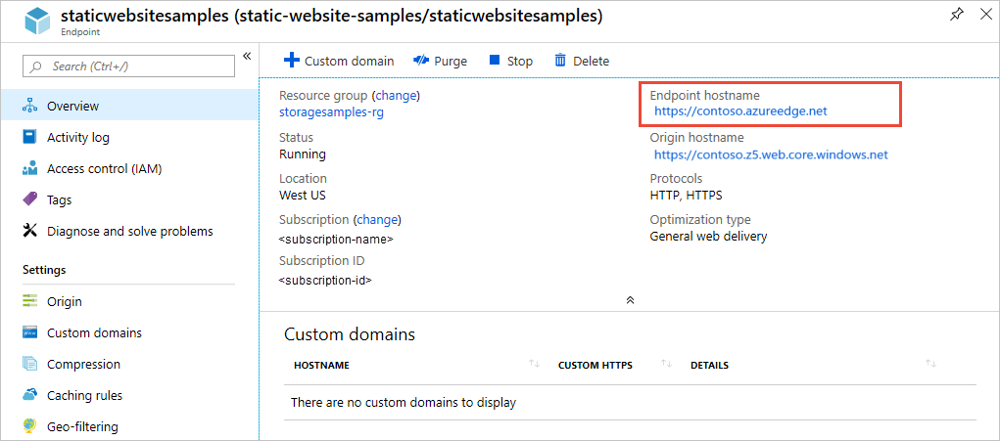

# Tutorial: Use Azure CDN to enable a custom domain with SSL for a static website

This tutorial is part two of a series. In it, you learn to enable a custom domain endpoint with SSL for your static website. 

The tutorial shows how to use [Azure CDN](../../cdn/cdn-overview.md) to configure the custom domain endpoint for your static website. With Azure CDN, you can provision custom SSL certificates, use a custom domain, and configure custom rewrite rules all at the same time. Configuring Azure CDN results in additional charges, but provides consistent low latencies to your website from anywhere in the world. Azure CDN also provides SSL encryption with your own certificate. For information on Azure CDN pricing, see [Azure CDN pricing](https://azure.microsoft.com/pricing/details/cdn/).

In part two of the series, you learn how to:

> [!div class="checklist"]
> * Create a CDN endpoint on the static website endpoint
> * Enable custom domain and SSL

## Prerequisites

Before you begin this tutorial, complete part one, [Tutorial: Host a static website on Blob Storage](storage-blob-static-website-host.md). 

## Sign in to the Azure portal

Sign in to the [Azure portal](https://portal.azure.com/) to get started.

## Create a CDN endpoint on the static website endpoint

1. Locate your storage account in the Azure portal and display the account overview.
1. Select **Azure CDN** under the **Blob Service** menu to configure Azure CDN.
1. In the **CDN profile** section, specify a new or existing CDN profile. For more information, see [Quickstart: Create an Azure CDN profile and endpoint](../../cdn/cdn-create-new-endpoint.md).
1. Specify a pricing tier for the CDN endpoint. This tutorial uses the **Standard Akamai** pricing tier, because it propagates quickly, typically within a few minutes. Other pricing tiers may take longer to propagate, but may also offer other advantages. For more information, see [Compare Azure CDN product features](../../cdn/cdn-features.md).
1. In the **CDN endpoint name** field, specify a name for your CDN endpoint. The CDN endpoint must be unique across Azure.
1. Specify your the static website endpoint in the **Origin hostname** field. To find your static website endpoint, navigate to the **Static website** settings for your storage account. Copy the primary endpoint and paste it into the CDN configuration, removing the protocol identifier (*e.g.*, HTTPS).

    The following image shows an example endpoint configuration:

    

1. Create the CDN endpoint and wait for it to propagate.
1. To verify that the CDN endpoint is configured correctly, click on the endpoint to navigate to its settings. From the CDN overview for your storage account, locate the endpoint hostname, and navigate to the endpoint, as shown in the following image. The format of your CDN endpoint will be similar to `https://staticwebsitesamples.azureedge.net`.

    

    Once the CDN endpoint propagation is complete, navigating to the CDN endpoint displays the contents of the index.html file that you previously uploaded to your static website.

1. To review the origin settings for your CDN endpoint, navigate to **Origin** under the **Settings** section for your CDN endpoint. You will see that the **Origin type** field is set to *Custom Origin* and that the **Origin hostname** field displays your static website endpoint.

    

## Enable custom domain and SSL

1. Create a CNAME record with your domain name provider to redirect your custom domain to the CDN endpoint. The CNAME record for the *www* subdomain should be similar to the following:

    

1. In the Azure portal, display the settings for your CDN endpoint. Navigate to **Custom domains** under **Settings** to configure the custom domain and the SSL certificate.
1. Select **Add custom domain** and enter your domain name, then click **Add**.
1. Select the new custom domain mapping to provision an SSL certificate.
1. Set **Custom Domain HTTPS** to **ON**, then click **Save**. It may take several hours to configure your custom domain. The portal displays progress as shown in the following image.

    

1. Test the mapping of your static website to your custom domain by accessing the URL for your custom domain.

For more information about enabling HTTPS for custom domains, see [Tutorial: Configure HTTPS on an Azure CDN custom domain](../../cdn/cdn-custom-ssl.md).

## Next steps

In part two of this tutorial, you learned how to configure a custom domain with SSL in Azure CDN for your static website.

For more information about configuring and using Azure CDN, see [What is Azure CDN?](../../cdn/cdn-overview.md).