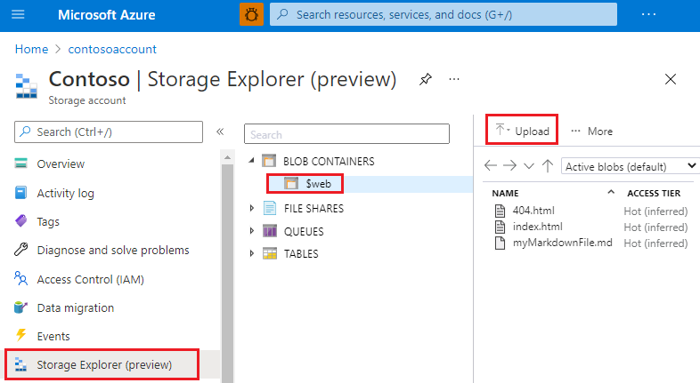
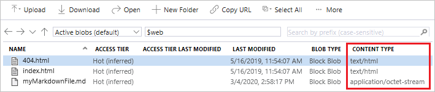

# Host a static website in Azure Storage

You can serve static content (HTML, CSS, JavaScript, and image files) directly from a container in an Azure Storage GPv2 account. To learn more, see [Static website hosting in Azure Storage](storage-blob-static-website.md).

This article shows you how to enable static website hosting by using the Azure portal, the Azure CLI, or PowerShell.

## Enable static website hosting

Static website hosting is a feature that you have to enable on the storage account.

### [Portal](#tab/azure-portal)

1. Sign in to the [Azure portal](https://portal.azure.com/) to get started.

2. Locate your storage account and display the account overview.

3. Select **Static website** to display the configuration page for static websites.

4. Select **Enabled** to enable static website hosting for the storage account.

5. In the **Index document name** field, specify a default index page (For example: *index.html*). 

   The default index page is displayed when a user navigates to the root of your static website.  

6. In the **Error document path** field, specify a default error page (For example: *404.html*). 

   The default error page is displayed when a user attempts to navigate to a page that does not exist in your static website.

7. Click **Save**. The Azure portal now displays your static website endpoint. 

    

### [Azure CLI](#tab/azure-cli)

<a id="cli"></a>

You can enable static website hosting by using the [Azure Command-Line Interface (CLI)](https://docs.microsoft.com/cli/azure/?view=azure-cli-latest).

1. First, open the [Azure Cloud Shell](https://docs.microsoft.com/azure/cloud-shell/overview?view=azure-cli-latest), or if you've [installed](https://docs.microsoft.com/cli/azure/install-azure-cli?view=azure-cli-latest) the Azure CLI locally, open a command console application such as Windows PowerShell.

2. If your identity is associated with more than one subscription, then set your active subscription to subscription of the storage account that will host your static website.

   ```azurecli-interactive
   az account set --subscription <subscription-id>
   ```

   Replace the `<subscription-id>` placeholder value with the ID of your subscription.

3. Enable static website hosting.

   ```azurecli-interactive
   az storage blob service-properties update --account-name <storage-account-name> --static-website --404-document <error-document-name> --index-document <index-document-name>
   ```

   * Replace the `<storage-account-name>` placeholder value with the name of your storage account.

   * Replace the `<error-document-name>` placeholder with the name of the error document that will appear to users when a browser requests a page on your site that does not exist.

   * Replace the `<index-document-name>` placeholder with the name of the index document. This document is commonly "index.html".

### [PowerShell](#tab/azure-powershell)

<a id="powershell"></a>

You can enable static website hosting by using the Azure PowerShell module.

1. Open a Windows PowerShell command window.

2. Verify that you have Azure PowerShell module Az version 0.7 or later.

   ```powershell
   Get-InstalledModule -Name Az -AllVersions | select Name,Version
   ```

   If you need to install or upgrade, see [Install Azure PowerShell module](/powershell/azure/install-Az-ps).

3. Sign in to your Azure subscription with the `Connect-AzAccount` command and follow the on-screen directions.

   ```powershell
   Connect-AzAccount
   ```

4. If your identity is associated with more than one subscription, then set your active subscription to subscription of the storage account that will host your static website.

   ```powershell
   $context = Get-AzSubscription -SubscriptionId <subscription-id>
   Set-AzContext $context
   ```

   Replace the `<subscription-id>` placeholder value with the ID of your subscription.

5. Get the storage account context that defines the storage account you want to use.

   ```powershell
   $storageAccount = Get-AzStorageAccount -ResourceGroupName "<resource-group-name>" -AccountName "<storage-account-name>"
   $ctx = $storageAccount.Context
   ```

   * Replace the `<resource-group-name>` placeholder value with the name of your resource group.

   * Replace the `<storage-account-name>` placeholder value with the name of your storage account.

6. Enable static website hosting.

   ```powershell
   Enable-AzStorageStaticWebsite -Context $ctx -IndexDocument <index-document-name> -ErrorDocument404Path <error-document-name>
   ```

   * Replace the `<error-document-name>` placeholder with the name of the error document that will appear to users when a browser requests a page on your site that does not exist.

   * Replace the `<index-document-name>` placeholder with the name of the index document. This document is commonly "index.html".

---

## Upload files 

### [Portal](#tab/azure-portal)

These instructions show you how to upload files by using the version of Storage Explorer that appears in the Azure portal. However, you can also use the version of [Storage Explorer](https://azure.microsoft.com/features/storage-explorer/) that runs outside of the Azure portal. You could use [AzCopy](../common/storage-use-azcopy-v10.md), PowerShell, CLI, or any custom application that can upload files to the **$web** container of your account. For a step-by-step tutorial that uploads files by using Visual Studio code, see [Tutorial: Host a static website on Blob Storage](https://docs.microsoft.com/azure/storage/blobs/storage-blob-static-website-host).

1. Select **Storage Explorer (preview)**.

2. Expand the **BLOB CONTAINERS** node, and then select the **$web** container.

3. Choose the **Upload** button to upload files.

   

4. If you intend for the browser to display the contents of file, make sure that the content type of that file is set to `text/html`. 

   

   >[!NOTE]
   > Storage Explorer automatically sets this property to `text/html` for commonly recognized extensions such as `.html`. However, in some cases, you'll have to set this yourself. If you don't set this property to `text/html`, the browser will prompt users to download the file instead of rendering the contents. To set this property, right-click the file, and then click **Properties**.

### [Azure CLI](#tab/azure-cli)

Upload objects to the *$web* container from a source directory.

This example assumes that you're running commands from Azure Cloud Shell session.

```azurecli-interactive
az storage blob upload-batch -s <source-path> -d '$web' --account-name <storage-account-name>
```

> [!NOTE] 
> If the browser prompts users users to download the file instead of rendering the contents, you can append `--content-type 'text/html; charset=utf-8'` to the command. 

* Replace the `<storage-account-name>` placeholder value with the name of your storage account.

* Replace the `<source-path>` placeholder with a path to the location of the files that you want to upload.

> [!NOTE]
> If you're using a location installation of Azure CLI, then you can use the path to any location on your local computer (For example: `C:\myFolder`.
>
> If you're using Azure Cloud Shell, you'll have to reference a file share that is visible to the Cloud Shell. This location could be the file share of the Cloud share itself or an existing file share that you mount from the Cloud Shell. To learn how to do this, see [Persist files in Azure Cloud Shell](https://docs.microsoft.com/azure/cloud-shell/persisting-shell-storage).

### [PowerShell](#tab/azure-powershell)

Upload objects to the *$web* container from a source directory.

```powershell
# upload a file
set-AzStorageblobcontent -File "<path-to-file>" `
-Container `$web `
-Blob "<blob-name>" `
-Context $ctx
```

> [!NOTE] 
> If the browser prompts users users to download the file instead of rendering the contents, you can append `-Properties @{ ContentType = "text/html; charset=utf-8";}` to the command.

* Replace the `<path-to-file>` placeholder value with the fully qualified path to the file that you want to upload (For example: `C:\temp\index.html`).

* Replace the `<blob-name>` placeholder value with the name that you want to give the resulting blob (For example: `index.html`).

---

<a id="portal-find-url"></a>

## Find the website URL

You can view the pages of your site from a browser by using the public URL of the website.

### [Portal](#tab/azure-portal)

In the pane that appears beside the account overview page of your storage account, select **Static Website**. The URL of your site appears in the **Primary endpoint** field.


### [Azure CLI](#tab/azure-cli)

Find the public URL of your static website by using the following command:

```azurecli-interactive
az storage account show -n <storage-account-name> -g <resource-group-name> --query "primaryEndpoints.web" --output tsv
```

* Replace the `<storage-account-name>` placeholder value with the name of your storage account.

* Replace the `<resource-group-name>` placeholder value with the name of your resource group.

### [PowerShell](#tab/azure-powershell)

Find the public URL of your static website by using by using the following command:

```powershell
 $storageAccount = Get-AzStorageAccount -ResourceGroupName "<resource-group-name>" -Name "<storage-account-name>"
Write-Output $storageAccount.PrimaryEndpoints.Web
```

* Replace the `<resource-group-name>` placeholder value with the name of your resource group.

* Replace the `<storage-account-name>` placeholder value with the name of your storage account.

---

<a id="metrics"></a>

## Enable metrics on static website pages

Once you've enabled metrics, traffic statistics on files in the **$web** container are reported in the metrics dashboard.

1. Click **Metrics** under the **Monitor** section of the storage account menu.

   > [!div class="mx-imgBorder"]
   > 

   > [!NOTE]
   > Metrics data are generated by hooking into different metrics APIs. The portal only displays API members used within a given time frame in order to only focus on members that return data. In order to ensure you're able to select the necessary API member, the first step is to expand the time frame.

2. Click on the time frame button, choose a time frame, and then click **Apply**.

   

3. Select **Blob** from the *Namespace* drop down.

   

4. Then select the **Egress** metric.

   

5. Select **Sum** from the *Aggregation* selector.

   

6. Click the **Add filter** button and choose **API name** from the *Property* selector.

   

7. Check the box next to **GetWebContent** in the *Values* selector to populate the metrics report.

   

   >[!NOTE]
   > The **GetWebContent** checkbox appears only if that API member was used within a given time frame. The portal only displays API members used within a given time frame in order to only focus on members that return data. If you can't find a specific API member in this list, expand the time frame.

## Next steps

* Learn how to configure a custom domain with your static website. See [Map a custom domain to an Azure Blob Storage endpoint](storage-custom-domain-name.md).

