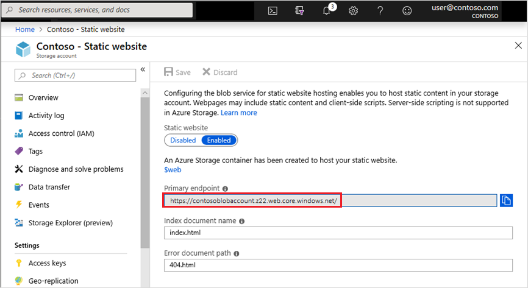
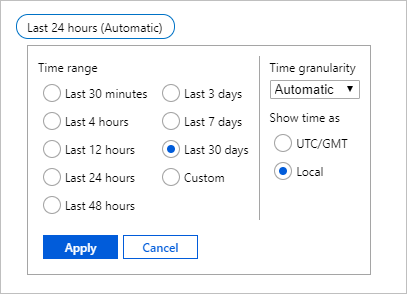
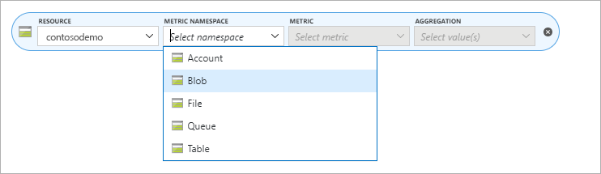
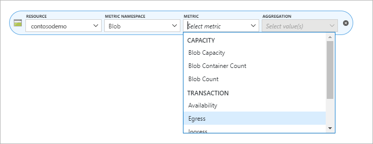
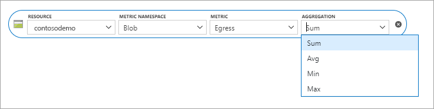
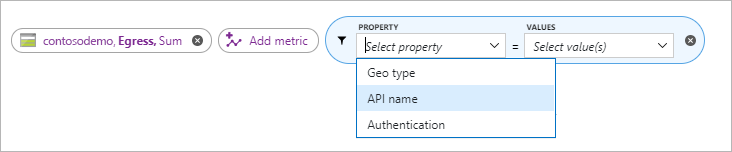
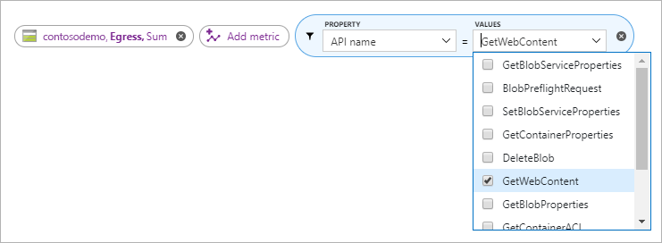

# Host a static website in Azure Storage

You can serve static content (HTML, CSS, JavaScript, and image files) directly from a container in an Azure Storage GPv2 account. To learn more, see [Static website hosting in Azure Storage](storage-blob-static-website.md).

This article shows you how to enable static website hosting by using the Azure portal, the Azure CLI, or PowerShell.

<a id="portal" />

## Use the Azure portal

For a step-by-step tutorial, see [Tutorial: Host a static website on Blob Storage](https://docs.microsoft.com/azure/storage/blobs/storage-blob-static-website-host).

After you enable static website hosting, you can view the pages of your site from a browser by using the public URL of the website.

<a id="portal-find-url" />

### Find the website URL by using the Azure portal

In the pane that appears beside the account overview page of your storage account, select **Static Website**. The URL of your site appears in the **Primary endpoint** field.



<a id="cli" />

## Use the Azure CLI

You can enable static website hosting by using the [Azure Command-Line Interface (CLI)](https://docs.microsoft.com/cli/azure/?view=azure-cli-latest).

1. First, open the [Azure Cloud Shell](https://docs.microsoft.com/azure/cloud-shell/overview?view=azure-cli-latest), or if you've [installed](https://docs.microsoft.com/cli/azure/install-azure-cli?view=azure-cli-latest) the Azure CLI locally, open a command console application such as Windows PowerShell.

2. If your identity is associated with more than one subscription, then set your active subscription to subscription of the storage account that will host your static website.

   ```azurecli-interactive
   az account set --subscription <subscription-id>
   ```

   Replace the `<subscription-id>` placeholder value with the ID of your subscription.

3. Enable static website hosting.

   ```azurecli-interactive
   az storage blob service-properties update --account-name <storage-account-name> --static-website --404-document <error-document-name> --index-document <index-document-name>
   ```

   * Replace the `<storage-account-name>` placeholder value with the name of your storage account.

   * Replace the `<error-document-name>` placeholder with the name of the error document that will appear to users when a browser requests a page on your site that does not exist.

   * Replace the `<index-document-name>` placeholder with the name of the index document. This document is commonly "index.html".

4. Upload objects to the *$web* container from a source directory.

   > [!NOTE]
   > If you're using Azure Cloud Shell, make sure to add an `\` escape character when referring to the `$web` container (For example: `\$web`). If you're using a local installation of the Azure CLI, then you won't have to use the escape character.

   This example assumes that you're running commands from Azure Cloud Shell session.

   ```azurecli-interactive
   az storage blob upload-batch -s <source-path> -d \$web --account-name <storage-account-name>
   ```

   * Replace the `<storage-account-name>` placeholder value with the name of your storage account.

   * Replace the `<source-path>` placeholder with a path to the location of the files that you want to upload.

   > [!NOTE]
   > If you're using a location installation of Azure CLI, then you can use the path to any location on your local computer (For example: `C:\myFolder`.
   >
   > If you're using Azure Cloud Shell, you'll have to reference a file share that is visible to the Cloud Shell. This location could be the file share of the Cloud share itself or an existing file share that you mount from the Cloud Shell. To learn how to do this, see [Persist files in Azure Cloud Shell](https://docs.microsoft.com/azure/cloud-shell/persisting-shell-storage).

<a id="cli-find-url" />

### Find the website URL by using the Azure CLI

You can view content from a browser by using the public URL of the website.

Find the URL by using the following command:

```azurecli-interactive
az storage account show -n <storage-account-name> -g <resource-group-name> --query "primaryEndpoints.web" --output tsv
```

* Replace the `<storage-account-name>` placeholder value with the name of your storage account.

* Replace the `<resource-group-name>` placeholder value with the name of your resource group.

<a id="powershell" />

## Use PowerShell

You can enable static website hosting by using the Azure PowerShell module.

1. Open a Windows PowerShell command window.

2. Verify that you have Azure PowerShell module Az version 0.7 or later.

   ```powershell
   Get-InstalledModule -Name Az -AllVersions | select Name,Version
   ```

   If you need to install or upgrade, see [Install Azure PowerShell module](/powershell/azure/install-Az-ps).

3. Sign in to your Azure subscription with the `Connect-AzAccount` command and follow the on-screen directions.

   ```powershell
   Connect-AzAccount
   ```

4. If your identity is associated with more than one subscription, then set your active subscription to subscription of the storage account that will host your static website.

   ```powershell
   $context = Get-AzSubscription -SubscriptionId <subscription-id>
   Set-AzContext $context
   ```

   Replace the `<subscription-id>` placeholder value with the ID of your subscription.

5. Get the storage account context that defines the storage account you want to use.

   ```powershell
   $storageAccount = Get-AzStorageAccount -ResourceGroupName "<resource-group-name>" -AccountName "<storage-account-name>"
   $ctx = $storageAccount.Context
   ```

   * Replace the `<resource-group-name>` placeholder value with the name of your resource group.

   * Replace the `<storage-account-name>` placeholder value with the name of your storage account.

6. Enable static website hosting.

   ```powershell
   Enable-AzStorageStaticWebsite -Context $ctx -IndexDocument <index-document-name> -ErrorDocument404Path <error-document-name>
   ```

   * Replace the `<error-document-name>` placeholder with the name of the error document that will appear to users when a browser requests a page on your site that does not exist.

   * Replace the `<index-document-name>` placeholder with the name of the index document. This document is commonly "index.html".

7. Upload objects to the *$web* container from a source directory.

    ```powershell
    # upload a file
    set-AzStorageblobcontent -File "<path-to-file>" `
    -Container `$web `
    -Blob "<blob-name>" `
    -Context $ctx
     ```

   * Replace the `<path-to-file>` placeholder value with the fully qualified path to the file that you want to upload (For example: `C:\temp\index.html`).

   * Replace the `<blob-name>` placeholder value with the name that you want to give the resulting blob (For example: `index.html`).

<a id="powershell-find-url" />

### Find the website URL by using PowerShell

You can view content from a browser by using the public URL of the website.

Find the URL by using the following command:

```powershell
 $storageAccount = Get-AzStorageAccount -ResourceGroupName "<resource-group-name>" -AccountName "<storage-account-name>"
Write-Output $storageAccount.PrimaryEndpoints.Web
```

* Replace the `<resource-group-name>` placeholder value with the name of your resource group.

* Replace the `<storage-account-name>` placeholder value with the name of your storage account.

<a id="metrics" />

## Enable metrics on static website pages

Once you've enabled metrics, traffic statistics on files in the **$web** container are reported in the metrics dashboard.

1. Click on **Settings** > **Monitoring** > **Metrics**.

   Metrics data are generated by hooking into different metrics APIs. The portal only displays API members used within a given time frame in order to only focus on members that return data. In order to ensure you're able to select the necessary API member, the first step is to expand the time frame.

2. Click on the time frame button and select **Last 24 hours** and then click **Apply**.

   

3. Select **Blob** from the *Namespace* drop down.

   

4. Then select the **Egress** metric.

   

5. Select **Sum** from the *Aggregation* selector.

   

6. Click the **Add filter** button and choose **API name** from the *Property* selector.

   

7. heck the box next to **GetWebContent** in the *Values* selector to populate the metrics report.

   

## Next steps

* [Static website hosting in Azure Storage](storage-blob-static-website.md)
* [Use the Azure CDN to access blobs with custom domains over HTTPS](storage-https-custom-domain-cdn.md)
* [Configure a custom domain name for your blob or web endpoint](storage-custom-domain-name.md)
* [Azure Functions](/azure/azure-functions/functions-overview)
* [Azure App Service](/azure/app-service/overview)
* [Build your first serverless web app](https://docs.microsoft.com/azure/functions/tutorial-static-website-serverless-api-with-database)
* [Tutorial: Host your domain in Azure DNS](../../dns/dns-delegate-domain-azure-dns.md)
