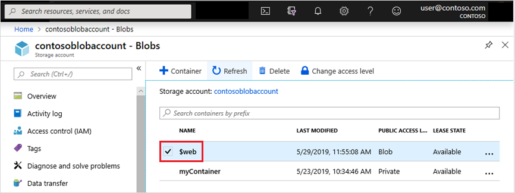

# Static website hosting in Azure Storage

You can serve static content (HTML, CSS, JavaScript, and image files) directly from a storage container named *$web*. Hosting your content in Azure Storage enables you to use serverless architectures that include [Azure Functions](../../azure-functions/functions-overview.md) and other Platform as a service (PaaS) services. Azure Storage static website hosting is a great option in cases where you don't require a web server to render content. 

[!INCLUDE [static websites vs static web apps](../../../includes/storage-blob-static-website-vs-static-web-app.md)]

If you need a web server to render content, you can use [Azure App Service](https://azure.microsoft.com/services/app-service/).

## Setting up a static website

Static website hosting is a feature that you have to enable on the storage account.

To enable static website hosting, select the name of your default file, and then optionally provide a path to a custom 404 page. If a blob storage container named **$web** doesn't already exist in the account, one is created for you. Add the files of your site to this container.

For step-by-step guidance, see [Host a static website in Azure Storage](storage-blob-static-website-how-to.md).

Files in the **$web** container are case-sensitive, served through anonymous access requests and are available only through read operations.

## Uploading content

You can use any of these tools to upload content to the **$web** container:

> [!div class="checklist"]
> - [Azure CLI](storage-blob-static-website-how-to.md?tabs=azure-cli)
> - [Azure PowerShell module](storage-blob-static-website-how-to.md?tabs=azure-powershell)
> - [AzCopy](../common/storage-use-azcopy-v10.md)
> - [Azure Storage Explorer](https://azure.microsoft.com/features/storage-explorer/)
> - [Azure Pipelines](https://azure.microsoft.com/services/devops/pipelines/)
> - [Visual Studio Code extension](https://marketplace.visualstudio.com/items?itemName=ms-azuretools.vscode-azurefunctions) and [Channel 9 video demonstration](/Shows/Docs-Azure/Deploy-static-website-to-Azure-from-Visual-Studio-Code/player)

## Viewing content

Users can view site content from a browser by using the public URL of the website. You can find the URL by using the Azure portal, Azure CLI, or PowerShell. See [Find the website URL](storage-blob-static-website-how-to.md#portal-find-url).

The index document that you specify when you enable static website hosting appears when users open the site and don't specify a specific file (For example: `https://contosoblobaccount.z22.web.core.windows.net`).

If the server returns a 404 error, and you haven't specified an error document when you enabled the website, then a default 404 page is returned to the user.

> [!NOTE]
> [Cross-Origin Resource Sharing (CORS) support for Azure Storage](/rest/api/storageservices/cross-origin-resource-sharing--cors--support-for-the-azure-storage-services) is not supported with static website.

### Secondary endpoints

If you set up [redundancy in a secondary region](../common/storage-redundancy.md#redundancy-in-a-secondary-region), you can also access website content by using a secondary endpoint. Data is replicated to secondary regions asynchronously. Therefore, the files that are available at the secondary endpoint aren't always in sync with the files that are available on the primary endpoint.

## Impact of setting the access level on the web container

You can modify the public access level of the **$web** container, but making this modification has no impact on the primary static website endpoint because these files are served through anonymous access requests. That means public (read-only) access to all files.

While the primary static website endpoint isn't affected, a change to the public access level does impact the primary blob service endpoint.

For example, if you change the public access level of the **$web** container from **Private (no anonymous access)** to **Blob (anonymous read access for blobs only)**, then the level of public access to the primary static website endpoint `https://contosoblobaccount.z22.web.core.windows.net/index.html` doesn't change.

However, the public access to the primary blob service endpoint `https://contosoblobaccount.blob.core.windows.net/$web/index.html` does change from private to public. Now users can open that file by using either of these two endpoints.

Disabling public access on a storage account by using the [public access setting](anonymous-read-access-prevent.md#set-the-storage-accounts-allowblobpublicaccess-property-to-false) of the storage account doesn't affect static websites that are hosted in that storage account. For more information, see [Remediate anonymous public read access to blob data (Azure Resource Manager deployments)](anonymous-read-access-prevent.md).

## Mapping a custom domain to a static website URL

You can make your static website available via a custom domain.

It's easier to enable HTTP access for your custom domain, because Azure Storage natively supports it. To enable HTTPS, you'll have to use Azure CDN because Azure Storage doesn't yet natively support HTTPS with custom domains. see [Map a custom domain to an Azure Blob Storage endpoint](storage-custom-domain-name.md) for step-by-step guidance.

If the storage account is configured to [require secure transfer](../common/storage-require-secure-transfer.md) over HTTPS, then users must use the HTTPS endpoint.

> [!TIP]
> Consider hosting your domain on Azure. For more information, see [Host your domain in Azure DNS](../../dns/dns-delegate-domain-azure-dns.md).

## Adding HTTP headers

There's no way to configure headers as part of the static website feature. However, you can use Azure CDN to add headers and append (or overwrite) header values. See [Standard rules engine reference for Azure CDN](../../cdn/cdn-standard-rules-engine-reference.md).

If you want to use headers to control caching, see [Control Azure CDN caching behavior with caching rules](../../cdn/cdn-caching-rules.md).

## Multi-region website hosting

If you plan to host a website in multiple geographies, we recommend that you use a [Content Delivery Network](../../cdn/index.yml) for regional caching. Use [Azure Front Door](../../frontdoor/index.yml) if you want to serve different content in each region. It also provides failover capabilities. [Azure Traffic Manager](../../traffic-manager/index.yml) isn't recommended if you plan to use a custom domain. Issues can arise because of how Azure Storage verifies custom domain names.

## Permissions

The permission to be able to enable static website is Microsoft.Storage/storageAccounts/blobServices/write or shared key.  Built in roles that provide this access include Storage Account Contributor.

## Pricing

You can enable static website hosting free of charge. You're billed only for the blob storage that your site utilizes and operations costs. For more details on prices for Azure Blob Storage, check out the [Azure Blob Storage Pricing Page](https://azure.microsoft.com/pricing/details/storage/blobs/).

## Metrics

You can enable metrics on static website pages. Once you've enabled metrics, traffic statistics on files in the **$web** container are reported in the metrics dashboard.

To enable metrics on your static website pages, see [Enable metrics on static website pages](storage-blob-static-website-how-to.md#metrics).

## Feature support

[!INCLUDE [Blob Storage feature support in Azure Storage accounts](../../../includes/azure-storage-feature-support.md)]

## FAQ

##### Does the Azure Storage firewall work with a static website?

Yes. Storage account [network security rules](../common/storage-network-security.md), including IP-based and VNET firewalls, are supported for the static website endpoint, and may be used to protect your website.

##### Do static websites support Azure Active Directory (Azure AD)?

No. A static website only supports anonymous public read access for files in the **$web** container.

##### How do I use a custom domain with a static website?

You can configure a [custom domain](./static-website-content-delivery-network.md) with a static website by using [Azure Content Delivery Network (Azure CDN)](./storage-custom-domain-name.md#map-a-custom-domain-with-https-enabled). Azure CDN provides consistent low latencies to your website from anywhere in the world.

##### How do I use a custom Secure Sockets Layer (SSL) certificate with a static website?

You can configure a [custom SSL](./static-website-content-delivery-network.md) certificate with a static website by using [Azure CDN](./storage-custom-domain-name.md#map-a-custom-domain-with-https-enabled). Azure CDN provides consistent low latencies to your website from anywhere in the world.

##### How do I add custom headers and rules with a static website?

You can configure the host header for a static website by using [Azure CDN - Verizon Premium](../../cdn/cdn-verizon-premium-rules-engine.md). We'd be interested to hear your feedback [here](https://feedback.azure.com/d365community/idea/694b08ef-3525-ec11-b6e6-000d3a4f0f84).

##### Why am I getting an HTTP 404 error from a static website?

A 404 error can happen if you refer to a file name by using an incorrect case. For example: `Index.html` instead of `index.html`. File names and extensions in the url of a static website are case-sensitive even though they're served over HTTP. This can also happen if your Azure CDN endpoint isn't yet provisioned. Wait up to 90 minutes after you provision a new Azure CDN for the propagation to complete.

##### Why isn't the root directory of the website not redirecting to the default index page?

In the Azure portal, open the static website configuration page of your account and locate the name and extension that is set in the **Index document name** field. Ensure that this name is exactly the same as the name of the file located in the **$web** container of the storage account. File names and extensions in the url of a static website are case-sensitive even though they're served over HTTP.

## Next steps

- [Host a static website in Azure Storage](storage-blob-static-website-how-to.md)
- [Map a custom domain to an Azure Blob Storage endpoint](storage-custom-domain-name.md)
- [Azure Functions](../../azure-functions/functions-overview.md)
- [Azure App Service](../../app-service/overview.md)
- [Build your first serverless web app](/labs/build2018/serverlesswebapp/)
- [Tutorial: Host your domain in Azure DNS](../../dns/dns-delegate-domain-azure-dns.md)
