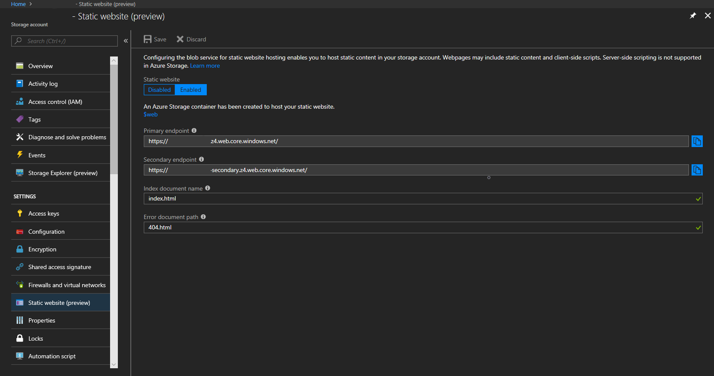

# Static website hosting in Azure Storage (Preview)
Azure Storage now offers static website hosting (Preview), enabling you to deploy cost-effective and scalable modern web applications on Azure. On a static website, webpages contain static content and JavaScript or other client-side code. By contrast, dynamic websites depend on server-side code, and can be hosted using [Azure Web Apps](/azure/app-service/app-service-web-overview).

As deployments shift toward elastic, cost-effective models, the ability to deliver web content without the need for server management is critical. The introduction of static website hosting in Azure Storage makes this possible, enabling rich backend capabilities with serverless architectures leveraging [Azure Functions](/azure/azure-functions/functions-overview) and other PaaS services.

## How does it work?
When you enable static websites on your storage account, a new web service endpoint is created of the form `<account-name>.<zone-name>.web.core.windows.net`.

The web service endpoint always allows anonymous read access, returns formatted HTML pages in response to service errors, and allows only object read operations. The web service endpoint returns the index document in the requested directory for both the root and all subdirectories. When the storage service returns a 404 error, the web endpoint returns a custom error document if you configured it.

Content for your static website is hosted in a special container named "$web". As a part of the enablement process, "$web" is created for you if it does not already exist. Content in "$web" can be accessed at the account root using the web endpoint. For example `https://contoso.z4.web.core.windows.net/` returns the index document you configured for your website, if a document of that name exists in the root directory of $web.

When uploading content to your website, use the blob storage endpoint. To upload a blob named 'image.jpg' that can be accessed at the account root use the following URL
`https://contoso.blob.core.windows.net/$web/image.jpg`. The uploaded image can be viewed in a web browser at the corresponding web endpoint `https://contoso.z4.web.core.windows.net/image.jpg`.


## Custom domain names
You can use a custom domain to host your web content. To do so, follow the guidance in [Configure a custom domain name for your Azure Storage account](storage-custom-domain-name.md). To access your website hosted at a custom domain name over HTTPS, see [Using the Azure CDN to access blobs with custom domains over HTTPS](storage-https-custom-domain-cdn.md). Point your CDN to the web endpoint as opposed to the blob endpoint and remember that CDN configuration doesn't happen instantaneously, so you may need to wait a few minutes before your content is visible.

## Pricing and billing
Static website hosting is provided at no additional cost. For more details on prices for Azure Blob Storage, check out the [Azure Blob Storage Pricing Page](https://azure.microsoft.com/pricing/details/storage/blobs/).

## Quickstart
### Azure portal
If you haven't already, [create a GPv2 storage account](../common/storage-quickstart-create-account.md) To start hosting your web application, you can configure the feature using the Azure Portal and click on "Static website (preview)" under "Settings" in the left navigation bar. Click "Enabled" and enter the name of the index document and (optionally) the custom error document path.



Upload your web assets to the "$web" container that was created as a part of static website enablement. You can do this directly in Azure Portal, or you can take advantage of [Azure Storage Explorer](https://azure.microsoft.com/features/storage-explorer/) to upload entire directory structures. Make sure to include an index document with the name you configured. In this example, the document's name is "index.html".

> [!NOTE]
> The document name is case sensitive and therefore needs to match the name of the file in storage exactly.

Finally, navigate to your web endpoint to test your website.

### Azure CLI
Install the storage preview extension:

```azurecli-interactive
az extension add --name storage-preview
```
Enable the feature:

```azurecli-interactive
az storage blob service-properties update --account-name <account-name> --static-website --404-document <error-doc-name> --index-document <index-doc-name>
```
Query for the web endpoint URL:

```azurecli-interactive
az storage account show -n <account-name> -g <resource-group> --query "primaryEndpoints.web" --output tsv
```

Upload objects to the $web container:

```azurecli-interactive
az storage blob upload-batch -s deploy -d $web --account-name <account-name>
```

## FAQ
**Is static websites available for all storage account types?**  
No, static website hosting is only available in GPv2 standard storage accounts.

**Are Storage VNET and firewall rules supported on the new web endpoint?**  
Yes, the new web endpoint obeys the VNET and firewall rules configured for the storage account.

**Is the web endpoint case sensitive?**  
Yes, the web endpoint is case sensitive just like the blob endpoint. 

## Next steps
* [Using the Azure CDN to access blobs with custom domains over HTTPS](storage-https-custom-domain-cdn.md)
* [Configure a custom domain name for your blob or web endpoint](storage-custom-domain-name.md)
* [Azure Functions](/azure/azure-functions/functions-overview)
* [Azure Web Apps](/azure/app-service/app-service-web-overview)
* [Build your first serverless web app](https://aka.ms/static-serverless-webapp)
